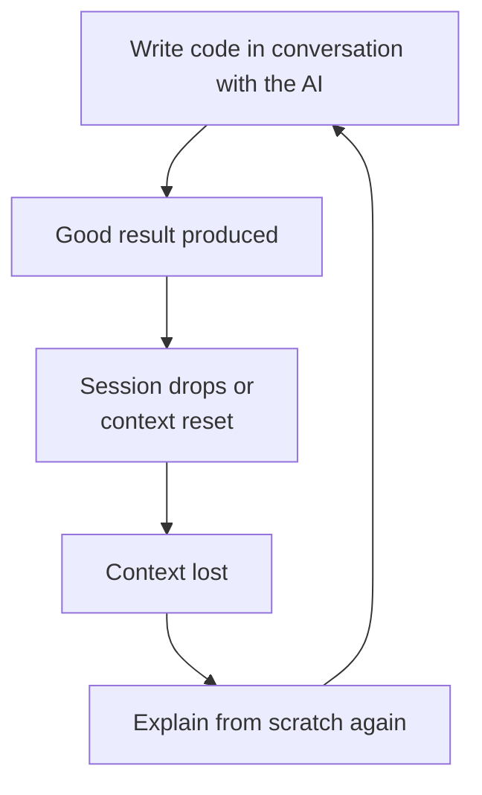
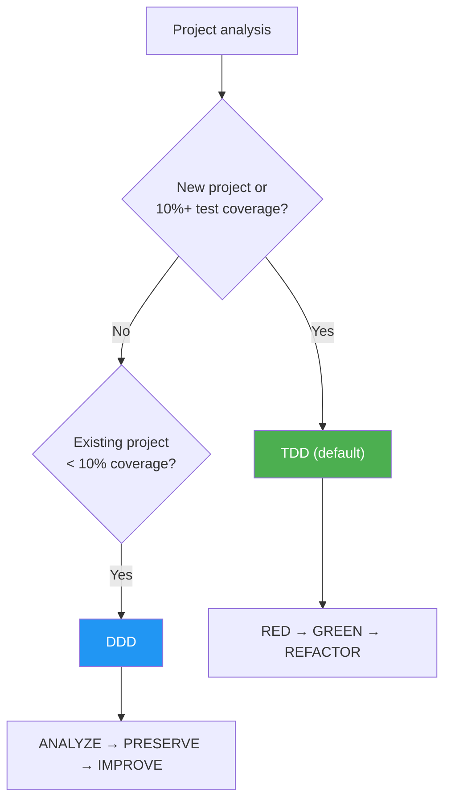
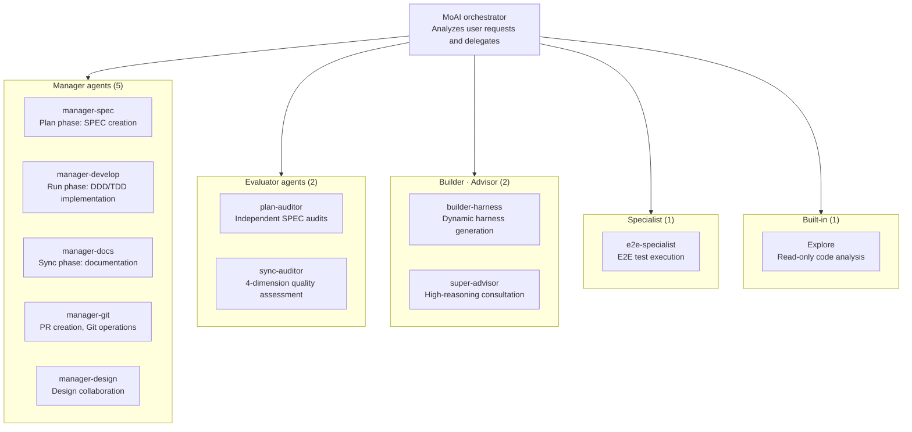
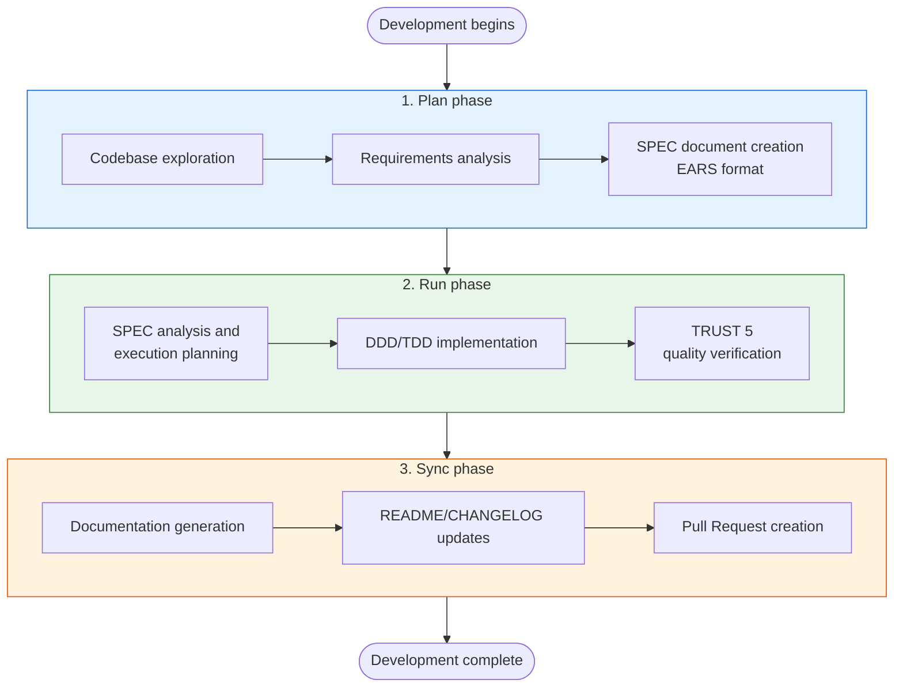
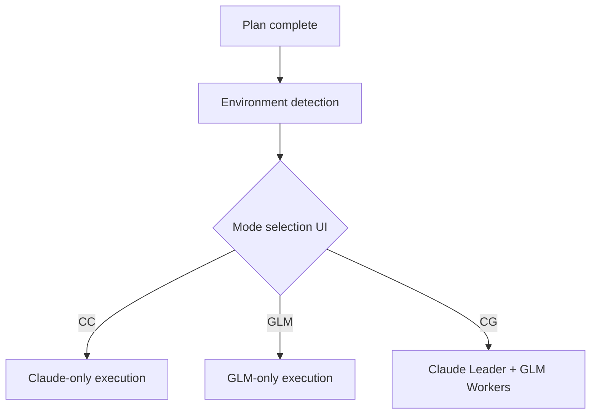

MoAI-ADK is an **Agentic Development Kit** that aims for **Tokenomics** (Token Economics). Code of the same quality with fewer tokens, and higher quality for the same tokens — the system manages model selection, reasoning depth, and context usage. 11 specialist AI agents and 27 skills work together, applying TDD (the default) to new projects and DDD to existing projects with low test coverage, automatically.

A single binary written in Go -- runs immediately on every platform with zero dependencies.


**One-line summary:** MoAI-ADK is an agentic development kit that "records your conversations with the AI as documents (SPECs), improves code safely (DDD/TDD), and verifies quality automatically (TRUST 5)" — **while the system also manages token cost**.


## Introducing MoAI-ADK

**MoAI** means "모두의 AI" (MoAI - Everybody's AI). **ADK** stands for Agentic Development Kit, a toolkit where AI agents drive the development process.

MoAI-ADK is **a development kit that has agents collaborate on agentic coding inside Claude Code**. Like an AI development team collaborating to finish a project, each agent takes on the work of its own specialty.

| AI development team | MoAI-ADK | Role |
|----------|----------|------|
| Product owner | The user (developer) | Decides what to build |
| Team lead / Tech Lead | The MoAI orchestrator | Coordinates all work and delegates to the 11 agents |
| Planner / Spec Writer | manager-spec | Organizes requirements into SPEC documents |
| Developers / Engineers | manager-develop (with domain context injected) | Implements the actual code with DDD/TDD |
| QA / Code reviewers | plan-auditor · sync-auditor | Independently audit plans and deliverables |

## Core Value — The Three Pillars

The value of v3.0 comes down to three pillars.

### Tokenomics (Token Economics)

Intelligent resource allocation that maximizes quality per cost. This pillar consists of the **3-tier model policy** that declaratively assigns model and reasoning depth by work phase and SPEC size, **CG mode** that combines a Claude leader with GLM workers to cut implementation cost by 60-70%, the **Token Circuit Breaker** that stops gracefully before the budget is exceeded, and the **context diet** that shrinks always-loaded context.

### Agentic Loop Engineering

The loop works on its own, and observations accumulate along the way. This pillar includes the **goal engine** that keeps the session working until a declared completion condition is met, the **Ralph Engine** (`/moai loop`) that iterates on fixes until the queue of issues found by diagnostic tools is drained, and **Analyze-First routing** that analyzes the intent of natural-language requests regardless of language. The accumulated observations become the raw material of harness learning, and guidance evolves along the 4-tier learning ladder (observation → heuristic → rule → auto-update) — auto-updates are always applied only under the user-approval gate.

### Agentic Harness

Instead of writing code yourself, you design an environment where agents work well. This pillar is the 11-agent catalog, the SPEC-based 3-phase workflow (plan → run → sync), the TRUST 5 quality gates, and the Harness v4 Builder that creates project-specific harnesses from natural-language requests. For the full concept, see the [Harness Engineering](/en/core-concepts/harness-engineering) document.

## Why Tokenomics

Token unit prices keep falling, but agentic development's token consumption grows faster. With multiple agents running, longer contexts, and deeper reasoning, what determines cost is not model pricing but **how tokens are operated**.

MoAI-ADK's answer is threefold.

1. **Assign the right model and reasoning depth per task** — plan deeply, implement cheaply, verify independently.
2. **Diet the context** — minimize always-loaded guidance and measure prompt-cache hit rates.
3. **Let the system keep the budget** — track token usage and stop gracefully before crossing the threshold.

## Why MoAI-ADK?

### A Complete Rewrite from Python to Go

The Python-based MoAI-ADK (~73,000 lines) was completely rewritten in Go.

| Item | Python Edition | Go Edition |
|------|-------------|----------|
| Distribution | pip + venv + dependencies | **Single binary**, zero dependencies |
| Startup time | ~800ms interpreter boot | **~5ms** native execution |
| Concurrency | asyncio / threading | **Native goroutines** |
| Type safety | Runtime (mypy optional) | **Compile-time enforced** |
| Cross-platform | Requires Python runtime | **Prebuilt binaries** (macOS, Linux, Windows) |
| Hook execution | Shell wrappers + Python | **Compiled binary**, JSON protocol |

### Key Numbers (as of v3.0)

- **11** agents in the catalog (10 MoAI custom + 1 Anthropic built-in `Explore`)
- **27** skills (template-managed)
- **36** CLI commands · **15** `/moai` subcommands
- **16** programming languages supported
- A codebase developed on top of **487** SPEC documents

### The Problems with Vibe Coding

**Vibe coding** (Vibe Coding) means writing code through natural conversation with an AI. Say "build me this feature" and the AI generates code. It is intuitive and fast, but in practice serious problems arise.


```mermaid
flowchart TD
    A["Write code in conversation with the AI"] --> B["Good result produced"]
    B --> C["Session drops or\ncontext reset"]
    C --> D["Context lost"]
    D --> E["Explain from scratch again"]
    E --> A
```

**Concrete problems in practice:**

| Problem | Example situation | Result |
|------|----------|------|
| **Context loss** | The auth approach discussed for an hour yesterday must be re-explained today | Wasted time, lower consistency |
| **Inconsistent quality** | The AI sometimes generates good code, sometimes bad | Code quality unpredictable |
| **Breaking existing code** | "Fix this part" ends up breaking another feature | Bugs, rollbacks needed |
| **Repeated explanations** | The project structure and coding conventions must be re-told every time | Lower productivity |
| **No verification** | No way to know whether AI-generated code is safe | Security vulnerabilities, insufficient tests |
| **Wasted tokens** | Every task handled with the same model and reasoning depth | Unpredictable cost, budget overruns |

### MoAI-ADK's Solutions

| Problem | MoAI-ADK's solution |
|------|------------------|
| Context loss | **SPEC documents** preserve requirements permanently as files |
| Inconsistent quality | The **TRUST 5** framework applies consistent quality standards |
| Breaking existing code | **DDD/TDD** writes tests first, protecting existing functionality |
| Repeated explanations | **CLAUDE.md and the skill system** auto-load the project context |
| No verification | The **LSP quality gate** verifies code quality automatically |
| Wasted tokens | **Model policy + Token Circuit Breaker** — the system manages cost |

## System Requirements

| Platform | Supported Environment | Notes |
|--------|---------|------|
| macOS | Terminal, iTerm2 | Fully supported |
| Linux | Bash, Zsh | Fully supported |
| Windows | **WSL (recommended)**, PowerShell 7.x+ | Native cmd.exe not supported |

**Prerequisites:**
- **Git** required on every platform
- **Windows users**: [Git for Windows](https://gitforwindows.org/) **required** (includes Git Bash)
  - For the best experience, **WSL** (Windows Subsystem for Linux) is recommended
  - PowerShell 7.x or later is supported as an alternative
  - Legacy Windows PowerShell 5.x and cmd.exe are **not supported**

## Quick Start

### 1. Installation

#### macOS / Linux / WSL

```bash
curl -fsSL https://raw.githubusercontent.com/modu-ai/moai-adk/main/install.sh | bash
```

#### Windows (PowerShell 7.x+)

> **Recommended**: using WSL with the Linux install command above provides the best experience.

```powershell
irm https://raw.githubusercontent.com/modu-ai/moai-adk/main/install.ps1 | iex
```

> [Git for Windows](https://gitforwindows.org/) must be installed first.

#### Build from Source (Go 1.26+)

```bash
git clone https://github.com/modu-ai/moai-adk.git
cd moai-adk && make build
```

> Prebuilt binaries can be downloaded from the [Releases](https://github.com/modu-ai/moai-adk/releases) page.

### 2. Project Initialization

```bash
moai init my-project
```

The interactive wizard auto-detects your language, framework, and methodology, then generates the Claude Code integration files.

### 3. Start Developing in Claude Code

```bash
# After launching Claude Code
/moai project                            # Generate project docs (product.md, structure.md, tech.md)
/moai plan "Add user authentication"      # Create the SPEC document
/moai run SPEC-AUTH-001                   # DDD/TDD implementation
/moai sync SPEC-AUTH-001                  # Documentation sync and PR creation
```

You can also make natural-language requests directly — `/moai "fix the login bug"` goes through **Analyze-First** intent analysis and is routed to the right workflow.

## Core Philosophy


**"The purpose of vibe coding is not fast productivity but code quality."**

MoAI-ADK is not a tool for churning out code quickly. The goal is to use AI to produce code of **higher quality** than a human would write directly. Speed is the side effect that follows naturally when quality is protected.


This philosophy is embodied in three principles:

1. **SPEC-First**: before writing code, define clearly in a document what will be built
2. **Safe improvement** (DDD/TDD): improve incrementally while preserving the behavior of existing code
3. **Automatic quality verification** (TRUST 5): verify all code automatically with the five quality principles

## The MoAI Development Methodology

MoAI-ADK automatically selects the optimal development methodology based on the project state.


```mermaid
flowchart TD
    A["Project analysis"] --> B{"New project or\n10%+ test coverage?"}
    B -->|"Yes"| C["TDD (default)"]
    B -->|"No"| D{"Existing project\n< 10% coverage?"}
    D -->|"Yes"| E["DDD"]
    C --> F["RED → GREEN → REFACTOR"]
    E --> G["ANALYZE → PRESERVE → IMPROVE"]

    style C fill:#4CAF50,color:#fff
    style E fill:#2196F3,color:#fff
```

### The TDD Methodology (Default)

The default methodology for new projects and feature development. Write tests first, then implement.

| Phase | Description |
|------|------|
| **RED** | Write a failing test that defines the expected behavior |
| **GREEN** | Write the minimum code that passes the test |
| **REFACTOR** | Improve code quality while keeping the tests green. |

For brownfield projects (existing codebases), a **pre-RED analysis phase** is added to TDD: read the existing code and understand current behavior before writing tests.

### The DDD Methodology (Existing Projects, Under 10% Coverage)

The methodology for safely refactoring existing projects with low test coverage.

```
ANALYZE   → Analyze existing code and dependencies, identify domain boundaries
PRESERVE  → Write characterization tests, capture current-behavior snapshots
IMPROVE   → Improve incrementally under the protection of tests.
```


The methodology is auto-selected at `moai init` (`--mode <ddd|tdd>`, default: tdd) and can be changed via `development_mode` in `.moai/config/sections/quality.yaml`.

**Note**: MoAI-ADK v2.5.0+ uses a binary methodology choice (TDD or DDD only). The hybrid mode was removed for clarity and consistency.


## The Harness Engineering Architecture

MoAI-ADK implements the **Harness Engineering** paradigm — designing the environment AI agents work in, rather than writing code directly.

| Component | Description | Command |
|----------|------|--------|
| **Self-Verify Loop** | The agent autonomously runs the write code → test → fail → fix → pass cycle | `/moai loop` |
| **Goal engine** | Declare a completion condition and the session keeps working until it is met or the turn limit is reached | `/moai goal` |
| **Context Map** | The codebase architecture map and docs are always provided to the agent | `/moai codemaps` |
| **Session Persistence** | `progress.md` tracks completed steps across sessions; interrupted runs resume automatically | `/moai run SPEC-XXX` |
| **Failing Checklist** | Every acceptance criterion is registered as a pending task at run start; marked done on completion | `/moai run SPEC-XXX` |
| **Language-Agnostic** | 16-language support: language auto-detection, correct LSP/linter/test/coverage tools selected | Every workflow |
| **Garbage Collection** | Periodic scanning and removal of dead code, AI slop, and unused imports | `/moai clean` |
| **Scaffolding First** | Empty file stubs generated before implementation to prevent entropy | `/moai run SPEC-XXX` |


"Human steers, agents execute." — The engineer's role shifts from writing code to designing the harness (SPECs, quality gates, feedback loops). The full concept is covered in the [Harness Engineering](/en/core-concepts/harness-engineering) document.


## AI Agent Orchestration

MoAI is the **strategic orchestrator**. It does not write code directly — it delegates work to the 11 retained agents (10 MoAI custom + 1 Anthropic built-in `Explore`). The core design principle is **separating planning from auditing** — the one who builds it does not inspect it.

### The 11-Agent Catalog

| Category | Agent | Role |
|------|---------|------|
| **Manager** | manager-spec | Plan phase: SPEC document creation |
| | manager-develop | Run phase: DDD/TDD/autofix implementation |
| | manager-docs | Sync phase: documentation and PR creation |
| | manager-git | Git workflow and tier-based PR routing |
| | manager-design | Design phase: Claude Design collaboration |
| **Evaluator** | plan-auditor | Independent audit of SPEC plans (bias prevention) |
| | sync-auditor | 4-dimension quality assessment (Functionality 40 · Security 25 · Craft 20 · Consistency 15) |
| **Builder** | builder-harness | Project-specific harness (agents/skills/commands) generation |
| **Advisor** | super-advisor | High-reasoning consultation (E1-E4 escalation) |
| **Specialist** | e2e-specialist | E2E test execution across web/mobile/desktop |
| **Built-in** | Explore | Read-only codebase exploration |


```mermaid
flowchart TD
    MoAI["MoAI orchestrator\nAnalyzes user requests and delegates"]

    subgraph Managers["Manager agents (5)"]
        M1["manager-spec\nPlan phase: SPEC creation"]
        M2["manager-develop\nRun phase: DDD/TDD implementation"]
        M3["manager-docs\nSync phase: documentation"]
        M4["manager-git\nPR creation, Git operations"]
        M5["manager-design\nDesign collaboration"]
    end

    subgraph Evaluators["Evaluator agents (2)"]
        E1["plan-auditor\nIndependent SPEC audits"]
        E2["sync-auditor\n4-dimension quality assessment"]
    end

    subgraph BuilderAdvisor["Builder · Advisor (2)"]
        B1["builder-harness\nDynamic harness generation"]
        B2["super-advisor\nHigh-reasoning consultation"]
    end

    subgraph Specialist["Specialist (1)"]
        S1["e2e-specialist\nE2E test execution"]
    end

    subgraph Explore["Built-in (1)"]
        X1["Explore\nRead-only code analysis"]
    end

    MoAI --> Managers
    MoAI --> Evaluators
    MoAI --> BuilderAdvisor
    MoAI --> Specialist
    MoAI --> Explore
```

### 27 Skills (Progressive Disclosure)

Managed token-efficiently through a 3-level Progressive Disclosure system. Only the skill descriptions (~100 tokens) are always listed; the body (~5K tokens) loads only when actually invoked — one axis of the context diet.

| Category | Examples |
|----------|------|
| **Foundation** | core, cc, thinking, quality |
| **Workflow** | spec, project, ddd, tdd, testing, worktree |
| **Domain** | backend, frontend, database, html-report |
| **Language** | Go, Python, TypeScript, Rust, Java, Kotlin, Swift, C++... |
| **Platform** | Vercel, Supabase, Firebase, Auth0, Clerk... |
| **Reference** | REST/GraphQL patterns, OWASP, git workflow |
| **Tool** | ast-grep, svg |

## The MoAI Workflow

### The Plan → Run → Sync Pipeline

MoAI's core workflow consists of 3 phases:


```mermaid
flowchart TD
    Start(["Development begins"]) --> Plan

    subgraph Plan["1. Plan phase"]
        P1["Codebase exploration"] --> P2["Requirements analysis"]
        P2 --> P3["SPEC document creation\nEARS format"]
    end

    Plan --> Run

    subgraph Run["2. Run phase"]
        R1["SPEC analysis and\nexecution planning"] --> R2["DDD/TDD implementation"]
        R2 --> R3["TRUST 5\nquality verification"]
    end

    Run --> Sync

    subgraph Sync["3. Sync phase"]
        S1["Documentation generation"] --> S2["README/CHANGELOG updates"]
        S2 --> S3["Pull Request creation"]
    end

    Sync --> Done(["Development complete"])

    style Plan fill:#E3F2FD,stroke:#1565C0
    style Run fill:#E8F5E9,stroke:#2E7D32
    style Sync fill:#FFF3E0,stroke:#E65100
```

The Plan-phase artifacts are independently audited by the **plan-auditor**, and right before entering the Run phase there is the **Implementation Kickoff Approval** (a human gate). When the Sync phase ends, the **sync-auditor** performs a 4-dimension quality assessment — completion is judged by evidence, not "it seems done".

**A real usage example:**

```bash
# 1. Plan: define the requirements
> /moai plan "Implement JWT-based user authentication"

# 2. Run: implement with DDD/TDD
> /moai run SPEC-AUTH-001

# 3. Sync: generate docs and PR
> /moai sync SPEC-AUTH-001
```

#### The Execution-Mode Selection Gate

At the transition from Plan to Run, MoAI automatically detects the current execution environment (cc/glm/cg) and shows a selection UI the user can confirm or change.


```mermaid
flowchart TD
    A["Plan complete"] --> B["Environment detection"]
    B --> C{"Mode selection UI"}
    C -->|"CC"| D["Claude-only execution"]
    C -->|"GLM"| E["GLM-only execution"]
    C -->|"CG"| F["Claude Leader + GLM Workers"]
```

This gate ensures the correct execution mode is used regardless of environment state, preventing mode mismatches during implementation.

### /moai Subcommands

All subcommands run inside Claude Code as `/moai <subcommand>`.

#### Core Workflow

| Subcommand | Aliases | Purpose | Key flags |
|-----------|------|------|-----------|
| `plan` | `spec` | SPEC document creation (EARS format) | `--worktree`, `--branch`, `--resume SPEC-XXX` |
| `run` | `impl` | DDD/TDD implementation of a SPEC | `--resume SPEC-XXX` |
| `sync` | `docs`, `pr` | Documentation sync, codemaps, PR creation | `--merge`, `--skip-mx` |

#### Agentic Loop

| Subcommand | Purpose | Key flags |
|-----------|------|-----------|
| `goal` | Condition-declared autonomous continuation loop (until the condition is met or the turn limit) | `status`, `clear` |
| `loop` | Diagnostic-driven iterative auto-fixing (a preset on the goal engine, up to 100 iterations) | `--max N`, `--auto-fix`, `--seq` |
| `fix` | Auto-fix LSP errors, lint, type errors (single pass) | `--dry`, `--seq`, `--level N`, `--resume` |

#### Quality and Codebase

| Subcommand | Aliases | Purpose | Key flags |
|-----------|------|------|-----------|
| `review` | `code-review` | Code review for security and @MX tag compliance | `--staged`, `--branch`, `--security` |
| `gate` | -- | Pre-commit quality gate (lint/format/type/test in parallel) | -- |
| `clean` | `refactor-clean` | Dead-code identification and safe removal | `--dry`, `--safe-only`, `--file PATH` |
| `mx` | -- | Codebase scan and @MX code-level annotation | `--all`, `--dry`, `--priority P1-P4`, `--force` |
| `codemaps` | `update-codemaps` | Architecture documentation generation | `--force`, `--area AREA` |

#### Project and Harness

| Subcommand | Aliases | Purpose |
|-----------|------|------|
| `project` | `init` | Project docs generation (product.md, structure.md, tech.md, codemaps/) + automatic harness setup |
| `harness` | -- | Harness learning lifecycle management · harness creation from natural language |
| `feedback` | `fb`, `bug`, `issue` | Feedback collection and GitHub issue creation |

#### The Default Workflow (Natural Language)

| Subcommand | Purpose | Key flags |
|-----------|------|-----------|
| *(none)* | Analyze-First intent analysis → the full autonomous plan → run → sync pipeline. SPEC auto-generated when the complexity score >= 5. | `--loop`, `--max N`, `--branch`, `--pr`, `--resume SPEC-XXX` |

### Orchestration Modes

The MoAI orchestrator analyzes task complexity and selects the execution shape.

| Mode | Shape | Best-suited work |
|------|------|-----------|
| **Sequential sub-agents** (default) | Step-by-step single-agent delegation | Coding-heavy work, predictable workflows |
| **Parallel sub-agents** | 3-5 read-only agents fanned out concurrently | Parallel analysis: research, review, audits |
| **Dynamic workflows** | A script orchestrates many agents | Large-scale sweeps, cross-checked research |


**Changed in v3.0**: The old Agent Teams static-orchestration layer has been retired. Forcing `--team` falls back to sub-agent mode. However, Claude Code's native teammate runtime — the tmux split panes of `moai cg` — is unaffected. The team-mode quality hooks (TeammateIdle's LSP gate verification, TaskCompleted's SPEC-reference checks) are also preserved along with the native teammate runtime.


### CG Mode (Claude + GLM Hybrid)

The practical tool of the Tokenomics pillar. A hybrid mode where the Leader uses the **Claude API** and the Workers use the **GLM API**, implemented via tmux session-level environment-variable isolation. Claude handles strategy, planning, and audits; GLM handles bulk implementation — cutting costs 60-70% on implementation-heavy work.

```
┌─────────────────────────────────────────────────────────────┐
│  LEADER (current tmux pane, Claude API)                      │
│  - Orchestrates the workflow when /moai --team runs          │
│  - Handles the plan, quality, and sync phases                │
│  - No GLM env → uses the Claude API                          │
└──────────────────────┬──────────────────────────────────────┘
                       │ Agent Teams (new tmux panes)
                       ▼
┌─────────────────────────────────────────────────────────────┐
│  TEAMMATES (new tmux panes, GLM API)                         │
│  - Inherit the tmux session env → use the GLM API            │
│  - Execute implementation work in the run phase              │
│  - Communicate with the leader via SendMessage               │
└─────────────────────────────────────────────────────────────┘
```

```bash
# 1. Save the GLM API key (once)
moai glm sk-your-glm-api-key

# 2. Activate CG mode
moai cg

# 3. Start Claude Code in the same pane (important!)
claude

# 4. Run the team workflow
/moai --team "task description"
```

| Command | Leader | Workers | tmux required | Cost savings | Use case |
|--------|--------|---------|----------|----------|----------|
| `moai cc` | Claude | Claude | No | - | Complex work, highest quality |
| `moai glm` | GLM | GLM | Recommended | ~70% | Cost optimization |
| `moai cg` | Claude | GLM | **Required** | **~60%** | Quality + cost balance |

### The Autonomous Development Loop (Ralph Engine)

An autonomous error-fixing engine combining LSP diagnostics with AST-grep:

```bash
/moai fix       # Single pass: scan → classify → fix → verify
/moai loop      # Iterative fixing: repeat until the completion condition is met (up to 100 iterations)
```

**How the Ralph Engine works:**
1. **Parallel scanning**: run LSP diagnostics + AST-grep + linters simultaneously
2. **Automatic classification**: classify errors from level 1 (auto-fixable) to level 4 (user intervention)
3. **Convergence detection**: apply an alternative strategy when the same error repeats
4. **Completion criteria**: 0 errors, 0 type errors, 85%+ coverage

If you want to declare the completion condition yourself, use the goal engine:

```text
/moai goal "go test ./... exits 0; all ACs recorded as PASS"
/moai goal status
/moai goal clear
```

`/moai loop` is a preset on top of the goal engine — it keeps fixing until the queue of issues found by the diagnostic tools is drained.

### Recommended Workflow Chains

**New feature development:**
```
/moai plan → /moai run SPEC-XXX → /moai sync SPEC-XXX
```

**Bug fixing:**
```
/moai fix (or /moai loop) → /moai review → /moai sync
```

**Refactoring:**
```
/moai plan → /moai clean → /moai run SPEC-XXX → /moai review → /moai codemaps
```

**Documentation updates:**
```
/moai codemaps → /moai sync
```

## The TRUST 5 Quality Framework

Every code change is verified against five quality criteria:

| Criterion | Meaning | What is verified |
|------|------|----------|
| **T**ested | Tested | 85%+ coverage, characterization tests, unit tests passing |
| **R**eadable | Readable | Clear naming conventions, consistent code style, 0 lint errors |
| **U**nified | Unified | Consistent formatting, import ordering, project-structure compliance |
| **S**ecured | Secured | OWASP compliance, input validation, 0 security warnings |
| **T**rackable | Trackable | Conventional Commits, issue references, structured logging |

## The @MX Tag System

MoAI-ADK uses the **@MX code-level annotation system** to convey context, invariants, and danger zones between AI agents.

| Tag type | Purpose | When added |
|----------|------|----------|
| `@MX:ANCHOR` | Critical contracts | Functions with fan_in >= 3; changes have wide blast radius |
| `@MX:WARN` | Danger zones | Goroutines, complexity >= 15, global-state mutation |
| `@MX:NOTE` | Context transfer | Magic constants, missing docs, business rules |
| `@MX:TODO` | Incomplete work | Missing tests, unimplemented features |

The @MX tag system is designed to **mark only the most dangerous and important code**. Most code needs no tags, and that is by design.

```bash
# Scan the full codebase
/moai mx --all

# Preview (no file changes)
/moai mx --dry

# Scan by priority
/moai mx --priority P1
```

## Model Policy (the Heart of Tokenomics)

MoAI-ADK assigns the optimal AI model to each agent according to your Claude Code subscription plan. The goal is maximizing quality within the plan's usage limits — heavier-reasoning phases like planning and auditing get the top models, while repetitive implementation and documentation get lightweight models.

| Policy | Plan | Characteristics |
|------|--------|------|
| **High** | Max $200/month | Highest quality — Opus assigned to planning and audits, maximum throughput |
| **Medium** | Max $100/month | Balance of quality and cost |
| **Low** | Plus $20/month | Economical, no Opus — Sonnet-centric allocation |

### How to Configure

```bash
# During project initialization
moai init my-project          # Select the model policy in the interactive wizard

# Reconfigure an existing project
moai update                   # Interactive prompts for each setup step
```


The default policy is `High`. GLM settings are isolated in `settings.local.json` (never committed to Git). The config key is `model_policy: high | medium | low`.


## Task Metrics Logging

MoAI-ADK automatically captures Task-tool metrics during development sessions:

- **Location**: `.moai/logs/task-metrics.jsonl`
- **Captured metrics**: token usage, tool calls, duration, agent type
- **Purpose**: session analysis, performance optimization, cost tracking

A PostToolUse hook logs metrics when the Task tool completes. Use this data to analyze agent efficiency and optimize token consumption — tokenomics starts with measurement.

## Project Structure

Installing MoAI-ADK creates the following structure in your project.

```
my-project/
├── CLAUDE.md                  # MoAI's execution directive
├── .claude/
│   ├── agents/moai/           # 10 MoAI custom agent definitions (+ the Explore built-in)
│   ├── skills/moai-*/         # 27 skill modules
│   ├── hooks/moai/            # Automation hook scripts
│   └── rules/moai/            # Coding rules and standards
└── .moai/
    ├── config/                # MoAI configuration files
    │   └── sections/
    │       └── quality.yaml   # TRUST 5 quality settings
    ├── specs/                 # SPEC document repository
    │   └── SPEC-XXX/
    │       └── spec.md
    └── memory/                # Cross-session context persistence
```

**Key files:**

| File/Directory | Role |
|--------------|------|
| `CLAUDE.md` | The execution directive MoAI reads. Contains project rules, the agent catalog, and workflow definitions |
| `.claude/agents/` | Defines each agent's specialty and tool permissions |
| `.claude/skills/` | Knowledge modules with best practices per programming language and platform |
| `.moai/specs/` | Where SPEC documents live. Each feature gets its own directory |
| `.moai/config/` | Manages project settings: TRUST 5 quality criteria, DDD/TDD configuration, etc. |

## Multilingual Support

MoAI-ADK supports 4 languages. Ask in Korean and it answers in Korean; ask in English and it answers in English.

| Language | Code | Coverage |
|------|------|----------|
| Korean | ko | Conversation, docs, commands, error messages |
| English | en | Conversation, docs, commands, error messages |
| Japanese | ja | Conversation, docs, commands, error messages |
| Chinese | zh | Conversation, docs, commands, error messages |


**Language settings:** in `.moai/config/sections/language.yaml` you can set the conversation language, code comment language, and commit message language independently. For example, converse in Korean while writing code comments and commit messages in English.


## Next Steps

Now that you understand the full picture of MoAI-ADK, it is time to explore each core concept in detail.

- [Harness Engineering](/en/core-concepts/harness-engineering) -- Learn the paradigm of designing the environment agents work in
- [SPEC-Based Development](/en/core-concepts/spec-based-dev) -- Learn how requirements are defined as documents
- [Domain-Driven Development](/en/core-concepts/ddd) -- Learn how to improve existing code safely
- [TRUST 5 Quality](/en/core-concepts/trust-5) -- Learn how code quality is verified automatically
- [MoAI Memory](/en/claude-code/context-memory/memory) -- Learn how context is preserved across sessions
