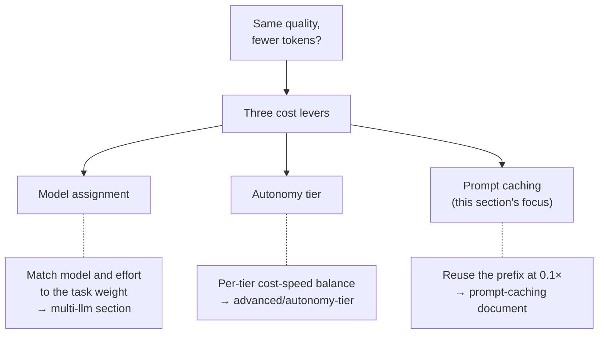

 <strong>Belongs to</strong>: Tokenomics

<!-- @value: tokenomics -->

The cost-optimization section gathers the documents that answer one question: "How do we cut the tokens spent to produce a result?" Because the model re-reads the entire conversation from the start on every turn, getting the same quality of code more cheaply requires a clear standard for what to save and what to spend. This section concentrates on **prompt caching** — reusing the previously processed prefix at a discount — and links out to the other levers that affect cost.


**In one line** — three levers directly affect cost: (1) pick the right model and effort for the task, (2) balance cost and speed with the autonomy tier, and (3) reuse the prefix with prompt caching. This section covers the third in depth.


## The cost axis within tokenomics

Of MoAI-ADK v3.0's three core elements, the area responsible for cost is **tokenomics** (token economics). In one phrase: "the same quality, for fewer tokens." Even as per-model pricing falls year over year, when many agents run and contexts grow long, the tokens a session burns rise sharply. So what governs cost is not the price list but "how you spend tokens" — and within that, this section owns the **reuse** side.

The table below pairs the three representative levers that directly affect cost with the document that treats each in depth. For the full tokenomics structure (instrumentation, routing, dieting, budget guards) see [Tokenomics Overview](/en/advanced/tokenomics-overview); the caching this section owns is covered in the document below.

| Lever | What it does | Representative document |
|------|--------|----------|
| **Model assignment** | Match the model and effort to the weight of the task | [Model Policy](/en/multi-llm/model-policy) · [CG Mode](/en/multi-llm/cg-mode) |
| **Autonomy tier** | Each tier sets a different cost-speed balance point (`MOAI_AUTONOMY_TIER`) | [Autonomy Tier](/en/advanced/autonomy-tier) |
| **Prompt caching** | Read the prefix that matches the previous request from cache at a discount (this section) | [Prompt Caching](/en/cost-optimization/prompt-caching) |

## What this section covers: prompt caching

Of the three levers, the one this section treats in depth is **prompt caching**. The model sends the system prompt, project rules, tool definitions, and conversation history from scratch on every turn; if the prefix matches the previous request exactly, that part is fetched from cache instead of recomputed. Tokens read from cache are billed at **0.1×** the base input rate, so the larger the repeating context, the bigger the saving.

The key point is that the break-even sits at **two requests**. The first request pays a 1.25× premium (5-minute TTL) to write the cache, but if a second request reads it at 0.1× within the TTL, that premium is recovered immediately. So the cost turning point depends not on "when to turn caching on" but on "when the cache is invalidated" — actions like switching models or running `/compact` change the prefix, the cache breaks at that point, and from there billing returns to full price.


**By way of analogy** — the model has a habit of re-reading the conversation from the start every time. Caching is a bookmark that says "the prefix is the same as what I just read" and skips it. If even one character of the prefix changes, the bookmark is voided and reading resumes from that point.


## How this differs from prompt caching on other pages

Two documents on the site treat prompt caching. They unpack the same mechanism from different angles, so pick the entry document based on what you want to know.

| Document | Angle | When to read |
|------|------|-----------|
| [This section: Prompt Caching](/en/cost-optimization/prompt-caching) | **Cost** — break-even, price multipliers, when the cache holds and when it is invalidated | When you want to understand the saving and the cache-invalidating actions |
| [Claude Code: Prompt Caching](/en/claude-code/context-memory/prompt-caching) | **Context** — how the prefix is reused every turn to cut latency | When you want to know how the Claude Code runtime builds and reuses context each turn |

If cost is your main concern, start with this section's document. If you are first curious about how the Claude Code runtime assembles and reuses context every turn, you may start with the context-angle document — the two documents point at each other, so either works as an entry point.

## Documents in this section

- [Prompt Caching — cost savings and break-even](/en/cost-optimization/prompt-caching) — the saving mechanism, the 2-request break-even rule, price multipliers (1.25× write / 0.1× read), 5-minute lifetime, actions that invalidate or preserve the cache, autonomy-tier cost trade-offs, and statusline `cache_hit` monitoring

## Further reading: the other cost levers

If you are curious about the two cost levers besides caching, continue with the documents below.

- [Multi-LLM](/en/multi-llm) — task-appropriate model assignment and CG mode (a Claude leader plus GLM workers cuts implementation-heavy work by roughly 60–70%)
- [Model Policy](/en/multi-llm/model-policy) — per-agent model and effort assignment table
- [Autonomy Tier](/en/advanced/autonomy-tier) — cost-speed trade-off per `MOAI_AUTONOMY_TIER`
- [Tokenomics Overview](/en/advanced/tokenomics-overview) — the full picture of tokenomics' four-layer structure
