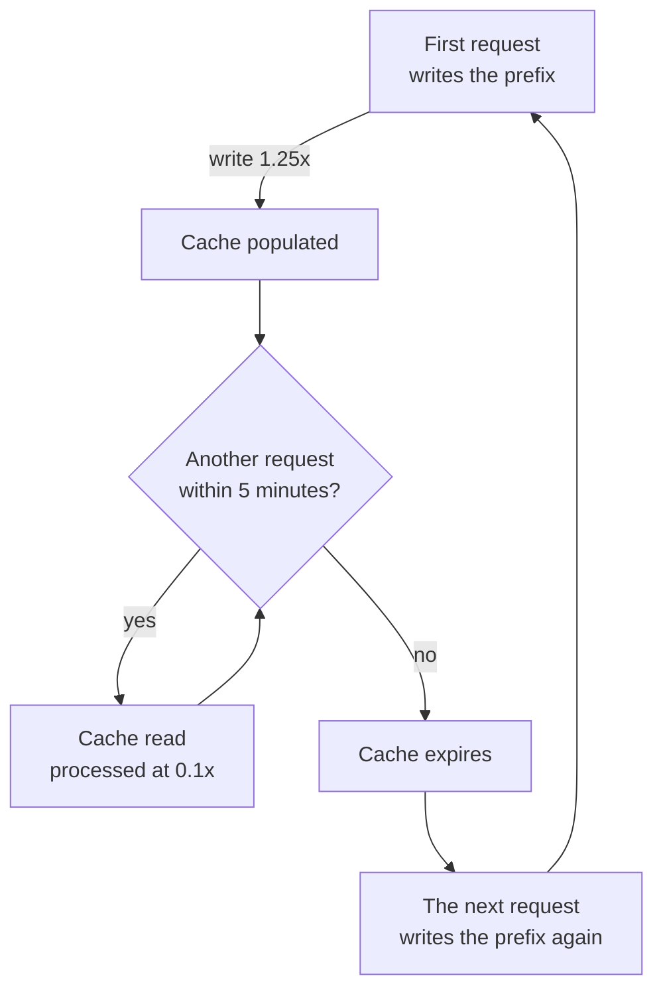

# Prompt Caching — Cost Savings and the Break-Even

**Prompt caching** reuses the front portion of a request that was just
processed, instead of recomputing it. The model resends the whole conversation
every turn, but if the front portion is identical to the previous one, it is
served from the cache at roughly 10% of the full price. So the longer the
conversation and the larger the repeated context, the bigger the savings.


This page treats prompt caching from the **cost** perspective — how the
savings work, the break-even, where money leaks when the cache goes cold, and
how autonomy tiers relate to cost. For how it works and for context
management in detail, see [Prompt Caching](/en/claude-code/context-memory/prompt-caching).
The two documents light the same feature from different angles — that one
follows context management, this one follows cost optimization.


## Why cost goes down

The model remembers nothing between requests. So Claude Code builds a fresh
API request every turn and sends the **entire context** — system prompt,
project instructions, tool definitions, the conversation and tool results so
far, and the new message — from scratch.

The key point is that new content is always **appended at the very end**. Most
of each request is identical to the previous one; the genuinely new part is
just the latest exchange. Prompt caching is what stops that "unchanged front
portion" from being recomputed every time. If MoAI-ADK **tokenomics** is the
axis that trims the always-loaded context itself, prompt caching is the axis
that reuses the remaining context on the cheap.

## The prefix and its three layers

For the cache to hit, the beginning of the request — the **prefix** — must be
100% identical to the previous one. This prefix is assembled in a fixed order.

| Order | Layer | What goes in | When it changes |
|------|------|-----------------|-------------|
| 1 | Tool definitions (tools) | Built-in tools + MCP tool schemas | MCP server connect/disconnect, upgrades |
| 2 | System prompt (system) | Core instructions, permission rules, `CLAUDE.md`, auto memory | Permission rule changes, session-start file edits, `/clear` |
| 3 | Messages (messages) | User input + responses + tool results | Every turn (appended at the end) |

Content that almost never changes comes first. If only the message layer
changes, the tool definitions and system prompt stay cached. Conversely, if
the system prompt or tool definitions change, everything after them sits
behind a different prefix and **the whole cache is invalidated** — one turn
gets slower and more expensive.

If you remember just one thing, make it this — **the more stable the front
portion, the longer the cache lives and the bigger the savings.** The exact
match requirement, and the fact that caches are tracked separately per model
and effort level, are covered in depth in the [context management
document](/en/claude-code/context-memory/prompt-caching).

## Cost structure and the break-even

Whether the cache is working shows up in two token counts the API reports with
every response.

| Field | Meaning | Cost (vs. base input rate) |
|------|------|----------------------------|
| `cache_read_input_tokens` | Tokens **read from** the cache | **0.1x** (≈10%) |
| `cache_creation_input_tokens` | Tokens newly **written to** the cache | **1.25x** (5-min TTL) · **2x** (1-hour TTL) |

Reads cost 10% of normal input, so the higher the share served from the cache,
the cheaper the same work becomes. Writes are 25% more expensive than normal
input, but they are an investment — pay once more upfront, save repeatedly
afterward.

### The break-even: 2 requests

The point where caching becomes a net gain is clear — **2 requests**.

The first request pays 1.25x (5-min TTL) to write the prefix into the cache.
A second request arriving within the TTL reads that prefix at 0.1x. Taken
together, the two already more than offset the first write's premium. As three,
four, or more requests follow on the same prefix, the savings compound.


**Rule of thumb**: whenever 2 or more requests follow on the same prefix,
caching is unconditionally a win. For work that ends in a single request,
whether it caches or not barely moves the cost.


### How cache cost flows



### When you call the API directly

What follows applies **only to developers calling the Anthropic API
directly**. It does not apply to Claude Code users — the runtime manages this
for you.

The principle is a single one — **place the breakpoint on the last stable
block, before the data that changes on every request** (the question, a
timestamp).

```python
# Place the cache breakpoint on a stable system prompt
response = client.messages.create(
    model="claude-opus-4-8",
    max_tokens=1024,
    system=[{
        "type": "text",
        "text": "Stable system prompt...",
        "cache_control": {"type": "ephemeral", "ttl": "1h"}
    }],
    messages=[{"role": "user", "content": user_query}]
)
```

## The 5-minute lifetime: where money leaks

While requests that hit the cache keep arriving, it stays warm — but if **no
request arrives for 5 minutes**, it expires. This lifetime is **idle-based**:
5 minutes after the last request the cache is gone, and the next request must
write the prefix from scratch again.

Long waits that need a human in the loop are what push past those 5 minutes.
Time spent answering a question or waiting for a review lands here. The larger
the context, the larger this expiration cost — the prefix to refill is big. So
unless a gate is genuinely necessary, it pays to avoid long pauses with a
large context on hand.

| Auth method | Default TTL | Notes |
|-----------|----------|------|
| Claude subscription (Pro/Max/Team/Enterprise) | 1 hour (automatic, no extra cost) | Falls back to 5 minutes automatically when limits are exceeded |
| API key · third-party | 5 minutes | Can switch to 1 hour with `ENABLE_PROMPT_CACHING_1H=1` |

Since Claude Code 2.1.243, the `promptCacheTtl` and `subagentPromptCacheTtl` settings (env vars `CLAUDE_CODE_PROMPT_CACHE_TTL` / `CLAUDE_CODE_SUBAGENT_PROMPT_CACHE_TTL`) let API-key and cloud-provider sessions hold a 1-hour cache on the main conversation while subagents stay at 5 minutes. Whether a third-party gateway such as z.ai honors the setting is unmeasured — on a gateway, keep planning around the 5-minute default until you have verified otherwise.

## What breaks the cache (cost perspective)

Do any of the following and the next request misses the cache — one turn gets
slower and more expensive. Once you have paid that one slow, expensive turn,
the new prefix is cached again.

| Action | Impact |
|------|------|
| Switching models (`/model`) | Full recompute (cache is partitioned per model) |
| Changing effort level (`/effort`) | Full recompute |
| Connecting/disconnecting an MCP server | Invalidates the tool-definitions layer → everything |
| Denying a whole tool (bare-name deny rules like `Bash`, `WebFetch`) | Invalidates the tool-definitions layer → everything |
| Compacting the conversation (`/compact`, auto-compact) | Rewrites the messages layer |
| Upgrading Claude Code | System prompt · tool definitions change → full rebuild |

> **Scoped** deny rules like `Bash(rm *)`, and all allow/ask rules, do not
> change the tool set, so the prefix stays intact.


**Session-start files are especially costly** — `CLAUDE.md`, rules under
`.claude/rules/`, output styles, and always-loaded skills enter the
system-prompt layer at session start. Edit these files mid-session and the
system-prompt layer changes, invalidating everything; if the context has
already grown, the whole prefix must be written again. Batch such edits
**at the end of a task, or right before a `/clear`**.


The full list of invalidations, and what preserves the cache, is in the
[context management document](/en/claude-code/context-memory/prompt-caching).

## Autonomy tiers (MOAI_AUTONOMY_TIER) and cost·speed

MoAI-ADK's autonomy tiers decide only "how often a human intervenes" — they do
not change cache behavior directly. But **the more frequent the human
intervention, the more chances the cache has to go cold**, and that does reach
the bill.

The `MOAI_AUTONOMY_TIER` environment variable takes three values.

| Tier | Human intervention | Effect on the cache |
|------|-----------|-------------------|
| `semi-auto` (default) | Confirmation · approval gates at every step | Long waits frequently exceed the 5-minute lifetime → frequent cache rewrites |
| `automatic` | Runs autonomously; only key decisions confirmed | Fewer blocking waits, cache stays warm longer |
| `fully-autonomous` | Minimal human intervention (sandbox required) | Fewest waits — best for keeping the cache warm |

In semi-auto, it is easy to pause more than 5 minutes while waiting for
work-start approval or while answering a question, and the cache cools in the
meantime. When the human returns, the grown prefix must be written again
(1.25x). As you go up the tiers, these blocking waits shrink, so **the same
work gets done cheaper and faster**.


The cost·speed gains come from passing through fewer review gates. Under
`automatic` and `fully-autonomous`, the pre-commit synchronous verification
gates (vet · lint · test) turn off, and under `fully-autonomous` even the
lifecycle hooks are reduced to observation-only. The more you save, the fewer
points a human checks directly — so choosing a tier is not just a cost
question but a question of **review responsibility**.


## How model choice affects cache cost

The model is part of the cache key. Change the model and the same content gets
recomputed in full. So keeping the model consistent is itself a way to save
cache cost. MoAI-ADK protects this consistency with two devices.

- **Profile matrix**: the max · medium · low 3-tier profiles fix a
  `{model, effort}` cell per agent. Query it with `moai model profile --json`.
  When each agent's model is pinned, spawning several agents does not shake
  the cache.
- **Per-spawn model injection** (model-policy): name the model explicitly
  every time you spawn `Agent()`. Agent definitions default to
  `model: inherit`, so omitting the model quietly drops the spawn to the
  parent session's model — a common cause of cache shake. A declared model
  that differs from the actually resolved one is caught as drift.

The **minimum token count** for content to enter the cache also differs per
model. A prefix shorter than this is simply not cached (processed normally,
no error).

| Model | Context | Minimum cache tokens |
|------|----------|----------------|
| Claude Fable 5 | 256K | 512 |
| Claude Opus 5 | 1M | 1,024 |
| Claude Sonnet 5 | 200K | 1,024 |
| Claude Opus 4.7 | 1M | 2,048 |
| Claude Haiku 4.5 | 200K | 4,096 |

> New models in the 2026 lineup, like Opus 4.8 (1M context), get their own
> per-family minimum cache tokens — for models not in the table above, check
> the [official prompt caching documentation](https://platform.claude.com/docs/en/build-with-claude/prompt-caching).

## Cost-saving habits

Caching turns on by itself, but working cache-aware saves far more cost and
latency. The core is one thing — the longer the unchanged front portion
survives, the bigger the gain, so keep that front portion from shaking.

1. **Fix things at session start, then leave them alone**: model, effort
   level, and MCP servers are set when the session starts and left that way
   until the work is done. These three are the most common causes of a full
   recompute.
2. **Edit always-loaded files at the end of a task**: editing `CLAUDE.md`,
   rules, output styles, or always-loaded skills mid-session invalidates
   everything. Batch them after a task finishes or right before a `/clear`.
3. **Don't pause long with a large context**: waits beyond 5 minutes cool the
   cache. The bigger the context, the more refilling it costs.
4. **`/compact` at natural checkpoints**: run it at meaningful boundaries
   between tasks. If you went down the wrong path, **`/rewind`, which returns
   you to the cached earlier turns**, is cheaper than a `/compact` that
   re-summarizes everything.
5. **`/clear` only when truly needed**: `/clear` throws away the whole warm
   cache. If only short cleanup remains, finishing while keeping the cache is
   cheaper than starting a large task carrying stale context.

## Saving more with CG mode

If caching is the axis of "reusing the same content cheaply," **CG mode** is
the axis of "using the expensive model less." It splits the tmux session so
the leader runs Claude and implementation workers run the cheaper GLM (z.ai
backend), cutting cost by roughly **60-70%** on implementation-heavy work.
The two axes do not overlap — under CG mode, each backend handles its own
caching (Claude with prompt caching, GLM with content-similarity-based
implicit caching).

For the detailed structure and switching commands, see [CG Mode](/en/multi-llm/cg-mode).

## Cost monitoring

To see whether the cache is working, watch the two token counts.

- **statusline**: you can use a statusline segment that shows the cache hit
  in real time on every turn.
- **API responses**: the ratio of `cache_read_input_tokens` (reads) to
  `cache_creation_input_tokens` (writes) is the key signal.

**The read-to-write ratio** is the heart of cache health. Reads overwhelming
writes means caching is doing its job. Conversely, if write tokens stay high
turn after turn, something in the prefix changes every time — look for the
cause in the "what breaks the cache" table above.

The latency side gains too. The unchanged prefix is not reprocessed, so
responses come back faster. Only the turn where the cache was invalidated pays
the one-time slow, expensive penalty.

## Summary

- **How the savings work**: the unchanged front portion is reused at 0.1x.
  The larger and more stable that front portion, the bigger the savings.
- **Break-even**: 2 requests. The first request's 1.25x write premium is
  recovered by the second request's 0.1x read within the TTL.
- **The 5-minute lifetime**: long human waits cool the cache. Especially
  costly with a large context.
- **Autonomy tiers**: higher `MOAI_AUTONOMY_TIER` means fewer blocking waits,
  a warmer cache, and better cost·speed — but fewer review gates too.
- **Monitoring**: statusline cache hit + the read/write token ratio.

## Related documents

- [Prompt Caching](/en/claude-code/context-memory/prompt-caching) — how it works, prefix matching, context management (context-management perspective)
- [Context Window](/en/claude-code/context-memory/context-window) — context window sizes and per-model differences
- [CG Mode](/en/multi-llm/cg-mode) — cut cost 60-70% with the Claude + GLM hybrid
- [Model Policy](/en/multi-llm/model-policy) — per-agent model injection and drift prevention

## Sources (official documentation)

- [How Claude Code uses prompt caching](https://code.claude.com/docs/en/prompt-caching) — automatic management, automatic TTL selection, invalidation factors
- [Prompt caching (API)](https://platform.claude.com/docs/en/build-with-claude/prompt-caching) — `cache_control`, price multipliers, per-model minimum tokens
- [Manage costs effectively](https://code.claude.com/docs/en/costs) — Claude Code's automatic cost optimization
