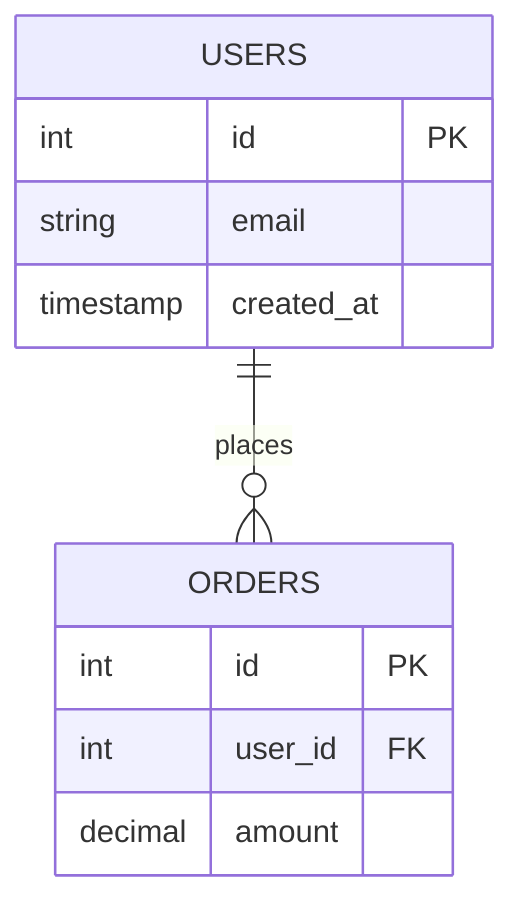

## 7-File Template Set

When you run `/moai db init`, these 7 files are automatically created in `.moai/project/db/`:

```
.moai/project/db/
├── README.md              (~50 lines) Basic overview
├── schema.md              (auto-generated) Table registry
├── erd.mmd                (auto-generated) Entity relationship diagram
├── migrations.md          (auto-generated) Migration timeline
├── rls-policies.md        (template) Row-level security
├── queries.md             (template) Common query library
└── seed-data.md           (template) Seed data patterns
```

## Role of Each File

### README.md

Overview and navigation guide for this section.

Contents:
- DB workflow introduction
- Description of the 7 files
- Common workflow (adding migrations, updating schema)

This file is for user editing and is protected during auto-update.

### schema.md

Automatically documents all tables, columns, and relationships.

Structure:

```markdown
# Schema

## Table Index

| Table | Columns | Primary Key | Latest Migration |
|-------|---------|-------------|------------------|
| users | 8 | id | 20240101_create_users.sql |
| orders | 12 | id | 20240115_add_orders.sql |

## users

| Column | Type | Constraints | Description |
|--------|------|-------------|-------------|
| id | bigint | PRIMARY KEY, NOT NULL | User ID |
| email | varchar(255) | UNIQUE, NOT NULL | Email address |
| created_at | timestamp | NOT NULL | Creation timestamp |
```

**[HARD] Auto-Generated** — Completely regenerated during `/moai db refresh`.

### erd.mmd

Visualizes table relationships in Mermaid syntax.

Example:



**[HARD] Auto-Generated** — Completely regenerated during `/moai db refresh`.

### migrations.md

Timeline of applied migration files.

Structure:

```markdown
# Migration History

## January 2024

- `2024-01-01` — 001_create_users.sql — Create users table
- `2024-01-01` — 002_create_orders.sql — Create orders table
- `2024-01-15` — 003_add_email.sql — Add email field

## February 2024

- `2024-02-01` — 004_add_status.sql — Add status field
```

**[HARD] Auto-Generated** — Completely regenerated during `/moai db refresh`.

### rls-policies.md

Define Row-Level Security (RLS) policies for Supabase, PostgreSQL, etc.

This file is a template for user authoring. Example:

```markdown
# Row-Level Security Policies

## users table

- **Select only rows matching auth.uid()** — Users can only view their own profile
- **Admin role can view all rows** — Admins can view all users

## orders table

- **Select only own orders** — user_id = auth.uid()
- **Admin can view all orders** — Check admin role
```

This file is for user editing and is protected during auto-update.

### queries.md

Common query patterns for AI agents to reference.

Contents:

- User lookup and authentication
- Order aggregation queries
- Report generation queries
- Data migration scripts

Example:

```sql
-- Look up user by email
SELECT * FROM users WHERE email = $1;

-- Monthly revenue aggregation
SELECT DATE_TRUNC('month', created_at) as month, SUM(amount)
FROM orders
GROUP BY DATE_TRUNC('month', created_at)
ORDER BY month DESC;
```

This file is for user editing and is protected during auto-update.

### seed-data.md

Initial or test data patterns for your project.

Structure:

```markdown
# Seed Data

## Development Environment

### Default Users

```json
{
  "email": "admin@example.com",
  "role": "admin"
},
{
  "email": "user@example.com",
  "role": "user"
}
```

## Production

Production seed data is kept in a separate repository.
```

This file is for user editing and is protected during auto-update.

## _TBD_ Markers for Customization

Template files (rls-policies.md, queries.md, seed-data.md) include `_TBD_` markers when created:

```markdown
# Row-Level Security Policies

_TBD_: Enter your project's RLS policies here.
```

Find each `_TBD_` marker and:

1. Delete the marker
2. Write actual project content
3. Save the file

For example:

```markdown
# Row-Level Security Policies

## users table

- **Only authenticated users can view their own data** — auth.uid() = id
- **Only admin role can view all rows** — role = 'admin'
```

## User Edit Content Protection

User-edited sections are protected during automatic sync.

Mechanism:

1. Add SHA-256 hash to user-edited blocks
2. During `/moai db refresh`, verify hash
3. If hash matches, skip that section and only update auto-generated parts

Example:

```markdown
---
# Auto-Generated Section
## Table Index
[Updated automatically]

---
# User Custom Section (SHA-256: abc123...)
## Relationship Descriptions

This is content written by the user.
It will be preserved during auto-update.
```

## Example Generated schema.md

After initialization, schema.md looks like:

```markdown
# Schema

## Table Index

| Table | Columns | Primary Key | Latest Migration |
|-------|---------|-------------|------------------|
| users | 8 | id | 20240101_create_users.sql |

## users

Created: 20240101_create_users.sql

| Column | Type | Nullable | Default | Description |
|--------|------|----------|---------|-------------|
| id | bigint | NO | auto_increment | User unique ID |
| email | varchar(255) | NO | - | Email address |
| password_hash | varchar(255) | NO | - | Hashed password |
| created_at | timestamp | NO | CURRENT_TIMESTAMP | Account creation time |

### Foreign Keys

None

### Indexes

- PRIMARY KEY: id
- UNIQUE: email
```

## Related Configuration Files

### db.yaml

Global settings in `.moai/config/sections/db.yaml`:

```yaml
db:
  auto_sync: true                        # Enable auto-sync
  debounce_window_seconds: 10            # Debounce window
  approval_required: false               # Approval required
  migration_patterns:                    # Custom migration paths
    - path: "db/migrations"
      language: "go"
```

## Workflow

### Typical Workflow

1. Add new migration file: `db/migrations/004_add_status.sql`
2. Auto-sync hook triggers after 10 seconds
3. `schema.md`, `erd.mmd`, `migrations.md` auto-update
4. `rls-policies.md`, `queries.md`, `seed-data.md` remain unchanged
5. Update manually if needed

### Full Rebuild

For full rebuild when needed:

```bash
/moai db refresh
```

Prompt:

```
Rebuild schema completely? (y/n)
```

Enter "y" to:
- Re-scan all migration files
- Completely regenerate schema.md
- Completely regenerate erd.mmd
- Completely regenerate migrations.md
- User-edited sections are protected
