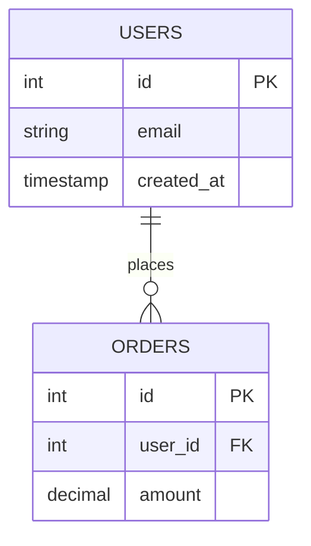

`.moai/project/db/` is the single reference point for your project's database.
It splits into 3 auto-generated files and 4 user-edited templates — the
auto-generated part is managed by `/moai db refresh`, and the user-edited part
is protected even during refreshes.

## The 7-file template set

Running `/moai db init` automatically creates the following 7 files in the
`.moai/project/db/` directory:

```
.moai/project/db/
├── README.md              (~ 50 lines) basic overview
├── schema.md              (auto-generated) table registry
├── erd.mmd                (auto-generated) entity-relationship diagram
├── migrations.md          (auto-generated) migration timeline
├── rls-policies.md        (template) Row-level security
├── queries.md             (template) common query library
└── seed-data.md           (template) seed data patterns
```

## What each file does

### README.md

The overview and navigation guide for this section.

Contents:
- Introduction to the DB workflow
- Description of the 7 included files
- Common workflows (adding migrations, updating the schema)

This file is user-edited, so it is protected during automatic refreshes.

### schema.md

Automatically documents all tables, columns, and relationships.

Structure:

```markdown
# Schema

## Table list

| Table | Columns | Primary key | Last migration |
|--------|--------|--------|-----------------|
| users | 8 | id | 20240101_create_users.sql |
| orders | 12 | id | 20240115_add_orders.sql |

## users

| Column | Type | Constraints | Description |
|------|------|--------|------|
| id | bigint | PRIMARY KEY, NOT NULL | unique user ID |
| email | varchar(255) | UNIQUE, NOT NULL | email address |
| created_at | timestamp | NOT NULL | creation time |
```

**Auto-generated file** — fully regenerated on `/moai db refresh`, so do not edit it directly.

### erd.mmd

Visualizes table relationships in Mermaid syntax.

Example:


```mermaid
erDiagram
    USERS ||--o{ ORDERS : places
    USERS {
        int id PK
        string email
        timestamp created_at
    }
    ORDERS {
        int id PK
        int user_id FK
        decimal amount
    }
```

**Auto-generated file** — fully regenerated on `/moai db refresh`, so do not edit it directly.

### migrations.md

The timeline of applied migration files.

Structure:

```markdown
# Migration history

## January 2024

- `2024-01-01` — 001_create_users.sql — create users table
- `2024-01-01` — 002_create_orders.sql — create orders table
- `2024-01-15` — 003_add_email.sql — add email field

## February 2024

- `2024-02-01` — 004_add_status.sql — add status field
```

**Auto-generated file** — fully regenerated on `/moai db refresh`, so do not edit it directly.

### rls-policies.md

Defines Row-Level Security (RLS) policies for Supabase, PostgreSQL, and the
like.

This file is a template that you fill in manually. Example:

```markdown
# Row-Level Security policies

## users table

- **Select only rows matching auth.uid()** — users can only view their own profile
- **Only the admin role can view all rows** — administrators can view every user

## orders table

- **View only your own orders** — user_id = auth.uid()
- **Administrators can view all orders** — check the admin role
```

This file is user-edited, so it is protected during automatic refreshes.

### queries.md

Common query patterns that AI agents reference. Instead of reasoning each
query from scratch every time, the agent reuses verified patterns — a win for
both quality and token cost.

Contents:

- User lookup and authentication
- Order aggregation queries
- Report generation queries
- Data migration scripts

Example:

```sql
-- Look up a user by email
SELECT * FROM users WHERE email = $1;

-- Aggregate monthly revenue
SELECT DATE_TRUNC('month', created_at) as month, SUM(amount)
FROM orders
GROUP BY DATE_TRUNC('month', created_at)
ORDER BY month DESC;
```

This file is user-edited, so it is protected during automatic refreshes.

### seed-data.md

Initial data or test data patterns for the project.

Example structure — the development environment section lists the default
accounts in JSON:

```json
[
  { "email": "admin@example.com", "role": "admin" },
  { "email": "user@example.com", "role": "user" }
]
```

Production seed data is kept in a separate repository.

This file is user-edited, so it is protected during automatic refreshes.

## Customization via _TBD_ markers

On initial creation, the template files (rls-policies.md, queries.md,
seed-data.md) include `_TBD_` markers:

```markdown
# Row-Level Security policies

_TBD_: enter your project's RLS policies here.
```

Find the `_TBD_` markers and do the following:

1. Delete the marker
2. Write your actual project content
3. Save

For example:

```markdown
# Row-Level Security policies

## users table

- **Only authenticated users can view their own data** — auth.uid() = id
- **Only the admin role can view all rows** — role = 'admin'
```

## Protecting user-edited content

Sections you have edited stay protected even during automatic sync.

Mechanism:

1. A SHA-256 hash is added to each file's user-edited blocks
2. The hash is verified when `/moai db refresh` runs
3. If the hash matches, that part is skipped and only the auto-generated part is refreshed

Example:

```markdown
---
# Auto-generated section
## Table list
[Refreshed automatically]

---
# User custom section (SHA-256: abc123...)
## Relationship notes

This part was written by the user.
It is preserved during automatic refreshes.
```

## Example of a generated schema.md

After initialization, schema.md looks like this:

```markdown
# Schema

## Table index

| Table | Columns | Primary key | Last migration |
|---------|--------|--------|-----------------|
| users | 8 | id | 20240101_create_users.sql |

## users

Created by: 20240101_create_users.sql

| Column | Type | Nullable | Default | Description |
|------|------|---------|--------|------|
| id | bigint | NO | auto_increment | unique user ID |
| email | varchar(255) | NO | - | email address |
| password_hash | varchar(255) | NO | - | hashed password |
| created_at | timestamp | NO | CURRENT_TIMESTAMP | account creation time |

### Foreign keys

None

### Indexes

- PRIMARY KEY: id
- UNIQUE: email
```

## Related configuration files

### db.yaml

Global settings in `.moai/config/sections/db.yaml`:

```yaml
db:
  auto_sync: true                        # enable automatic sync
  debounce_window_seconds: 10            # debounce window
  approval_required: false               # whether approval is required
  migration_patterns:                    # custom migration paths
    - path: "db/migrations"
      language: "go"
```

## Workflow

### Typical workflow

1. Add a new migration file: `db/migrations/004_add_status.sql`
2. The automatic sync hook triggers after 10 seconds
3. `schema.md`, `erd.mmd`, and `migrations.md` are refreshed automatically
4. `rls-policies.md`, `queries.md`, and `seed-data.md` are left as they are
5. Update them manually if needed

### Full rebuild

When a manual rebuild is needed:

```bash
/moai db refresh
```

Prompt:

```
Fully rebuild the schema? (y/n)
```

Entering "y":
- Rescans all migration files
- Fully regenerates schema.md
- Fully regenerates erd.mmd
- Fully regenerates migrations.md
- User-edited parts stay protected
