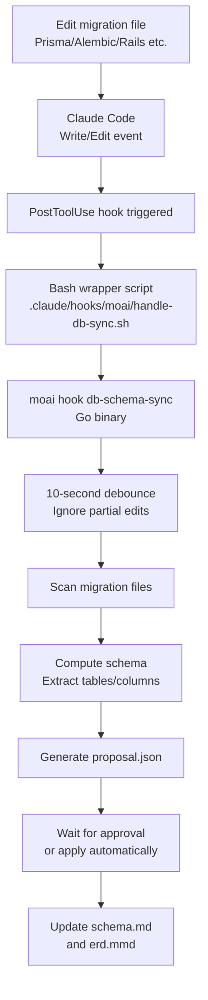

## Architecture Overview

MoAI's database workflow automatically detects changes to migration files and synchronizes schema documentation. This is implemented through the PostToolUse hook.

## Event Flow



## Automatic Detection

### Supported Events

Automatic detection triggers when migration files change:

| Language | Migration Path | File Pattern |
|----------|---------------|-------------|
| Go | `db/migrations/` | `*.sql` |
| Python | `alembic/versions/` | `*.py` |
| TypeScript | `prisma/migrations/` | `*.sql` |
| JavaScript | `migrations/` | `*.js` |
| Rust | `migrations/` | `*.sql` |
| Java | `src/main/resources/db/migration/` | `V*.sql` |
| Ruby | `db/migrate/` | `*.rb` |
| PHP | `database/migrations/` | `*.php` |

### Debounce Window

To prevent errors from partial edits, a **10-second debounce window** is implemented:

- Migration file change detected
- Wait 10 seconds
- If no additional changes occur within 10 seconds, execute schema scan
- If changes occur within 10 seconds, reset timer

## Configuration Options

### Enable Automatic Sync

Configure in `.moai/config/sections/db.yaml`:

```yaml
db:
  auto_sync: true              # Default: true
  debounce_window_seconds: 10  # Default: 10 seconds
  approval_required: false     # Default: false (auto-apply)
```

### Disable Automatic Sync

To disable auto-sync for a project:

```yaml
db:
  auto_sync: false
```

In this case, manually sync with:

```bash
/moai db refresh
```

## Manual Synchronization

Use the `/moai db refresh` command:

```bash
/moai db refresh
```

This command:

1. Wait for user confirmation (REQ-024) — "Rebuild schema completely?"
2. Full scan of all migration files
3. Regenerate schema.md, erd.mmd, migrations.md
4. Output summary

## Relationship to /moai sync

When running the full documentation sync workflow (`/moai sync`):

- Phase 0.08: DB schema automatically refreshed
- Works independently from auto-sync hook
- Performs integrated update of all documents

## User Edit Content Protection

During automatic sync, user-edited sections are protected:

- Tracks changes with SHA-256 hashing
- Auto-detects user-edited sections
- Only regenerated content is updated
- User edits are preserved

For example, in `schema.md`:

```markdown
# Schema Documentation

## Auto-Generated Section
[Updated automatically]

## Custom Notes (User-Edited)
[Preserved during auto-update]
```

## Verify Hook Registration

Check that the PostToolUse hook is correctly registered:

```bash
grep -A10 '"PostToolUse"' .claude/settings.json
```

Expected output:

```json
"PostToolUse": [{
  "hooks": [{
    "command": "\"$CLAUDE_PROJECT_DIR/.claude/hooks/moai/handle-db-sync.sh\"",
    "timeout": 15
  }]
}]
```

## Troubleshooting

### Hook Not Working

1. Check hook script exists:

```bash
ls -la .claude/hooks/moai/handle-db-sync.sh
```

2. Verify execute permissions:

```bash
chmod +x .claude/hooks/moai/handle-db-sync.sh
```

3. Check moai binary path:

```bash
which moai
```

### Schema Update Incorrect

Disable auto-sync and validate manually:

```yaml
db:
  auto_sync: false
```

Then manually refresh to verify results:

```bash
/moai db refresh
```
