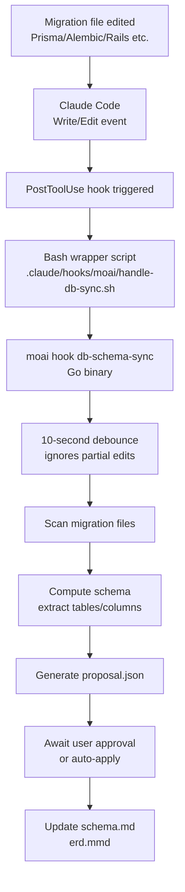

## Architecture overview

MoAI's database workflow automatically detects migration file changes and
synchronizes the schema documentation. So that nobody has to remember to
"update the docs", this observation loop is attached to Claude Code's
PostToolUse hook — when the agent works, the documentation follows.

## Event flow


```mermaid
flowchart TD
    A["Migration file edited<br/>Prisma/Alembic/Rails etc."] --> B["Claude Code<br/>Write/Edit event"]
    B --> C["PostToolUse hook triggered"]
    C --> D["Bash wrapper script<br/>.claude/hooks/moai/handle-db-sync.sh"]
    D --> E["moai hook db-schema-sync<br/>Go binary"]
    E --> F["10-second debounce<br/>ignores partial edits"]
    F --> G["Scan migration files"]
    G --> H["Compute schema<br/>extract tables/columns"]
    H --> I["Generate proposal.json"]
    I --> J["Await user approval<br/>or auto-apply"]
    J --> K["Update schema.md<br/>erd.mmd"]
```

## Automatic detection mechanism

### Supported events

Changes to migration files are detected automatically:

| Language | Migration path | File pattern |
|------|-----------------|---------|
| Go | `db/migrations/` | `*.sql` |
| Python | `alembic/versions/` | `*.py` |
| TypeScript | `prisma/migrations/` | `*.sql` |
| JavaScript | `migrations/` | `*.js` |
| Rust | `migrations/` | `*.sql` |
| Java | `src/main/resources/db/migration/` | `V*.sql` |
| Ruby | `db/migrate/` | `*.rb` |
| PHP | `database/migrations/` | `*.php` |

### Debounce window

Scanning on every file save would be wasteful, so a **10-second debounce
window** is set to prevent false triggers from partial edits:

- Migration file change detected
- Wait for 10 seconds
- If no further changes within 10 seconds, run the schema scan
- If another change occurs within 10 seconds, reset the timer

## Configuration options

### Enabling automatic sync

Configure in `.moai/config/sections/db.yaml`:

```yaml
db:
  auto_sync: true              # default: true
  debounce_window_seconds: 10  # default: 10 seconds
  approval_required: false     # default: false (auto-apply)
```

### Disabling automatic sync

To disable automatic sync for a specific project:

```yaml
db:
  auto_sync: false
```

In that case you must sync manually:

```bash
/moai db refresh
```

## Manual sync

Use the `/moai db refresh` command:

```bash
/moai db refresh
```

This command:

1. Waits for user confirmation (REQ-024) — "Fully rebuild the schema?"
2. Fully scans all migration files
3. Regenerates schema.md, erd.mmd, and migrations.md
4. Prints a result summary

## Relationship with /moai sync

When the full documentation sync workflow (`/moai sync`) runs:

- Phase 0.08: includes the automatic DB schema refresh
- Operates independently of the automatic sync hook
- Updates all documentation together

## Protecting user-edited content

Sections you have edited stay protected even during automatic sync:

- Change tracking via SHA-256 hashes
- User-edited regions detected automatically
- Only auto-generated content is refreshed
- User edits are preserved

For example, in `schema.md`:

```markdown
# Schema documentation

## Auto-generated section
[Refreshed automatically]

## Custom notes (user-edited)
[Preserved during automatic refresh]
```

## Verifying the hook configuration

Verify the PostToolUse hook is registered correctly:

```bash
grep -A10 '"PostToolUse"' .claude/settings.json
```

Expected output:

```json
"PostToolUse": [{
  "hooks": [{
    "command": "\"$CLAUDE_PROJECT_DIR/.claude/hooks/moai/handle-db-sync.sh\"",
    "timeout": 15
  }]
}]
```

## Troubleshooting

### The hook is not firing

1. Check the hook script exists:

```bash
ls -la .claude/hooks/moai/handle-db-sync.sh
```

2. Check execute permissions:

```bash
chmod +x .claude/hooks/moai/handle-db-sync.sh
```

3. Check the `moai` binary path:

```bash
which moai
```

### The schema refresh is wrong

Disable automatic sync and verify manually:

```yaml
db:
  auto_sync: false
```

Then refresh manually and check the result:

```bash
/moai db refresh
```
