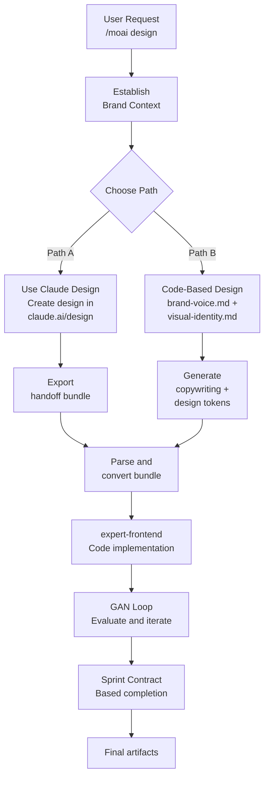

# Design System

MoAI-ADK's design system supports a **hybrid approach**. Choose between Claude Design or code-based design to build brand-aligned web experiences.

## Two Paths

## Key Features

- **Brand Consistency** — Brand context applied at every stage
- **Sprint Contract Protocol** — Clear acceptance criteria per iteration
- **4-Dimensional Scoring** — Design quality, originality, completeness, functionality
- **Anti-AI-Slop** — Rules preventing shallow AI-generated content
- **Accessibility Compliance** — WCAG AA standard automated validation

## Next Steps

- **[Getting Started](./getting-started.md)** — Start your first project with `/moai design`
- **[Claude Design Handoff](./claude-design-handoff.md)** — Learn Claude Design features and bundle export
- **[Code-Based Path](./code-based-path.md)** — Design using brand-voice.md
- **[GAN Loop](./gan-loop.md)** — Builder-Evaluator iteration process
- **[Migration Guide](./migration-guide.md)** — Convert existing .agency/ projects

## Requirements

- Latest MoAI-ADK version
- Claude Code desktop client v2.1.50 or later
- Path A: Claude.ai Pro or higher subscription
- Path B: Complete brand context files
