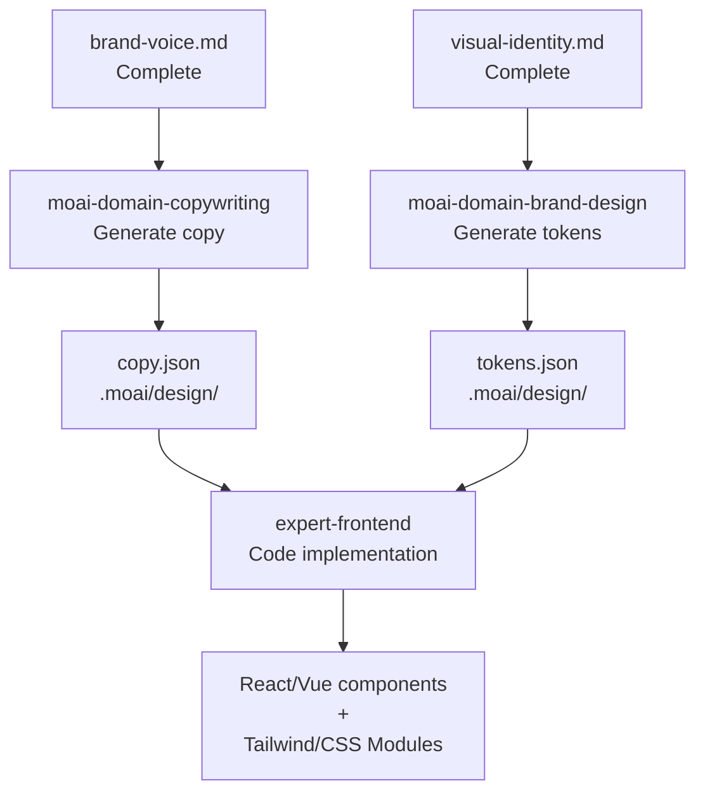

# Code-Based Path

Path B **automatically generates** design tokens and component specs from **complete brand context**.

## Required Files

Path B requires these three files to be complete:

### 1. brand-voice.md

Brand tone, terminology, messaging guidelines

```markdown
# Brand Tone

- **Primary Tone:** Professional yet approachable
- **Avoid:** Exaggeration, technical jargon overload
- **Preferred:** "Let's solve your problem together"

## Key Terminology

- AI Agency → Design Automation
- Workflow → Work process
```

**Used by:** `moai-domain-copywriting` skill for hero, features, CTA copy

### 2. visual-identity.md

Colors, typography, visual language

```markdown
# Color Palette

## Primary Colors
- **Primary Blue:** #3B82F6 (RGB: 59, 130, 246)
- **Dark Blue:** #1E40AF (RGB: 30, 64, 175)

## Secondary Colors
- **Accent:** #8B5CF6 (Purple)
- **Success:** #10B981 (Green)

# Typography

- **Heading:** Inter (700, 600, 500)
- **Body:** Inter (400, 500)
- **Line Height:** 1.5 (body), 1.2 (heading)
```

**Used by:** `moai-domain-brand-design` skill for token generation

### 3. target-audience.md

Target customer profile and preferences

```markdown
# Target Customer

## Demographics
- **Role:** Product Manager, Designer, Engineer
- **Company Size:** Early startup to mid-size (5-100 people)
- **Tech Level:** Intermediate to advanced

## Preferences
- Clean interface
- Fast learning curve
- Mobile-first thinking
```

**Used by:** All stages of copy and design

## Skill Architecture

### moai-domain-copywriting

**Purpose:** Generate brand-aligned marketing copy

**Input:**
- `brand-voice.md` context
- Page type (landing, about, services, pricing)
- Section requirements

**Output:** Structured JSON

```json
{
  "page_type": "landing",
  "sections": {
    "hero": {
      "primary": {
        "headline": "Cut design time by 90%",
        "subheadline": "Generate complex designs with natural language",
        "cta_primary": "Start free"
      },
      "variant_a": {
        "headline": "Design automation's new standard",
        "subheadline": "From prototype to production, all automated"
      }
    },
    "features": [
      {
        "title": "Auto token generation",
        "description": "Colors, typography, spacing in one go",
        "metric": "99% accuracy"
      }
    ]
  }
}
```

**Anti-AI-Slop Rules:**
- Include concrete numbers ("90% faster" yes, "much faster" no)
- Reader as subject ("you can achieve" yes, "we can help" maybe)
- Active voice preferred
- Remove abstract language

### moai-domain-brand-design

**Purpose:** Auto-generate design tokens and component specs

**Input:**
- `visual-identity.md` colors, typography, spacing
- Page structure and component requirements

**Output:** Design tokens JSON + component specs

```json
{
  "tokens": {
    "colors": {
      "primary": "#3B82F6",
      "dark": "#1E40AF",
      "accent": "#8B5CF6"
    },
    "typography": {
      "heading": {
        "font": "Inter",
        "weight": 700,
        "lineHeight": 1.2
      },
      "body": {
        "font": "Inter",
        "weight": 400,
        "lineHeight": 1.5
      }
    },
    "spacing": {
      "xs": "4px",
      "sm": "8px",
      "md": "16px",
      "lg": "24px"
    }
  },
  "components": {
    "button": {
      "primary": {
        "bg": "$colors.primary",
        "text": "white",
        "padding": "$spacing.md $spacing.lg"
      }
    }
  }
}
```

**WCAG AA Compliance:**
- Color contrast ratio 4.5:1 minimum (text)
- 3:1 minimum (graphics)
- Auto-validated

## Workflow



## Run Path B

### Step 1: Verify Brand Files

```bash
ls -la .moai/project/brand/
# brand-voice.md       ✓
# visual-identity.md   ✓
# target-audience.md   ✓
```

### Step 2: Run /moai design

```
/moai design
```

### Step 3: Select Path B

```
Choose path:

1. (Recommended) Use Claude Design...
2. Code-Based Design (Copywriting + Design Tokens)
   → No subscription needed, auto-generated from brand files

Selection: 2
```

### Step 4: Auto Generation

`moai-domain-copywriting` then `moai-domain-brand-design` execute

**Generated Files:**
- `.moai/design/copy.json` — Page copy (by section)
- `.moai/design/tokens.json` — Design tokens (colors, typography, spacing)
- `.moai/design/components.json` — Component specs (Button, Card, etc.)

### Step 5: Enter GAN Loop

`expert-frontend` agent:
1. Receives tokens and copy
2. Generates React/Vue components + styles
3. `evaluator-active` scores (4-dimensional)
4. Failed → retry with feedback (max 5 iterations)

## Edit Brand Files During Design

Update brand files mid-design if needed:

```bash
# Edit file
vim .moai/project/brand/visual-identity.md

# Re-run (overwrites generated files)
/moai design
```

Results:
- `tokens.json` regenerated (new colors/typography)
- `copy.json` preserved (protected if manually edited)

## Next Steps

- [GAN Loop](./gan-loop.md) — Builder-Evaluator iteration process
- [Sprint Contract Protocol](./gan-loop.md#sprint-contract-protocol) — Acceptance criteria per iteration
- [4-Dimensional Scoring](./gan-loop.md#4-dimensional-scoring) — Detailed scoring criteria
