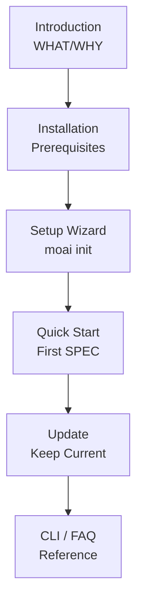

Welcome to MoAI-ADK. Follow the **Introduction → Installation → Quick Start** path and you will have your first MoAI-ADK project running in under 30 minutes.


Already installed? Jump straight to [Quick Start](./quickstart). Looking for CLI flags, see [CLI Reference](./cli). Hitting an issue, try the [FAQ](./faq).


## Learning Flow

## Recommended Reading Order

| Step | Document | What you will learn |
|------|----------|---------------------|
| 1 | [Introduction](./introduction) | What MoAI-ADK is and the problems it solves |
| 2 | [Installation](./installation) | Install on macOS/Linux and verify prerequisites |
| 3 | [Setup Wizard](./init-wizard) | Configure your project with `moai init` |
| 4 | [Quick Start](./quickstart) | Create your first SPEC and run `/moai plan → run → sync` |
| 5 | [Update](./update) | Keep your templates and binary up to date |
| 6 | [CLI Reference](./cli) | Complete index of `moai` subcommands |
| 7 | [FAQ](./faq) | Common installation and runtime issues |


**Next step**: After finishing installation, explore [Core Concepts](/en/core-concepts/) to learn about SPEC-based development, DDD, and the TRUST 5 quality framework.

