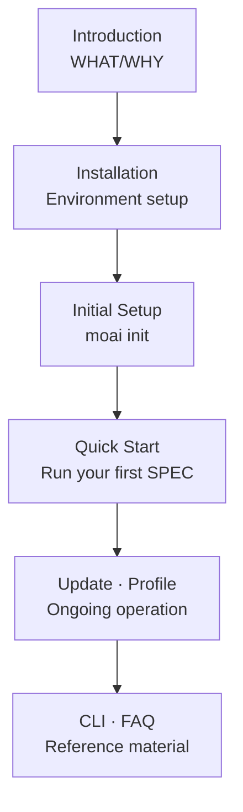

 <strong>Belongs to</strong>: 🪙 Tokenomics · 🧠 Recursive Self-Learning · 🛡️ Agentic Harness

<!-- @value: tokenomics, self-learning, agentic-harness -->

This is the onboarding path for anyone meeting MoAI-ADK for the first time. Read in the order **Introduction → Installation → Quick Start** and you can have your first MoAI-ADK project running within 30 minutes. Installation is nothing more than downloading a single binary, and no extra runtime or dependency is needed to run your first SPEC.


If you have already finished installing, jump straight to the [Quick Start](./quickstart). Curious about CLI flags? See the [CLI Reference](./cli). Having trouble? Check the [FAQ](./faq).


## Learning Flow

```mermaid
flowchart TD
    A["Introduction<br>WHAT/WHY"] --> B["Installation<br>Environment setup"]
    B --> C["Initial Setup<br>moai init"]
    C --> D["Quick Start<br>Run your first SPEC"]
    D --> E["Update · Profile<br>Ongoing operation"]
    E --> F["CLI · FAQ<br>Reference material"]
```

## Recommended Reading Order

| Order | Document | Key Content |
|------|------|----------|
| 1 | [Introduction](./introduction) | What MoAI-ADK is and which problems it solves |
| 2 | [Installation](./installation) | Installation and prerequisites on macOS/Linux |
| 3 | [Windows Guide](./windows-guide) | Special considerations for Windows environments |
| 4 | [Initial Setup](./init-wizard) | Configure your project with the `moai init` interactive wizard |
| 5 | [Quick Start](./quickstart) | Create your first SPEC and run `/moai plan → run → sync` |
| 6 | [Update](./update) | Keep templates on the latest version |
| 7 | [Profile Management](./profile) | User profile, environment variables, and settings sync |
| 8 | [CLI Reference](./cli) | Full subcommand index for the `moai` binary |
| 9 | [FAQ](./faq) | Common issues during installation and execution, with solutions |


**Next step**: Once installation is done, head to [Core Concepts](/en/core-concepts/) to learn the three pillars of v3.0 — Tokenomics · Agentic Loop Engineering · Agentic Harness — and MoAI-ADK's design philosophy including SPEC, DDD, and TRUST 5.

