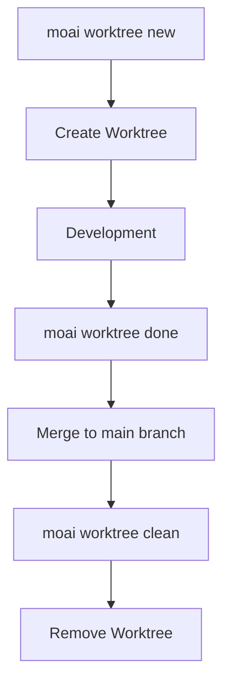

Reference all commands and options of the MoAI-ADK command-line interface.

## Command List

```bash
moai --help
```

**Output Example:**

```
MoAI-ADK - Agentic Development Kit for Claude Code

Usage:
  moai [command]

Available Commands:
  init        Interactive project setup (auto-detects language/framework/methodology)
  doctor      System health diagnosis and environment verification
  status      Project status summary including Git branch, quality metrics, etc.
  update      Update to the latest version (with automatic rollback support)
  worktree    Manage Git worktrees for parallel SPEC development
  hook        Claude Code hook dispatcher
  profile     Manage Claude Code configuration profiles
  glm         Switch to GLM backend (cost-effective) or update API key
  claude      Switch to Claude backend (Anthropic API)
  version     Display version, commit hash, and build date

Flags:
  -h, --help      help for moai
  -v, --version   version for moai
```

| Command | Description |
|---------|-------------|
| `moai init` | Initialize project (auto-detects language/framework/methodology) |
| `moai doctor` | System diagnostics and environment verification |
| `moai status` | Project status summary (Git branch, quality metrics, etc.) |
| `moai inventory` | Read-only integrated inventory (active sessions, worktrees, harnesses) (add `--json` for structured output) |
| `moai update` | Update to the latest version (with automatic rollback support) |
| `moai worktree` | Manage Git worktrees (parallel SPEC development) |
| `moai hook` | Claude Code hook dispatcher |
| `moai profile` | Manage profiles (list, setup, current, delete) |
| `moai glm` | Switch to GLM backend (`--team`: GLM Worker mode) |
| `moai claude`, `moai cc` | Switch to Claude backend |
| `moai cg` | Enable CG mode — Claude leader + GLM teammates (tmux required) |
| `moai version` | Display version, commit hash, and build date |

---

## moai init

Initialize a project.

```bash
moai init [PATH] [OPTIONS]
```

### Options

| Option | Description |
|--------|-------------|
| `-y, --non-interactive` | Non-interactive mode (use defaults) |
| `--mode [personal\|team]` | Project mode |
| `--locale [ko\|en\|ja\|zh]` | Preferred language (default: en) |
| `--language TEXT` | Programming language (auto-detect if specified) |
| `--force` | Force re-initialization without confirmation |

### Examples

```bash
# Initialize new project
moai init my-project

# Korean, team mode
moai init my-project --locale ko --mode team

# Python project
moai init --language python
```

---

## moai update

Update MoAI-ADK to the latest version.

```bash
moai update [OPTIONS]
```

### Options

| Option | Description |
|--------|-------------|
| `--path PATH` | Project path (default: current directory) |
| `--force` | Force update without backup |
| `--check` | Check version only (no update) |
| `--project` | Sync project templates only |
| `--templates-only` | Sync templates only (skip package upgrade) |
| `--yes` | Auto confirm (CI/CD mode) |
| `-c, --config` | Edit project config (same as initial setup wizard) |
| `--merge` | Auto merge (preserve user changes) |
| `--manual` | Manual merge (create guide) |

### Examples

```bash
# Check for updates
moai update --check

# Force update
moai update --force

# Auto merge
moai update --merge
```


**Important:** `--force` option does not create backups. User changes may be lost.


---

## moai doctor

Run system diagnostics.

```bash
moai doctor [OPTIONS]
```

### Options

| Option | Description |
|--------|-------------|
| `-v, --verbose` | Show detailed tool versions and language detection |
| `--fix` | Suggest fixes for missing tools |
| `--export PATH` | Export to JSON file |
| `--check TEXT` | Check only specific tool |
| `--check-commands` | Diagnose slash command loading issues |
| `--shell` | Diagnose shell and PATH configuration (WSL/Linux) |

### Examples

```bash
# Full diagnostics
moai doctor

# Verbose diagnostics
moai doctor --verbose

# Suggest fixes
moai doctor --fix
```

---

## moai profile

Manage profiles. Profiles provide isolated Claude Code configuration environments.

### Profile Subcommands

| Command | Description |
|---------|-------------|
| `moai profile list` | Show all available profiles |
| `moai profile setup` | Create new profile with interactive wizard |
| `moai profile current` | Show current active profile information |
| `moai profile delete <name>` | Delete specified profile |

### moai profile list

```bash
moai profile list
```

Display all available profiles and the currently active profile.

### moai profile setup

```bash
moai profile setup
```

Interactive wizard creates a new profile:

1. **Profile Name**: Unique identifier (e.g., `work`, `personal`)
2. **User Name**: Name Claude Code should use to address you
3. **Language Settings**:
   - Conversation language (conversation_language)
   - Git commit language (git_commit_lang)
   - Code comment language (code_comment_lang)
   - Documentation language (doc_lang)
4. **Model Settings**:
   - Model policy (model_policy): high, medium, low
   - Default model (model): inherit, opus, sonnet, haiku, 1M context model
5. **Execution Settings**:
   - Permission mode (permission_mode): default, acceptEdits
6. **Display Settings**:
   - Statusline mode (statusline_mode): off, basic, full
   - Statusline theme (statusline_theme): auto, light, dark, monokai, nord, dracula
   - Teammate display (teammate_display): auto, in-process, tmux

### moai profile current

```bash
moai profile current
```

Display information about the currently active profile.

### moai profile delete

```bash
moai profile delete <name>
```

Delete the specified profile and its directory.

### Running with Profiles

To run MoAI commands with a specific profile, use the `-p` flag:

```bash
# Use specific profile with Claude mode
moai cc -p work

# Use specific profile with GLM mode
moai glm -p personal

# Use specific profile with CG mode
moai cg -p team-project
```

The profile's Claude Code settings apply to that session.

### Profile vs MoAI Worktree

| Feature | Profile | Worktree |
|---------|---------|----------|
| **Purpose** | Claude Code configuration isolation | Project file isolation |
| **Path** | `~/.moai/claude-profiles/<name>/` | `~/.moai/worktrees/<project>/<spec>/` |
| **Use Case** | Manage different environment settings | Workspace for SPEC development |

---

## moai glm

Switch to GLM backend or update API key.

```bash
moai glm [OPTIONS] [API_KEY]
```

### Options

| Option | Description |
|--------|-------------|
| `-p, --profile TEXT` | Profile name to use |
| `--team` | Start GLM Worker mode (Opus leader + GLM-5 teammates) |
| `--help` | Show help |

### Usage

```bash
# Switch to GLM backend
moai glm

# Update API key
moai glm <api-key>

# Specify profile
moai glm -p work

# Start GLM Worker mode (cost-effective team development)
moai glm --team

# Get API key from z.ai
# https://z.ai/subscribe?ic=1NDV03BGWU
```

### GLM Worker Mode

Using the `--team` option starts the cost-effective GLM Worker mode:

- **Configuration**: Opus model leader agent + GLM-5 model teammate agents
- **Benefit**: 70% cost savings compared to Claude, equivalent performance
- **Use Case**: Optimize token costs for large-scale team-based development

### Profile-based Login (v2.7.0+)

`moai glm`, `moai cc`, and `moai cg` are now true login commands with persistent profile support. Profiles are stored at `~/.moai/claude-profiles/`.

- Interactive profile setup wizard on first run
- Profiles persist across sessions
- Switching from `moai glm` to `moai cg` automatically resets GLM settings

---

## moai claude

Switch to Claude backend (Anthropic API).

```bash
$ moai claude [OPTIONS]
# Or shorthand
$ moai cc [OPTIONS]
```

### Options

| Option | Description |
|--------|-------------|
| `-p, --profile TEXT` | Profile name to use |

### Usage

```bash
# Switch to Claude backend
moai cc

# Use specific profile
moai cc -p work
```

---

## moai cg

Enable CG Mode (Claude + GLM Hybrid). The leader uses Claude API while teammates use GLM API via tmux session-level environment isolation.

```bash
moai cg [OPTIONS]
```

### Options

| Option | Description |
|--------|-------------|
| `-p, --profile TEXT` | Profile name to use |

### How It Works

1. Injects GLM config into tmux session environment
2. Removes GLM env from settings — leader pane uses Claude API
3. Sets `CLAUDE_CODE_TEAMMATE_DISPLAY=tmux` — teammates inherit GLM env in new panes

### Usage

```bash
# 1. Save GLM API key (once)
moai glm sk-your-glm-api-key

# 2. Enable CG mode (must be in tmux)
moai cg

# 3. Start Claude Code in the SAME pane
claude

# 4. Run team workflow
/moai --team "your task description"

# Use specific profile
moai cg -p team-project
```

### Important Notes

| Item | Description |
|------|-------------|
| **tmux Required** | Must run inside a tmux session. Set VS Code terminal default to tmux for convenience. |
| **Leader Start Location** | MUST start Claude Code in the **same pane** where `moai cg` was run. |
| **Session End** | session_end hook automatically clears tmux session env. |

### Mode Comparison

| Command | Leader | Workers | tmux Required | Cost Savings | Use Case |
|---------|--------|---------|---------------|--------------|----------|
| `moai cc` | Claude | Claude | No | - | Maximum quality |
| `moai glm` | GLM | GLM | Recommended | ~70% | Cost optimization |
| `moai cg` | Claude | GLM | **Required** | **~60%** | Quality + cost balance |

### Display Modes

| Mode | Description | Communication | Leader/Worker Separation |
|------|-------------|---------------|--------------------------|
| `in-process` | Default mode | SendMessage | Same env |
| `tmux` | Split-pane display | SendMessage | Session env isolation |


**New in v2.7.1**: CG mode is now the **default** team mode. When using `--team`, the system runs in CG mode automatically.


---

## moai status

Check project status.

```bash
moai status
```

**Output Example:**

```
╭────── Project Status ──────╮
│   Mode          personal   │
│   Locale        unknown    │
│   SPECs         1          │
│   Branch        main       │
│   Git Status    Modified   │
╰────────────────────────────╯
```

**Output Information:**
- **Mode**: Work mode (personal, team, manual)
- **Locale**: Language setting
- **SPECs**: Number of active SPECs
- **Branch**: Current branch
- **Git Status**: Git status (Clean, Modified)

---

## moai inventory

Query the integrated read-only inventory of active sessions, worktrees, and harnesses.

```bash
moai inventory [OPTIONS]
```

### Options

| Option | Description |
|--------|-------------|
| `--json` | Output structured JSON format |

### Usage

```bash
# View basic inventory
moai inventory

# Query in JSON format (for programmatic use)
moai inventory --json
```

**Output Information:**
- **Active Sessions**: Currently running Claude Code sessions
- **Worktree**: Active Git worktrees for parallel development
- **Harnesses**: Registered development harnesses

For detailed information, see the [Inventory Management](./inventory) page.

---

## moai worktree

Manage Git worktrees for parallel SPEC development.

```bash
moai worktree [OPTIONS] COMMAND [ARGS]...
```

### Subcommands

| Command | Description |
|---------|-------------|
| `moai worktree new` | Create new worktree |
| `moai worktree list` | List active worktrees |
| `moai worktree switch` | Switch to a worktree |
| `moai worktree go` | Navigate to worktree directory |
| `moai worktree sync` | Sync with upstream |
| `moai worktree remove` | Remove worktree |
| `moai worktree clean` | Clean up stale worktrees |
| `moai worktree recover` | Recover from existing directory |

### moai worktree new

Create a new worktree.

```bash
moai worktree new [OPTIONS] SPEC_ID
```

#### Options

| Option | Description |
|--------|-------------|
| `-b, --branch TEXT` | User branch name |
| `--base TEXT` | Base branch (default: main) |
| `--repo PATH` | Repository path |
| `--worktree-root PATH` | Worktree root path |
| `-f, --force` | Force create even if exists |
| `--glm` | Use GLM LLM settings |
| `--llm-config PATH` | User LLM config file path |

#### Examples

```bash
# Create worktree for SPEC-001
moai worktree new SPEC-001

# Specify user branch
moai worktree new SPEC-001 --branch feature-auth

# Change base branch
moai worktree new SPEC-001 --base develop
```

### moai worktree list

List active worktrees.

```bash
moai worktree list [OPTIONS]
```

#### Options

| Option | Description |
|--------|-------------|
| `--format [table\|json]` | Output format |
| `--repo PATH` | Repository path |
| `--worktree-root PATH` | Worktree root path |

### moai worktree remove

Remove a worktree.

```bash
moai worktree remove [OPTIONS] SPEC_ID
```

#### Options

| Option | Description |
|--------|-------------|
| `-f, --force` | Force remove uncommitted changes |
| `--repo PATH` | Repository path |
| `--worktree-root PATH` | Worktree root path |

### worktree Workflow



---

## moai hook

Claude Code hook dispatcher for MoAI-ADK events.

```bash
moai hook <event>
```

### Supported Events (16)

| Event | Description |
|-------|-------------|
| `PreToolUse` | Before tool execution |
| `PostToolUse` | After tool execution |
| `Notification` | System notifications |
| `Stop` | Session end |
| `SubagentStop` | Subagent stop |
| `UserPromptSubmit` | User prompt submission |
| `PreCompact` | Before context compaction |
| `PostCompact` | After context compaction |
| `PermissionRequest` | Permission request |
| `PostToolFailure` | After tool execution failure |
| `SubagentStart` | Subagent start |
| `TeammateIdle` | Teammate idle |
| `TaskCompleted` | Task completed |
| `WorktreeCreate` | Worktree creation |
| `WorktreeRemove` | Worktree removal |
| `model` | Model selection |

### Examples

```bash
# Run PreToolUse hook
moai hook PreToolUse

# Run PostToolUse hook
moai hook PostToolUse

# Run UserPromptSubmit hook
moai hook UserPromptSubmit
```

---

## Statusline v3

MoAI Statusline v3 displays real-time API usage in the Claude Code statusline.

### v3 New Features

| Feature | Description |
|---------|-------------|
| **RGB Gradient Colors** | Smooth color transitions based on usage ratio |
| **5H/7D API Usage** | Display accumulated usage over 5 hours and 7 days |
| **rate_limits Field Parsing** | Accurate limit information from Claude API responses |

### Color Gradient

Colors transition smoothly based on usage ratio:

- **0-30%**: Green → Yellow (safe)
- **31-70%**: Yellow → Orange (caution)
- **71-100%**: Orange → Red (near limit)

### API Usage Display

```
5H: 45K/200K (22%) | 7D: 180K/500K (36%)
```

- **5H**: Usage over the last 5 hours
- **7D**: Usage over the last 7 days
- **Ratio**: Current usage as percentage of quota

### Configuration

Set up Statusline in the profile setup wizard (`moai profile setup`):

1. **statusline_mode**: `off`, `basic`, `full`
2. **statusline_theme**: `auto`, `light`, `dark`, `monokai`, `nord`, `dracula`

### Usage

```bash
# Configure Statusline during profile creation
moai profile setup
# → Choose statusline_mode: full
# → Choose statusline_theme: auto

# Run with configured profile
moai cc -p my-profile
```

---

## Task Metrics Logging

MoAI-ADK automatically captures Task tool metrics during development sessions.

### Log File

- **Location**: `.moai/logs/task-metrics.jsonl`
- **Format**: JSONL (JSON Lines)

### Captured Metrics

| Metric | Description |
|--------|-------------|
| Token usage | Input/output token count |
| Tool calls | List of tools used and call count |
| Duration | Task execution time |
| Agent type | Type of agent executed |

### Usage

- Session analysis and performance optimization
- Agent efficiency analysis
- Token consumption tracking and cost management

The PostToolUse hook automatically logs metrics when a Task tool completes.

---

## Model Policy Settings

MoAI-ADK assigns optimal AI models to agents based on your Claude Code subscription plan.

### Policy Tiers

| Policy | Plan | 🟣 Opus | 🔵 Sonnet | 🟡 Haiku |
|--------|------|---------|-----------|----------|
| **High** | Max $200/mo | 23 | 1 | 4 |
| **Medium** | Max $100/mo | 4 | 19 | 5 |
| **Low** | Plus $20/mo | 0 | 12 | 16 |

### Configuration

```bash
# During project initialization (interactive wizard)
moai init my-project

# Reconfigure existing project
moai update -c

# Manual configuration (.moai/config/sections/user.yaml)
# model_policy: high | medium | low
```

> **Note**: The default policy is `High`. After running `moai update`, reconfigure settings with `moai update -c`.

### 1M Context Models

When selecting the default model in profile setup, you can choose from 1M context models:

- `claude-opus-4-6 1M context`
- `claude-sonnet-4-6 1M context`

These models are ideal for analyzing large codebases or working with lengthy documents.

---

## Environment Variables

| Variable | Description |
|----------|-------------|
| `MOAI_API_KEY` | API key (Claude/GLM) |
| `MOAI_MODE` | Execution mode (development/production) |
| `MOAI_LOCALE` | Language setting (ko/en/ja/zh) |
| `MOAI_WORKTREE_ROOT` | Worktree root path |

---

## See Also

- [Quick Start](./quickstart)
- [Installation](./installation)
- [Update](./update)
- [Profile](./profile)
