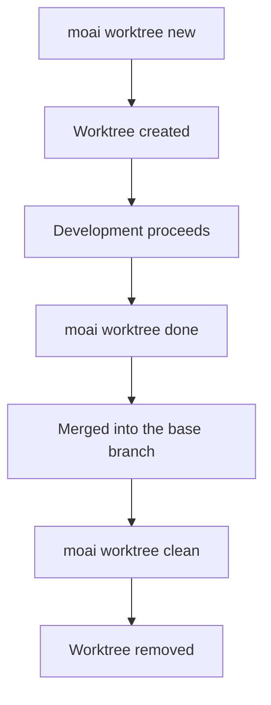

Reference for every command and option of the MoAI-ADK command-line interface. The terminal's `moai` (the Go binary) and Claude Code's `/moai` (the slash subcommand) are different tools — this document covers the terminal CLI.

## Command List

```bash
moai --help
```

**Example output:**

```
MoAI-ADK - Agentic Development Kit for Claude Code

Usage:
  moai [command]

Available Commands:
  init        Interactive project setup (auto-detects language/framework/methodology)
  doctor      System health diagnosis and environment verification
  status      Project status summary including Git branch, quality metrics, etc.
  update      Update to the latest version (with automatic rollback support)
  worktree    Manage Git worktrees for parallel SPEC development
  hook        Claude Code hook dispatcher
  profile     Manage Claude Code configuration profiles
  glm         Switch to GLM backend (cost-effective) or update API key
  claude      Switch to Claude backend (Anthropic API)
  version     Display version, commit hash, and build date

Flags:
  -h, --help      help for moai
  -v, --version   version for moai
```

| Command | Description |
|--------|------|
| `moai init` | Project initialization (auto-detects language/framework/methodology) |
| `moai doctor` | System diagnosis and environment verification |
| `moai status` | Project status summary (Git branch, quality metrics, etc.) |
| `moai inventory` | Read-only unified inventory of active sessions, worktrees, and harnesses (add `--json` for structured output) |
| `moai update` | Update to the latest version (automatic rollback support) |
| `moai worktree` | Git worktree management (parallel SPEC development) |
| `moai hook` | Claude Code hook dispatcher |
| `moai profile` | Profile management (list, setup, current, delete) |
| `moai glm` | Switch to the GLM backend (`--team`: GLM Worker mode) |
| `moai claude`, `moai cc` | Switch to the Claude backend |
| `moai cg` | Activate CG mode — Claude leader + GLM teammates (tmux required) |
| `moai version` | Show version, commit hash, and build date |

---

## moai init

Initializes a project.

```bash
moai init [PATH] [OPTIONS]
```

### Options

| Option | Description |
|------|------|
| `-y, --non-interactive` | Non-interactive mode (uses defaults) |
| `--mode [personal\|team]` | Project mode |
| `--locale [ko\|en\|ja\|zh]` | Preferred language (default: en) |
| `--language TEXT` | Programming language (auto-detected when omitted) |
| `--force` | Force re-initialization without confirmation |

### Examples

```bash
# Initialize a new project
moai init my-project

# Korean, team mode
moai init my-project --locale ko --mode team

# Python project
moai init --language python
```

---

## moai update

Updates MoAI-ADK to the latest version.

```bash
moai update [OPTIONS]
```

### Options

| Option | Description |
|------|------|
| `--path PATH` | Project path (default: current directory) |
| `--force` | Force update without backup |
| `--check` | Version check only (no update) |
| `--project` | Sync project templates only |
| `--templates-only` | Sync templates only (skip package upgrade) |
| `--yes` | Auto-confirm (CI/CD mode) |
| `-c, --config` | Edit the project settings (same as the initial setup wizard) |
| `--merge` | Automatic merge (preserves user changes) |
| `--manual` | Manual merge (generates a guide) |

### Examples

```bash
# Check for updates
moai update --check

# Force update
moai update --force

# Automatic merge
moai update --merge
```


**Important:** the `--force` option creates no backup. User changes may be lost.


---

## moai doctor

Runs the system diagnosis.

```bash
moai doctor [OPTIONS]
```

### Options

| Option | Description |
|------|------|
| `-v, --verbose` | Show detailed tool versions and language detection |
| `--fix` | Suggest fixes for missing tools |
| `--export PATH` | Export to a JSON file |
| `--check TEXT` | Check specific tools only |
| `--check-commands` | Diagnose slash-command loading issues |
| `--shell` | Diagnose shell and PATH configuration (WSL/Linux) |

### Examples

```bash
# Full diagnosis
moai doctor

# Verbose diagnosis
moai doctor --verbose

# Fix suggestions
moai doctor --fix
```

---

## moai profile

Manages profiles. A profile provides an isolated Claude Code configuration environment.

### Profile Subcommands

| Command | Description |
|--------|------|
| `moai profile list` | List all available profiles |
| `moai profile setup` | Create a new profile with the interactive wizard |
| `moai profile current` | Show info on the currently active profile |
| `moai profile delete <name>` | Delete the specified profile |

### moai profile list

```bash
moai profile list
```

Shows all available profiles and the currently active one.

### moai profile setup

```bash
moai profile setup
```

An interactive wizard creates a new profile:

1. **Profile name**: a unique identifier (e.g., `work`, `personal`)
2. **User name**: the name Claude Code will address you by
3. **Language settings**:
   - Conversation language (conversation_language)
   - Git commit language (git_commit_lang)
   - Code comment language (code_comment_lang)
   - Documentation language (doc_lang)
4. **Model settings**:
   - Model policy (model_policy): high, medium, low
   - Default model (model): inherit, opus, sonnet, haiku, 1M context models
5. **Execution settings**:
   - Permission mode (permission_mode): default, acceptEdits
6. **Display settings**:
   - Statusline mode (statusline_mode): off, basic, full
   - Statusline theme (statusline_theme): auto, light, dark, monokai, nord, dracula
   - Teammate display (teammate_display): auto, in-process, tmux

### moai profile current

```bash
moai profile current
```

Shows info on the currently active profile.

### moai profile delete

```bash
moai profile delete <name>
```

Deletes the specified profile and its directory.

### Running with a Profile

Use the `-p` flag to run MoAI commands with a profile:

```bash
# Use a specific profile in Claude mode
moai cc -p work

# Use a specific profile in GLM mode
moai glm -p personal

# Use a specific profile in CG mode
moai cg -p team-project
```

The profile's Claude Code configuration applies to that session.

### Profile vs MoAI Worktree

| Feature | Profile | Worktree |
|------|---------|----------|
| **Purpose** | Claude Code configuration isolation | Project file isolation |
| **Path** | `~/.moai/claude-profiles/<name>/` | `~/.moai/worktrees/<project>/<spec>/` |
| **Use** | Managing different environment configs | Workspaces for SPEC development |

---

## moai glm

Switches to the GLM backend or updates the API key.

```bash
moai glm [OPTIONS] [API_KEY]
```

### Options

| Option | Description |
|------|------|
| `-p, --profile TEXT` | Profile name to use |
| `--team` | Start GLM Worker mode (Opus leader + GLM-5 teammates) |
| `--help` | Show help |

### Usage

```bash
# Switch to the GLM backend
moai glm

# Update the API key
moai glm <api-key>

# Run with a specific profile
moai glm -p work

# Start GLM Worker mode (cost-efficient team development)
moai glm --team

# Get an API key from z.ai
# https://z.ai/subscribe?ic=1NDV03BGWU
```

### GLM Worker Mode

The `--team` option starts the cost-efficient GLM Worker mode:

- **Composition**: a leader agent on the Opus model + teammate agents on the GLM-5 model
- **Advantage**: 70% cost savings vs Claude, comparable performance
- **Use**: token-cost optimization for large team-based development

### Profile-Based Configuration (v2.7.0+)

`moai glm`, `moai cc`, and `moai cg` are now login commands supporting persistent profiles. Profiles are stored in `~/.moai/claude-profiles/`.

- An interactive profile setup wizard runs on first use
- Profiles persist across sessions
- GLM settings are reset automatically when switching from `moai glm` to `moai cg`

---

## moai claude

Switches to the Claude backend (Anthropic API).

```bash
$ moai claude [OPTIONS]
# or the short form
$ moai cc [OPTIONS]
```

### Options

| Option | Description |
|------|------|
| `-p, --profile TEXT` | Profile name to use |

### Usage

```bash
# Switch to the Claude backend
moai cc

# Run with a specific profile
moai cc -p work
```

---

## moai cg

Activates CG mode (Claude + GLM hybrid). The leader uses the Claude API and teammates use the GLM API, implemented via tmux session-level environment-variable isolation.

```bash
moai cg [OPTIONS]
```

### Options

| Option | Description |
|------|------|
| `-p, --profile TEXT` | Profile name to use |

### How It Works

1. Injects the GLM settings into the tmux session environment
2. Removes the GLM env from settings — the leader pane uses the Claude API
3. Sets `CLAUDE_CODE_TEAMMATE_DISPLAY=tmux` — teammates inherit the GLM env in new panes

### Usage

```bash
# 1. Save the GLM API key (first time only)
moai glm sk-your-glm-api-key

# 2. Activate CG mode (run inside tmux)
moai cg

# 3. Start Claude Code in the same pane
claude

# 4. Run the team workflow
/moai --team "task description"

# Run with a specific profile
moai cg -p team-project
```

### Caveats

| Item | Description |
|------|------|
| **tmux required** | Must run inside a tmux session. Setting VS Code's default terminal to tmux is convenient. |
| **Leader start location** | Start Claude Code in the **same pane** where you ran `moai cg`. |
| **Session end** | The session_end hook automatically cleans up the tmux session environment. |

### Mode Comparison

| Command | Leader | Workers | tmux required | Cost savings | Use |
|--------|------|------|-----------|-----------|------|
| `moai cc` | Claude | Claude | No | - | Highest quality |
| `moai glm` | GLM | GLM | Recommended | ~70% | Cost optimization |
| `moai cg` | Claude | GLM | **Required** | **~60%** | Quality + cost balance |

### Display Modes

| Mode | Description | Communication | Leader/worker separation |
|------|------|------|----------------|
| `in-process` | Default mode | SendMessage | Same environment |
| `tmux` | Split-pane display | SendMessage | Session-env isolation |


**Changed in v2.7.1**: CG mode is now the **default** team mode. Using `--team` runs in CG mode without extra configuration.


---

## moai status

Checks the project status.

```bash
moai status
```

**Example output:**

```
╭────── Project Status ──────╮
│   Mode          personal   │
│   Locale        unknown    │
│   SPECs         1          │
│   Branch        main       │
│   Git Status    Modified   │
╰────────────────────────────╯
```

**Output fields:**
- **Mode**: working mode (personal, team, manual)
- **Locale**: language setting
- **SPECs**: number of active SPECs
- **Branch**: current branch
- **Git Status**: Git state (Clean, Modified)

---

## moai inventory

Queries the read-only unified inventory of active sessions, worktrees, and harnesses.

```bash
moai inventory [OPTIONS]
```

### Options

| Option | Description |
|------|------|
| `--json` | Structured JSON output |

### Usage

```bash
# View the basic inventory
moai inventory

# Query in JSON format (for programmatic use)
moai inventory --json
```

**Output info:**
- **Active sessions**: currently running Claude Code sessions
- **Worktrees**: active Git worktrees for parallel development
- **Harnesses**: registered development harnesses

For details, see the [Inventory Management](./inventory) page.

---

## moai worktree

Manages Git worktrees for parallel SPEC development.

```bash
moai worktree [OPTIONS] COMMAND [ARGS]...
```

### Subcommands

| Command | Description |
|--------|------|
| `moai worktree new` | Create a new worktree |
| `moai worktree list` | List active worktrees |
| `moai worktree switch` | Switch to a worktree |
| `moai worktree go` | Move to a worktree directory |
| `moai worktree sync` | Sync with upstream |
| `moai worktree remove` | Remove a worktree |
| `moai worktree clean` | Clean up stale worktrees |
| `moai worktree recover` | Recover from an existing directory |

### moai worktree new

Creates a new worktree.

```bash
moai worktree new [OPTIONS] SPEC_ID
```

#### Options

| Option | Description |
|------|------|
| `-b, --branch TEXT` | Custom branch name |
| `--base TEXT` | Base branch (default: main) |
| `--repo PATH` | Repository path |
| `--worktree-root PATH` | Worktree root path |
| `-f, --force` | Force creation even if it exists |
| `--glm` | Use the GLM LLM configuration |
| `--llm-config PATH` | Path to a custom LLM configuration file |

#### Examples

```bash
# Create a worktree for SPEC-001
moai worktree new SPEC-001

# Specify a custom branch
moai worktree new SPEC-001 --branch feature-auth

# Change the base branch
moai worktree new SPEC-001 --base develop
```

### moai worktree list

Lists the active worktrees.

```bash
moai worktree list [OPTIONS]
```

#### Options

| Option | Description |
|------|------|
| `--format [table\|json]` | Output format |
| `--repo PATH` | Repository path |
| `--worktree-root PATH` | Worktree root path |

### moai worktree remove

Removes a worktree.

```bash
moai worktree remove [OPTIONS] SPEC_ID
```

#### Options

| Option | Description |
|------|------|
| `-f, --force` | Force removal with uncommitted changes |
| `--repo PATH` | Repository path |
| `--worktree-root PATH` | Worktree root path |

### The Worktree Workflow


```mermaid
flowchart TD
    A[moai worktree new] --> B[Worktree created]
    B --> C[Development proceeds]
    C --> D[moai worktree done]
    D --> E[Merged into the base branch]
    E --> F[moai worktree clean]
    F --> G[Worktree removed]
```

---

## moai hook

The Claude Code hook dispatcher for MoAI-ADK events.

```bash
moai hook <event>
```

### Supported Events (16)

| Event | Description |
|-------|------|
| `PreToolUse` | Before tool execution |
| `PostToolUse` | After tool execution |
| `Notification` | System notifications |
| `Stop` | Session end |
| `SubagentStop` | Subagent termination |
| `UserPromptSubmit` | User prompt submission |
| `PreCompact` | Before context compaction |
| `PostCompact` | After context compaction |
| `PermissionRequest` | Permission requests |
| `PostToolFailure` | After a tool execution failure |
| `SubagentStart` | Subagent start |
| `TeammateIdle` | Teammate idle |
| `TaskCompleted` | Task completion |
| `WorktreeCreate` | Worktree creation |
| `WorktreeRemove` | Worktree removal |
| `model` | Model selection |

### Examples

```bash
# Run the PreToolUse hook
moai hook PreToolUse

# Run the PostToolUse hook
moai hook PostToolUse

# User prompt submission hook
moai hook UserPromptSubmit
```

---

## Statusline v3

MoAI Statusline v3 displays real-time API usage in the Claude Code status line.

### New in v3

| Feature | Description |
|------|------|
| **RGB gradient colors** | Smooth color transitions by usage ratio |
| **5H/7D API usage** | 5-hour / 7-day cumulative usage display |
| **rate_limits field parsing** | Accurate limit info from Claude API responses |

### Color Gradient

Colors transition smoothly with the usage ratio:

- **0-30%**: Green → Yellow (safe)
- **31-70%**: Yellow → Orange (caution)
- **71-100%**: Orange → Red (near the limit)

### API Usage Display

```
5H: 45K/200K (22%) | 7D: 180K/500K (36%)
```

- **5H**: usage over the last 5 hours
- **7D**: usage over the last 7 days
- **Ratio**: usage relative to the current quota

### How to Configure

Select the following options in the profile setup wizard (`moai profile setup`):

1. **statusline_mode**: `off`, `basic`, `full`
2. **statusline_theme**: `auto`, `light`, `dark`, `monokai`, `nord`, `dracula`

### Usage

```bash
# Configure the statusline when creating a profile
moai profile setup
# → select statusline_mode: full
# → select statusline_theme: auto

# Run with the profile
moai cc -p my-profile
```

---

## Task Metrics Logging

MoAI-ADK automatically captures Task-tool metrics during development sessions.

### Log File

- **Location**: `.moai/logs/task-metrics.jsonl`
- **Format**: JSONL (JSON Lines)

### Captured Metrics

| Metric | Description |
|--------|------|
| Token usage | Input/output token counts |
| Tool calls | List of tools used and call counts |
| Duration | Task execution time |
| Agent type | Type of agent executed |

### Uses

- Session analysis and performance optimization
- Agent efficiency analysis
- Token-consumption tracking and cost management

The PostToolUse hook logs metrics automatically when the Task tool completes.

---

## Model Policy Configuration

MoAI-ADK assigns the optimal AI model to each agent according to your Claude Code subscription plan — the starting point of tokenomics. Heavier-reasoning phases like planning and auditing get the top models; repetitive work gets lightweight models.

### Policy Tiers

| Policy | Plan | Characteristics |
|------|--------|------|
| **High** | Max $200/month | Highest quality — Opus assigned to planning and audits, maximum throughput |
| **Medium** | Max $100/month | Balance of quality and cost |
| **Low** | Plus $20/month | Economical, no Opus — Sonnet-centric allocation |

### How to Configure

```bash
# During project initialization (interactive wizard)
moai init my-project

# Reconfigure an existing project
moai update -c

# Manual configuration (.moai/config/sections/user.yaml)
# model_policy: high | medium | low
```

> **Note**: the default policy is `High`. After running `moai update`, configure the setting with `moai update -c`.

### 1M Context Models

When selecting the **default model** during profile setup, you can choose 1M context variants. The `[1m]` suffix is not a separate model — it is Claude Code's native context-window modifier:

- `opus` / `opus[1m]`
- `sonnet` / `sonnet[1m]`
- `fable` / `fable[1m]`

These variants suit large-codebase analysis and long-document work.

---

## Environment Variables

| Variable | Description |
|------|------|
| `MOAI_API_KEY` | API key (Claude/GLM) |
| `MOAI_MODE` | Execution mode (development/production) |
| `MOAI_LOCALE` | Language setting (ko/en/ja/zh) |
| `MOAI_WORKTREE_ROOT` | Worktree root path |

---

## See Also

- [Quick Start](./quickstart)
- [Installation](./installation)
- [Update](./update)
- [Profile](./profile)
