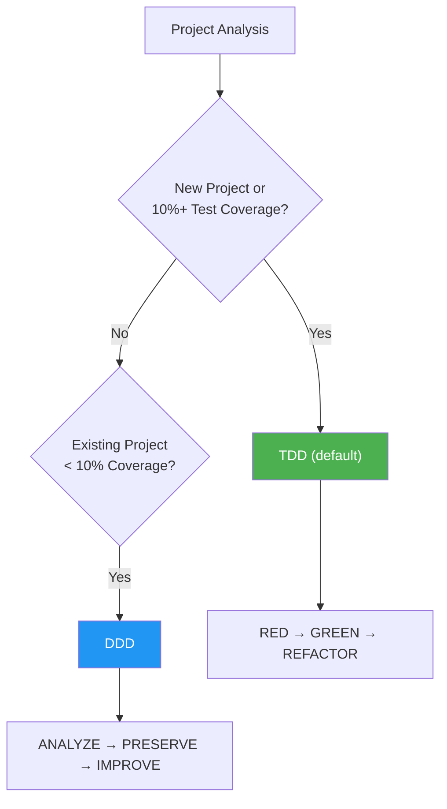

# Frequently Asked Questions

Frequently asked questions and answers about MoAI-ADK.

---

## Q: What does the version indicator in statusline mean?

The MoAI statusline shows version information with update notifications:

```
🗿 v2.2.2 ⬆️ v2.2.5
```

- **`v2.2.2`**: Currently installed version
- **`⬆️ v2.2.5`**: New version available for update

When you're on the latest version, only the version number is displayed:

```
🗿 v2.2.5
```

**To update**: Run `moai update` and the update notification will disappear.


**Note**: This is different from Claude Code's built-in version indicator (`🔅 v2.1.38`). The MoAI indicator tracks MoAI-ADK versions, while Claude Code shows its own version separately.


---

## Q: How do I customize which statusline segments are displayed?

The statusline supports 4 display presets plus custom configuration:

| Preset | Description |
|--------|-------------|
| **Full** (default) | All 8 segments displayed |
| **Compact** | Model + Context + Git Status + Branch only |
| **Minimal** | Model + Context only |
| **Custom** | Pick individual segments |

Configure during `moai init` / `moai update -c` wizard, or edit `.moai/config/sections/statusline.yaml`:

```yaml
statusline:
  preset: compact  # or full, minimal, custom
  segments:
    model: true
    context: true
    output_style: false
    directory: false
    git_status: true
    claude_version: false
    moai_version: false
    git_branch: true
```


See [SPEC-STATUSLINE-001](https://github.com/modu-ai/moai-adk/blob/main/.moai/specs/SPEC-STATUSLINE-001/spec.md) for details.


---

## Q: How do I choose a model policy?

MoAI-ADK assigns optimal AI models to each of 28 agents based on your Claude Code subscription plan. This maximizes quality within your plan's rate limits.

### Policy Tier Comparison

| Policy | Plan | 🟣 Opus | 🔵 Sonnet | 🟡 Haiku | Best For |
|--------|------|---------|-----------|----------|----------|
| **High** | Max $200/mo | 23 | 1 | 4 | Maximum quality, highest throughput |
| **Medium** | Max $100/mo | 4 | 19 | 5 | Balanced quality and cost |
| **Low** | Plus $20/mo | 0 | 12 | 16 | Budget-friendly, no Opus access |


**Why does this matter?** The Plus $20 plan does not include Opus access. Setting `Low` ensures all agents use only Sonnet and Haiku, preventing rate limit errors. Higher plans benefit from Opus on critical agents (security, strategy, architecture) while using Sonnet/Haiku for routine tasks.


### Agent Model Assignment by Tier

#### Manager Agents

| Agent | High | Medium | Low |
|-------|------|--------|-----|
| manager-spec | 🟣 opus | 🟣 opus | 🔵 sonnet |
| manager-strategy | 🟣 opus | 🟣 opus | 🔵 sonnet |
| manager-ddd | 🟣 opus | 🔵 sonnet | 🔵 sonnet |
| manager-tdd | 🟣 opus | 🔵 sonnet | 🔵 sonnet |
| manager-project | 🟣 opus | 🔵 sonnet | 🟡 haiku |
| manager-docs | 🔵 sonnet | 🟡 haiku | 🟡 haiku |
| manager-quality | 🟡 haiku | 🟡 haiku | 🟡 haiku |
| manager-git | 🟡 haiku | 🟡 haiku | 🟡 haiku |

#### Expert Agents

| Agent | High | Medium | Low |
|-------|------|--------|-----|
| expert-backend | 🟣 opus | 🔵 sonnet | 🔵 sonnet |
| expert-frontend | 🟣 opus | 🔵 sonnet | 🔵 sonnet |
| expert-security | 🟣 opus | 🟣 opus | 🔵 sonnet |
| expert-debug | 🟣 opus | 🔵 sonnet | 🔵 sonnet |
| expert-refactoring | 🟣 opus | 🔵 sonnet | 🔵 sonnet |
| expert-devops | 🟣 opus | 🔵 sonnet | 🟡 haiku |
| expert-performance | 🟣 opus | 🔵 sonnet | 🟡 haiku |
| expert-testing | 🟣 opus | 🔵 sonnet | 🟡 haiku |

### Configuration

```bash
# During project initialization
moai init my-project          # Interactive wizard includes model policy selection

# Reconfigure existing project
moai update -c                # Re-runs the configuration wizard
```


Default policy is `High`. After running `moai update`, a notice guides you to configure this setting via `moai update -c`.


---

## Q: "Allow external CLAUDE.md file imports?" warning appears

When opening a project, Claude Code may show a security prompt about external file imports:

```
External imports:
  /Users/<user>/.moai/config/sections/quality.yaml
  /Users/<user>/.moai/config/sections/user.yaml
  /Users/<user>/.moai/config/sections/language.yaml
```


**Recommended action**: Select **"No, disable external imports"** ✅


**Why?**
- Your project's `.moai/config/sections/` already contains these files
- Project-specific settings take precedence over global settings
- The essential configuration is already embedded in CLAUDE.md text
- Disabling external imports is more secure and doesn't affect functionality

**What are these files?**
- `quality.yaml`: TRUST 5 framework and development methodology settings
- `language.yaml`: Language preferences (conversation, comments, commits)
- `user.yaml`: User name (optional, for Co-Authored-By attribution)

---

## Q: What is the difference between TDD and DDD methodologies?

MoAI-ADK v2.5.0+ uses **binary methodology selection** (TDD or DDD only). The hybrid mode has been removed for clarity and consistency.

### Methodology Selection Guide



### TDD Methodology (Default)

The default methodology for new projects and feature development. Write tests first, then implement.

| Phase | Description |
|-------|-------------|
| **RED** | Write a failing test that defines expected behavior |
| **GREEN** | Write minimal code to make the test pass |
| **REFACTOR** | Improve code quality while keeping tests green |

For brownfield projects (existing codebases), TDD is enhanced with a **pre-RED analysis step**: read existing code to understand current behavior before writing tests.

### DDD Methodology (Existing Projects with < 10% Coverage)

A methodology for safely refactoring existing projects with minimal test coverage.

```
ANALYZE   → Analyze existing code and dependencies, identify domain boundaries
PRESERVE  → Write characterization tests, capture current behavior snapshots
IMPROVE   → Improve incrementally under test protection
```

### Methodology Selection Table

| Project State | Test Coverage | Recommended Methodology | Reason |
|--------------|---------------|-------------------------|--------|
| New project | N/A | TDD | Test-first development |
| Existing project | 50%+ | TDD | Strong test base exists |
| Existing project | 10-49% | TDD | Can expand tests |
| Existing project | < 10% | DDD | Gradual characterization tests needed |

### Configuration

```bash
# Auto-detect during project initialization
moai init my-project          # --mode <ddd|tdd> flag to specify

# Manual configuration
# Edit .moai/config/sections/quality.yaml
development_mode: tdd         # or ddd
```


**Note:** The hybrid mode from v2.5.0 and earlier has been removed. You must now clearly select either TDD or DDD.


---

## Q: Why doesn't my code have @MX tags?

This is **completely normal**. The @MX tag system is designed to mark only the most dangerous and important code that AI needs to notice first.

| Question | Answer |
|----------|--------|
| Is having no tags a problem? | **No.** Most code doesn't need tags. |
| When are tags added? | Only for **high fan_in** (>= 3 callers), **complex logic** (>= 15 complexity), or **danger patterns** (goroutines without context). |
| Are all projects similar? | **Yes.** Most code in every project has no tags. |

### Tag Priority

| Priority | Condition | Tag Type |
|----------|-----------|----------|
| **P1 (Critical)** | fan_in >= 3 | `@MX:ANCHOR` |
| **P2 (Danger)** | goroutine, complexity >= 15 | `@MX:WARN` |
| **P3 (Context)** | magic constant, no godoc | `@MX:NOTE` |
| **P4 (Missing)** | no test file | `@MX:TODO` |

To scan your codebase for @MX tags:

```bash
/moai mx --all        # Full scan
/moai mx --dry        # Preview only
/moai mx --priority P1  # Critical only
```

---

## Have more questions?

- [GitHub Discussions](https://github.com/modu-ai/moai-adk/discussions) — Questions, ideas, feedback
- [Issues](https://github.com/modu-ai/moai-adk/issues) — Bug reports, feature requests
- [Discord Community](https://discord.gg/moai-adk) — Real-time chat, tips sharing
