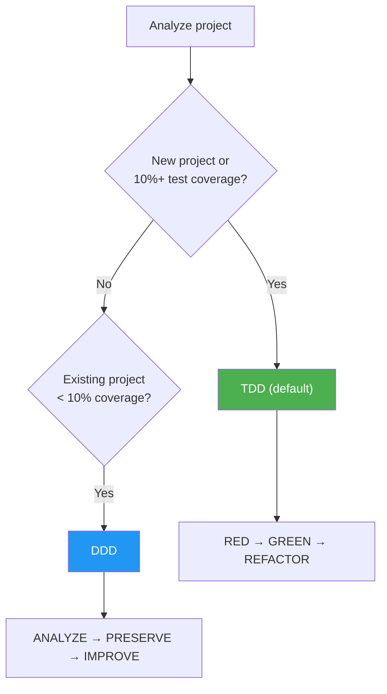

Frequently asked questions and answers about using MoAI-ADK.


---

## Q: What is the difference between `moai` and `/moai`?

They are two completely different things. This is the most common confusion, so let's clear it up first.

| | `moai` (terminal CLI) | `/moai` (slash subcommand) |
|---|---|---|
| **Where it runs** | Terminal shell | Claude Code chat input |
| **What it is** | Go binary | Claude Code skill invocation |
| **Purpose** | Project setup, template deployment | AI agent development workflows |
| **Example** | `moai init my-project` | `/moai plan "auth feature"` |

- Running `moai plan` in the terminal does nothing — `/moai plan` is only valid inside Claude Code.
- Typing `/moai init` in Claude Code does nothing — `moai init` is a terminal command.

---

## Q: What does the version display in the statusline mean?

The MoAI statusline shows version information together with an update notification:

```
🗿 v2.2.2 ⬆️ v2.2.5
```

- **`v2.2.2`**: The currently installed version
- **`⬆️ v2.2.5`**: A newer version available for update

When you are on the latest version, only the version number is shown:

```
🗿 v2.2.5
```

**How to update**: Run `moai update` and the update notification disappears.


**Note**: This is different from Claude Code's built-in version display (`🔅 v2.1.38`). The MoAI display tracks the MoAI-ADK version, while Claude Code displays its own version separately.


---

## Q: How do I customize the segments shown in the statusline?

The statusline supports 4 display presets plus a custom configuration:

| Preset | Description |
|--------|------|
| **Full** (default) | Shows all 8 segments |
| **Compact** | Shows only Model + Context + Git Status + Branch |
| **Minimal** | Shows only Model + Context |
| **Custom** | Select individual segments |

Configure it in the `moai init` or `moai update -c` wizard, or edit `.moai/config/sections/statusline.yaml` directly:

```yaml
statusline:
  preset: compact  # or full, minimal, custom
  segments:
    model: true
    context: true
    output_style: false
    directory: false
    git_status: true
    claude_version: false
    moai_version: false
    git_branch: true
```


For details, see [SPEC-STATUSLINE-001](https://github.com/modu-ai/moai-adk/blob/main/.moai/specs/SPEC-STATUSLINE-001/spec.md).


---

## Q: How do I choose a model policy?

MoAI-ADK assigns the optimal AI model to each agent according to your Claude Code subscription plan. It is a tokenomics mechanism that maximizes quality within your plan's usage limits.

### Tier Comparison

| Tier | Characteristics |
|------|------|
| **max** | Highest quality — Opus assigned to planning and auditing, maximum reasoning depth |
| **medium** (default) | Balance of quality and cost |
| **low** | Economical — Sonnet-centric allocation |


**Why does this matter?** The `low` tier is designed so the whole workflow works without higher-tier models (Opus). It can perform core work while preventing usage-limit errors. The `max` tier assigns Opus to the core phases (planning, auditing) and lightweight models to general work.


### Agent Model Assignment per Tier

Of the **11-agent catalog** (10 MoAI custom + 1 Anthropic built-in `Explore`), the MoAI custom agents are assigned models according to the tier. The 12 archived agents from earlier versions are not available.

#### Manager Agents (5)

| Agent | max | medium | low |
|---------|-----|--------|-----|
| manager-spec | opus | opus | sonnet |
| manager-develop | opus | sonnet | sonnet |
| manager-docs | sonnet | sonnet | sonnet |
| manager-git | sonnet | sonnet | sonnet |
| manager-design | sonnet | sonnet | sonnet |

#### Evaluator · Builder · Advisor Agents (4)

| Agent | max | medium | low |
|---------|-----|--------|-----|
| plan-auditor | opus | opus | sonnet |
| sync-auditor | opus | sonnet | sonnet |
| builder-harness | opus | sonnet | sonnet |
| super-advisor | opus | opus | sonnet |

The e2e-tester and the built-in `Explore` follow the session model as-is (`model: inherit`).

### How to Configure

```bash
# During project initialization
moai init my-project          # Select the model policy in the interactive wizard

# Reconfigure an existing project
moai update -c                # Re-run the setup wizard
```


The default tier is `medium`. Change it by re-running the setup wizard with `moai update -c`.


---

## Q: I see an "Allow external CLAUDE.md file imports?" warning

When opening a project, Claude Code may show a security prompt about external file imports:

```
External imports:
  /Users/<user>/.moai/config/sections/quality.yaml
  /Users/<user>/.moai/config/sections/user.yaml
  /Users/<user>/.moai/config/sections/language.yaml
```


**Recommended action:** Choose **"No, disable external imports"**.


**Why:**
- These files already exist in your project's `.moai/config/sections/`
- Project-level settings take precedence over global settings
- The essential settings are already included in the CLAUDE.md text
- Disabling external imports is safer and does not affect functionality

**What the files are:**
- `quality.yaml`: TRUST 5 framework and development methodology settings
- `language.yaml`: Language settings (conversation, comments, commits)
- `user.yaml`: User name (optional, used for Co-Authored-By)

---

## Q: What is the difference between the TDD and DDD methodologies?

MoAI-ADK v2.5.0+ uses a **binary methodology choice** (TDD or DDD only). The hybrid mode was removed for clarity and consistency.

### Methodology Selection Guide


```mermaid
flowchart TD
    A["Analyze project"] --> B{"New project or<br/>10%+ test coverage?"}
    B -->|"Yes"| C["TDD (default)"]
    B -->|"No"| D{"Existing project<br/>< 10% coverage?"}
    D -->|"Yes"| E["DDD"]
    C --> F["RED → GREEN → REFACTOR"]
    E --> G["ANALYZE → PRESERVE → IMPROVE"]

    style C fill:#4CAF50,color:#fff
    style E fill:#2196F3,color:#fff
```

### TDD Methodology (Default)

The default methodology recommended for new projects and feature development. Tests are written first.

| Phase | Description |
|------|------|
| **RED** | Write a failing test that defines the expected behavior |
| **GREEN** | Write the minimum code that passes the test |
| **REFACTOR** | Improve code quality while keeping the tests green |

For brownfield projects (existing codebases), an **analysis phase before RED** is added: read the existing code to understand current behavior before writing tests.

### DDD Methodology (Existing Projects with < 10% Test Coverage)

The methodology for safely refactoring existing projects with minimal test coverage.

```
ANALYZE   → Analyze existing code and dependencies, identify domain boundaries
PRESERVE  → Write characterization tests, capture current-behavior snapshots
IMPROVE   → Improve incrementally while protected by tests
```

### Methodology Selection Table

| Project State | Test Coverage | Recommended Methodology | Reason |
|--------------|---------------|-------------|------|
| New project | N/A | TDD | Test-first development |
| Existing project | 50%+ | TDD | A test base exists |
| Existing project | 10-49% | TDD | Tests can be extended |
| Existing project | < 10% | DDD | Incremental characterization tests needed |

### How to Configure

```bash
# Auto-detected during project initialization
moai init my-project          # Can be specified with the --mode <ddd|tdd> flag

# Manual configuration
# Edit .moai/config/sections/quality.yaml
development_mode: tdd         # or ddd
```


---

## Q: Why does my code have no @MX tags?

This is **completely normal**. The @MX tag system is designed to mark only the most dangerous and important code the AI should look at first.

| Question | Answer |
|------|------|
| Is it a problem if there are no tags? | **No.** Most code does not need tags. |
| When are tags added? | Only for **high fan_in** (callers >= 3), **complex logic** (complexity >= 15), and **risky patterns** (goroutines without context). |
| Is it similar across projects? | **Yes.** In every project, most code carries no tags. |

### Tag Priorities

| Priority | Condition | Tag Type |
|---------|------|----------|
| **P1 (critical)** | fan_in >= 3 | `@MX:ANCHOR` |
| **P2 (risky)** | goroutines, complexity >= 15 | `@MX:WARN` |
| **P3 (context)** | magic constants, missing godoc | `@MX:NOTE` |
| **P4 (missing)** | no test file | `@MX:TODO` |

To scan your codebase for @MX tags:

```bash
/moai mx --all        # Full scan
/moai mx --dry        # Preview
/moai mx --priority P1  # Critical items only
```

---

## More Questions?

- [GitHub Discussions](https://github.com/modu-ai/moai-adk/discussions) — Questions, ideas, feedback
- [Issues](https://github.com/modu-ai/moai-adk/issues) — Bug reports, feature requests
- [Discord Community](https://discord.gg/Z7E7Mdc5aN) — Real-time chat, tips
