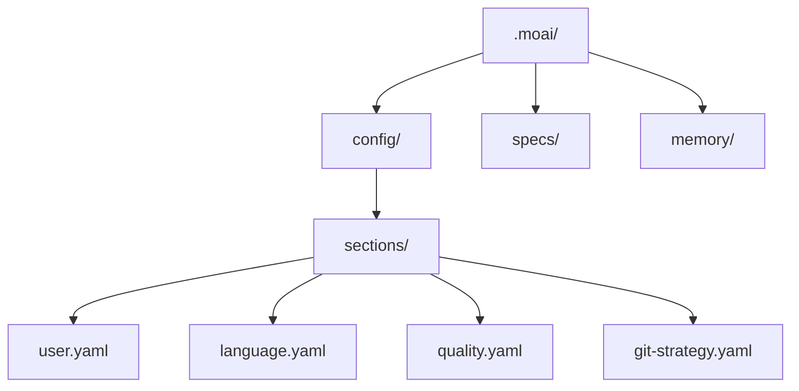
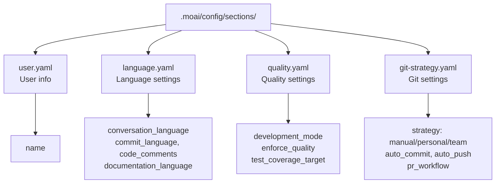

Complete your first setup using MoAI-ADK's interactive setup wizard. Configure your system for development in 9 steps.

## Starting the Setup Wizard

### Creating New Project

To create and initialize a new project:

```bash
moai init my-project
```

This creates a `my-project` folder and initializes MoAI-ADK.

### Installing in Current Folder

To install MoAI-ADK in an existing project, navigate to that folder and run:

```bash
cd my-existing-project
moai init
```


`moai init` installs directly in the current folder. For new projects, use `moai init <project-name>`.


## 9-Step Setup Process

### Step 1: Select Conversation Language

Select the language Claude will use to communicate with you.

```bash
? Select conversation language:
▸ English - English
  Korean (한국어) - Korean
  Japanese (日本語) - Japanese
  Chinese (中文) - Chinese
```


Language can be changed later in `.moai/config/sections/language.yaml`.


### Step 2: Enter Name

Used in configuration files. Press Enter to skip.

```bash
? Enter name: [name]
```

### Step 3: Select Git Automation Mode

Set the scope of Git operations Claude can perform.

```bash
? Select Git automation mode:
▸ Manual - AI does not commit or push
  Personal - AI can create branches and commit
  Team - AI can create branches, commit, and create PRs
```

**Manual**: AI does not perform any Git operations. All commits and pushes are executed by the user directly.
**Personal**: AI can create branches and commit. Suitable for personal projects.
**Team**: AI handles branch creation, commits, and PR creation. Optimized for team collaboration workflows.


Git settings are saved in `.moai/config/sections/git-strategy.yaml`. You can reconfigure at any time with `moai update -c`.


### Step 4: Select Git Provider

Select your project's Git hosting platform.

```bash
? Select Git provider:
▸ GitHub - GitHub.com
  GitLab - GitLab.com or self-hosted GitLab
```

### Step 5: Select Git Commit Message Language

Select the language for writing commit messages.

```bash
? Select Git commit message language:
▸ Korean (한국어) - Commit in Korean
  English - Commit in English
  Japanese (日本語) - Commit in Japanese
  Chinese (中文) - Commit in Chinese
```


Commit message language can be set differently from code comment language.


### Step 6: Select Code Comment Language

Select the language for code comments.

```bash
? Select code comment language:
▸ Korean (한국어) - Comment in Korean
  English - Comment in English
  Japanese (日本語) - Comment in Japanese
  Chinese (中文) - Comment in Chinese
```


For most projects, using English for code comments is recommended.


### Step 7: Select Documentation Language

Select the language for documentation files.

```bash
? Select documentation language:
▸ Korean (한국어) - Document in Korean
  English - Document in English
  Japanese (日本語) - Document in Japanese
  Chinese (中文) - Document in Chinese
```

### Step 8: Select Agent Teams Execution Mode

Configure whether MoAI uses Agent Teams (parallel) or sub-agents (sequential).

```bash
? Select Agent Teams execution mode:
▸ Auto (Recommended) - Intelligent selection based on task complexity
  Sub-agent (Classic) - Traditional single agent mode
  Team (Experimental) - Parallel Agent Teams (requires experimental feature)
```

**Auto**: Automatically selects the optimal mode based on task complexity. Recommended for most cases.
**Sub-agent**: A single agent processes tasks sequentially. Suitable for highly dependent tasks.
**Team**: Multiple specialized agents collaborate in parallel. Requires `CLAUDE_CODE_EXPERIMENTAL_AGENT_TEAMS=1` environment variable.

### Step 9: Select Teammate Display Mode

Configure how Agent teammates are displayed. Split screen requires tmux.

```bash
? Select teammate display mode:
▸ Auto (Recommended) - tmux when available, in-process otherwise (default)
  In-Process - Run in same terminal (works everywhere)
  Tmux - tmux split screen (requires tmux/iTerm2)
```

**Auto**: Automatically detects tmux availability and selects the optimal display mode.
**In-Process**: Teammate work runs in the same terminal window. Works without tmux.
**Tmux**: Visually monitor teammate work in tmux split screens.

## Setup Completion

After completing all steps, configuration files will be created:



Check the generated configuration files:

```bash
cat .moai/config/sections/user.yaml
```

## Configuration Structure



## Modifying Configuration

Configuration can be modified at any time:

### Manual Modification

```bash
# User settings
vim .moai/config/sections/user.yaml

# Language settings
vim .moai/config/sections/language.yaml

# Quality settings
vim .moai/config/sections/quality.yaml

# Git settings
vim .moai/config/sections/git-strategy.yaml
```

### Reset Configuration

Re-run the setup wizard to reconfigure all settings:

```bash
# Re-run setup wizard (recommended)
moai update -c

# Or complete reset
moai init --reset
```


`moai update -c` allows you to selectively reset only the items you want to change while keeping existing settings.



`moai init --reset` overwrites all existing settings. Backup important settings.


## Configuration Verification

Verify that configuration is correctly set up:

```bash
moai doctor
```

Output example:

```bash
moai doctor
Running system diagnostics...

┏━━━━━━━━━━━━━━━━━━━━━━━━━━━━━━━━━━━━━━━━━━┳━━━━━━━━┓
┃ Check                                    ┃ Status ┃
┡━━━━━━━━━━━━━━━━━━━━━━━━━━━━━━━━━━━━━━━━━━╇━━━━━━━━┩
│ Python >= 3.11                           │   ✓    │
│ Git installed                            │   ✓    │
│ Project structure (.moai/)               │   ✓    │
│ Config file (.moai/config/config.yaml)   │   ✓    │
└──────────────────────────────────────────┴────────┘

✓ All checks passed
```

This command verifies:

- Python >= 3.11 installed
- Git installed
- Project structure (`.moai/` folder)
- Configuration file (`.moai/config/config.yaml`)

## Next Steps

Once setup is complete, follow the [Quick Start](./quickstart) guide to create your first project.

```bash
moai --help
```

You can see all commands and options.

---

## Next Steps

Learn how to create your first project in [Quick Start](./quickstart).
