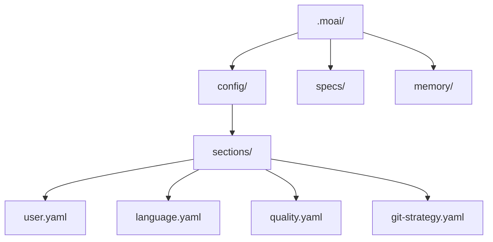
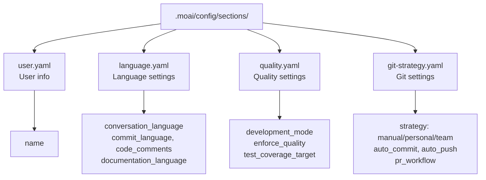

Complete your first-time setup with MoAI-ADK's interactive setup wizard. Across nine steps you configure language, Git automation scope, and execution mode to fit your development environment. Everything you choose here is saved as YAML files under `.moai/config/sections/`, so you can edit the files directly or re-run the wizard at any time.

## Starting the Setup Wizard

### Creating a New Project

To create and initialize a new project:

```bash
moai init my-project
```

This command creates the `my-project` folder and initializes MoAI-ADK.

### Installing into the Current Folder

To install MoAI-ADK into an existing project, move into that folder and run:

```bash
cd my-existing-project
moai init
```


`moai init` installs directly into the current folder. For a new project, create it with `moai init <project-name>`.


## The 9-Step Setup Process

### Step 1: Select the Conversation Language

Choose the language Claude will respond in.

```bash
? Select your conversation language:
▸ English - English
  Korean (한국어) - Korean
  Japanese (日本語) - Japanese
  Chinese (中文) - Chinese
```


You can change the language later in the `.moai/config/sections/language.yaml` file.


### Step 2: Enter Your Name

Used in the settings file. You can press Enter to skip.

```bash
? Enter your name: [name]
```

### Step 3: Select the Git Automation Mode

Sets the scope of Git operations Claude may perform.

```bash
? Select Git automation mode:
▸ Manual - AI does not commit or push
  Personal - AI can create branches and commit
  Team - AI can create branches, commit, and open PRs
```

**Manual**: The AI performs no Git operations. You run every commit and push yourself.
**Personal**: The AI can create branches and commit. Good for personal projects.
**Team**: The AI creates branches, commits, and opens PRs. Optimized for team collaboration workflows.


The Git settings are saved to `.moai/config/sections/git-strategy.yaml`. You can reconfigure at any time with `moai update -c`.


### Step 4: Select the Git Provider

Choose the project's Git hosting platform.

```bash
? Select Git provider:
▸ GitHub - GitHub.com
  GitLab - GitLab.com or self-hosted GitLab
```

### Step 5: Select the Git Commit Message Language

Choose the language used for commit messages.

```bash
? Select Git commit message language:
▸ Korean (한국어) - Commit in Korean
  English - Commit in English
  Japanese (日本語) - Commit in Japanese
  Chinese (中文) - Commit in Chinese
```


The commit message language can be set independently of the code comment language.


### Step 6: Select the Code Comment Language

Choose the language used for code comments.

```bash
? Select code comment language:
▸ Korean (한국어) - Comments in Korean
  English - Comments in English
  Japanese (日本語) - Comments in Japanese
  Chinese (中文) - Comments in Chinese
```


For most projects, English is the recommended code comment language.


### Step 7: Select the Documentation Language

Choose the language used for documentation files.

```bash
? Select documentation language:
▸ Korean (한국어) - Docs in Korean
  English - Docs in English
  Japanese (日本語) - Docs in Japanese
  Chinese (中文) - Docs in Chinese
```

### Step 8: Select the Agent Teams Execution Mode

Configure whether MoAI uses Agent Teams (parallel) or sub-agents (sequential).

```bash
? Select Agent Teams execution mode:
▸ Auto (recommended) - Intelligent selection based on task complexity
  Sub-agent (classic) - The traditional single-agent mode
  Team (experimental) - Parallel Agent Teams (requires the experimental feature)
```

**Auto**: Automatically selects the optimal mode based on task complexity. Recommended in most cases.
**Sub-agent**: A single agent processes work sequentially. Good for highly dependent tasks.
**Team**: Multiple specialist agents collaborate in parallel. Requires the `CLAUDE_CODE_EXPERIMENTAL_AGENT_TEAMS=1` environment variable.

### Step 9: Select the Teammate Display Mode

Configures how agent teammates are displayed. Split-screen requires tmux.

```bash
? Select teammate display mode:
▸ Auto (recommended) - tmux when available, otherwise in-process (default)
  In-Process - Runs in the same terminal (works anywhere)
  Tmux - tmux split panes (requires tmux/iTerm2)
```

**Auto**: Detects whether tmux is installed and selects the best display mode automatically.
**In-Process**: Teammate work runs in the same terminal window. Works without tmux.
**Tmux**: Lets you visually monitor teammate work in tmux split panes.

## Setup Complete

Once all steps are finished, the configuration files are created:


```mermaid
graph TD
    A[.moai/] --> B[config/]
    A --> C[specs/]
    A --> D[memory/]
    B --> E[sections/]
    E --> F[user.yaml]
    E --> G[language.yaml]
    E --> H[quality.yaml]
    E --> I[git-strategy.yaml]
```

Take a look at the generated configuration files:

```bash
cat .moai/config/sections/user.yaml
```

## Configuration Structure


```mermaid
graph TB
    A[.moai/config/sections/] --> B[user.yaml<br>User info]
    A --> C[language.yaml<br>Language settings]
    A --> D[quality.yaml<br>Quality settings]
    A --> E[git-strategy.yaml<br>Git settings]

    B --> B1[name]
    C --> C1[conversation_language<br>commit_language, code_comments<br>documentation_language]
    D --> D1[development_mode<br>enforce_quality<br>test_coverage_target]
    E --> E1[strategy: manual/personal/team<br>auto_commit, auto_push<br>pr_workflow]
```

## Modifying the Configuration

You can modify the configuration at any time:

### Manual Editing

```bash
# User settings
vim .moai/config/sections/user.yaml

# Language settings
vim .moai/config/sections/language.yaml

# Quality settings
vim .moai/config/sections/quality.yaml

# Git settings
vim .moai/config/sections/git-strategy.yaml
```

### Reconfiguring

You can re-run the setup wizard to reconfigure everything:

```bash
# Re-run the setup wizard (recommended)
moai update -c

# Or a full reset
moai init --reset
```


The `moai update -c` command keeps your existing settings and lets you selectively reconfigure only the items you want to change.



The `moai init --reset` option overwrites all existing settings. Back up anything important first.


## Verifying the Configuration

Verify that the configuration is set up correctly:

```bash
moai doctor
```

This command verifies:

- Whether Git is installed
- The project structure (the `.moai/` folder)
- The configuration file (`.moai/config/config.yaml`)
- Per-language development tool detection (use `--verbose` for details)

If every item passes, an `All checks passed` message is shown. If tools are missing, `moai doctor --fix` offers fix suggestions.

## Next Steps

With setup complete, follow the [Quick Start](./quickstart) guide to create your first project. You can view all commands and options at any time:

```bash
moai --help
```
