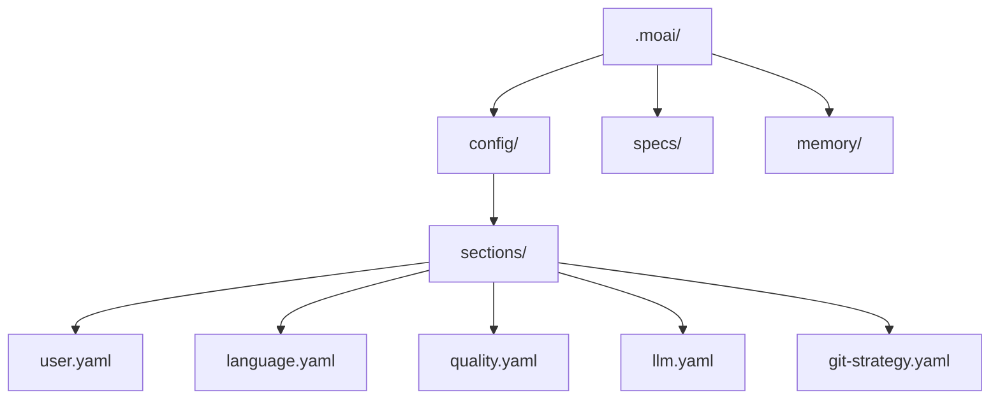

Complete your first setup through MoAI-ADK's interactive setup wizard. It configures the language, model policy, report format, and quality/workflow settings to match your development environment. Every value you set here is saved as a YAML file under `.moai/config/sections/`, so you can change it any time later by editing the file directly or re-running the wizard.

## Starting the setup wizard

### Create a new project

To initialize while creating a new project:

```bash
moai init my-project
```

This command creates the `my-project` folder and initializes MoAI-ADK.

### Install into an existing folder

To install MoAI-ADK into an existing project, move into that folder and run:

```bash
cd my-existing-project
moai init
```


`moai init` installs directly into the current folder. For a new project, create it with `moai init <project-name>`.


## Wizard structure

The initialization wizard always runs the same fixed 3-page flow — there is no mode flag that widens or narrows the question set; every user sees the same questions.

| Page | Questions |
|------|-----------|
| **Page 1 — Basic** | Conversation language, name, project name |
| **Page 2 — Model & Report** | Performance tier (model policy), report format |
| **Page 3 — Quality & Workflow** | LSP integration, enforce quality gates, project mode, design workflow, Claude Design integration |

```bash
moai init my-project
```


Git automation mode and provider are NOT asked by the wizard. `moai init` auto-detects them from the repository's already-configured Git remotes. To change Git settings later, run `moai update --reconfigure` — only that path shows a separate set of Git questions (automation mode, provider, credentials).


## Page 1 — Basic

### Step 1: choose the conversation language

Choose the language Claude will respond in. Every subsequent question renders in this language.

```bash
? Choose the conversation language:
▸ English
  Korean (한국어)
  Japanese (日本語)
  Chinese (中文)
```

This setting is saved in `.moai/config/sections/language.yaml`.

### Step 2: enter your name

The user name used in the config files. Press Enter to skip.

```bash
? Enter your name: [name]
```

This setting is saved in the `user.name` field of `.moai/config/sections/user.yaml`.

### Step 3: project name

The name of your project. The default is the current directory name.

```bash
? Enter project name: [my-project]
```

## Page 2 — Model & Report

### Performance tier (model policy)

Choose the AI model tier assigned to agents — the core Tokenomics setting.

```bash
? Choose the performance tier:
▸ Medium (Recommended) - balance of quality and cost, Max $100 plan
  Max - Fable 5(low) + Opus 4.8(high) + Sonnet(medium~low), Max $200 plan
  Low - Opus 4.8(high~low) + Sonnet(medium~low), Plus $20 plan
```

| Tier | Characteristics |
|------|------|
| **Max** | Highest-quality allocation — for the Max $200 plan |
| **Medium** (default) | Balance of quality and cost — for the Max $100 plan |
| **Low** | Economical allocation — for the Plus $20 plan |

This setting is saved in the `performance_tier` field of `.moai/config/sections/llm.yaml` and is read as a legacy alias of the `profile` field (the profile matrix column). Specifying the `--profile max|medium|low` flag directly stores it in the `profile` field. For the per-profile agent model+effort mapping, see the [Profile Matrix](/en/advanced/profile-matrix/) page.

### Report format

Choose whether reports are generated as HTML+Markdown or Markdown only.

```bash
? Choose the report format:
▸ HTML + Markdown (Recommended) - generate both a browser-viewable HTML report and Markdown
  Markdown only - generate Markdown reports only (lighter, diff-friendly)
```

This setting is saved in the `report.format` field of `.moai/config/sections/report.yaml`.

## Page 3 — Quality & Workflow

### LSP integration

Choose whether to enable language-server diagnostics in the run phase. The default is **enabled (Yes)**; answer No to opt out.

This setting is saved in the `lsp.enabled` field of `.moai/config/sections/lsp.yaml`.

### quality gates

Choose whether to enforce the TRUST 5 quality gates.

- **Enforce quality gates** (default: Yes) — block implementation from proceeding when a quality gate fails

This setting is saved in the `constitution.enforce_quality` field of `.moai/config/sections/quality.yaml`.

### project mode

Choose the project collaboration mode.

```bash
? Select project mode:
▸ Personal (Recommended) - Solo developer
  Team - Multi-developer setup
```

This setting is saved in the `project.mode` field of `.moai/config/sections/project.yaml`.

### design workflow

Choose whether to enable the MoAI design pipeline and Claude Design integration.

- **Enable design workflow** (default: Yes)
- **Enable Claude Design integration** (default: Yes, shown only when design is enabled)

These settings are saved in the `design.enabled` / `design.claude_design.enabled` fields of `.moai/config/sections/design.yaml`.

## Non-interactive mode (CI/CD)

By specifying all values with flags, you can initialize without the wizard:

```bash
moai init my-project \
  --non-interactive \
  --project-mode personal \
  --profile medium \
  --harness-profile default \
  --enable-lsp=false \
  --enforce-quality
```

## Setup complete

Once all steps are done, the config files are created:


```mermaid
graph TD
    A[".moai/"] --> B["config/"]
    A --> C["specs/"]
    A --> D["memory/"]
    B --> E["sections/"]
    E --> F["user.yaml"]
    E --> G["language.yaml"]
    E --> H["quality.yaml"]
    E --> I["llm.yaml"]
    E --> J["git-strategy.yaml"]
```

## Editing the configuration

### Manual editing

```bash
# User settings
vim .moai/config/sections/user.yaml

# Language settings
vim .moai/config/sections/language.yaml

# Model policy (performance tier)
vim .moai/config/sections/llm.yaml

# Quality settings
vim .moai/config/sections/quality.yaml
```

### Reconfiguration

Re-run the setup wizard to change the configuration:

```bash
# Re-run the setup wizard (recommended)
moai update -c
```


The `moai update -c` command lets you keep existing settings while selectively reconfiguring only the items you want to change.


## Validating the configuration

Check that the configuration is set up correctly:

```bash
moai doctor
```

This command validates whether Git is installed, the project structure (the `.moai/` folder), the config files, and language-specific development tools. Check details with `--verbose`.

## Next steps

Once setup is complete, follow the [Quick Start](./quickstart) guide to create your first project.

```bash
moai --help
```
