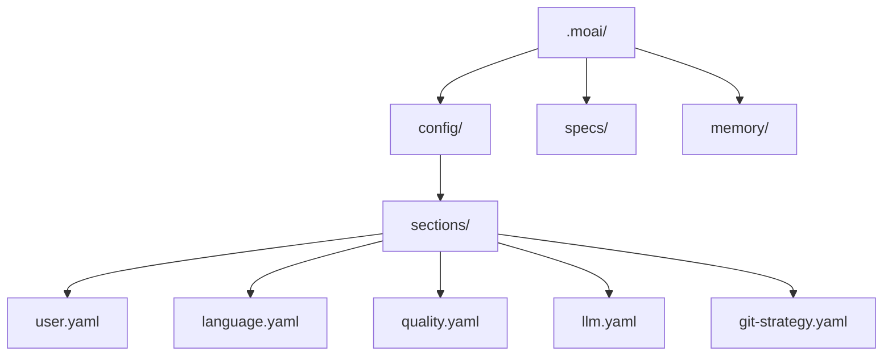

Complete your first setup through MoAI-ADK's interactive setup wizard. The wizard asks only the five things a person has to choose — conversation language, name, the agent harness to deploy, the session permission mode, and whether to enable Jev typed judgments. Everything else (model policy, report format, quality gates, design workflow, and so on) is saved with its recommended default, and you can change it later.

Most settings are saved as YAML files under `.moai/config/sections/`, one concern per file, so changing a value means opening just that file. The session permission mode is the exception: it is written to your user-level Claude Code settings (see Page 2 below).

## Starting the setup wizard

### Create a new project

To initialize while creating a new project:

```bash
moai init my-project
```

This command creates the `my-project` folder and initializes MoAI-ADK.

### Install into an existing folder

To install MoAI-ADK into an existing project, move into that folder and run:

```bash
cd my-existing-project
moai init
```


`moai init` installs directly into the current folder. For a new project, create it with `moai init <project-name>`.


## Wizard structure

The initialization wizard always runs the same flow — there is no mode flag that widens or narrows the question set; every user sees the same questions. It asks five questions spread over three pages. The progress indicator at the top of the screen (`● ● ● ○ ○ 3 / 5`) counts questions, not pages.

| Page | Questions |
|------|-----------|
| **Page 1 — Basic** | Conversation language, name |
| **Page 2 — Agents & Autonomy** | Agent harness to deploy, session permission mode |
| **Page 3 — Judgment Capability** | Whether to enable Jev typed judgments |

```bash
moai init my-project
```


Git automation mode and provider are NOT asked by the wizard. `moai init` auto-detects them from the repository's already-configured Git remotes. To change Git settings later, run `moai update -c` (`--config`) — only that path shows a separate set of Git questions (automation mode, provider, credentials).


## Page 1 — Basic

Two basic values: conversation language and your name. The language comes pre-filled, and the name is pre-filled when your profile already has one; either way, pressing Enter moves you on.

**Conversation language** — the language MoAI uses when talking with you. The wizard switches to it immediately.

```bash
? Select conversation language
▸ English
  Korean (한국어)
  Japanese (日本語)
  Chinese (中文)
```

This setting is saved to `.moai/config/sections/language.yaml`.

**Name** — how MoAI addresses you. Leave it empty to skip.

```bash
? Enter your name: [name]
```

This setting is saved to the `user.name` field in `.moai/config/sections/user.yaml`.


The project name is not asked. `moai init` uses the name you pass as `moai init <project-name>`, or the current folder name when you give none. You can also set it directly with the `--name` flag.


## Page 2 — Agents & Autonomy

### Agent harness

Choose which agent harness MoAI deploys and wires for this project. The choice decides which files land at the project root.

```bash
? Select the agent harness to deploy and wire
▸ Claude only (Recommended) - Deploy the .claude/ surface plus AGENTS.md (today's default behavior)
  GPT (Codex) only          - AGENTS.md and Codex surfaces only — no .claude/ tree, no CLAUDE.md, no .mcp.json
  Claude + Codex            - Same .claude/ deployment plus .codex/ wiring; .mcp.json provisioning forced on
```

The `--llm claude|gpt|both` flag takes precedence over this answer.

### Session permission mode

Choose the permission mode Claude Code sessions start in.

```bash
? Select the session permission mode
▸ Accept edits on (Recommended) - Auto-accept file edits; prompt for other tools
  Auto mode                     - Auto-approve tool calls under classifier safety checks
  Bypass permissions            - Skip all prompts; requires sandbox proof (Docker/gVisor/etc.)
```

This setting is written to your user-level Claude Code settings (`defaultMode`), not to a project YAML file. The default, Accept edits on, becomes `defaultMode: acceptEdits`. Bypass permissions applies only when a sandbox proof is present and the kill switch is off; otherwise it is applied as Auto mode instead. The `--autonomy-tier semi-auto|automatic|fully-autonomous` flag takes precedence over this answer.

## Page 3 — Judgment Capability

### Jev typed judgments

Jev answers a typed question about supplied state and returns a probability; it decides nothing.

```bash
? Enable Jev typed judgments? (optional, off by default)
```

The default is **off**. Enabling it sends card text or request text to a third-party server, so decide with that in mind. This setting is saved to the `workflow.jev.enabled` field in `.moai/config/sections/workflow.yaml`.


This question is asked only by `moai init`. `moai update -c` does not ask it — to change it later, open the `moai web` settings.


## Settings the wizard does not ask

The values below are saved with their defaults without asking. To change them, pass a flag, or use `moai update -c` or `moai web` after setup.

| Setting | Default | How to change |
|---------|---------|---------------|
| Performance tier (model policy) | Medium | `--model-policy` or `--profile`, `moai update -c` |
| Report format | HTML + Markdown | `moai update -c` |
| LSP integration | On | `--enable-lsp` |
| Enforce quality gates | On | `--enforce-quality` |
| Design workflow and Claude Design integration | On | `--enable-design` |
| Git automation mode and provider | Detected from the repository's remotes | `--git-mode`, `--git-provider`, `moai update -c` |

### Performance tier (model policy)

`moai init` does not ask for the model policy; it saves Medium. The screen below appears when you reconfigure with `moai update -c`.

```bash
? Select model policy:
  Max - Opus 5.5 (high~medium) + Sonnet (low, docs/single-shot rows) — Max $200 plan
▸ Medium (Recommended) - Opus 5.5 (high~low) + Sonnet (low, docs/single-shot rows) — Max $100 plan
  Low - Opus 5.5 (high~low) + Sonnet (low, docs/e2e/single-shot rows) — Plus $20 plan
```

| Tier | Characteristics |
|------|------|
| **Max** | Quality first — same as Medium except that `builder-harness` and `e2e-tester` run one effort level higher |
| **Medium** (default, recommended) | Balance of quality and cost — the knee of the cost/score curve |
| **Low** | Lowest cost per task — most agentic agents drop to Opus `medium` |

This setting is saved in the `performance_tier` field of `.moai/config/sections/llm.yaml` and is read as a legacy alias of the `profile` field (the profile matrix column). Specifying the `--profile high|medium|low` flag directly stores it in the `profile` field (the legacy value `max` is accepted as input and normalized to `high`). For the per-profile agent model+effort mapping, see the [Profile Matrix](/en/advanced/profile-matrix/) page.

## Non-interactive mode (CI/CD)

Specify every value with flags to initialize without the wizard:

```bash
moai init my-project \
  --non-interactive \
  --llm claude \
  --autonomy-tier semi-auto \
  --profile medium \
  --enable-lsp=false \
  --enforce-quality
```

## Setup complete

Once all steps are done, the config files are created:


```mermaid
graph TD
    A[".moai/"] --> B["config/"]
    A --> C["specs/"]
    A --> D["memory/"]
    B --> E["sections/"]
    E --> F["user.yaml"]
    E --> G["language.yaml"]
    E --> H["quality.yaml"]
    E --> I["llm.yaml"]
    E --> J["git-strategy.yaml"]
```

When installation deploys the skill mirror, it prefers a symbolic link. On systems where a link cannot be created, a copy is deployed instead, and the `moai init` completion summary then says so — the one thing worth knowing is that a copy does not follow the source the way a link does.

## Editing the configuration

### Manual editing

```bash
# User settings
vim .moai/config/sections/user.yaml

# Language settings
vim .moai/config/sections/language.yaml

# Model policy (performance tier)
vim .moai/config/sections/llm.yaml

# Quality settings
vim .moai/config/sections/quality.yaml
```

### Reconfiguration

Re-run the setup wizard to change the configuration:

```bash
# Re-run the setup wizard (recommended)
moai update -c
```


The `moai update -c` command lets you keep existing settings while selectively reconfiguring only the items you want to change.


## Validating the configuration

Check that the configuration is set up correctly:

```bash
moai doctor
```

This command validates whether Git is installed, the project structure (the `.moai/` folder), the config files, and language-specific development tools. Check details with `--verbose`.

## Next steps

Once setup is complete, follow the [Quick Start](./quickstart) guide to create your first project.

```bash
moai --help
```
