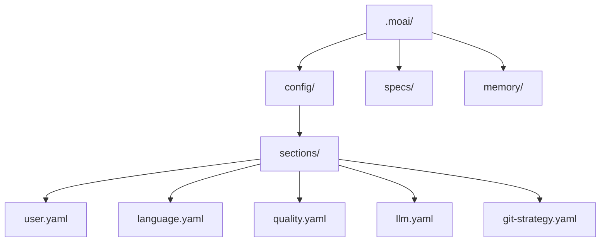

Complete your first setup through MoAI-ADK's interactive setup wizard. It configures the language, Git automation scope, model policy, and harness profile to match your development environment. Every value you set here is saved as a YAML file under `.moai/config/sections/`, so you can change it any time later by editing the file directly or re-running the wizard.

## Starting the setup wizard

### Create a new project

To initialize while creating a new project:

```bash
moai init my-project
```

This command creates the `my-project` folder and initializes MoAI-ADK.

### Install into an existing folder

To install MoAI-ADK into an existing project, move into that folder and run:

```bash
cd my-existing-project
moai init
```


`moai init` installs directly into the current folder. For a new project, create it with `moai init <project-name>`.


## Wizard modes

The initialization wizard operates in three modes, depending on the depth of questions.

| Mode | Flag | Question scope |
|------|--------|----------|
| **Quick** (default) | (none) | Core settings only — language, name, Git, model policy |
| **Standard** | `--standard` | Quick + Phase 1 questions (project mode, harness profile, LSP, quality, design) |
| **Advanced** | `--advanced` | Standard + Phase 2 questions (only when prerequisites are met) |

```bash
# Default wizard (Quick)
moai init my-project

# Include Phase 1 questions
moai init my-project --standard

# Include Phase 1 + Phase 2 questions
moai init my-project --advanced
```

## Quick mode (default)

Run without flags, it asks only the core settings. This is sufficient for most users.

### Step 1: choose the conversation language

Choose the language Claude will respond in.

```bash
? Choose the conversation language:
▸ English
  Korean (한국어)
  Japanese (日本語)
  Chinese (中文)
```

This setting is saved in `.moai/config/sections/language.yaml`.

### Step 2: enter your name

The user name used in the config files. Press Enter to skip.

```bash
? Enter your name: [name]
```

### Step 3: choose the Git automation mode

Sets the scope of Git operations Claude can perform.

```bash
? Choose the Git automation mode:
▸ Manual - the AI does not commit or push
  Personal - the AI can create branches and commit
  Team - the AI can create branches, commit, and create PRs
```

- **Manual**: the AI does not perform Git operations. You run all commits and pushes yourself.
- **Personal**: the AI can create branches and commit. Suited for personal projects.
- **Team**: the AI performs branch creation, commits, and even PR creation. Optimized for team collaboration workflows.


Git settings are saved in the `.moai/config/sections/git-strategy.yaml` file.


### Step 4: choose the Git provider

Choose the project's Git hosting platform.

```bash
? Choose the Git provider:
▸ GitHub - GitHub.com
  GitLab - GitLab.com or self-hosted GitLab
```

### Step 5: commit message language

Choose the language used for writing commit messages. It can be set differently from the code-comment language.

### Step 6: code comment language

Choose the language used for code comments. English is recommended for most projects.

### Step 7: documentation language

Choose the language used for documentation files.

### Step 8: performance tier (model policy)

Choose the AI model tier assigned to agents — the core Tokenomics setting.

```bash
? Choose the performance tier:
▸ medium (Recommended) - balance of quality and cost
  max - highest quality, Opus assigned to planning and auditing
  low - economical, Sonnet-centric allocation
```

| Tier | Characteristics |
|------|------|
| **max** | Highest quality — Opus assigned to planning and auditing, maximum reasoning depth |
| **medium** (default) | Balance of quality and cost |
| **low** | Economical — Sonnet-centric allocation |

This setting is saved in the `performance_tier` field of `.moai/config/sections/llm.yaml`.

### Step 9: pricing plan type (plan_type)

Choose the model-assignment profile based on billing method.

```bash
? Choose the pricing plan type:
▸ subscription (Recommended) - subscription plan (weekly quota optimized)
  api - API usage-based billing (per-task cost optimized)
```

This setting is saved in the `plan_type` field of `.moai/config/sections/llm.yaml`. Even at the same performance tier, model assignment differs by pricing plan type.

## Standard mode (Phase 1 questions)

With the `--standard` flag, all Quick-mode questions plus Phase 1 questions are shown.

### project mode

Choose the project collaboration mode.

```bash
? Select project mode:
▸ Personal (Recommended) - Solo developer
  Team - Multi-developer setup
```

### harness evaluator profile

Choose the default profile of the quality evaluator.

```bash
? Select default harness evaluator profile:
▸ default
  strict
  lenient
  frontend
```

### LSP integration

Choose whether to enable language-server diagnostics in the run phase. The default is disabled (opt-in).

### quality gates

Choose whether to enforce the TRUST 5 quality gates and whether to allow coverage exemptions.

- **Enforce quality gates** (default: Yes) — block implementation from proceeding when a quality gate fails
- **Allow coverage exemptions** (default: No) — exclude specific files/packages from coverage

### design workflow

Choose whether to enable the MoAI design pipeline and Claude Design integration.

- **Enable design workflow** (default: Yes)
- **Enable Claude Design integration** (default: Yes, shown only when design is enabled)

## Advanced mode (Phase 2 questions)

The `--advanced` flag includes `--standard`, and additionally shows Phase 2 questions. Phase 2 questions are shown only when prerequisites — such as run-phase completion — are met; if there is no such condition, they are skipped automatically with a guidance message.

## Non-interactive mode (CI/CD)

By specifying all values with flags, you can initialize without the wizard:

```bash
moai init my-project \
  --non-interactive \
  --project-mode personal \
  --model-policy medium \
  --plan-type subscription \
  --harness-profile default \
  --enable-lsp=false \
  --enforce-quality
```

## Setup complete

Once all steps are done, the config files are created:


```mermaid
graph TD
    A[".moai/"] --> B["config/"]
    A --> C["specs/"]
    A --> D["memory/"]
    B --> E["sections/"]
    E --> F["user.yaml"]
    E --> G["language.yaml"]
    E --> H["quality.yaml"]
    E --> I["llm.yaml"]
    E --> J["git-strategy.yaml"]
```

## Editing the configuration

### Manual editing

```bash
# User settings
vim .moai/config/sections/user.yaml

# Language settings
vim .moai/config/sections/language.yaml

# Model policy (performance tier)
vim .moai/config/sections/llm.yaml

# Quality settings
vim .moai/config/sections/quality.yaml
```

### Reconfiguration

Re-run the setup wizard to change the configuration:

```bash
# Re-run the setup wizard (recommended)
moai update -c
```


The `moai update -c` command lets you keep existing settings while selectively reconfiguring only the items you want to change.


## Validating the configuration

Check that the configuration is set up correctly:

```bash
moai doctor
```

This command validates whether Git is installed, the project structure (the `.moai/` folder), the config files, and language-specific development tools. Check details with `--verbose`.

## Next steps

Once setup is complete, follow the [Quick Start](./quickstart) guide to create your first project.

```bash
moai --help
```
