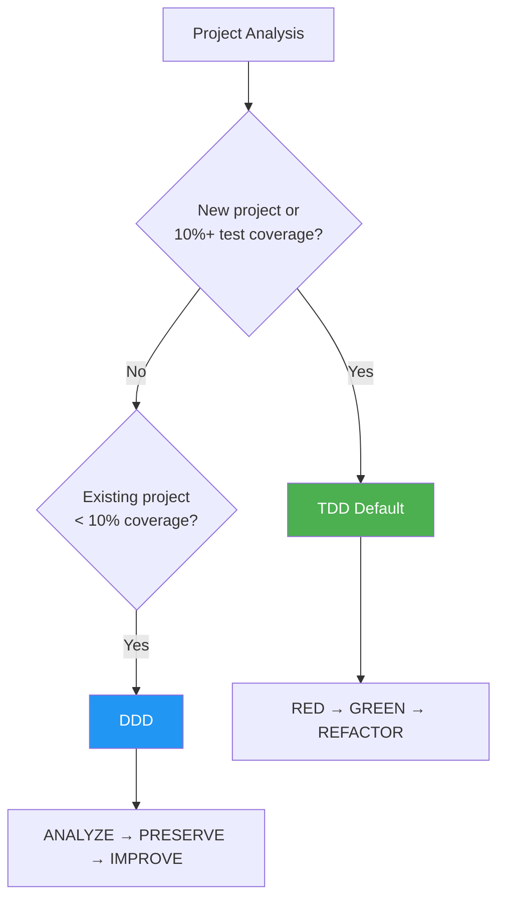
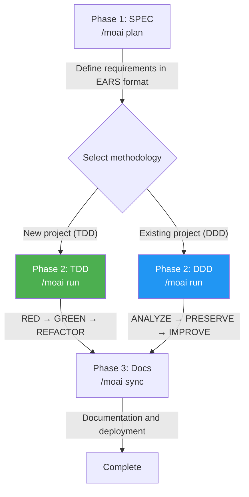

MoAI-ADK is an AI-based development environment, a comprehensive toolkit for efficiently generating high-quality code.

## Notation Guide

In this documentation, command prefixes indicate the execution environment:

- **Claude Code** commands entered in the chat window
  ```bash
  > /moai plan "feature description"
  ```

- **Terminal** commands entered in the terminal
  ```bash
  moai init my-project
  ```

## Core Concepts

MoAI-ADK is based on **SPEC-based TDD/DDD** methodology and ensures code quality through the **TRUST 5** quality framework.

### What is SPEC? (Easy Understanding)

**SPEC** (Specification) is "documenting conversations with AI."

The biggest problem with **Vibe Coding** is **context loss**:
- Context discussed with AI for an hour **disappears** when the session ends
- To continue work the next day, you must **re-explain everything from scratch**
- For complex features, **results often differ from your intentions**

**SPEC solves this problem:**
- Permanently preserve requirements by **saving them to files**
- Can **continue work** by reading just the SPEC even if the session ends
- Define clearly without ambiguity using **EARS format**


**One-line summary:** Yesterday's discussion about "JWT authentication + 1-hour expiration + refresh token" — no need to re-explain today. Just run `/moai run SPEC-AUTH-001` and start implementation immediately!


### What is TDD? (Easy Understanding)

**TDD** (Test-Driven Development) is "a method where you write tests before writing code."

Using exam preparation as an analogy:
- Write the **grading criteria (tests) first** — naturally fails since the feature doesn't exist yet
- Write **minimal code to pass the criteria** — only what's necessary
- **Polish the code** — improve quality while tests remain passing

MoAI-ADK automates this process using the **RED-GREEN-REFACTOR** cycle:

| Phase | Meaning | Action |
|-------|---------|--------|
| **RED** | Failure | Write tests for features that don't yet exist |
| **GREEN** | Success | Write minimal code to make tests pass |
| **REFACTOR** | Improvement | Improve code quality while keeping tests green |

### What is DDD? (Easy Understanding)

**DDD** (Domain-Driven Development) is "a method for safely improving existing code."

Using home renovation as an analogy:
- **Don't demolish the existing house** — improve room by room
- **Record the current state before renovation** (= characterization tests)
- **Work room by room and verify each step** (= incremental improvement)

MoAI-ADK automates this process using the **ANALYZE-PRESERVE-IMPROVE** cycle:

| Phase | Meaning | Action |
|-------|---------|--------|
| **ANALYZE** | Analysis | Understand current code structure and issues |
| **PRESERVE** | Preservation | Record current behavior with tests (safety net) |
| **IMPROVE** | Improvement | Gradually improve while passing tests |

### Choosing Your Development Methodology

MoAI-ADK automatically selects the optimal methodology based on your project state.



| Methodology | Target | Cycle |
|------------|--------|-------|
| **TDD** | New projects or 10%+ coverage | RED → GREEN → REFACTOR |
| **DDD** | Existing projects with < 10% coverage | ANALYZE → PRESERVE → IMPROVE |


MoAI-ADK v2.5.0+ uses binary methodology selection (TDD or DDD only). Hybrid mode has been removed for clarity and consistency. The methodology is auto-selected during `moai init`, and can be changed via `development_mode` in `.moai/config/sections/quality.yaml`.


### TRUST 5 Quality Framework

TRUST 5 is based on these 5 core principles:

| Principle | Description |
|-----------|-------------|
| **T**ested | 85% coverage, characterization tests, behavior preservation |
| **R**eadable | Clear naming conventions, consistent formatting |
| **U**nified | Unified style guide, auto-formatting |
| **S**ecured | OWASP compliance, security validation, vulnerability analysis |
| **T**rackable | Structured commits, change history tracking |

## Go Edition Features

MoAI-ADK 2.5 completely rewrote the Python Edition in Go, maximizing performance and efficiency.

| Item | Python Edition | Go Edition |
|------|---------------|-----------|
| Distribution | pip + venv + dependencies | **Single binary**, zero dependencies |
| Startup Time | ~800ms interpreter boot | **~5ms** native execution |
| Concurrency | asyncio / threading | **Native goroutines** |
| Type Safety | Runtime (mypy optional) | **Compile-time enforcement** |
| Cross-Platform | Python runtime required | **Pre-built binaries** (macOS, Linux, Windows) |

### Key Numbers

- **100K+** lines of Go code, **100+** packages
- **85-100%** test coverage
- **8** specialized AI agents + **27** skills
- **16** programming languages supported
- **27** Claude Code Hook events

## System Requirements

| Platform | Supported Environments | Notes |
|----------|------------------------|-------|
| macOS | Terminal, iTerm2 | Fully supported |
| Linux | Bash, Zsh | Fully supported |
| Windows | **WSL (recommended)**, PowerShell 7.x+ | Native cmd.exe not supported |

**Required:**
- **Git** must be installed on all platforms
- **Windows users**: WSL (Windows Subsystem for Linux) is recommended for the best experience

## Core Values

MoAI-ADK delivers these core values:

- **SPEC-based TDD/DDD**: A structured methodology for documenting requirements and developing incrementally (TDD for new projects, DDD for legacy code)
- **TRUST 5 Quality Framework**: Five principles ensuring test coverage, readability, unified style, security, and traceability
- **8 Specialized Agents**: An AI agent team specialized for each development stage (7 MoAI custom + Anthropic built-in Explore)
- **27 Skills**: Extensible skill library supporting diverse development scenarios
- **Multilingual Support**: Support for Korean, English, Japanese, and Chinese
- **Adaptive Thinking**: Use the `ultrathink` keyword with Opus 4.7+/4.8 and Sonnet 4.6 built-in reasoning modes to analyze complex problems
- **Ralph-Style LSP Integration**: LSP-based autonomous workflow with real-time quality feedback

## Key Features

MoAI-ADK provides 8 specialized AI agents and 27 skills to automate and optimize your entire development workflow.

### Agent Categories

| Category | Count | Key Agents |
|----------|-------|-----------|
| **Manager** | 4 | manager-spec, manager-develop, manager-docs, manager-git |
| **Evaluator** | 2 | plan-auditor, sync-auditor |
| **Builder** | 1 | builder-harness |
| **Explore** | 1 | Anthropic built-in (read-only code analysis) |

### Model Policy (Token Optimization)

MoAI-ADK allocates optimal AI models to 8 agents based on your Claude Code subscription tier, maximizing quality within usage limits.

| Policy | Tier | Opus | Sonnet | Haiku | Use Case |
|--------|------|------|--------|-------|----------|
| **High** | Max $200/month | 16 | 5 | 3 | Maximum quality, highest throughput |
| **Medium** | Max $100/month | 3 | 17 | 4 | Balance quality and cost |
| **Low** | Plus $20/month | 0 | 13 | 11 | Budget-conscious, Opus not included |


The Plus $20 tier does not include Opus. Setting the **Low** policy ensures all agents use only Sonnet and Haiku to avoid usage limit errors. Higher tiers allocate Opus to core agents (security, strategy, architecture) and Sonnet/Haiku to general tasks.


#### Key Agent Model Allocation

| Agent | High | Medium | Low |
|-------|------|--------|-----|
| manager-spec, plan-auditor | Opus | Opus | Sonnet |
| manager-develop, sync-auditor | Opus | Sonnet | Sonnet |
| manager-docs, manager-git, builder-harness | Haiku → Sonnet | Haiku | Haiku |

### Dual Execution Modes

Provides two execution modes: `--solo` (Sub-Agent) and `--team` (Agent Teams). Both modes automatically determine sequential or parallel execution; without flags, the system analyzes task complexity to select the optimal mode.


| Flag | Mode | Execution |
|------|------|-----------|
| `--solo` | Sub-Agent Mode | Sequential delegation to expert agents |
| `--team` | Agent Teams Mode | Parallel collaboration among team agents |
| (none) | Auto-select | Auto-analyze based on complexity |

```bash
/moai run SPEC-AUTH-001          # Auto-select
/moai run SPEC-AUTH-001 --team    # Force Agent Teams (parallel)
/moai run SPEC-AUTH-001 --solo    # Force Sub-Agent (sequential)
```

### SPEC-First Workflow

MoAI-ADK follows a 3-phase development workflow. The Run phase methodology is auto-selected based on project state:



### Recommended Workflow Chains

**New feature development:**
```
/moai plan → /moai run SPEC-XXX → /moai sync SPEC-XXX
```

**Bug fixes:**
```
/moai fix (or /moai loop) → /moai review → /moai sync
```

**Refactoring:**
```
/moai plan → /moai clean → /moai run SPEC-XXX → /moai review → /moai codemaps
```

**Documentation updates:**
```
/moai codemaps → /moai sync
```

## Multilingual Support

MoAI-ADK supports 4 languages:

- Korean
- English
- Japanese
- Chinese

You can select your preferred language during installation or change it directly in the configuration file.

## LSP Integration

**LSP** (Language Server Protocol) is the standard communication protocol between code editors and language tools. It detects code errors, type errors, and linting results in real-time, providing immediate feedback.

**Ralph-Loop Style** is an autonomous workflow that uses LSP diagnostics as a feedback loop. When quality issues are detected, it automatically invokes the fix agent and repeats until quality standards are met.

MoAI-ADK provides Ralph-Loop Style LSP integration for autonomous workflows:

- **LSP-based completion auto-detection**: Real-time monitoring of code quality status
- **Real-time regression detection**: Immediately detect impact of changes on existing functionality
- **Auto-completion conditions**: Automatically mark complete when 0 errors, 0 type errors, 85% coverage achieved


Ralph-Loop Style LSP integration automates quality gates in your development workflow, maintaining high code quality without manual intervention.


## Save 50-70% on Tokens with GLM

GLM is a Claude Code-compatible AI model. Combining Claude Opus reader with GLM-5 teammates in **CG Mode** can save **50-70% of tokens** on implementation tasks.

### CG Mode: Claude + GLM Agent Team

CG Mode has Claude Opus orchestrating the entire workflow while cost-effective GLM-5 teammates handle implementation tasks in parallel.

| Role | Model | Responsibilities |
|------|-------|-----------------|
| **Reader** | Claude Opus | Orchestration, architecture decisions, code review |
| **Teammates** | GLM-5 | Code implementation, test writing, documentation |

| Task Type | Recommended Mode | Savings |
|-----------|-----------------|---------|
| Implementation-focused SPEC (`/moai run`) | CG Mode | **50-70% savings** |
| Code generation, testing, documentation | CG Mode | **50-70% savings** |
| Architecture design, security review | Claude only | Opus reasoning required |

### GLM Switching Commands

```bash
# Switch to GLM backend
moai glm

# Start GLM Worker mode (Opus reader + GLM-5 teammates)
moai glm --team

# CG Mode (Claude reader + GLM teammates, tmux required)
moai cg

# Return to Claude backend
moai cc
```


Don't have a GLM account? [Sign up for z.ai (additional 10% discount)](https://z.ai/subscribe?ic=1NDV03BGWU). Rewards from this link support **MoAI open source development**. Thank you!


## Getting Started

Follow these steps to begin your MoAI-ADK journey:

1. **[Install](/getting-started/installation)** — Install MoAI-ADK on your system
2. **[Setup](/getting-started/installation)** — Run the interactive setup wizard
3. **[Quick Start](/getting-started/quickstart)** — Create your first project
4. **[Core Concepts](/core-concepts/what-is-moai-adk)** — Deepen your understanding

## Key Advantages

| Advantage | Description |
|-----------|-------------|
| **Quality Assurance** | Maintain consistent quality with TRUST 5 framework |
| **Productivity** | Reduce development time with AI agent automation |
| **Cost Efficiency** | Save 70% cost with GLM 5 |
| **Scalability** | Flexible expansion with modular architecture |
| **Multilingual** | Support for 4 languages |

## Additional Resources

- [GitHub Repository](https://github.com/modu-ai/moai-adk)
- [Documentation Site](https://adk.mo.ai.kr)
- [Community Forum](https://github.com/modu-ai/moai-adk/discussions)

---

## Next Steps

Learn how to install MoAI-ADK in the [Installation Guide](./installation).
