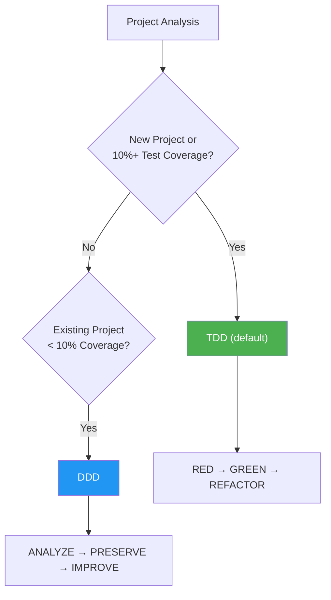
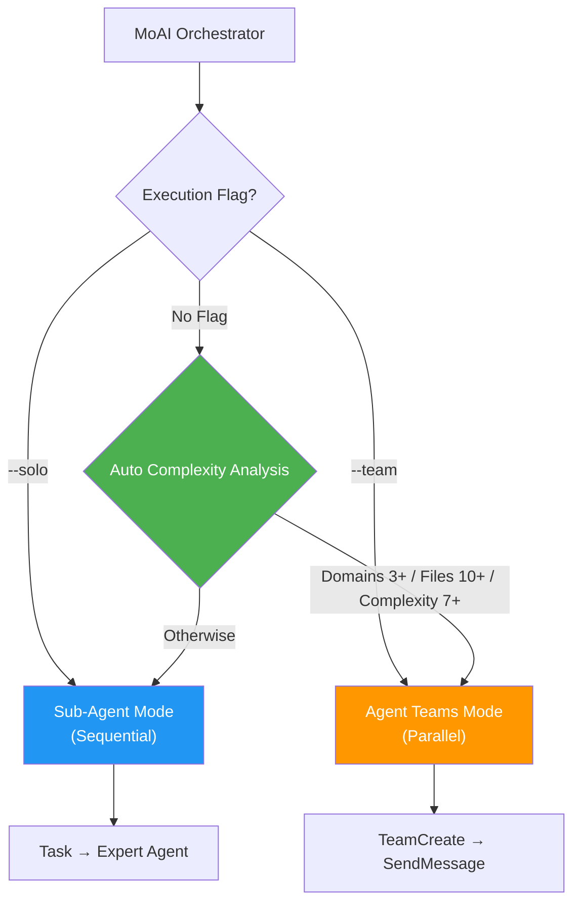
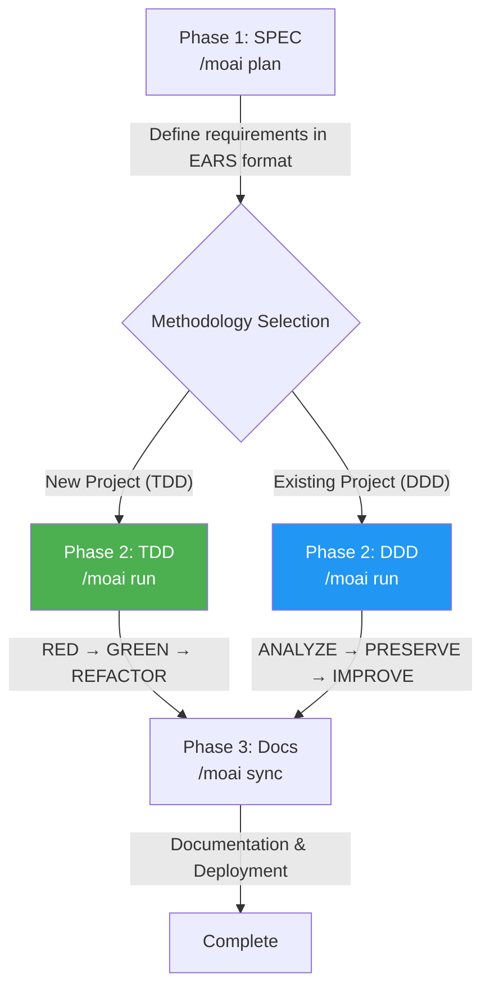

MoAI-ADK is an AI-based development environment, a comprehensive toolkit for efficiently generating high-quality code.

## Notation Guide

In this documentation, command prefixes indicate the execution environment:

- **Claude Code** commands entered in the chat window
  ```bash
  > /moai plan "feature description"
  ```

- **Terminal** commands entered in the terminal
  ```bash
  moai init my-project
  ```

## Core Concepts

MoAI-ADK is based on **SPEC-based TDD/DDD** methodology and ensures code quality through the **TRUST 5** quality framework.

### What is SPEC? (Easy Understanding)

**SPEC** (Specification) is "documenting conversations with AI."

The biggest problem with **Vibe Coding** is **context loss**:
- 😰 Content discussed with AI for 1 hour **disappears** when the session ends
- 😰 To continue work the next day, you must **explain from the beginning**
- 😰 For complex features, **results differ from intentions**

**SPEC solves this problem:**
- ✅ Permanently preserve requirements by **saving them to files**
- ✅ Can **continue work** by reading just the SPEC even if session ends
- ✅ Define clearly without ambiguity using **EARS format**


**One-line summary:** Yesterday's discussion about "JWT authentication + 1 hour expiration + refresh token" - no need to re-explain today. Just `/moai run SPEC-AUTH-001` and start implementation immediately!


### What is TDD? (Easy Understanding)

**TDD** (Test-Driven Development) is "a method where you write tests before writing code."

Using exam preparation as an analogy:
- 📝 **Write the grading criteria (tests) first** — naturally fails since the feature doesn't exist yet
- 💡 **Write minimal code to pass the criteria** — exactly what's needed, nothing more
- ✨ **Refine to better code** — improve while keeping tests passing

MoAI-ADK automates this process with the **RED-GREEN-REFACTOR** cycle:

| Phase | Meaning | What it does |
|-------|---------|--------------|
| 🔴 **RED** | Fail | Write a test for a feature that doesn't exist yet |
| 🟢 **GREEN** | Pass | Write minimal code to make the test pass |
| 🔵 **REFACTOR** | Improve | Improve code quality while keeping tests passing |

### What is DDD? (Easy Understanding)

**DDD** (Domain-Driven Development) is "a safe code improvement method."

Using home remodeling as an analogy:
- 🏠 **Without destroying the existing house**, improve one room at a time
- 📸 **Take photos of the current state before remodeling** (= characterization tests)
- 🔧 **Work on one room at a time, checking each time** (= incremental improvement)

MoAI-ADK automates this process with the **ANALYZE-PRESERVE-IMPROVE** cycle:

| Phase | Meaning | What it does |
|------|---------|--------------|
| **ANALYZE** | Analyze | Understand current code structure and problems |
| **PRESERVE** | Preserve | Record current behavior with tests (safety net) |
| **IMPROVE** | Improve | Make incremental improvements while tests pass |

### Development Methodology Selection

MoAI-ADK automatically selects the optimal development methodology based on your project's state.



| Methodology | Target | Cycle |
|-------------|--------|-------|
| **TDD** | New projects or 10%+ coverage | RED → GREEN → REFACTOR |
| **DDD** | Existing projects with < 10% coverage | ANALYZE → PRESERVE → IMPROVE |


MoAI-ADK v2.5.0+ uses binary methodology selection (TDD or DDD only). The hybrid mode has been removed for clarity and consistency. Methodology is auto-selected during `moai init` and can be changed via `development_mode` in `.moai/config/sections/quality.yaml`.


### TRUST 5 Quality Framework

TRUST 5 is based on 5 core principles:

| Principle | Description |
|-----------|-------------|
| **T**ested | 85% coverage, characterization tests, behavior preservation |
| **R**eadable | Clear naming conventions, consistent formatting |
| **U**nified | Unified style guide, auto-formatting |
| **S**ecured | OWASP compliance, security verification, vulnerability analysis |
| **T**rackable | Structured commits, change history tracking |

## Go Edition Features

MoAI-ADK 2.5 is a complete rewrite of the Python Edition in Go for maximum performance and efficiency.

| Aspect | Python Edition | Go Edition |
|--------|---------------|------------|
| Distribution | pip + venv + dependencies | **Single binary**, zero dependencies |
| Startup time | ~800ms interpreter boot | **~5ms** native execution |
| Concurrency | asyncio / threading | **Native goroutines** |
| Type safety | Runtime (mypy optional) | **Compile-time enforced** |
| Cross-platform | Python runtime required | **Prebuilt binaries** (macOS, Linux, Windows) |

### Key Numbers

- **34,220 lines** of Go code, **32** packages
- **85-100%** test coverage
- **28** specialized AI agents + **52** skills
- **18** programming languages supported
- **16** Claude Code hook events

## System Requirements

| Platform | Supported Environments | Notes |
|----------|----------------------|-------|
| macOS | Terminal, iTerm2 | Fully supported |
| Linux | Bash, Zsh | Fully supported |
| Windows | **WSL (recommended)**, PowerShell 7.x+ | Native cmd.exe is not supported |

**Prerequisites:**
- **Git** must be installed on all platforms
- **Windows users**: WSL (Windows Subsystem for Linux) is recommended for the best experience

## Core Values

MoAI-ADK delivers the following core values:

- **SPEC-based TDD/DDD**: A structured methodology for documenting requirements and developing incrementally with TDD (default) or DDD for legacy code
- **TRUST 5 Quality Framework**: Five principles ensuring testing, readability, unification, security, and traceability
- **28 Specialized Agents**: An AI agent team specialized for each stage of development
- **52 Skills**: An extensible skill library supporting diverse development scenarios
- **Multilingual Support**: Support for 4 languages: Korean, English, Japanese, and Chinese
- **Sequential Thinking MCP**: Structured problem-solving through step-by-step reasoning
- **Ralph-Style LSP Integration**: LSP-based autonomous workflow with real-time quality feedback

## Key Features

MoAI-ADK provides 28 specialized AI agents and 52 skills to automate and optimize the entire development workflow.

### Agent Categories

| Category | Count | Key Agents |
|----------|-------|------------|
| **Manager** | 8 | spec, ddd, tdd, docs, quality, project, strategy, git |
| **Expert** | 8 | backend, frontend, security, devops, performance, debug, testing, refactoring |
| **Builder** | 3 | agent, skill, plugin |
| **Team** | 8 | researcher, analyst, architect, designer, backend-dev, frontend-dev, tester, quality |

### Model Policy (Token Optimization)

MoAI-ADK assigns optimal AI models to each of 28 agents based on your Claude Code subscription plan. This maximizes quality within your plan's rate limits.

| Policy | Plan | 🟣 Opus | 🔵 Sonnet | 🟡 Haiku | Best For |
|--------|------|---------|-----------|----------|----------|
| **High** | Max $200/mo | 23 | 1 | 4 | Maximum quality, highest throughput |
| **Medium** | Max $100/mo | 4 | 19 | 5 | Balanced quality and cost |
| **Low** | Plus $20/mo | 0 | 12 | 16 | Budget-friendly, no Opus access |


The Plus $20 plan does not include Opus access. Setting **Low** ensures all agents use only Sonnet and Haiku, preventing rate limit errors. Higher plans benefit from Opus on critical agents (security, strategy, architecture) while using Sonnet/Haiku for routine tasks.


#### Key Agent Model Assignment

| Agent | High | Medium | Low |
|---------|------|--------|-----|
| manager-spec, manager-strategy, expert-security | 🟣 opus | 🟣 opus | 🔵 sonnet |
| manager-ddd/tdd, expert-backend/frontend | 🟣 opus | 🔵 sonnet | 🔵 sonnet |
| manager-quality, team-researcher | 🟡 haiku | 🟡 haiku | 🟡 haiku |

### Dual Execution Modes

Two execution modes are available: `--solo` (Sub-Agent mode) and `--team` (Agent Teams mode). Both modes autonomously determine whether to run sequentially or in parallel. Without a flag, MoAI-ADK analyzes task complexity and automatically selects the optimal mode.



| Flag | Mode | Execution |
|------|------|-----------|
| `--solo` | Sub-Agent Mode | Sequential expert agent delegation |
| `--team` | Agent Teams Mode | Parallel team collaboration |
| (none) | Auto Selection | Autonomously determined by complexity |

```bash
/moai run SPEC-AUTH-001          # Auto selection
/moai run SPEC-AUTH-001 --team   # Force Agent Teams mode (parallel)
/moai run SPEC-AUTH-001 --solo   # Force Sub-Agent mode (sequential)
```

### SPEC-First Workflow

MoAI-ADK follows a 3-phase development workflow. The methodology in the Run phase is automatically selected based on project state:



### Recommended Workflow Chains

**New Feature Development:**
```
/moai plan → /moai run SPEC-XXX → /moai sync SPEC-XXX
```

**Bug Fix:**
```
/moai fix (or /moai loop) → /moai review → /moai sync
```

**Refactoring:**
```
/moai plan → /moai clean → /moai run SPEC-XXX → /moai review → /moai coverage → /moai codemaps
```

**Documentation Update:**
```
/moai codemaps → /moai sync
```

## Multilingual Support

MoAI-ADK supports 4 languages:

- 🇰🇷 **Korean** (Korean)
- 🇺🇸 **English** (English)
- 🇯🇵 **Japanese** (Japanese)
- 🇨🇳 **Chinese** (Chinese)

You can select your preferred language in the installation wizard or change it directly in the configuration file.

## LSP Integration

**LSP** (Language Server Protocol) is the standard communication protocol between code editors and language tools. It provides real-time detection of errors, type issues, and lint results, offering instant feedback to developers.

**Ralph-Loop Style** is an autonomous workflow that uses LSP diagnostic results as a feedback loop. When quality issues are detected, fix agents are automatically invoked and the cycle repeats until quality standards are met.

MoAI-ADK provides autonomous workflows through Ralph-Loop Style LSP integration:

- **LSP-based completion marker auto-detection**: Automatically detects when work is complete
- **Real-time regression detection**: Catches errors before they become problems
- **Auto-completion trigger**: Automatically completes when 0 errors, 0 type errors, 85% coverage achieved


Ralph-Loop Style LSP integration automates quality gates in the development workflow, maintaining high code quality without manual intervention.


## 💡 Save 50~70% Tokens with GLM

GLM is an AI model fully compatible with Claude Code. In **CG Mode**, combining a Claude Opus leader with GLM-5 teammates enables **50~70% token savings** on implementation-heavy tasks.

### CG Mode: Claude + GLM Agent Team

In CG Mode, Claude Opus orchestrates the entire workflow while GLM-5 teammates handle implementation tasks in parallel at a fraction of the cost.

| Role | Model | Responsibilities |
|------|-------|-----------------|
| **Leader** | Claude Opus | Orchestration, architecture decisions, code review |
| **Teammates** | GLM-5 | Code implementation, test writing, documentation |

| Task Type | Recommended Mode | Savings |
|-----------|-----------------|---------|
| Implementation-heavy SPEC (`/moai run`) | CG Mode | **50~70% savings** |
| Code generation, tests, documentation | CG Mode | **50~70% savings** |
| Architecture design, security review | Claude only | Requires Opus reasoning |

### Switching to GLM

```bash
# Switch to GLM backend
moai glm

# GLM Worker mode start (Opus leader + GLM-5 teammates)
moai glm --team

# CG Mode (Claude leader + GLM teammates, tmux required)
moai cg

# Return to Claude backend
moai cc
```


If you don't have a GLM account yet, sign up at [z.ai (10% additional discount)](https://z.ai/subscribe?ic=1NDV03BGWU). Rewards from sign-ups are used for **MoAI open source development**. 🙏


## Getting Started

To start your MoAI-ADK journey:

1. **[Installation](/getting-started/installation)** - Install MoAI-ADK on your system
2. **[Initial Setup](/getting-started/installation)** - Run the interactive setup wizard
3. **[Quick Start](/getting-started/quickstart)** - Create your first project
4. **[Core Concepts](/core-concepts/what-is-moai-adk)** - Deepen your understanding of MoAI-ADK

## Key Benefits

| Benefit | Description |
|---------|-------------|
| **Quality Assurance** | Maintain consistent quality with TRUST 5 framework |
| **Productivity** | Reduce development time with AI agent automation |
| **Cost Efficiency** | 70% cost savings with GLM 5 |
| **Scalable** | Flexible scaling with modular architecture |
| **Multilingual** | Support for 4 languages |

## Additional Resources

- [GitHub Repository](https://github.com/modu-ai/moai-adk)
- [Documentation Site](https://adk.mo.ai.kr)
- [Community Forum](https://github.com/modu-ai/moai-adk/discussions)

---

## Next Steps

Learn about MoAI-ADK installation in the [Installation Guide](./installation).
