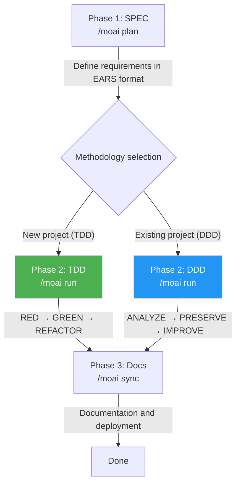

MoAI-ADK is an Agentic Development Kit that wraps Claude Code around three things: **cost (tokenomics)**, **self-improvement (agentic loop engineering)**, and **quality control (agentic harness)**. It delivers the same quality of code for fewer tokens. Declare a completion condition and the loop works on its own, and the observations piled up along the way become raw material for harness learning. "Done" is judged by evidence, through the SPEC 3-phase lifecycle and the TRUST 5 gates. Model selection, reasoning depth, and context usage are all managed by the system. It is written in Go and ships as a single binary, so it runs immediately with no dependencies.

This page introduces what MoAI-ADK is and why it is shaped the way it is, in one flow. It covers which problem each of the three pillars answers, where terms like SPEC · TRUST 5 · CG mode stand inside that picture, and where to go when starting out. Installation and running your first project are left to the [Installation](/en/getting-started/installation) and [Quick Start](/en/getting-started/quickstart) pages — here we focus on the "why."


## Notation

In this documentation, a code block's prefix indicates the execution environment:

- Commands you type in the **Claude Code** chat
  ```bash
  > /moai plan "feature description"
  ```

- Commands you type in the **terminal**
  ```bash
  $ moai init my-project
  ```

## Three core values

MoAI-ADK is an Agentic Development Kit that wraps Claude Code around **three pillars** — cost · self-improvement · quality control. Push only one and the others collapse. Cut only cost and quality turns harsh; raise only quality gates and the same mistakes repeat every session; run only autonomous loops and a single billing run burns through your limit. The three pillars hold each other up.

### Cost — tokenomics

The same quality for fewer tokens. Cost is decided not by unit price but by **model assignment** — in the DeepSWE benchmark, Opus at its lowest reasoning outscored Sonnet at its highest while costing one sixteenth as much. The 3-tier model policy · CG mode · prompt caching · Token Circuit Breaker put the budget under the system's management.

### Self-improvement — agentic loop engineering

The harness gets smarter the more it runs. Declare a completion condition and the loop works on its own (`/moai goal` · `/moai loop`), while observations pile up into rules so the next session does not repeat the same mistakes.

### Quality control — agentic harness

"Done" is judged by evidence. The SPEC 3-phase lifecycle + TRUST 5 gates + worktree isolation block rework (the biggest token waste), and planning is separated from auditing so the one who built it never inspects it.

Each pillar is covered in detail in the [Core Concepts](/en/core-concepts/) section.

## What got more convenient in v3.1

- **`/moai goal`** — declare a completion condition in one line and the session runs autonomously.
- **Kanban Mode** — runs multiple sessions at once.
- **BAS Navigator** — auto-syncs the 3-tier codemap.
- **manager-lead** — coordinates large-scale work: Tier L milestone fan-out inside a SPEC, plus kanban and factory lead-session dispatch.
- **multi-model audit** — cross-validates with multiple models to catch bias.
- **autonomy tier** — dials the autonomy level so things run safely.
- **profile matrix** — assigns models across 12 agents × 3 profiles.

## Core concepts

MoAI-ADK follows the **SPEC-based TDD/DDD** methodology and guarantees code quality with the **TRUST 5** quality framework.

### What is a SPEC? (made easy)

A **SPEC** (Specification) is "keeping your conversation with the AI as a document."

The biggest problem with **vibe coding** is **context loss**:

- An hour of discussion with the AI **disappears** when the session drops
- To continue the next day, you have to **explain everything from scratch**
- The more complex the feature, the more **the result diverges from your intent**

**A SPEC solves this problem:**

- **Saves requirements as files** for permanent preservation
- Even if the session drops, reading the SPEC is enough to **resume work**
- Defines things clearly and **without ambiguity** in the EARS format
- No repeated explanations, so **tokens are saved** too


**One-line summary:** the "JWT auth + 1-hour expiry + refresh token" you discussed with the AI yesterday does not need re-explaining today — start implementation right away with the single line `/moai run SPEC-AUTH-001`!


### Methodology and quality criteria

One of two implementation methodologies is assigned automatically based on the project state, and the result is verified against a shared set of quality criteria.

| Name | When it applies | Details |
|------|-----------|--------|
| **TDD** (Test-Driven Development) | New project, or test coverage of 10% or more (default) | [SPEC-Based Development](/en/core-concepts/spec-based-dev) |
| **DDD** (Domain-Driven Development) | Existing project with test coverage under 10% | [DDD](/en/core-concepts/ddd) |
| **TRUST 5** | Applied to every code change, whichever methodology is in use | [TRUST 5](/en/core-concepts/trust-5) |


MoAI-ADK v2.5.0+ picks exactly one of TDD and DDD. The hybrid mode was removed for clarity and consistency. The methodology is chosen automatically at `moai init` and can be changed in `development_mode` in `.moai/config/sections/quality.yaml`.


## Go Edition characteristics

MoAI-ADK fully rewrote the Python Edition in Go to maximize performance and efficiency.

| Item | Python Edition | Go Edition |
|------|---------------|------------|
| Distribution | pip + venv + dependencies | **Single binary**, no dependencies |
| Startup time | ~800ms interpreter boot | **~5ms** native execution |
| Concurrency | asyncio / threading | **Native goroutines** |
| Type safety | Runtime (mypy optional) | **Enforced at compile time** |
| Cross-platform | Requires the Python runtime | **Prebuilt binaries** (macOS, Linux, Windows) |

### Key numbers (as of v3.0)

- **11** agent catalog (10 MoAI-custom + 1 Anthropic built-in `Explore`)
- **31** skills (template-managed)
- **36** terminal CLI commands · **16** `/moai` slash subcommands
- **16** programming languages supported
- A codebase developed on the basis of **543** SPEC documents

## System requirements

| Platform | Supported environment | Notes |
|--------|----------|------|
| macOS | Terminal, iTerm2 | Full support |
| Linux | Bash, Zsh | Full support |
| Windows | **WSL (recommended)**, PowerShell 7.x+ | Native cmd.exe not supported |

**Requirements:**
- **Git** must be installed on all platforms
- **Windows users**: WSL (Windows Subsystem for Linux) is recommended for the smoothest experience

## Key features

### Agent catalog (11)

The MoAI orchestrator does not implement directly; it delegates work to 11 specialized agents. Planning and auditing are separated — the one who made it does not inspect it.

| Category | Count | Main agents |
|----------|------|--------------|
| **Manager** | 5 | manager-spec, manager-develop, manager-docs, manager-git, manager-design |
| **Evaluator** | 2 | plan-auditor, sync-auditor |
| **Builder** | 1 | builder-harness |
| **Advisor** | 1 | super-advisor (high-reasoning consultation) |
| **Specialist** | 1 | e2e-tester (web/mobile/desktop E2E test execution) |
| **Built-in** | 1 | Explore (Anthropic built-in, read-only code analysis) |

### Model policy (tokenomics)

MoAI-ADK assigns each agent the optimal model and reasoning depth. The goal is to pull quality as high as possible within your plan's usage limits. So instead of switching to a weaker model class, it tunes only each agent's reasoning depth within the same Opus — because on long-horizon agentic work, a weaker model burns more steps and the per-task cost actually rises.

| Tier | Characteristics |
|------|------|
| **high** | Highest quality — `max` reasoning depth on the two agents with the lowest call frequency |
| **medium** (default) | Balance of quality and cost |
| **low** | Lowest cost per task — agentic agents drop to Opus `low` effort, and Sonnet appears only on single-shot rows |


The default tier is **medium**. Changing the tier does not change the model class — only each agent's Opus reasoning depth moves. `low` keeps every agentic row on Opus `low` effort and uses Sonnet only on single-shot rows; `high` raises the two lowest-call-frequency agents to `max` effort. Set it with the `--model-policy` flag or in the initialization wizard.


### Execution modes and orchestration

Natural-language requests go through **Analyze-First** routing. Whatever language you request in, intent is analyzed first and connected to the right workflow. Depending on task complexity, the orchestrator chooses sequential sub-agents (default), parallel sub-agent fan-out, or dynamic workflows.

```bash
/moai run SPEC-AUTH-001           # complexity-based auto selection
/moai run SPEC-AUTH-001 --solo    # force sequential sub-agents
```


**v3.0 change**: the former Agent Teams static-orchestration layer was retired. Forcing `--team` falls back to sub-agent mode. Claude Code's native teammate runtime (the tmux split panes of `moai cg`) is preserved.


### SPEC-First workflow

MoAI-ADK follows a 3-phase development workflow. The run-phase methodology is selected automatically based on the project state:


```mermaid
flowchart TD
    A["Phase 1: SPEC<br/>/moai plan"] -->|"Define requirements in EARS format"| B{"Methodology selection"}
    B -->|"New project (TDD)"| C["Phase 2: TDD<br/>/moai run"]
    B -->|"Existing project (DDD)"| D["Phase 2: DDD<br/>/moai run"]
    C -->|"RED → GREEN → REFACTOR"| E["Phase 3: Docs<br/>/moai sync"]
    D -->|"ANALYZE → PRESERVE → IMPROVE"| E
    E -->|"Documentation and deployment"| F["Done"]

    style C fill:#4CAF50,color:#fff
    style D fill:#2196F3,color:#fff
```

### Agentic loops

Declare a completion condition and the loop works on its own:

```text
/moai goal "until all tests pass and lint is clean"   # condition-declared loop
/moai loop                                            # diagnostic-based iterative fix (loop_prevention default 100)
/moai fix                                             # single-pass auto-fix
```

`/moai loop` is a preset on top of the goal engine. It keeps fixing until the issue queue found by the diagnostic tools is drained.

Two separate settings bound iteration at two separate layers. `workflow.loop_prevention.max_iterations` (default **100**) is the per-task diagnostic-fix loop limit, while `workflow.agentic_loop.max_iterations` (default **10**) is the completion-loop ceiling over the whole pipeline. They are distinct settings, so different values are normal, not a contradiction.

### Recommended workflow chains

**New feature development:**
```
/moai plan → /moai run SPEC-XXX → /moai sync SPEC-XXX
```

**Bug fixing:**
```
/moai fix (or /moai loop) → /moai review → /moai sync
```

**Refactoring:**
```
/moai plan → /moai clean → /moai run SPEC-XXX → /moai review → /moai codemaps
```

**Documentation updates:**
```
/moai codemaps → /moai sync
```

## Multilingual support

MoAI-ADK supports the following 4 languages:

- **Korean**
- **English**
- **Japanese**
- **Chinese**

Choose your preferred language in the installation wizard, or change it directly in the config file.

## LSP integration

**LSP** (Language Server Protocol) is a standard communication protocol between code editors and language tools. It detects code errors, type errors, and lint results in real time and reports them immediately.

**Ralph-Loop Style** is an autonomous workflow that uses LSP diagnostics as a feedback loop. When a quality issue is detected, it automatically invokes a fix agent and iterates until the quality criteria are met.

MoAI-ADK's Ralph-Loop Style LSP integration works like this:

- **LSP-based completion auto-detection**: monitors code quality state in real time
- **Real-time regression detection**: immediately detects the impact of changes on existing functionality
- **Automatic completion condition**: automatically marks work complete at 0 errors, 0 type errors, and 85% coverage


Ralph-Loop Style LSP integration automates the quality gates of the development workflow, keeping code quality high without a person touching it each time.


## Save tokens with CG mode (50-70%)


**A practical tool for cost (tokenomics):** z.ai GLM is an AI backend fully compatible with Claude Code. In **CG mode** (`moai cg`, tmux required), a Claude leader handles orchestration, architecture decisions, and code review, while GLM teammates work in parallel on implementation, tests, and documentation — saving **50-70% of tokens** on implementation-heavy work. For work that needs deep reasoning, like architecture design or security review, use Claude only (`moai cc`).

```bash
moai cc            # Claude only
moai glm           # GLM only
moai cg            # CG hybrid (Claude leader + GLM teammates, tmux required)
```

If you do not have a GLM account, sign up at [z.ai signup (extra 10% discount)](https://z.ai/subscribe?ic=1NDV03BGWU). Rewards through the signup link go to **MoAI open-source development**. For the detailed architecture and model policy, see the [Multi-LLM](/en/multi-llm/) section.


## Self-improvement — the loop works on its own and the harness learns


**A practical tool for self-improvement (agentic loop engineering):** declare a completion condition and the session works on its own until it is met. `/moai goal "<condition>"` is a condition-declared autonomous loop, `/moai loop` keeps fixing until the issue queue found by LSP diagnostics · AST-grep · linters is drained (pipeline completion loop, default 10 — `agentic_loop.max_iterations`), and `/moai fix` is a single-pass auto-fix. The observations the loop leaves behind — user corrections, failure patterns, routing decisions — accumulate into harness guidance along the 4-tier learning ladder (observation → heuristic → rule → auto-update, under the user-approval gate). That is why the next session does not repeat the previous session's mistakes.


## Getting started

To start with MoAI-ADK, follow this order:

1. **[Installation](/en/getting-started/installation)** - Install MoAI-ADK on your system
2. **[Initial Setup](/en/getting-started/init-wizard)** - Run the interactive setup wizard
3. **[Quick Start](/en/getting-started/quickstart)** - Create your first project
4. **[Core Concepts](/en/core-concepts/what-is-moai-adk)** - Understand MoAI-ADK in depth

## Key advantages

| Advantage | Description |
|------|------|
| **Quality assurance** | Consistent quality maintained by the TRUST 5 framework |
| **Token efficiency** | Cost managed by the system via model policy + CG mode + Token Circuit Breaker |
| **Higher productivity** | Shorter development time through AI-agent automation |
| **Extensible** | Flexible extension with a modular architecture and the harness builder |
| **Multilingual** | 4 languages supported |

## Additional resources

- [GitHub repository](https://github.com/modu-ai/moai-adk)
- [Documentation site](https://adk.mo.ai.kr)
- [GitHub Issues](https://github.com/modu-ai/moai-adk/issues)

---

## Next steps

Learn how to install MoAI-ADK in the [Installation guide](/en/getting-started/installation).
