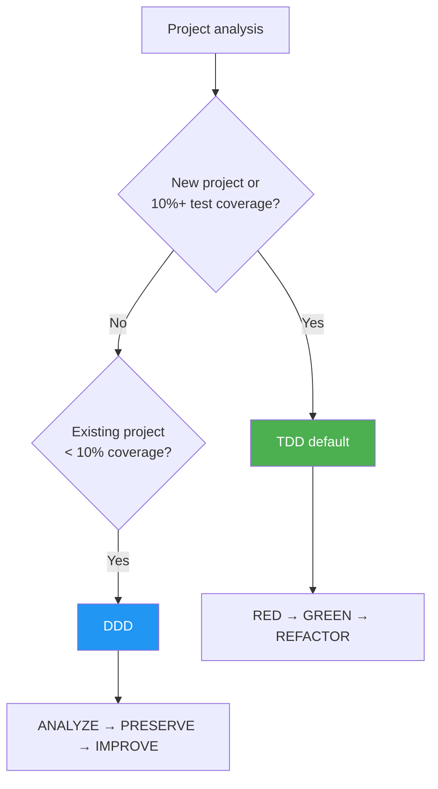
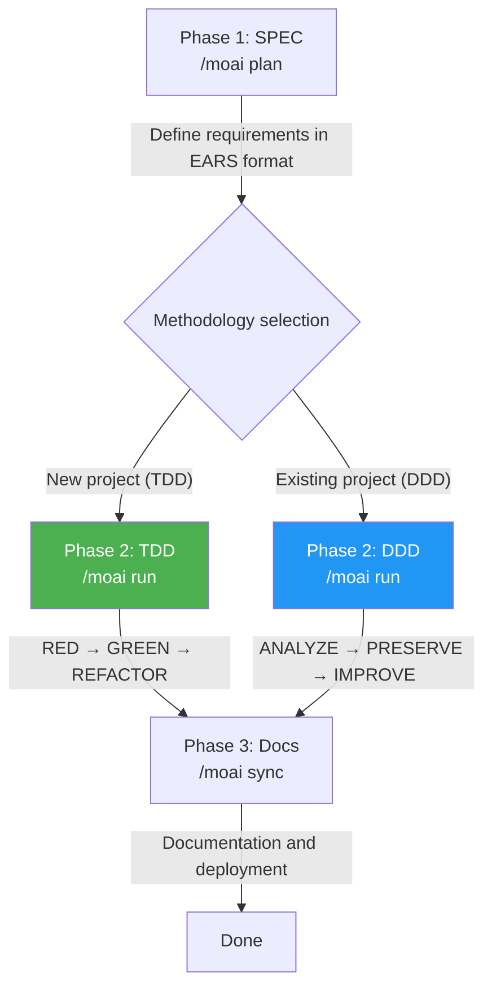

MoAI-ADK is an Agentic Development Kit aimed at **Tokenomics** (Token Economics). The same quality of code with fewer tokens, higher quality for the same tokens — the system manages model selection, reasoning depth, and context usage. As a single binary written in Go, it runs immediately with no dependencies.


## Notation

In this documentation, a code block's prefix indicates the execution environment:

- Commands you type in the **Claude Code** chat
  ```bash
  > /moai plan "feature description"
  ```

- Commands you type in the **Terminal**
  ```bash
  moai init my-project
  ```

## Core value — three pillars

MoAI-ADK v3.0's value is summarized in three pillars.

| Pillar | One-line description | Representative tools |
|------|-----------|----------|
| **Tokenomics** | Intelligent resource allocation that maximizes quality per cost | 3-tier model policy · CG mode · Token Circuit Breaker |
| **Agentic loop engineering** | Loops work on their own, observations accumulate, the harness learns | `/moai goal` · `/moai loop` · Analyze-First routing |
| **Agentic harness** | Design an environment for agents to work in, instead of writing code directly | 11 agents · SPEC 3-phase · TRUST 5 |

Each pillar is covered in detail in the [Core Concepts](/en/core-concepts/) section. This document looks at only as much as you need to get started.

## Core concepts

MoAI-ADK is based on the **SPEC-based TDD/DDD** methodology, and it ensures code quality through the **TRUST 5** quality framework.

### What is a SPEC? (made easy)

A **SPEC** (Specification) is "leaving your conversation with the AI as a document."

The biggest problem with **vibe coding** (Vibe Coding) is **context loss**:

- What you discussed with the AI for an hour **disappears** when the session ends
- To continue the next day, you have to **explain everything from scratch**
- The more complex the feature, the more **the result differs from your intent**

**A SPEC solves this problem:**

- **Saves requirements as a file** for permanent preservation
- Even if the session ends, you can **resume work** just by reading the SPEC
- Defines things clearly, **without ambiguity**, in the EARS format
- Since you do not repeat the same explanation, you **save tokens** too


**One-line summary:** Yesterday's "JWT auth + 1-hour expiry + refresh token" that you discussed with the AI does not need re-explaining today — start implementation right away with the single line `/moai run SPEC-AUTH-001`!


### What is TDD? (made easy)

**TDD** (Test-Driven Development) is "a method of writing tests first, then developing."

Comparing it to writing exam questions:

- **You write the grading criteria (tests) first** — with no feature yet, they naturally fail
- **You write the minimum code that passes the criteria** — just as much as needed
- **You polish it into better code** — improving while keeping the tests passing

MoAI-ADK automates this process with the **RED-GREEN-REFACTOR** cycle:

| Phase | Meaning | What it does |
|------|------|--------|
| **RED** | Fail | Write a test for a not-yet-existing feature first |
| **GREEN** | Pass | Write the minimum code that passes the test |
| **REFACTOR** | Improve | Improve code quality while keeping the test passing |

### What is DDD? (made easy)

**DDD** (Domain-Driven Development) is "a safe way to improve code."

Comparing it to home remodeling:

- You improve **one room at a time, without demolishing the existing house**
- You **record the current state before remodeling** (= characterization tests)
- You **work one room at a time and verify each time** (= incremental improvement)

MoAI-ADK automates this process with the **ANALYZE-PRESERVE-IMPROVE** cycle:

| Phase | Meaning | What it does |
|------|------|--------|
| **ANALYZE** | Analyze | Understand the current code structure and issues |
| **PRESERVE** | Preserve | Record current behavior with tests (a safety net) |
| **IMPROVE** | Improve | Improve little by little while keeping tests passing |

### Choosing a development methodology

MoAI-ADK automatically selects the optimal development methodology based on the project state.


```mermaid
flowchart TD
    A["Project analysis"] --> B{"New project or<br/>10%+ test coverage?"}
    B -->|"Yes"| C["TDD default"]
    B -->|"No"| D{"Existing project<br/>< 10% coverage?"}
    D -->|"Yes"| E["DDD"]
    C --> F["RED → GREEN → REFACTOR"]
    E --> G["ANALYZE → PRESERVE → IMPROVE"]

    style C fill:#4CAF50,color:#fff
    style E fill:#2196F3,color:#fff
```

| Methodology | Target | Cycle |
|--------|------|--------|
| **TDD** | New project or 10%+ coverage | RED → GREEN → REFACTOR |
| **DDD** | Existing project under 10% coverage | ANALYZE → PRESERVE → IMPROVE |


MoAI-ADK v2.5.0+ uses binary methodology selection (TDD or DDD only). For clarity and consistency, the hybrid mode was removed. The methodology is selected automatically at `moai init` and can be changed in `development_mode` in `.moai/config/sections/quality.yaml`.


### TRUST 5 quality framework

TRUST 5 is based on the following 5 core principles:

| Principle | Description |
|------|------|
| **T**ested | 85% coverage, characterization tests, behavior preservation |
| **R**eadable | Clear naming conventions, consistent formatting |
| **U**nified | Unified style guide, automatic formatting |
| **S**ecured | OWASP compliance, security validation, vulnerability analysis |
| **T**rackable | Structured commits, change history tracking |

## Go Edition characteristics

MoAI-ADK fully rewrote the Python Edition in Go to maximize performance and efficiency.

| Item | Python Edition | Go Edition |
|------|---------------|------------|
| Distribution | pip + venv + dependencies | **Single binary**, no dependencies |
| Startup time | ~800ms interpreter boot | **~5ms** native execution |
| Concurrency | asyncio / threading | **Native goroutines** |
| Type safety | Runtime (mypy optional) | **Enforced at compile time** |
| Cross-platform | Requires the Python runtime | **Prebuilt binaries** (macOS, Linux, Windows) |

### Key numbers (as of v3.0)

- **11** agent catalog (10 MoAI-custom + 1 Anthropic built-in `Explore`)
- **27** skills (template-managed)
- **36** CLI commands · **15** `/moai` subcommands
- **16** programming languages supported
- A codebase developed on the basis of **504** SPEC documents

## System requirements

| Platform | Supported environment | Notes |
|--------|----------|------|
| macOS | Terminal, iTerm2 | Full support |
| Linux | Bash, Zsh | Full support |
| Windows | **WSL (recommended)**, PowerShell 7.x+ | Native cmd.exe not supported |

**Requirements:**
- **Git** must be installed on all platforms
- **Windows users**: WSL (Windows Subsystem for Linux) is recommended for the best experience

## Key features

### Agent catalog (11)

The MoAI orchestrator does not implement directly; it delegates work to 11 specialized agents. Planning and auditing are separated — the one who made it does not inspect it.

| Category | Count | Main agents |
|----------|------|--------------|
| **Manager** | 5 | manager-spec, manager-develop, manager-docs, manager-git, manager-design |
| **Evaluator** | 2 | plan-auditor, sync-auditor |
| **Builder** | 1 | builder-harness |
| **Advisor** | 1 | super-advisor (high-reasoning consultation) |
| **Specialist** | 1 | e2e-tester (web/mobile/desktop E2E test execution) |
| **Built-in** | 1 | Explore (Anthropic built-in, read-only code analysis) |

### Model policy (Tokenomics)

MoAI-ADK assigns the optimal AI model to each agent to match your Claude Code subscription plan. It maximizes quality within the plan's usage limits — assigning higher-tier models to reasoning-heavy phases like planning and auditing, and lightweight models to repetitive work.

| Tier | Characteristics |
|------|------|
| **max** | Highest quality — Opus assigned to planning and auditing, maximum reasoning depth |
| **medium** (default) | Balance of quality and cost |
| **low** | Economical — Sonnet-centric allocation |


The default tier is **medium**. The `low` tier is designed so the whole workflow works without higher-tier models (Opus). The `max` tier assigns Opus to core phases (planning, auditing) and lightweight models to general work. Set it via the `--model-policy` flag or the initialization wizard.


### Execution modes and orchestration

Natural-language requests go through **Analyze-First** routing — whatever language you request in, it analyzes intent first and connects to the right workflow. The orchestrator chooses one of sequential sub-agents (default), parallel sub-agent fan-out, or dynamic workflows, depending on task complexity.

```bash
/moai run SPEC-AUTH-001           # complexity-based auto selection
/moai run SPEC-AUTH-001 --solo    # force sequential sub-agents
```


**v3.0 change**: The former Agent Teams static-orchestration layer was retired. Forcing `--team` falls back to sub-agent mode. Claude Code's native teammate runtime — the tmux split panes of `moai cg` — is preserved.


### SPEC-First workflow

MoAI-ADK follows a 3-phase development workflow. The run-phase methodology is selected automatically based on the project state:


```mermaid
flowchart TD
    A["Phase 1: SPEC<br/>/moai plan"] -->|"Define requirements in EARS format"| B{"Methodology selection"}
    B -->|"New project (TDD)"| C["Phase 2: TDD<br/>/moai run"]
    B -->|"Existing project (DDD)"| D["Phase 2: DDD<br/>/moai run"]
    C -->|"RED → GREEN → REFACTOR"| E["Phase 3: Docs<br/>/moai sync"]
    D -->|"ANALYZE → PRESERVE → IMPROVE"| E
    E -->|"Documentation and deployment"| F["Done"]

    style C fill:#4CAF50,color:#fff
    style D fill:#2196F3,color:#fff
```

### Agentic loops

Declare a completion condition, and the loop works on its own:

```text
/moai goal "until all tests pass and lint is clean"   # condition-declared loop
/moai loop                                            # diagnostic-based iterative fix (up to 100)
/moai fix                                             # single-pass auto-fix
```

`/moai loop` is a preset on top of the goal engine — it iterates until the issue queue found by the diagnostic tools is drained.

### Recommended workflow chains

**New feature development:**
```
/moai plan → /moai run SPEC-XXX → /moai sync SPEC-XXX
```

**Bug fixing:**
```
/moai fix (or /moai loop) → /moai review → /moai sync
```

**Refactoring:**
```
/moai plan → /moai clean → /moai run SPEC-XXX → /moai review → /moai codemaps
```

**Documentation updates:**
```
/moai codemaps → /moai sync
```

## Multilingual support

MoAI-ADK supports the following 4 languages:

- **Korean** (한국어)
- **English**
- **Japanese** (日本語)
- **Chinese** (中文)

Choose your preferred language in the setup wizard, or change it directly in the config file.

## LSP integration

**LSP** (Language Server Protocol) is a standard communication protocol between code editors and language tools. It detects code errors, type errors, and lint results in real time to provide immediate feedback.

**Ralph-Loop Style** is an autonomous workflow that uses LSP diagnostics as a feedback loop. When a quality issue is detected, it automatically invokes a fix agent and iterates until the quality criteria are met.

MoAI-ADK provides an autonomous workflow through Ralph-Loop Style LSP integration:

- **LSP-based automatic completion detection**: monitors code quality state in real time
- **Real-time regression detection**: immediately detects the impact of changes on existing functionality
- **Automatic completion condition**: automatically marks complete when 0 errors, 0 type errors, and 85% coverage are achieved


Ralph-Loop Style LSP integration automates the quality gates of the development workflow, letting you maintain high code quality without manual intervention.


## Save tokens with GLM (50–70%) {#save-tokens-with-glm-5070}

GLM is an AI model fully compatible with Claude Code. Combining a Claude leader with GLM teammates in **CG mode** can **save 50–70% of tokens** on implementation work — a representative hands-on tool of the Tokenomics pillar.

### CG mode: the Claude + GLM hybrid

In CG mode, Claude orchestrates the whole workflow while implementation work is handled in parallel by lower-cost GLM teammates.

| Role | Model | Responsibility |
|------|------|---------|
| **Leader** | Claude | Orchestration, architecture decisions, code review |
| **Teammates** | GLM | Code implementation, test writing, documentation |

| Work type | Recommended mode | Savings |
|----------|----------|---------|
| Implementation-heavy SPEC (`/moai run`) | CG mode | **50–70% savings** |
| Code generation, tests, documentation | CG mode | **50–70% savings** |
| Architecture design, security review | Claude only | Needs deep reasoning |

### GLM switch commands

```bash
# Switch to the GLM backend (GLM only)
moai glm

# CG mode (Claude leader + GLM teammates, tmux required)
moai cg

# Return to the Claude backend
moai cc
```


If you do not have a GLM account, sign up at [z.ai signup (extra 10% discount)](https://z.ai/subscribe?ic=1NDV03BGWU). Rewards through the signup link are used for **MoAI open-source development**.


## Getting started

To begin your MoAI-ADK journey, follow these steps:

1. **[Installation](/en/getting-started/installation)** - Install MoAI-ADK on your system
2. **[Initial Setup](/en/getting-started/init-wizard)** - Run the interactive setup wizard
3. **[Quick Start](/en/getting-started/quickstart)** - Create your first project
4. **[Core Concepts](/en/core-concepts/what-is-moai-adk)** - A deeper understanding of MoAI-ADK

## Key advantages

| Advantage | Description |
|------|------|
| **Quality assurance** | Maintain consistent quality with the TRUST 5 framework |
| **Token efficiency** | The system manages cost via model policy + CG mode + Token Circuit Breaker |
| **Higher productivity** | Shorten development time with AI-agent automation |
| **Extensible** | Flexible extension with a modular architecture and the harness builder |
| **Multilingual** | Supports 4 languages |

## Additional resources

- [GitHub repository](https://github.com/modu-ai/moai-adk)
- [Documentation site](https://adk.mo.ai.kr)
- [Community forum](https://github.com/modu-ai/moai-adk/discussions)

---

## Next steps

Learn how to install MoAI-ADK in the [Installation guide](./installation).
