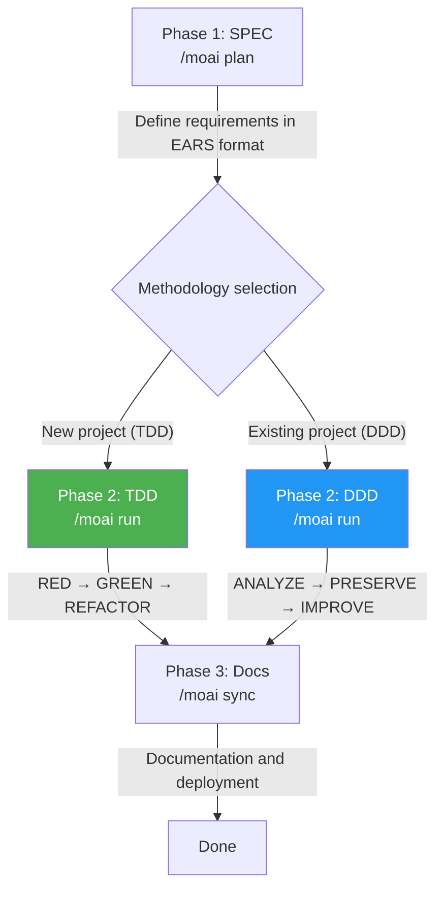

MoAI-ADK is an Agentic Development Kit built around three core values that augment Claude Code: **cost** (Tokenomics), **self-improvement** (Agentic Loop Engineering), and **quality control** (Agentic Harness). It delivers the same code quality for fewer tokens. Declare a completion condition and the loop works on its own, accumulating observations the harness learns from. SPEC 3-phase and TRUST 5 gates judge 'done' by evidence. Model selection, reasoning depth, and context usage are all managed by the system. It ships as a single Go binary with no dependencies, so it runs immediately.


## Notation

In this documentation, a code block's prefix indicates the execution environment:

- Commands you type in the **Claude Code** chat
  ```bash
  > /moai plan "feature description"
  ```

- Commands you type in the **Terminal**
  ```bash
  moai init my-project
  ```

## Three core values

MoAI-ADK v3.0's value is summarized in three core values.

| Core value | One-line description | Representative tools |
|------|-----------|----------|
| **Tokenomics** | Intelligent resource allocation that maximizes quality per cost | 3-tier model policy · CG mode · Token Circuit Breaker |
| **Agentic loop engineering** | Loops work on their own, observations accumulate, the harness learns | `/moai goal` · `/moai loop` · Analyze-First routing |
| **Agentic harness** | Design an environment for agents to work in, instead of writing code directly | 11 agents · SPEC 3-phase · TRUST 5 |

Each core value is covered in detail in the [Core Concepts](/en/core-concepts/) section. This document looks at only as much as you need to get started.

## What got more convenient in v3.1

- **`/moai goal`** — declare a completion condition in one line and the session runs autonomously.
- **Factory Mode** — runs multiple sessions at once.
- **BAS Navigator** — auto-syncs the 3-tier codemap.
- **manager-lead** — coordinates large-scale work via Tier L parallel fan-out.
- **multi-model audit** — cross-validates with multiple models to catch bias.
- **autonomy tier** — dials the autonomy level so things run safely.
- **profile matrix** — assigns models across 12 agents × 3 profiles.

## Core concepts

MoAI-ADK is based on the **SPEC-based TDD/DDD** methodology, and it ensures code quality through the **TRUST 5** quality framework.

### What is a SPEC? (made easy)

A **SPEC** (Specification) is "leaving your conversation with the AI as a document."

The biggest problem with **vibe coding** (Vibe Coding) is **context loss**:

- What you discussed with the AI for an hour **disappears** when the session ends
- To continue the next day, you have to **explain everything from scratch**
- The more complex the feature, the more **the result differs from your intent**

**A SPEC solves this problem:**

- **Saves requirements as a file** for permanent preservation
- Even if the session ends, you can **resume work** just by reading the SPEC
- Defines things clearly, **without ambiguity**, in the EARS format
- Since you do not repeat the same explanation, you **save tokens** too


**One-line summary:** Yesterday's "JWT auth + 1-hour expiry + refresh token" that you discussed with the AI does not need re-explaining today — start implementation right away with the single line `/moai run SPEC-AUTH-001`!


### Methodology and quality criteria

One of two implementation methodologies is assigned automatically based on the project state, and the result is verified against a shared set of quality criteria.

| Name | When it applies | Details |
|------|-----------------|---------|
| **TDD** (Test-Driven Development) | New project, or test coverage of 10% or more (default) | [SPEC-Based Development](/en/core-concepts/spec-based-dev) |
| **DDD** (Domain-Driven Development) | Existing project with test coverage under 10% | [DDD](/en/core-concepts/ddd) |
| **TRUST 5** | Applied to every code change, whichever methodology is in use | [TRUST 5](/en/core-concepts/trust-5) |


MoAI-ADK v2.5.0+ uses binary methodology selection (TDD or DDD only). For clarity and consistency, the hybrid mode was removed. The methodology is selected automatically at `moai init` and can be changed in `development_mode` in `.moai/config/sections/quality.yaml`.


## Go Edition characteristics

MoAI-ADK fully rewrote the Python Edition in Go to maximize performance and efficiency.

| Item | Python Edition | Go Edition |
|------|---------------|------------|
| Distribution | pip + venv + dependencies | **Single binary**, no dependencies |
| Startup time | ~800ms interpreter boot | **~5ms** native execution |
| Concurrency | asyncio / threading | **Native goroutines** |
| Type safety | Runtime (mypy optional) | **Enforced at compile time** |
| Cross-platform | Requires the Python runtime | **Prebuilt binaries** (macOS, Linux, Windows) |

### Key numbers (as of v3.0)

- **11** agent catalog (10 MoAI-custom + 1 Anthropic built-in `Explore`)
- **31** skills (template-managed)
- **36** terminal CLI commands · **16** `/moai` slash subcommands
- **16** programming languages supported
- A codebase developed on the basis of **543** SPEC documents

## System requirements

| Platform | Supported environment | Notes |
|--------|----------|------|
| macOS | Terminal, iTerm2 | Full support |
| Linux | Bash, Zsh | Full support |
| Windows | **WSL (recommended)**, PowerShell 7.x+ | Native cmd.exe not supported |

**Requirements:**
- **Git** must be installed on all platforms
- **Windows users**: WSL (Windows Subsystem for Linux) is recommended for the best experience

## Key features

### Agent catalog (11)

The MoAI orchestrator does not implement directly; it delegates work to 11 specialized agents. Planning and auditing are separated — the one who made it does not inspect it.

| Category | Count | Main agents |
|----------|------|--------------|
| **Manager** | 5 | manager-spec, manager-develop, manager-docs, manager-git, manager-design |
| **Evaluator** | 2 | plan-auditor, sync-auditor |
| **Builder** | 1 | builder-harness |
| **Advisor** | 1 | super-advisor (high-reasoning consultation) |
| **Specialist** | 1 | e2e-tester (web/mobile/desktop E2E test execution) |
| **Built-in** | 1 | Explore (Anthropic built-in, read-only code analysis) |

### Model policy (Tokenomics)

MoAI-ADK assigns the optimal AI model to each agent to match your Claude Code subscription plan. It maximizes quality within the plan's usage limits — assigning higher-tier models to reasoning-heavy phases like planning and auditing, and lightweight models to repetitive work.

| Tier | Characteristics |
|------|------|
| **high** | Highest quality — `max` reasoning depth on the two rarest-invocation agents |
| **medium** (default) | Balance of quality and cost |
| **low** | Lowest cost per task — agentic agents drop to Opus `low` effort; Sonnet only on single-shot rows |


The default tier is **medium**. The tier moves each agent along the Opus reasoning-depth ladder rather than swapping in a weaker model class — `low` keeps Opus on every agentic row at `low` effort and falls back to Sonnet only on single-shot rows, while `high` raises the two rarest-invocation agents to `max` effort. Set it via the `--model-policy` flag or the initialization wizard.


### Execution modes and orchestration

Natural-language requests go through **Analyze-First** routing — whatever language you request in, it analyzes intent first and connects to the right workflow. The orchestrator chooses one of sequential sub-agents (default), parallel sub-agent fan-out, or dynamic workflows, depending on task complexity.

```bash
/moai run SPEC-AUTH-001           # complexity-based auto selection
/moai run SPEC-AUTH-001 --solo    # force sequential sub-agents
```


**v3.0 change**: The former Agent Teams static-orchestration layer was retired. Forcing `--team` falls back to sub-agent mode. Claude Code's native teammate runtime — the tmux split panes of `moai cg` — is preserved.


### SPEC-First workflow

MoAI-ADK follows a 3-phase development workflow. The run-phase methodology is selected automatically based on the project state:


```mermaid
flowchart TD
    A["Phase 1: SPEC<br/>/moai plan"] -->|"Define requirements in EARS format"| B{"Methodology selection"}
    B -->|"New project (TDD)"| C["Phase 2: TDD<br/>/moai run"]
    B -->|"Existing project (DDD)"| D["Phase 2: DDD<br/>/moai run"]
    C -->|"RED → GREEN → REFACTOR"| E["Phase 3: Docs<br/>/moai sync"]
    D -->|"ANALYZE → PRESERVE → IMPROVE"| E
    E -->|"Documentation and deployment"| F["Done"]

    style C fill:#4CAF50,color:#fff
    style D fill:#2196F3,color:#fff
```

### Agentic loops

Declare a completion condition, and the loop works on its own:

```text
/moai goal "until all tests pass and lint is clean"   # condition-declared loop
/moai loop                                            # diagnostic-based iterative fix (loop_prevention default 100)
/moai fix                                             # single-pass auto-fix
```

`/moai loop` is a preset on top of the goal engine — it iterates until the issue queue found by the diagnostic tools is drained.

Two distinct settings bound iteration at two different levels. `workflow.loop_prevention.max_iterations` (default **100**) bounds the per-operation diagnostic fix loop, while `workflow.agentic_loop.max_iterations` (default **10**) is the pipeline-level completion-loop ceiling. They are separate settings, so different values are expected rather than contradictory.

### Recommended workflow chains

**New feature development:**
```
/moai plan → /moai run SPEC-XXX → /moai sync SPEC-XXX
```

**Bug fixing:**
```
/moai fix (or /moai loop) → /moai review → /moai sync
```

**Refactoring:**
```
/moai plan → /moai clean → /moai run SPEC-XXX → /moai review → /moai codemaps
```

**Documentation updates:**
```
/moai codemaps → /moai sync
```

## Multilingual support

MoAI-ADK supports the following 4 languages:

- **Korean** (한국어)
- **English**
- **Japanese** (日本語)
- **Chinese** (中文)

Choose your preferred language in the setup wizard, or change it directly in the config file.

## LSP integration

**LSP** (Language Server Protocol) is a standard communication protocol between code editors and language tools. It detects code errors, type errors, and lint results in real time to provide immediate feedback.

**Ralph-Loop Style** is an autonomous workflow that uses LSP diagnostics as a feedback loop. When a quality issue is detected, it automatically invokes a fix agent and iterates until the quality criteria are met.

MoAI-ADK provides an autonomous workflow through Ralph-Loop Style LSP integration:

- **LSP-based automatic completion detection**: monitors code quality state in real time
- **Real-time regression detection**: immediately detects the impact of changes on existing functionality
- **Automatic completion condition**: automatically marks complete when 0 errors, 0 type errors, and 85% coverage are achieved


Ralph-Loop Style LSP integration automates the quality gates of the development workflow, letting you maintain high code quality without manual intervention.


## Save tokens with GLM (50–70%) {#save-tokens-with-glm-5070}


**A practical tool for cost (Tokenomics):** z.ai GLM is an AI backend fully compatible with Claude Code. In **CG mode** (`moai cg`, tmux required), a Claude leader handles orchestration, architecture decisions, and code review, while GLM teammates work in parallel on implementation, tests, and documentation — saving **50–70% of tokens** on implementation-heavy work. For work that needs deep reasoning, like architecture design or security review, use Claude only (`moai cc`).

```bash
moai cc            # Claude only
moai glm           # GLM only
moai cg            # CG hybrid (Claude leader + GLM teammates, tmux required)
```

If you do not have a GLM account, sign up at [z.ai signup (extra 10% discount)](https://z.ai/subscribe?ic=1NDV03BGWU). Rewards through the signup link are used for **MoAI open-source development**. For the detailed architecture and model policy, see the [Multi-LLM](/en/multi-llm/) section.


## Self-improvement — loops work on their own, the harness learns


**A practical tool for self-improvement (Agentic Loop Engineering):** Declare a completion condition and the session works on its own until it is met. `/moai goal "<condition>"` is a condition-declared autonomous loop, `/moai loop` keeps fixing until the queue of issues found by LSP diagnostics, AST-grep, and linters is drained (pipeline completion loop, default 10 — `agentic_loop.max_iterations`), and `/moai fix` is a single-pass auto-fix. The observations the loop leaves behind — user corrections, failure patterns, routing decisions — accumulate into harness guidance along the 4-tier learning ladder (observation → heuristic → rule → auto-update, under the user-approval gate), so the next session does not repeat the previous session's mistakes.


## Getting started

To begin your MoAI-ADK journey, follow these steps:

1. **[Installation](/en/getting-started/installation)** - Install MoAI-ADK on your system
2. **[Initial Setup](/en/getting-started/init-wizard)** - Run the interactive setup wizard
3. **[Quick Start](/en/getting-started/quickstart)** - Create your first project
4. **[Core Concepts](/en/core-concepts/what-is-moai-adk)** - A deeper understanding of MoAI-ADK

## Key advantages

| Advantage | Description |
|------|------|
| **Quality assurance** | Maintain consistent quality with the TRUST 5 framework |
| **Token efficiency** | The system manages cost via model policy + CG mode + Token Circuit Breaker |
| **Higher productivity** | Shorten development time with AI-agent automation |
| **Extensible** | Flexible extension with a modular architecture and the harness builder |
| **Multilingual** | Supports 4 languages |

## Additional resources

- [GitHub repository](https://github.com/modu-ai/moai-adk)
- [Documentation site](https://adk.mo.ai.kr)
- [Community forum](https://github.com/modu-ai/moai-adk/discussions)

---

## Next steps

Learn how to install MoAI-ADK in the [Installation guide](./installation).
