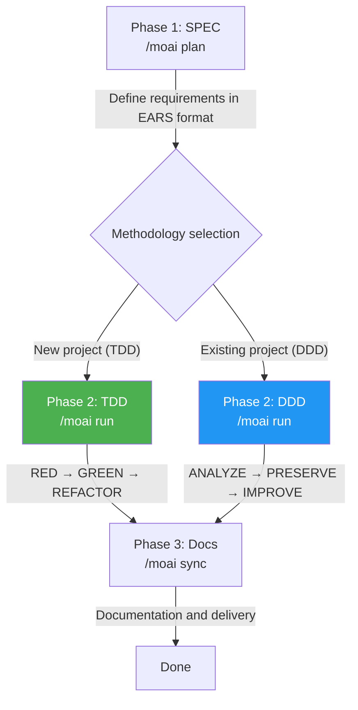

MoAI-ADK is an Agentic Development Kit that aims for **Tokenomics** (Token Economics). Code of the same quality with fewer tokens, and higher quality for the same tokens — the system manages model selection, reasoning depth, and context usage. Written in Go as a single binary, it runs immediately with zero dependencies.

## Notation Guide

In this documentation, the prefix in code blocks indicates where the command runs:

- Commands typed into the **Claude Code** chat input
  ```bash
  > /moai plan "feature description"
  ```

- Commands typed into the **terminal**
  ```bash
  moai init my-project
  ```

## Core Value — The Three Pillars

The value of MoAI-ADK v3.0 comes down to three pillars.

| Pillar | One-line description | Representative tools |
|------|-----------|----------|
| **Tokenomics** | Intelligent resource allocation maximizing quality per cost | 3-tier model policy · CG mode · Token Circuit Breaker |
| **Agentic Loop Engineering** | The loop works on its own; observations accumulate and the harness learns | `/moai goal` · `/moai loop` · Analyze-First routing |
| **Agentic Harness** | Design the environment agents work in instead of writing code yourself | 11 agents · SPEC 3-phase · TRUST 5 |

The details of each pillar are covered in the [Core Concepts](/en/core-concepts/) section. This page covers only what you need to get started.

## Core Concepts

MoAI-ADK is built on the **SPEC-based TDD/DDD** methodology and guarantees code quality through the **TRUST 5** quality framework.

### What is a SPEC? (The Easy Version)

A **SPEC** (Specification) is "recording your conversation with the AI as a document".

The biggest problem with **vibe coding** (Vibe Coding) is **context loss**:

- What you discussed with the AI for an hour **disappears** when the session ends
- To continue the next day, you have to **explain everything from scratch**
- The more complex the feature, the more the result **diverges from your intent**

**A SPEC solves this:**

- Requirements are **saved as files** and preserved permanently
- Even if the session drops, reading the SPEC lets you **pick up where you left off**
- The EARS format defines requirements clearly, **without ambiguity**
- No repeating the same explanation, so you **save tokens** too


**One-line summary:** Instead of re-explaining yesterday's "JWT auth + 1-hour expiry + refresh token" discussion, one line — `/moai run SPEC-AUTH-001` — starts the implementation immediately!


### What is TDD? (The Easy Version)

**TDD** (Test-Driven Development) is "writing the tests first, then developing".

Think of it like writing an exam:

- **Write the grading criteria (the tests) first** — with no feature yet, they naturally fail
- **Write the minimum code that passes the criteria** — exactly as much as needed
- **Polish it into better code** — improve while keeping the tests passing

MoAI-ADK automates this process with the **RED-GREEN-REFACTOR** cycle:

| Phase | Meaning | What happens |
|------|------|--------|
| **RED** | Fail | Write tests first for the feature that does not exist yet |
| **GREEN** | Pass | Write the minimum code that passes the tests |
| **REFACTOR** | Improve | Raise code quality while keeping the tests green |

### What is DDD? (The Easy Version)

**DDD** (Domain-Driven Development) is "a safe way to improve code".

Think of it like remodeling a house:

- Improve one room at a time, **without demolishing the house**
- **Record the current state before remodeling** (= characterization tests)
- **Work room by room, verifying each time** (= incremental improvement)

MoAI-ADK automates this process with the **ANALYZE-PRESERVE-IMPROVE** cycle:

| Phase | Meaning | What happens |
|------|------|--------|
| **ANALYZE** | Analyze | Understand the current code structure and problems |
| **PRESERVE** | Preserve | Record current behavior with tests (the safety net) |
| **IMPROVE** | Improve | Improve bit by bit while the tests keep passing |

### Choosing a Development Methodology

MoAI-ADK automatically selects the optimal development methodology based on the project state.


```mermaid
flowchart TD
    A["Analyze project"] --> B{"New project or<br/>10%+ test coverage?"}
    B -->|"Yes"| C["TDD default"]
    B -->|"No"| D{"Existing project<br/>< 10% coverage?"}
    D -->|"Yes"| E["DDD"]
    C --> F["RED → GREEN → REFACTOR"]
    E --> G["ANALYZE → PRESERVE → IMPROVE"]

    style C fill:#4CAF50,color:#fff
    style E fill:#2196F3,color:#fff
```

| Methodology | Target | Cycle |
|--------|------|--------|
| **TDD** | New projects or 10%+ coverage | RED → GREEN → REFACTOR |
| **DDD** | Existing projects under 10% coverage | ANALYZE → PRESERVE → IMPROVE |


MoAI-ADK v2.5.0+ uses a binary methodology choice (TDD or DDD only). The hybrid mode was removed for clarity and consistency. The methodology is auto-selected at `moai init` and can be changed via `development_mode` in `.moai/config/sections/quality.yaml`.


### The TRUST 5 Quality Framework

TRUST 5 is based on the following five core principles:

| Principle | Description |
|------|------|
| **T**ested | 85% coverage, characterization tests, behavior preservation |
| **R**eadable | Clear naming conventions, consistent formatting |
| **U**nified | Unified style guide, automatic formatting |
| **S**ecured | OWASP compliance, security verification, vulnerability analysis |
| **T**rackable | Structured commits, change-history tracking |

## Go Edition Highlights

MoAI-ADK is a complete rewrite of the Python Edition in Go, maximizing performance and efficiency.

| Item | Python Edition | Go Edition |
|------|---------------|------------|
| Distribution | pip + venv + dependencies | **Single binary**, zero dependencies |
| Startup time | ~800ms interpreter boot | **~5ms** native execution |
| Concurrency | asyncio / threading | **Native goroutines** |
| Type safety | Runtime (mypy optional) | **Compile-time enforced** |
| Cross-platform | Requires Python runtime | **Prebuilt binaries** (macOS, Linux, Windows) |

### Key Numbers (as of v3.0)

- **11** agents in the catalog (10 MoAI custom + 1 Anthropic built-in `Explore`)
- **27** skills (template-managed)
- **36** CLI commands · **15** `/moai` subcommands
- **16** programming languages supported
- A codebase developed on top of **487** SPEC documents

## System Requirements

| Platform | Supported Environment | Notes |
|--------|----------|------|
| macOS | Terminal, iTerm2 | Fully supported |
| Linux | Bash, Zsh | Fully supported |
| Windows | **WSL (recommended)**, PowerShell 7.x+ | Native cmd.exe not supported |

**Prerequisites:**
- **Git** must be installed on every platform
- **Windows users**: For the best experience, WSL (Windows Subsystem for Linux) is recommended

## Key Features

### The Agent Catalog (11 Agents)

The MoAI orchestrator does not implement directly — it delegates work to 11 specialist agents. Planning and auditing are separated — the one who builds it does not inspect it.

| Category | Count | Key agents |
|----------|------|--------------|
| **Manager** | 5 | manager-spec, manager-develop, manager-docs, manager-git, manager-design |
| **Evaluator** | 2 | plan-auditor, sync-auditor |
| **Builder** | 1 | builder-harness |
| **Advisor** | 1 | super-advisor (high-reasoning consultation) |
| **Specialist** | 1 | e2e-tester (E2E test execution across web/mobile/desktop) |
| **Built-in** | 1 | Explore (Anthropic built-in, read-only code analysis) |

### Model Policy (Tokenomics)

MoAI-ADK assigns the optimal AI model to each agent according to your Claude Code subscription plan. It maximizes quality within your plan's usage limits — heavier-reasoning phases like planning and auditing get the top models, while repetitive work gets lightweight models.

| Policy | Plan | Characteristics |
|------|--------|------|
| **High** | Max $200/month | Highest quality — Opus assigned to planning and audits, maximum throughput |
| **Medium** | Max $100/month | Balance of quality and cost |
| **Low** | Plus $20/month | Economical, no Opus — Sonnet-centric allocation |


The Plus $20 plan does not include Opus. Setting the **Low** policy runs the full workflow without usage-limit errors even without the top models. On higher plans, Opus goes to the critical phases (planning, audits) while lighter models handle routine work.


### Execution Modes and Orchestration

Natural-language requests go through **Analyze-First** routing — whatever language you make the request in, intent is analyzed first and routed to the right workflow. The orchestrator picks one of sequential sub-agents (default), parallel sub-agent fan-out, or dynamic workflows based on task complexity.

```bash
/moai run SPEC-AUTH-001           # Automatic selection based on complexity
/moai run SPEC-AUTH-001 --solo    # Force sequential sub-agents
```


**Changed in v3.0**: The old Agent Teams static-orchestration layer has been retired. Forcing `--team` falls back to sub-agent mode. Claude Code's native teammate runtime — the tmux split panes of `moai cg` — is unaffected.


### The SPEC-First Workflow

MoAI-ADK follows a 3-phase development workflow. The Run-phase methodology is auto-selected based on the project state:


```mermaid
flowchart TD
    A["Phase 1: SPEC<br/>/moai plan"] -->|"Define requirements in EARS format"| B{"Methodology selection"}
    B -->|"New project (TDD)"| C["Phase 2: TDD<br/>/moai run"]
    B -->|"Existing project (DDD)"| D["Phase 2: DDD<br/>/moai run"]
    C -->|"RED → GREEN → REFACTOR"| E["Phase 3: Docs<br/>/moai sync"]
    D -->|"ANALYZE → PRESERVE → IMPROVE"| E
    E -->|"Documentation and delivery"| F["Done"]

    style C fill:#4CAF50,color:#fff
    style D fill:#2196F3,color:#fff
```

### The Agentic Loop

Declare a completion condition and the loop works on its own:

```text
/moai goal "until all tests pass and lint is clean"     # Condition-declared loop
/moai loop                                              # Diagnostic-driven iterative fixing (up to 100 iterations)
/moai fix                                               # Single-pass auto-fix
```

`/moai loop` is a preset on top of the goal engine — it keeps fixing until the queue of issues found by the diagnostic tools is drained.

### Recommended Workflow Chains

**New feature development:**
```
/moai plan → /moai run SPEC-XXX → /moai sync SPEC-XXX
```

**Bug fixing:**
```
/moai fix (or /moai loop) → /moai review → /moai sync
```

**Refactoring:**
```
/moai plan → /moai clean → /moai run SPEC-XXX → /moai review → /moai codemaps
```

**Documentation updates:**
```
/moai codemaps → /moai sync
```

## Multilingual Support

MoAI-ADK supports the following four languages:

- **Korean**
- **English**
- **Japanese**
- **Chinese**

Choose your preferred language in the setup wizard, or change it directly in the configuration files.

## LSP Integration

**LSP** (Language Server Protocol) is the standard communication protocol between code editors and language tools. It detects code errors, type errors, and lint results in real time, providing immediate feedback.

**Ralph-Loop Style** is an autonomous workflow that uses LSP diagnostics as a feedback loop. When a quality problem is detected, a fixing agent is invoked automatically, repeating until the quality bar is met.

MoAI-ADK provides autonomous workflows through Ralph-Loop Style LSP integration:

- **LSP-based automatic completion detection**: monitors code quality state in real time
- **Real-time regression detection**: immediately detects the impact of changes on existing functionality
- **Automatic completion conditions**: work is marked complete automatically at 0 errors, 0 type errors, and 85% coverage


Ralph-Loop Style LSP integration automates the quality gates of the development workflow, maintaining high code quality without manual intervention.


## Saving Tokens with GLM (50-70%)

GLM is an AI model fully compatible with Claude Code. Combining a Claude leader with GLM teammates in **CG mode** can **save 50-70% of tokens** on implementation work — the flagship practical tool of the Tokenomics pillar.

### CG Mode: Claude + GLM Hybrid

In CG mode, Claude orchestrates the entire workflow while lower-cost GLM teammates handle implementation work in parallel.

| Role | Model | Responsibilities |
|------|------|---------|
| **Leader** | Claude | Orchestration, architecture decisions, code review |
| **Teammates** | GLM | Code implementation, test writing, documentation |

| Task Type | Recommended Mode | Savings |
|----------|----------|---------|
| Implementation-heavy SPECs (`/moai run`) | CG mode | **50-70% savings** |
| Code generation, tests, documentation | CG mode | **50-70% savings** |
| Architecture design, security review | Claude only | Deep reasoning required |

### GLM Switching Commands

```bash
# Switch to the GLM backend
moai glm

# Start GLM worker mode (Claude leader + GLM teammates)
moai glm --team

# CG mode (Claude leader + GLM teammates, requires tmux)
moai cg

# Return to the Claude backend
moai cc
```


Don't have a GLM account yet? Sign up at [z.ai (extra 10% discount)](https://z.ai/subscribe?ic=1NDV03BGWU). Rewards from this referral link go toward **MoAI open-source development**.


## Getting Started

Follow these steps to begin your MoAI-ADK journey:

1. **[Installation](/en/getting-started/installation)** - Install MoAI-ADK on your system
2. **[Initial Setup](/en/getting-started/init-wizard)** - Run the interactive setup wizard
3. **[Quick Start](/en/getting-started/quickstart)** - Create your first project
4. **[Core Concepts](/en/core-concepts/what-is-moai-adk)** - Deepen your understanding of MoAI-ADK

## Key Benefits

| Benefit | Description |
|------|------|
| **Quality assurance** | Consistent quality via the TRUST 5 framework |
| **Token efficiency** | Model policy + CG mode + Token Circuit Breaker — the system manages cost |
| **Higher productivity** | AI agent automation shortens development time |
| **Extensible** | Flexible extension via the modular architecture and the harness Builder |
| **Multilingual** | 4 languages supported |

## Additional Resources

- [GitHub Repository](https://github.com/modu-ai/moai-adk)
- [Documentation Site](https://adk.mo.ai.kr)
- [Community Forum](https://github.com/modu-ai/moai-adk/discussions)

---

## Next Steps

Learn how to install MoAI-ADK in the [Installation Guide](./installation).
