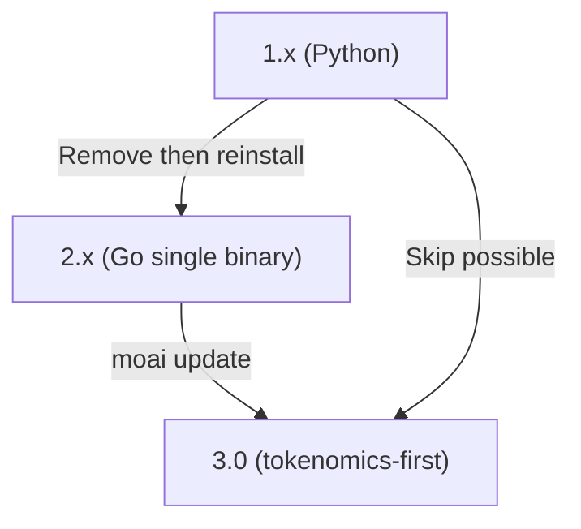

# Migration Guide

MoAI-ADK has undergone two major transitions. (1) 1.x (Python) to 2.x (Go single binary), (2) 2.x to 3.0 (tokenomics-first agent workflow). This page consolidates both transitions into one flow. Jump to the section that matches where you're coming from.

## Overall Flow



1.x users can go directly to 3.0 without passing through 2.x. Follow the 1.x section's removal procedure, then jump straight to the [3.0 installation](#30-installation) section.

## 1.x (Python) Users — To 2.x


**MoAI-ADK 1.x (Python version) users MUST remove the existing version first.** 1.x and 2.x use the same `moai` command, so leaving the old version in place causes conflicts.


### Step 1: Remove existing 1.x

```bash
# If installed with uv
uv tool uninstall moai-adk

# If installed with pip
pip uninstall moai-adk
```

### Step 2: Back up existing config (optional)

```bash
# If you want to back up existing config
cp -r ~/.moai ~/.moai-v1-backup
```

### Step 3: Install 2.x

```bash
curl -fsSL https://raw.githubusercontent.com/modu-ai/moai-adk/main/install.sh | bash
```

### Step 4: Verify installation

```bash
moai version
```

After these steps, Python runtime and virtualenv are no longer needed. 2.x is a single Go binary with startup time reduced from ~800ms to 5ms, and license changed from GPL-3.0 to Apache-2.0.


**License change**: MoAI-ADK 1.x (Python) is GPL-3.0; 2.x (Go) and later are Apache-2.0. Commercial use·modification·distribution are free with no source-disclosure obligation.


### Resolving pip / uv conflicts

pip and uv install packages in different locations. Using both tools together can cause the `moai` command to execute the wrong version. If you see symptoms, wipe everything and reinstall:

```bash
# 1. Remove all existing versions
uv tool uninstall moai-adk 2>/dev/null || true
pip uninstall moai-adk -y 2>/dev/null || true

# 2. Check and delete remaining binary
which moai && rm $(which moai) 2>/dev/null || true

# 3. Reinstall
curl -fsSL https://raw.githubusercontent.com/modu-ai/moai-adk/main/install.sh | bash

# 4. Verify
moai version
```

## 2.x Users — To 3.0

3.0 is the GA (general availability) release that maintains 2.x compatibility while switching to tokenomics-first. User files (`.claude/`, `.moai/project/`, `.moai/specs/`) are automatically preserved.

### 3.0 Installation

For existing projects, run template sync first, then upgrade the binary.

```bash
# 1. v3.0.0 template sync (preserves user files)
moai update

# 2. CLI binary upgrade
moai update --binary

# 3. Verify
moai version    # Should report v3.0.0
```

For new projects or clean environments, the installation script alone is sufficient.

```bash
curl -fsSL https://raw.githubusercontent.com/modu-ai/moai-adk/main/install.sh | bash
```

If Go is already installed, `go install` also works.

```bash
go install github.com/modu-ai/moai-adk/cmd/moai@latest
```

### 3.0 Key Changes

Moving to 3.0 redesigns the agent catalog, autonomous loops, and cost control. Here are the migration-facing changes you'll encounter most frequently.

#### Agent catalog consolidated to 11

Archived agent names (`manager-strategy`, `expert-backend`, `researcher`, etc.) are **rejected at spawn**. Instead, either (a) use one of 11 retained agents, or (b) adopt the pattern of spawning `Agent(general-purpose)` with a domain whitelist wherever needed.

#### Agent Teams static orchestration layer retired

Forced `--team` / `--mode team` emits `MODE_TEAM_UNAVAILABLE` and falls back to subagent mode. The native Claude Code teammate runtime (`moai cg` GLM panes, `worktree --team`) is unaffected.

#### Context7 MCP dependency retired

`mcp__context7__*` was removed from all `allowed-tools` and settings ask-lists. Library documentation lookup uses the WebSearch/WebFetch fallback strategy.

#### `/moai e2e` repurposed

The web-only E2E subcommand was retired and rebuilt as a multi-platform subsystem covering web·mobile·desktop (led by the `e2e-tester` agent).

#### Profile matrix introduced (3.0.1)

The `plan_type × performance_tier` two-axis design was replaced by a **single profile matrix per agent group** (`max`/`medium`/`low`). `moai init --plan-type` is retired and replaced by `moai init --profile <max|medium|low>`. The existing `llm.yaml` (`plan_type` + `claude_models` + `performance_tier`) loads error-free and resolves to the correct profile — retired keys are cleaned on next save.


**Config migration is automatic.** Legacy `llm.yaml` is read as-is and converted to the correct profile, so no manual config editing is needed.


### Known v2 → v3 clean reinstall issues

Two regressions reported during the 2.x → 3.0 transition were both fixed around the 3.0.0 release.

- **Config infinite loop (#1084)** — User-edited `language.yaml` / `design.yaml` reverted to defaults every execution. Fixed by making `system.yaml`'s `v3.*` version bypass the v2 fingerprint.
- **Template collision loop** — `.claude/rules/moai/design` existed in both the retirement path and the v3 template, causing endless clean-reinstall loops. Removed that item from the retirement list and added build-time regression guards.
- **Retired v2 permission deny rules (#1101)** — 12 v2-era `deny` entries survived upgrade and emitted a warning at every session start. 3.0.1 cleans them up in a one-time migration.

If you're on the latest 3.0.x binary, these issues are already resolved.

## Skip Path — 1.x to 3.0

1.x users can go directly to 3.0 without passing through 2.x.

```bash
# 1. Remove existing Python version
uv tool uninstall moai-adk 2>/dev/null || true
pip uninstall moai-adk -y 2>/dev/null || true
which moai && rm $(which moai) 2>/dev/null || true

# 2. (Optional) Back up
cp -r ~/.moai ~/.moai-v1-backup 2>/dev/null || true

# 3. Install 3.0
curl -fsSL https://raw.githubusercontent.com/modu-ai/moai-adk/main/install.sh | bash

# 4. Verify
moai version
```

License changes from GPL-3.0 (1.x) to Apache-2.0 (2.x+). Commercial restrictions are removed.

## Post-Upgrade Verification

After upgrading, verify the following:

```bash
moai version      # Should show expected version
moai doctor       # Harness·hook·config health check
```

If `moai doctor` shows red items, template sync is usually incomplete. Running `moai update` one more time resolves most cases.

## Uninstall

To completely remove, delete the binary and config directory.

```bash
# Delete binary
rm "$(which moai)"

# Delete config directory (optional)
rm -rf "$HOME/.moai"
```

## Next Steps

- [Installation](/en/getting-started/installation/) — OS-specific installation details
- [Init wizard](/en/getting-started/init-wizard/) — Project initialization
- [CLI overview](/en/getting-started/cli/) — Frequently used commands
