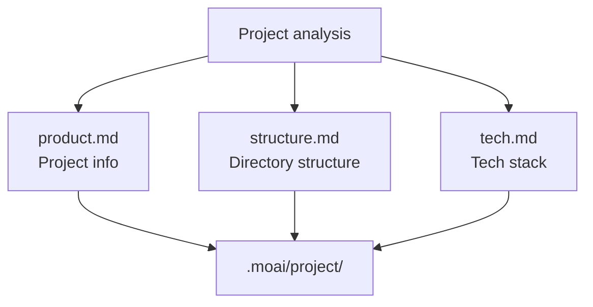
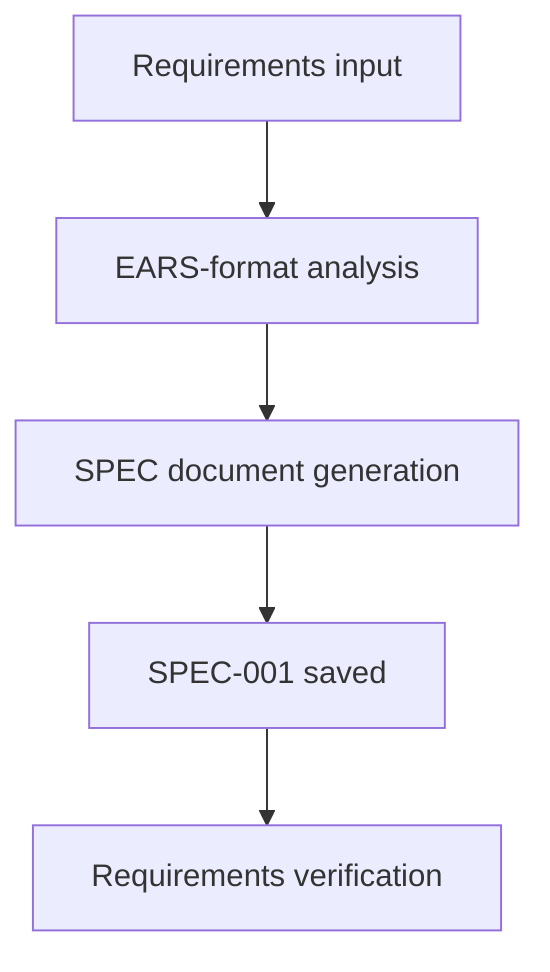
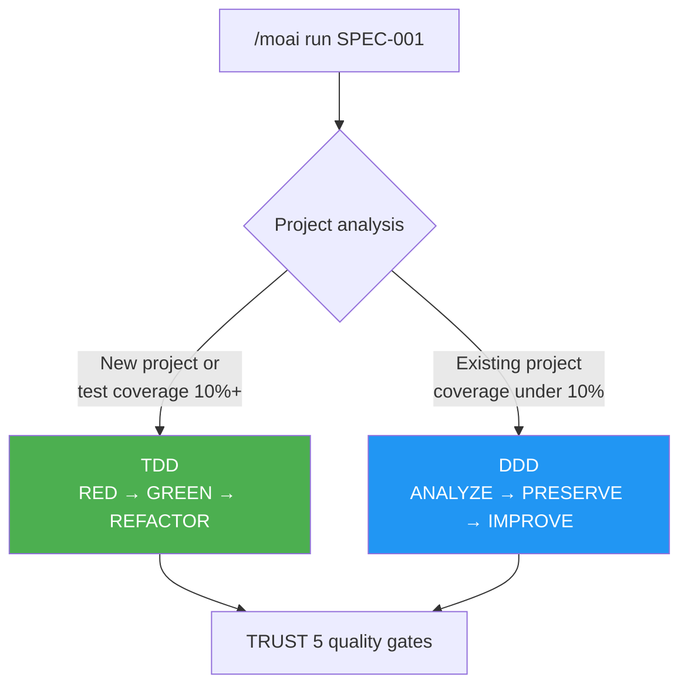
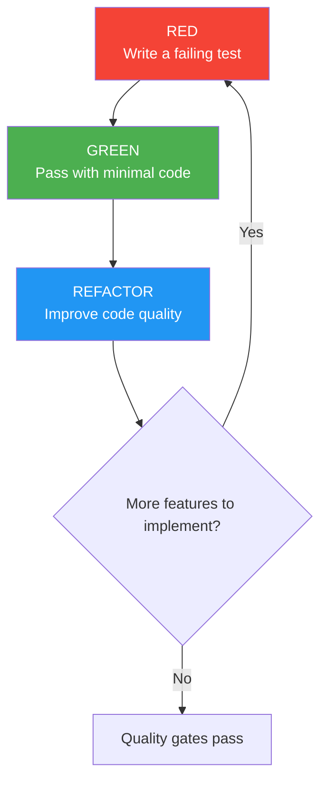
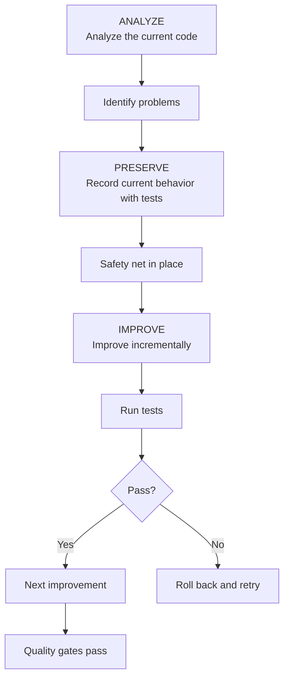
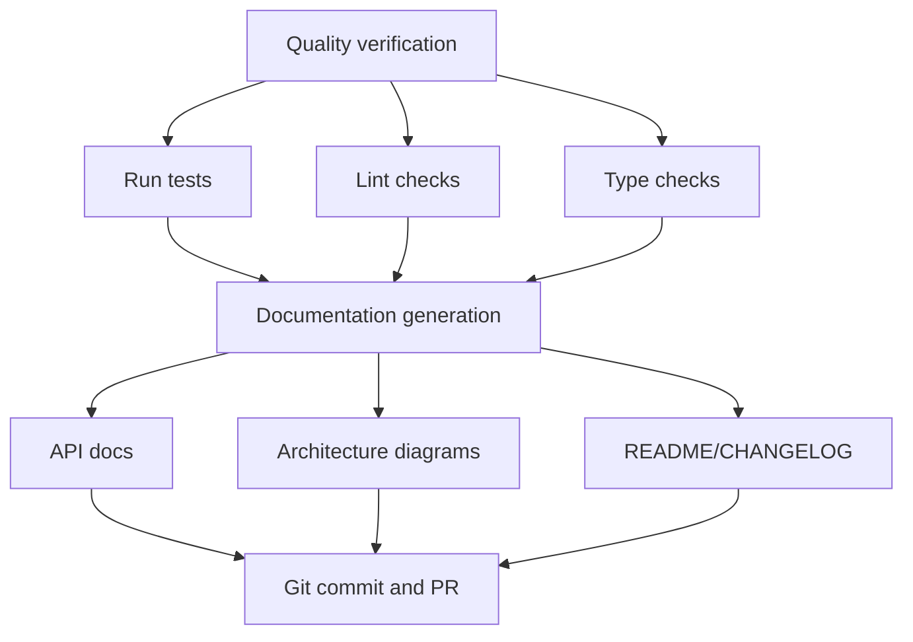
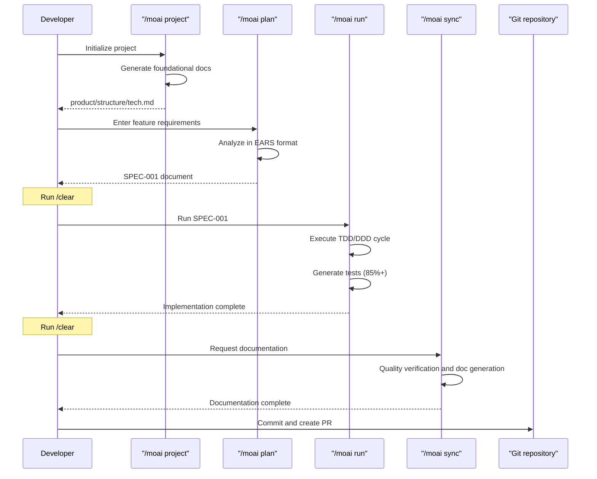
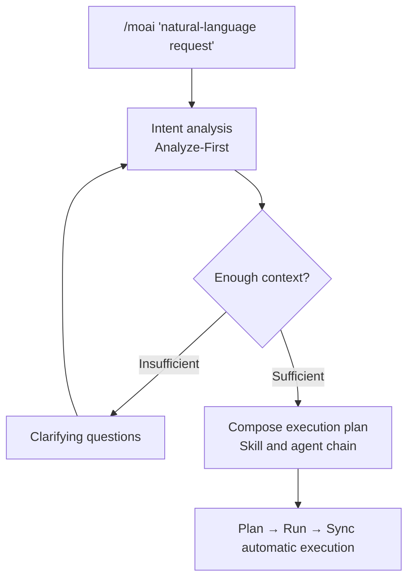
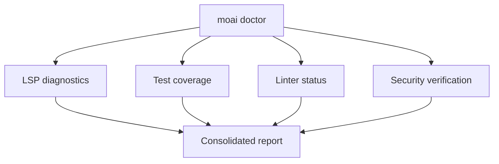

Create your first project with MoAI-ADK and experience the development workflow. Following this document takes you through a full cycle — from writing a SPEC to implementation and documentation.

## Prerequisites

Before starting, the following should be done:

- [x] MoAI-ADK installed ([Installation Guide](./installation))
- [x] Initial setup completed ([Initial Setup](./init-wizard))
- [ ] GLM API key acquired (optional — if you want to cut token costs with CG mode)

## Creating Your First Project

### Step 1: Initialize the Project

To create a new project, use the `moai init` command:

```bash
moai init my-first-project
cd my-first-project
```

To initialize MoAI-ADK in an existing project, move into that folder and run:

```bash
cd existing-project
moai init
```

### Step 2: Generate the Project Documents

Generate the project's foundational documents. This step is essential for Claude Code to understand your project — instead of explaining the project structure every session, the agents read these documents.

```bash
> /moai project
```

This command analyzes the project and automatically generates these 3 files:



| File | Content |
|------|------|
| **product.md** | Project name, description, target users, core features |
| **structure.md** | Directory tree, purpose of key folders, module composition |
| **tech.md** | Technologies used, frameworks, development environment, build/deploy settings |


Run `/moai project` after initial project setup or after major structural changes. Along with the project documents, a project-specific harness is configured automatically.


### Step 3: Create a SPEC Document

Create a SPEC document for your first feature. It uses the EARS format to define clear requirements.


**Why do you need a SPEC?**

The biggest problem with **vibe coding** (Vibe Coding) is **context loss**:

- While coding through conversation with the AI, there comes a moment of "wait, what was I trying to do?"
- When the session drops or the context is reset, **the requirements you discussed earlier disappear**
- You end up repeating the same explanation, or getting code that diverges from your intent

**The SPEC document solves this:**

| Problem | How the SPEC solves it |
|------|-----------------|
| Context loss | Requirements **saved as files**, preserved permanently |
| Ambiguous requirements | Clearly structured in the **EARS format** |
| Communication errors | Completion conditions stated as **acceptance criteria** |
| No progress tracking | Work units managed by **SPEC ID** |

**One-line summary:** A SPEC is "recording your conversation with the AI as a document". Even if the session drops, reading the SPEC lets you pick up where you left off — and since you don't repeat the same explanation, you save tokens too.


```bash
> /moai plan "Implement user authentication"
```

This command does the following:



The generated SPEC document is saved at `.moai/specs/SPEC-001/spec.md`.


After creating the SPEC, clear the context with the `/clear` command. The decisions are already recorded in the SPEC file, so there is no reason to keep the conversation history — this is token-saving 101.


### Step 4: Run TDD/DDD Development

Implementation proceeds based on the SPEC document.

```bash
> /clear
> /moai run SPEC-001
```

MoAI-ADK automatically selects the optimal development methodology based on the project state.



---

#### TDD Mode (New Project / Test Coverage 10%+)


**What is TDD?**

TDD is "writing the exam first, then studying":
- **Write the tests (the grading criteria) first** — with no feature yet, they naturally fail
- **Write the minimum code that passes the tests** — exactly as much as needed
- **Improve the code while keeping the tests green** — polish it into better code

**Key point:** Tests come before code!


**The RED-GREEN-REFACTOR cycle:**

| Phase | Meaning | What happens |
|------|------|--------|
| **RED** | Fail | Write tests first for the feature that does not exist yet |
| **GREEN** | Pass | Write the minimum code that passes the tests |
| **REFACTOR** | Improve | Raise code quality while keeping the tests green |



---

#### DDD Mode (Existing Project / Test Coverage Under 10%)


**What is DDD?**

DDD is like "remodeling a house":
- Improve one room at a time, **without demolishing the house**
- **Take photos of the current state before remodeling** (= characterization tests)
- **Work room by room, verifying each time** (= incremental improvement)

**Key point:** Improve safely while preserving existing behavior!


**The ANALYZE-PRESERVE-IMPROVE cycle:**

| Phase | Analogy | Actual work |
|------|------|----------|
| **ANALYZE** | Inspect the house | Understand the current code structure and problems |
| **PRESERVE** | Photograph the current state | Record current behavior with characterization tests |
| **IMPROVE** | Remodel one room at a time | Improve bit by bit while the tests keep passing |



---


`/moai run` automatically develops toward 85%+ test coverage. The development methodology can be changed manually via `development_mode` in `.moai/config/sections/quality.yaml`.


**Completion conditions:**
- Test coverage >= 85%
- 0 errors, 0 type errors
- LSP baseline achieved

Completion is judged by evidence, not by feel — each acceptance criterion is registered as a task and checked off only when its tests pass.

### Step 5: Synchronize Documentation

Once development is complete, quality verification and documentation are generated automatically.

```bash
> /clear
> /moai sync SPEC-001
```

This command does the following:



## The Full Development Workflow



## Integrated Automation: /moai

To run every phase automatically at once, make a natural-language request:

```bash
> /moai "Implement user authentication"
```

The request goes through **Analyze-First** routing — whatever language you use, intent is analyzed first, missing context is filled in with questions, and then the Plan → Run → Sync pipeline runs automatically.



## Workflow Selection Guide

| Situation | Recommended Command | Reason |
|------|-----------|------|
| New project | Run `/moai project` first | Foundational docs required |
| Simple feature | `/moai plan` + `/moai run` | Fast execution |
| Complex feature | `/moai` | Automatic optimization |
| Parallel development | Use the `--worktree` flag | Guaranteed independent environments |

## Practical Examples

### Example 1: A Simple API Endpoint

```bash
# 1. Generate project docs (first time only)
> /moai project

# 2. Create a SPEC
> /moai plan "Implement a user list API endpoint"
> /clear

# 3. Implement
> /moai run SPEC-001
> /clear

# 4. Document and open a PR
> /moai sync SPEC-001
```

### Example 2: A Complex Feature (Natural-Language Automation)

```bash
# If project docs already exist, run everything at once with natural language
> /moai "Implement JWT authentication middleware"
```

### Example 3: Parallel Development (Using Worktrees)

```bash
# Parallel development in an isolated environment
> /moai plan "Implement a payment system" --worktree
```

## Understanding the File Structure

The standard structure of a MoAI-ADK project:

```
my-first-project/
├── CLAUDE.md                        # Claude Code project instructions
├── CLAUDE.local.md                  # Project-local settings (personal)
├── .mcp.json                        # MCP server configuration
├── .claude/
│   ├── agents/                      # Claude Code agent definitions
│   ├── commands/                    # Slash command definitions
│   ├── hooks/                       # Hook scripts
│   ├── skills/                      # Reusable skills
│   └── rules/                       # Project rules
├── .moai/
│   ├── config/
│   │   └── sections/
│   │       ├── user.yaml            # User info
│   │       ├── language.yaml        # Language settings
│   │       ├── quality.yaml         # Quality gate settings
│   │       └── git-strategy.yaml    # Git strategy settings
│   ├── project/
│   │   ├── product.md               # Project overview
│   │   ├── structure.md             # Directory structure
│   │   └── tech.md                  # Tech stack
│   ├── specs/
│   │   └── SPEC-001/
│   │       └── spec.md              # Requirements specification
│   └── memory/
│       └── checkpoints/             # Session checkpoints
├── src/
│   └── [project source code]
├── tests/
│   └── [test files]
└── docs/
    └── [generated docs]
```

## Quality Checks

You can check quality at any time during development:

```bash
moai doctor
```

This command checks:

- LSP diagnostics (errors, warnings)
- Test coverage
- Linter status
- Security verification



## Useful Tips

### Token Management

Run `/clear` after each phase to empty the context. The decisions live on as files in the SPEC and `progress.md`, so you can continue to the next phase without conversation history:

```bash
> /moai plan "Implement a complex feature"
> /clear  # Reset the session
> /moai run SPEC-001
> /clear
> /moai sync SPEC-001
```

### Bug Fixing and Automation

```bash
# Auto-fix (single pass)
> /moai fix "Fix the TypeError occurring in the tests"

# Iterative fixing (until done)
> /moai loop "Fix all linter warnings"

# Condition-declared loop
> /moai goal "go test ./... exits 0; all lint warnings resolved"
```

---

## Next Steps

Explore MoAI-ADK's advanced features in [Core Concepts](/en/core-concepts/what-is-moai-adk).
