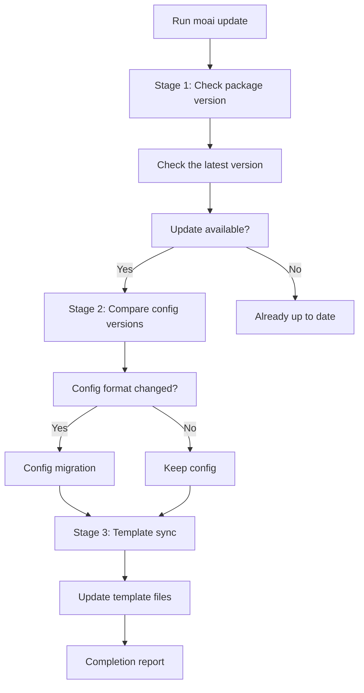
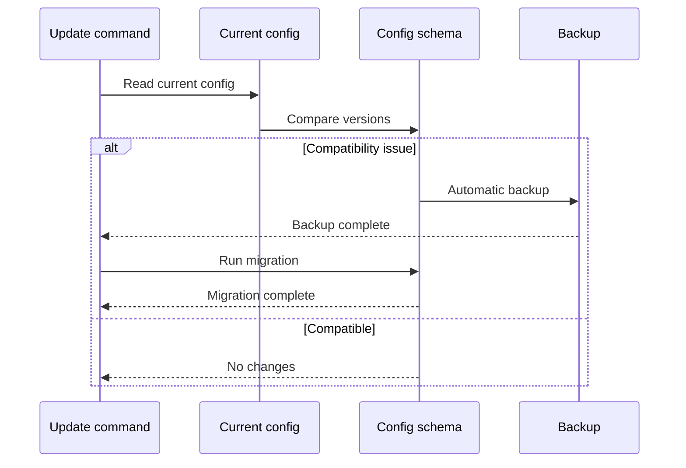
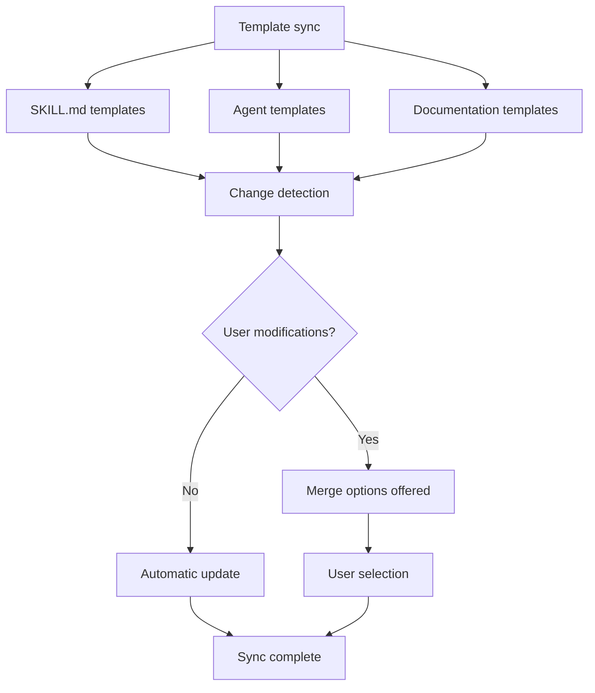

This guide covers keeping MoAI-ADK on the latest version. A single `moai update` refreshes both the binary and the templates, and custom assets you created are preserved automatically.

## The Update Command

To update MoAI-ADK to the latest version:

```bash
moai update
```

This command runs a 3-stage smart update workflow.

## The 3-Stage Smart Update Workflow



### Stage 1: Package Version Check

First, the currently installed version is compared to the latest version on GitHub Releases.

```bash
# Check the current version
moai --version

# Check for available updates
moai update --check-only
```

**What is checked:**

- The currently installed version
- The latest version on GitHub Releases
- The changelog (new features, bug fixes, compatibility)

**Example output:**

```
Current version: 1.2.0
Latest version: 1.3.0

Release notes:
- Add new manager-develop agent
- Improve token optimization
- Fix SPEC validation issues

Update available! Run 'moai update' to upgrade.
```

### Mandatory Checksum Verification {#checksum-verification}

Starting from v2.20.0-rc1, the binary download in `moai update` **cannot bypass checksum verification**. If downloading or parsing the release's `checksums.txt` fails, the sentinel error `ErrChecksumUnavailable` is returned and the update flow **aborts** — the binary download is never attempted.

#### Retry Policy

The `checksums.txt` download is retried **3 times** with exponential backoff:

| Attempt | Wait |
|------|-----------|
| 1st (immediate) | 0s |
| 2nd retry | 2s wait |
| 3rd retry | 4s wait |
| No further retries | Fails after ~6s total wait |

(Internal implementation: base delay 2s × 2^(attempt-1) exponential backoff; as defense-in-depth, empty checksums are blocked at both the checker and updater stages)

If all retries fail, the following message is printed:

```
error: checksum unavailable: persistent retry failure after 3 attempts
```

**No bypass option like `--skip-checksum` exists** (a deliberate CWE-345 policy).

#### Recovery Procedure on Failure

1. **Check network connectivity**:
   ```bash
   curl -I https://github.com/modu-ai/moai-adk/releases/latest
   ```
2. **Check proxies / firewalls** — whether the GitHub release asset domains (`github.com`, `objects.githubusercontent.com`) are allowed
3. **Possible transient GitHub CDN outage** — retry after a moment
4. **Manual binary installation** (if permanently blocked):
   ```bash
   curl -fsSL https://raw.githubusercontent.com/modu-ai/moai-adk/main/install.sh | bash
   ```
   With manual installation you verify integrity yourself; for protection equivalent to the automatic update, checking the GitHub Release's `checksums.txt` separately is recommended.

For the full threat model, implementation locations, and inspection procedures, see [Security Notes — CWE-345](/en/advanced/security-notes/#cwe-345).

### Stage 2: Config Version Comparison

The configuration files' format and compatibility are inspected.



**Files inspected:**

- `.moai/config/sections/user.yaml`
- `.moai/config/sections/language.yaml`
- `.moai/config/sections/quality.yaml`

**Migration example:**

```yaml
# Old config (v1.2.0)
development_mode: ddd
test_coverage_target: 85

# New config (v1.3.0)
development_mode: ddd
test_coverage_target: 85
ddd_settings:
  require_existing_tests: true
  characterization_tests: true
```


The `.moai/config/` directory is always backed up before a config migration.


### Stage 3: Template Sync

Project templates and base files are synchronized to the latest version.



**Files synchronized:**

- `.moai/templates/` - Project templates
- `.claude/skills/` - Skill templates
- `.claude/agents/` - Agent templates


Template files you modified are preserved, and merge options with the new version are offered.


## Update Options

### Behavior

| Command | Binary update | Template sync |
|--------|-------------------|---------------|
| `moai update` | O | O |
| `moai update --binary` | O | X |
| `moai update --templates-only` | X | O |

### Binary-Only Update

Updates only the MoAI-ADK binary without syncing templates:

```bash
$ moai update --binary
```

**When to use:**
- You have modified the templates yourself
- You want to skip template sync
- You only need a quick binary update

### Template-Only Sync

Syncs only the templates without updating the binary:

```bash
$ moai update --templates-only
```

**When to use:**
- Applying the latest skill and agent templates
- Updating templates while keeping the binary version
- Syncing templates across multiple projects

### Check Only

Checks the available version without actually updating:

```bash
$ moai update --check-only
```

### Automatic Update

Proceeds with the update without confirmation:

```bash
$ moai update --yes
```

### Specific Version

Updates to a specific version:

```bash
$ moai update --version 1.2.0
```

### Keeping Backups

Preserves a backup for recovery in case the update fails:

```bash
$ moai update --keep-backup
```

## After Updating

### Step 1: Verify the Version

```bash
moai --version
```

### Step 2: Validate the Configuration

```bash
moai doctor
```

### Step 3: Check New Features

```bash
moai --help
```

Check for newly added commands or options.

## Troubleshooting

### Problem: Update Failed

```bash
Error: Update failed - permission denied
```

**Solution:**

```bash
# Manual reinstall with curl
curl -fsSL https://raw.githubusercontent.com/modu-ai/moai-adk/main/install.sh | bash

# Or reinstall a specific version
moai update --version <VERSION>
```

### Problem: Config Migration Error

```bash
Error: Config migration failed
```

**Solution:**

```bash
# Restore from backup
cp -r .moai/config.bak .moai/config

# Migrate manually
vim .moai/config/sections/quality.yaml
```

### Problem: Template Conflicts

```bash
Warning: Template conflicts detected
```

**Solution:**

```bash
# Automatic merge (preserves user changes)
$ moai update --merge

# Manual merge (keeps backups, generates a merge guide)
$ moai update --manual

# Force update (no backup)
$ moai update --force
```

## Managing Personal Settings

During a MoAI-ADK update, **CLAUDE.md** and **settings.json** are overwritten with the new version. If you have personal modifications, manage them as follows.

### Using .local Files

Store personal settings in separate files to protect them from being overwritten during updates:

| File | Location | Purpose |
|------|------|------|
| `CLAUDE.md` | Project root | MoAI-ADK managed (changes on update) |
| `settings.json` | `.claude/` | MoAI-ADK managed (changes on update) |
| `CLAUDE.local.md` | Project root |  Project personal settings (unaffected by updates) |
| `.claude/settings.local.json` | Project |  Project personal settings (unaffected by updates) |

**Personal settings example (project-local):**

```markdown
# CLAUDE.local.md

## User Info

- Name: John Developer
- Role: Senior Software Engineer
- Expertise: Backend Development, DevOps

## Development Preferences

- Languages: Python, TypeScript
- Frameworks: FastAPI, React
- Testing: pytest, Jest
- Docs: Markdown, OpenAPI
```

**Personal settings example (settings):**

```json
// .claude/settings.local.json
{
  "env": {
    "ANTHROPIC_AUTH_TOKEN": "YOUR-API-KEY",
    "ANTHROPIC_BASE_URL": "https://api.z.ai/api/anthropic"
  },
  "permissions": {
    "allow": [
      "Bash(bun run typecheck:*)",
      "Bash(bun install)",
      "Bash(bun run build)"
    ]
  },
  "_meta": {
    "description": "User-specific Claude Code settings (gitignored - never commit)",
    "note": "Edit this file to customize your local development environment"
  }
}
```


**Settings precedence:** Local > Project > User > Enterprise<br />
<code>settings.local.json</code> overrides the project settings.


### The moai Folder Structure

MoAI-ADK manages files only in the following folders:

```
.claude/
├── agents/
│   ├── moai/                # MoAI-ADK agents (updated)
│   └── harness/             # User harness agents (excluded from updates, preserved)
│
├── hooks/
│   └── moai/                # MoAI-ADK hook scripts (updated)
│
├── skills/
│   ├── moai-*               # MoAI-ADK skills (moai- prefix, updated)
│   │
│   └── hns-*                # User-created skills (excluded from updates, preserved)
│
└── rules/
    └── moai/                # Rule files (moai managed)
        ├── core/            # Core principles and constitution
        ├── development/     # Development guidelines and standards
        ├── languages/       # Language-specific rules (16 languages)
        └── workflow/        # Workflow phase definitions
```

**Naming conventions:**

| Type | Location | Update Impact |
|------|------|--------------|
| **Agents** | `agents/moai/` |  **Changed on update** |
| **Hooks** | `hooks/moai/` |  **Changed on update** |
| **Skills** | `skills/moai-*` |  **Changed on update** |
| **Rules** | `rules/moai/` |  **Changed on update** |
| **User agents** | `agents/harness/` |  **Unaffected by updates (preserved)** |
| **User skills** | `skills/hns-*` (including legacy `harness-*`, `my-*`) |  **Unaffected by updates (preserved)** |


**Important:** Skills with the <code>moai-*</code> prefix are managed by MoAI-ADK and are overwritten on update. For skills you create yourself, use the <code>hns-*</code> prefix (the user-owned namespace), and put agents in the <code>.claude/agents/harness/</code> directory. For the full policy, see the [Harness Namespace Policy](/en/core-concepts/harness-engineering/#harness-namespace-policy-template-managed-vs-user-owned).


### How to Reorganize Files

```bash
# Move a personal agent (example)
mv .claude/agents/moai/my-agent.md .claude/agents/harness/

# Rename a personal skill (example: apply the hns- prefix)
mv .claude/skills/my-skill .claude/skills/hns-my-skill
```

### Changelog

For recent changes, see [GitHub Releases](https://github.com/modu-ai/moai-adk/releases).

## Rollback

If problems occur after an update, you can roll back to a previous version:

```bash
# Roll back to a specific version
moai update --version 1.2.0

# Or restore from backup
cp -r .moai/config.bak .moai/config
```


Commit your current work before rolling back.


## Next Steps

After completing the update:

1. **[Check the changelog](/en/getting-started/update)** - Learn the new features
2. **[Core Concepts](/en/core-concepts/what-is-moai-adk)** - Master the new agents and features
3. **[Quick Start](/en/getting-started/quickstart)** - Apply the new features to your project

---

Update regularly to take advantage of MoAI-ADK's latest features and improvements!
