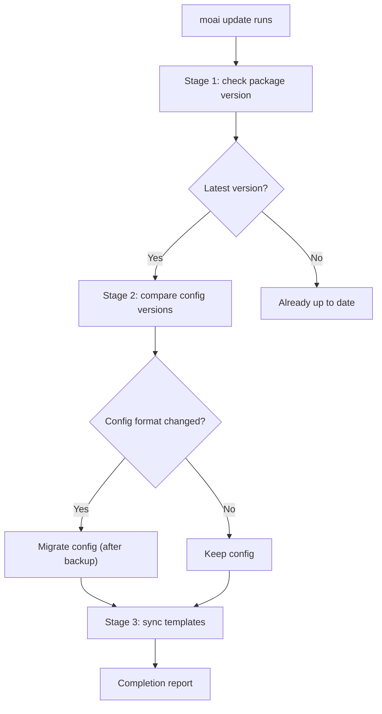
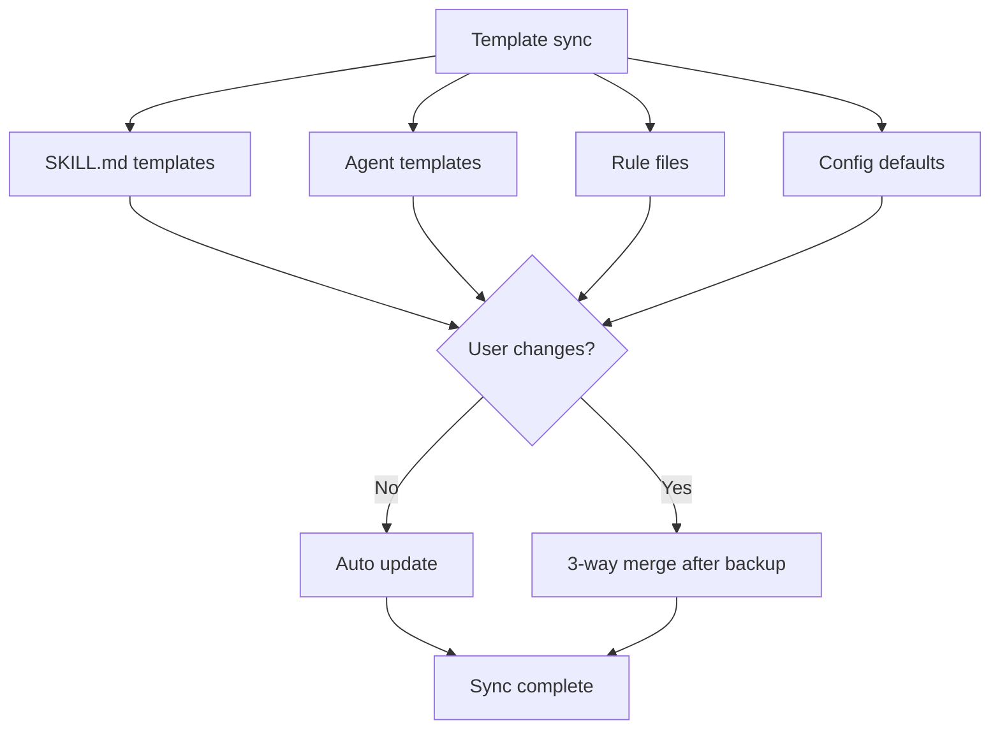

A guide to keeping MoAI-ADK up to date. A single `moai update` refreshes both the binary and the templates, and the custom assets you created are preserved automatically.

## The update command

Run without flags, it refreshes both the binary and the templates — this is the default behavior.

```bash
moai update
```

### The 3-stage smart update



### Stage 1: check package version

Compares the currently installed version with the latest version on GitHub Releases.

```bash
# Check the current version
moai --version

# Only check for available updates (no actual update)
moai update --check
```

### Mandatory Checksum Verification {#checksum-verification}

The binary download in `moai update` **cannot bypass checksum verification**. If the download or parsing of the release's `checksums.txt` fails, the update flow is **aborted** — it does not attempt the binary download.

#### Retry policy

The `checksums.txt` download is retried **3 times** with exponential backoff:

| Attempt | Wait time |
|------|-----------|
| 1st (immediate) | 0s |
| 2nd retry | wait 2s |
| 3rd retry | wait 4s |
| No further retries | fails after ~6s total wait |

If all retries fail, a message like the following is printed:

```
error: checksum unavailable: persistent retry failure after 3 attempts
```

**There is no bypass option such as `--skip-checksum`** (an intended CWE-345 policy).

#### Recovery procedure on failure

1. **Check network connectivity**:
   ```bash
   curl -I https://github.com/modu-ai/moai-adk/releases/latest
   ```
2. **Check proxy / firewall** — whether the GitHub release asset domains (`github.com`, `objects.githubusercontent.com`) are allowed
3. **Possible temporary GitHub CDN outage** — retry after a while
4. **Manual binary install** (if permanently blocked):
   ```bash
   curl -fsSL https://raw.githubusercontent.com/modu-ai/moai-adk/main/install.sh | bash
   ```
   For a manual install, it is recommended to verify the release's `checksums.txt` separately.

For the detailed threat model, see [Security Notes — CWE-345](/en/advanced/security-notes/#cwe-345).

### Stage 2: compare config versions

Checks the format and compatibility of the configuration files. When the format has changed, it backs up automatically and then migrates.

**Files checked:**

- YAML files under `.moai/config/sections/`


The `.moai/config/` directory is always backed up before a config migration.


### Stage 3: sync templates

Syncs the project templates and default files to the latest version. Files you modified are preserved, and on conflict with the new version they are backed up and merged.



## Flag reference

| Flag | Description |
|--------|------|
| `--check` | Only check whether a new version exists (no update) |
| `-c, --config` | Re-run the configuration wizard (no template sync) |
| `--force` | Force update (skip version match, force backup+merge) |
| `--yes` | Auto-approve all confirmations (CI/CD mode) |
| `--templates-only` | Skip the binary update and sync templates only |
| `--binary` | Skip template sync and update the binary only |
| `--dry-run` | Show planned actions only, with no filesystem changes |
| `--no-hooks` | Skip Git hook installation |
| `--verbose` | Show all warnings (diagnostic mode) |
| `--shell-env` | Configure shell environment variables for Claude Code |
| `--plan-type <api\|subscription>` | Override the pricing plan type |

### How it behaves

| Command | Binary update | Template sync |
|--------|-------------------|---------------|
| `moai update` |  |  |
| `moai update --binary` |  |  |
| `moai update --templates-only` |  |  |
| `moai update --check` |  |  (version check only) |

### Binary-only update

Update only the binary without syncing templates:

```bash
moai update --binary
```

### Template-only sync

Sync only the templates without updating the binary:

```bash
moai update --templates-only
```

### Re-run the configuration wizard

Re-run the configuration wizard to change the project setup (does not perform a template sync):

```bash
moai update -c
# or
moai update --config
```

### Dry Run

Preview the planned archive and install actions without making any actual changes:

```bash
moai update --dry-run
```

### CI/CD mode

Auto-approve all confirmations:

```bash
moai update --yes
```

## Post-update procedure

### Step 1: check the version

```bash
moai --version
```

### Step 2: validate the configuration

```bash
moai doctor
```

### Step 3: check new features

```bash
moai --help
```

## Managing personal settings

On a MoAI-ADK update, **CLAUDE.md** and `settings.json` are synced to the new version. Keep your personal modifications in separate files.

| File | Location | Update impact |
|------|------|--------------|
| `CLAUDE.md` | Project root |  Changed on update (MoAI-ADK managed) |
| `settings.json` | `.claude/` |  Changed on update (MoAI-ADK managed) |
| `CLAUDE.local.md` | Project root |  No impact (personal settings) |
| `.claude/settings.local.json` | Project |  No impact (personal settings) |


**Settings priority:** Local > Project > User > Enterprise<br />
`settings.local.json` overrides the project settings.


### The moai folder structure

MoAI-ADK manages files only in the following folders:

```
.claude/
├── agents/
│   ├── moai/                # MoAI-ADK agents (update target)
│   └── harness/             # User harness agents (excluded from update, preserved)
│
├── hooks/
│   └── moai/                # MoAI-ADK hook scripts (update target)
│
├── skills/
│   ├── moai-*               # MoAI-ADK skills (moai- prefix, update target)
│   └── hns-*                # User-created skills (excluded from update, preserved)
│
└── rules/
    └── moai/                # Rule files (moai managed)
```

| Type | Location | Update impact |
|------|------|--------------|
| **Agents** | `agents/moai/` |  Changed on update |
| **Hooks** | `hooks/moai/` |  Changed on update |
| **Skills** | `skills/moai-*` |  Changed on update |
| **Rules** | `rules/moai/` |  Changed on update |
| **User agents** | `agents/harness/` |  No update impact (preserved) |
| **User skills** | `skills/hns-*` (including legacy `harness-*`, `my-*`) |  No update impact (preserved) |


**Important:** Skills with the <code>moai-*</code> prefix are managed by MoAI-ADK and are overwritten on update. For skills you create yourself, use the <code>hns-*</code> prefix (the user-owned namespace), and for agents use the <code>.claude/agents/harness/</code> directory.


## Rollback

If a problem occurs after an update, you can roll back to a previous version:

```bash
# Restore a specific version via manual reinstall
curl -fsSL https://raw.githubusercontent.com/modu-ai/moai-adk/main/install.sh | bash -s -- --version <release-tag>

# Restore the config from backup
cp -r .moai/config.bak .moai/config
```


Commit your current work before rolling back.


## Troubleshooting

### Update failure

```bash
# Check the network
curl -I https://github.com/modu-ai/moai-adk/releases/latest

# Manual reinstall
curl -fsSL https://raw.githubusercontent.com/modu-ai/moai-adk/main/install.sh | bash
```

### Config migration error

```bash
# Restore from backup
cp -r .moai/config.bak .moai/config

# Validate the config
moai doctor
```

### Template conflict

Template files you modified are backed up automatically and then 3-way merged. If a conflict occurs, check the detailed warnings with `--verbose`:

```bash
moai update --verbose
```

To force an overwrite, use `--force` (your existing changes are backed up to `.moai/archive/`):

```bash
moai update --force
```

## Next steps

1. **[Check the changelog](https://github.com/modu-ai/moai-adk/releases)** — learn the new features
2. **[Core Concepts](/en/core-concepts/what-is-moai-adk)** — master the new agents and features
3. **[Quick Start](./quickstart)** — apply the new features to your project
