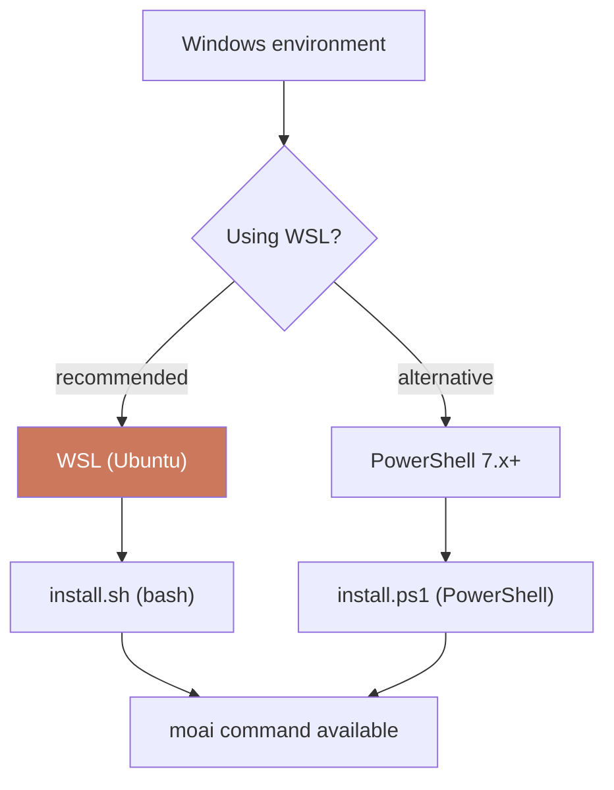

This page collects the environment requirements and common pitfalls you should know when using MoAI-ADK on Windows. Bottom line first: **WSL is the most comfortable option**. Most of the path and permission issues you hit in a native Windows environment simply do not occur under WSL.

MoAI-ADK is a single Go binary, so it runs on Windows directly. But the shell scripts, path separators, and character encoding that **Claude Code** drives follow the Linux/macOS conventions. So under the Windows command prompt (cmd.exe) or legacy PowerShell 5.x, paths drift and hook scripts fail more often than not. WSL brings a full Linux environment inside Windows, which closes that gap in one step.

This page walks through WSL installation, opening a project, and (optionally) configuring CG mode as a single flow. If you already use WSL, you can jump straight to [Step 2](#step-2--install-moai-adk-inside-wsl).



## Supported environments

| Environment | Supported | Notes |
|------|----------|------|
| **WSL (recommended)** |  Fully supported | Best experience |
| **PowerShell 7.x+** |  Supported | Alternative environment |
| PowerShell 5.x (legacy) |  Not supported | Windows PowerShell |
| cmd.exe |  Not supported | Command Prompt |

**Requirements:**
- [Git for Windows](https://gitforwindows.org/) must be installed
- WSL or PowerShell 7.x or later

## Step 1 — Install WSL

WSL lets you use a Linux environment inside Windows and fully supports every MoAI-ADK feature. Run a single command in an administrator PowerShell. The biggest reason to choose WSL is that the shell scripts, path rules, and character encoding that Claude Code and MoAI-ADK rely on follow Linux conventions — WSL brings those conventions into Windows verbatim, removing the path and encoding pitfalls you hit in a native environment.

```powershell
# Run in an administrator PowerShell
wsl --install

# Default distribution: Ubuntu (recommended)
# After restarting, set your username and password
```

When installation finishes, you will be prompted to restart. After the restart Ubuntu opens automatically and you set a Linux username and password. This username is separate from your Windows account, so the path problems caused by a Korean Windows username do not occur here.

You can use PowerShell 7.x or later as an alternative, but WSL hits far fewer pitfalls. Native PowerShell frequently makes hook scripts behave differently than expected, or leaves files in unexpected locations, because of path-separator and shell-syntax differences. WSL gives you the same commands, the same file paths, and the same behavior as the Linux version.

## Step 2 — Install MoAI-ADK inside WSL

Open a WSL terminal (Ubuntu) and run the install script. It is the same one-line command as on macOS/Linux. Inside WSL there is no need to touch the Windows PATH or registry; the single binary is installed under the Linux home directory.

```bash
# Install MoAI-ADK inside WSL
curl -fsSL https://adk.mo.ai.kr/install.sh \
  | bash
```

When installation finishes, verify the version. If the command is not found, reopening the shell so PATH is re-read usually resolves it.

```bash
moai version
```

If you only use PowerShell 7.x+, use the dedicated install script. The PowerShell path installs on top of the Windows filesystem, unlike WSL, so you are somewhat more likely to hit Korean-username path or permission issues.

```powershell
irm https://adk.mo.ai.kr/install.ps1 | iex
```

> **Note**: Prefer WSL where possible. The PowerShell path hits more frequent pitfalls in shell-script compatibility — `install.ps1` is the Windows alternative to `install.sh`, not a guarantee of identical behavior.

## Step 3 — Open a project (VS Code integration)

Inside WSL, create a project and open it with VS Code. With the VS Code WSL extension, the VS Code installed on Windows drives the WSL filesystem directly.

First pick a project directory. Placing it under a WSL-native path (under `~/`) is fastest because it avoids cross-filesystem overhead.

```bash
# Use the WSL native filesystem (faster)
cd ~/projects/
moai init my-project
cd my-project
```

When you need to reach the Windows filesystem, use the `/mnt/c/` mount.

```bash
# Access the Windows filesystem
cd /mnt/c/Users/<username>/projects/
```

VS Code integration is three steps.

1. Install the [WSL extension](https://marketplace.visualstudio.com/items?itemName=ms-vscode-remote.remote-wsl) in VS Code
2. Run `code .` from a WSL terminal
3. VS Code opens in WSL mode automatically

You can now run `moai init` from the WSL terminal to initialize a project, then start a Claude Code session inside VS Code. The VS Code terminal opens as a WSL shell, so you can use the `moai` command and Claude Code together in a single window without opening a separate terminal.

## Step 4 — (Optional) CG mode and tmux

[CG mode](/en/multi-llm/cg-mode) (Claude leader + GLM teammates) requires tmux. Under WSL, install it with a single command.

```bash
# Ubuntu/Debian
sudo apt install tmux

# Start a tmux session
tmux new -s moai

# Run CG mode
moai cg
```

Without tmux, `moai cg` fails immediately — CG mode injects GLM environment variables inside a tmux session and opens multiple panes, which is its structure.

## Non-ASCII username path errors

### Symptom

When a Windows username contains non-ASCII characters such as Korean or Chinese, path handling can drift in some legacy tools or during 8.3 short-filename conversion. If the home-directory path contains non-ASCII characters, certain commands fail outright.

```
C:\Users\홍길동\...
```

In this case, the surest fix is to set up an ASCII-only path environment using one of the methods below.

### Solution 1: Enable 8.3 filename generation

Set the system (with administrator privileges) so that an 8.3 short filename (an ASCII alternative path) is generated.

```powershell
fsutil 8dot3name set 1
```

> **Caution**: This setting applies system-wide, so some legacy programs may be affected.

### Solution 2: Create an ASCII user account

Creating a new Windows user account with an English name removes the home-directory path problem at its root.

### Solution 3: Use WSL

The most recommended approach is to work inside the WSL installed in [Step 1](#step-1--install-wsl). The WSL native filesystem never experiences the non-ASCII home-path problem.

## Troubleshooting

| Problem | Cause | Solution |
|------|------|------|
| `moai: command not found` | Install directory not on PATH | The install script installs to `~/.local/bin` — add `export PATH="$HOME/.local/bin:$PATH"` to `.bashrc` (if installed via `go install`, `$HOME/go/bin`) |
| Korean-path handling failure | Korean username | See [Non-ASCII username path errors](#non-ascii-username-path-errors) above |
| Permission denied | Install script permissions | Run `chmod +x install.sh` and retry |
| Git commands fail | Git for Windows not installed | Install [Git for Windows](https://gitforwindows.org/) |
| tmux missing | CG mode cannot run | `sudo apt install tmux` (in WSL) |

## Next steps

- [Installation](/en/getting-started/installation) — Detailed installation guide
- [Initial Setup](/en/getting-started/init-wizard) — Project initialization
- [CG Mode](/en/multi-llm/cg-mode) — Claude + GLM hybrid mode
- [moai-adk on GitHub](https://github.com/modu-ai/moai-adk) — Source code and issue tracker
