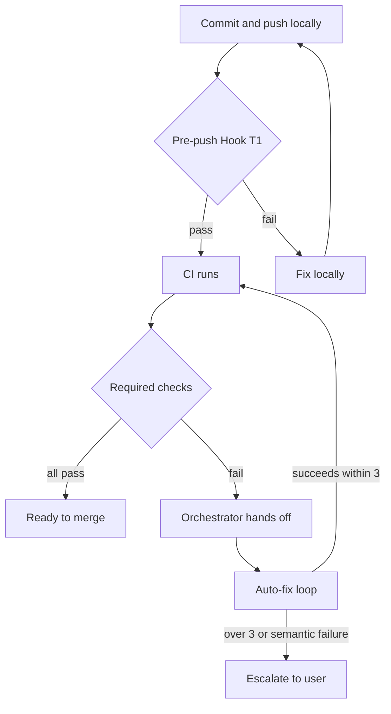

When a red light goes on in the CI (continuous integration) server, a developer usually runs over, reads the logs, finds the cause, and fixes it. MoAI-ADK has the tool take over this repetitive work. It verifies locally before push, and when CI fails it runs a loop where the machine diagnoses and patches itself and then re-verifies. The developer no longer has to turn the "diagnose → fix → verify" cycle by hand. It is a case of the agentic loop — a structure where an agent judges and iterates on its own — applied at the repository level.

This guide walks you through that autonomous CI/CD system end to end. You will see the order in which several lines of defense fire, and at each step what the developer does by hand versus what is delegated to the tool. After reading, you should be able to explain the concept to a friend in two sentences: "When CI breaks, MoAI-ADK catches the cause on its own, fixes it, and re-runs verification. So instead of running over at a red light, I can be doing something else." That is the target shape of the explanation.

## What the lines of defense do

MoAI-ADK's autonomous CI/CD is a series of defensive lines. If one line fails to catch a problem, the next one receives it. The flow starts at local pre-push verification and continues all the way to CI auto-fix; the figure below shows the shape.



This figure, flowing from the upper left downward, is the overall shape of autonomous CI/CD. A block at the local level means: fix and push again. A block at CI means: the auto-fix loop runs. And only when the loop cannot patch it does the matter pass to the user.

## The 8-Tier architecture at a glance

Introduced in SPEC (requirements specification) V3R3-CI-AUTONOMY-001, this system consists of 8 tiers. Each tier is an independent line of defense.

| Tier | Name | Priority | Description |
|------|------|----------|------|
| T1 | Pre-push Hook | P0 | Automatic quality verification before push |
| T2 | Branch Protection | P0 | main branch protection rules |
| T3 | Auto-fix Loop | P1 | Automatic fixes on CI failure |
| T4 | Auxiliary Workflows | P2 | Auxiliary workflow housekeeping |
| T5 | Worktree State Guard | P1 | Guarantees worktree state integrity |
| T6 | i18n Validator | P2 | 4-locale documentation consistency checks |
| T7 | BODP | P0 | Branch Origin Decision Protocol |
| T8 | Release Workflow | P1 | Release automation |

The per-step sections below walk through T1, T3, T7, and T6 — the ones a developer touches directly. T2, T4, T5, and T8 are configured once at the repository level and then work invisibly.

## Step 1 — Turn on local pre-push verification (Pre-push Hook)

The first line of defense is to run quality verification locally and automatically before push. It cuts off, in advance and locally, the round-trip cost of going all the way to CI, failing, and coming back.

Running `moai init` or `moai update` installs the pre-push hook automatically. No separate installation step is needed.

```bash
# illustrative-only — the mapping installed automatically on moai init / moai update
.git/hooks/pre-push → moai hook pre-push
```

When you push, this hook runs the verifications below. The project language is detected automatically.

- `go vet` / `golangci-lint` (auto-detected by project language)
- `go test ./...` (the test suite)
- MX tag (semantic markers attached to code) integrity check

To confirm the hook landed correctly or to run it once by hand, use the command below.

```bash
moai hook pre-push
```

If any verification fails, the push is blocked. Read the log, fix the cause, and push again. You get immediate feedback locally without waiting on a CI round-trip. This single line cuts the developer's "waiting on broken CI" time.

## Step 2 — Let automatic fixing handle CI failure (Auto-fix Loop)

Even if local verification passes, the CI environment may produce a different result — operating-system differences, dependency versions, or interference between parallel sessions are common causes. That is when the T3 Auto-fix Loop kicks in.

After `/moai sync` creates a PR (pull request), the orchestrator (the central agent that coordinates work) hands off a failing required check, and the `manager-develop` agent runs the "diagnose → fix → re-verify" loop as its `cycle_type=autofix` cycle. It extends the local diagnostic self-fix loop onto the PR pipeline. Without developer intervention, the agent prepares a patch and re-verifies on its own.

The entry condition and the safety rails are fixed.

- **Entry condition** — the loop starts only when at least one required check is failing AND the orchestrator hands off, naming the pull request and branch under repair. The orchestrator is the sole entry point.
- **Iteration cap** — at most 3 iterations per PR push. On the fourth, the loop attempts no patch and escalates to the user through a blocking `AskUserQuestion`.
- **Semantic failures** — data race, deadlock, panic, and test assertion failures are never auto-patched; they go to human judgment. The intent is to avoid patching the surface while hiding the core defect.
- **Protected files** — secrets, credentials files, and CI workflow definitions are never modified by the loop, because patching the layer that reports a failure can turn a real failure into a false green.

Every iteration records its diagnosis, patch, and result under `.moai/logs/ci-autofix/`. To look back at what was fixed, list the recent logs with the command below.

```bash
ls -t .moai/logs/ci-autofix/
```

The SSoT (single source of truth) for the iteration cap, the escalation contract, semantic-failure handling, and the protected-file list is `.claude/rules/moai/workflow/ci-autofix-protocol.md`. When you want the loop's concrete behavior, read that file first.

## Step 3 — Pick the base of a new branch automatically (BODP)

When you create a new branch or worktree (an independent Git workspace), the question of where to base it comes up every time — should it branch off `main`, or continue from the branch currently in progress? The answer differs by situation. The BODP (Branch Origin Decision Protocol) makes that decision for you automatically.

BODP evaluates three signals.

| Signal | Source | Meaning |
|--------|------|------|
| Signal A | SPEC `depends_on` + diff path overlap | Code dependency |
| Signal B | `.moai/specs/<NewSpecID>/` match in `git status` | Working tree co-location |
| Signal C | `gh pr list --head <branch> --state open` ≥ 1 | Current branch PR |

Combining the three signals, it decides as follows.

| Signals | Decision |
|--------|------|
| A only | `stacked` — based on the current branch |
| B present | `continue` — continue in the current context |
| C only | `stacked` — based on the current branch |
| None | `main` — based on origin/main |

Every BODP decision is recorded in `.moai/branches/decisions/<branch-name>.md`. Decisions are left as records, not guesses. The MoAI principle of judging completion by evidence applies to choosing a branch as well. To review past decisions, list the decision-record directory with the command below.

```bash
ls .moai/branches/decisions/
```

## Step 4 — Verify 4-locale documentation consistency (i18n Validator)

When documentation exists in four languages, fixing one side often leaves the others out of sync — a translation drops out, heading structure drifts, or terminology diverges. The T6 i18n Validator verifies this consistency automatically.

```bash
scripts/docs-i18n-check.sh
```

The checks are as follows.

- Matching file counts and paths across the 4 locales
- Front matter `title` present
- H1 heading present
- MoAI glossary compliance

Lift this check into CI and you catch missing translations or structural drift before merge. You do not have to compare four languages line by line by hand. The rule "every time you touch documentation, touch all four locales together" is enforced mechanically by this check.

## The remaining lines of defense

These are the tiers you did not exercise by hand above. Once configured at the repository level, they keep working invisibly.

- **T2 Branch Protection** — applies protection rules to the main branch: direct push is blocked, and passing the required checks becomes a merge condition.
- **T5 Worktree State Guard** — guarantees worktree state integrity. It detects uncommitted changes, checks the sync state between the worktree and the main branch, and surfaces that state in `moai status`.
- **T4 Auxiliary Workflows** — keeps the auxiliary workflows tidy so the CI configuration does not scatter.
- **T8 Release Workflow** — handles release-stage automation.

## Summary and next steps

In one line, autonomous CI/CD is "block it locally in advance, and when CI breaks the machine fixes it on its own." The touch points a developer handles directly are pre-push verification (T1) and the CI auto-fix loop (T3); BODP (T7) and the i18n check (T6) are auxiliary lines that help the work flow. The rest are configured once at the repository level and then work invisibly.

Related documents to read next:

- [Worktree Guide](/en/worktree/guide) — the complete Git Worktree guide
- [/moai loop](/en/utility-commands/moai-loop) — the iterative fix loop
- [/moai fix](/en/utility-commands/moai-fix) — automatic error fixing
- [GitHub Integration Guide](/en/guides/github-integration) — issue parsing · SPEC linking
