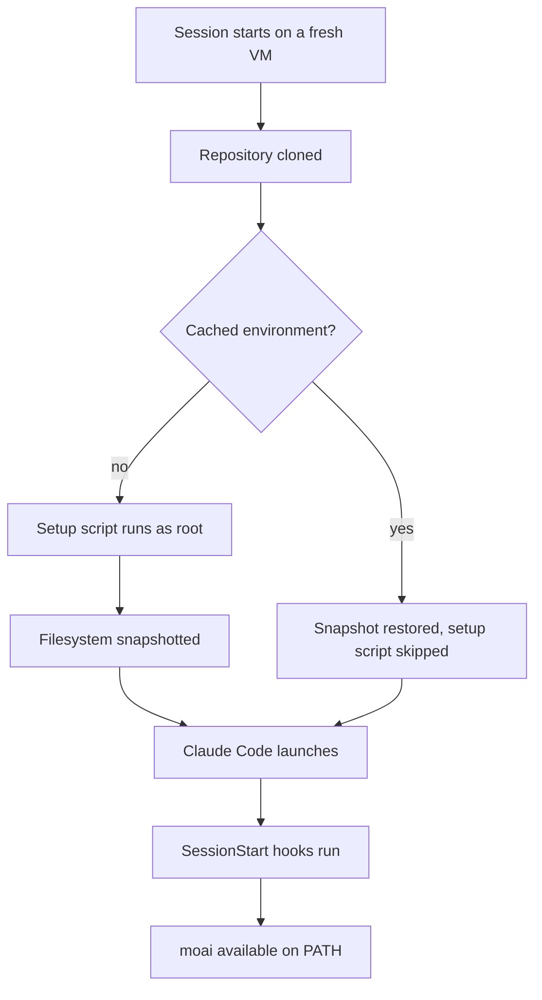

A cloud session starts from a fresh clone of your repository on an Anthropic-managed VM. Everything
MoAI-ADK keeps in the repository — `CLAUDE.md`, `.claude/settings.json` and its hooks,
`.claude/rules/`, `.claude/skills/`, `.claude/agents/`, `.claude/commands/`, and `.mcp.json` — arrives
with that clone. One thing does not: the `moai` binary, which lives on your own machine and was never
part of the repo.

That single gap is what this guide closes. Without the binary, the hooks wired in `.claude/settings.json`
fail, `moai` commands are not found, and the MCP server declared in `.mcp.json` never starts. With it,
a cloud session behaves like a local one.

## The recipe

Open the environment settings dialog at [claude.ai/code](https://claude.ai/code) and paste this into
the **Setup script** field:

```bash
#!/bin/bash
curl -fsSL https://raw.githubusercontent.com/modu-ai/moai-adk/main/install.sh \
  | bash -s -- --install-dir /usr/local/bin || true
moai --version || true
```

Three details in that snippet are load-bearing, and each one is there because the obvious form fails.

**The installer is fetched from `raw.githubusercontent.com`, not from `adk.mo.ai.kr`.** The
`curl -fsSL https://adk.mo.ai.kr/install.sh | bash` form documented in the README is the one to use on
your own machine; in a cloud session the environment's default **Trusted** network level allows a fixed
list of domains, and `adk.mo.ai.kr` is not on it. GitHub is: `github.com`, `raw.githubusercontent.com`,
`objects.githubusercontent.com`, and `release-assets.githubusercontent.com` all resolve, which covers
both the script and the release asset it downloads. The file served from `raw.githubusercontent.com` is
the same `install.sh` that lives at the repository root.

**`--install-dir` is passed as a flag, not as an environment variable.** The installer resets
`INSTALL_DIR` when it parses its arguments, so `INSTALL_DIR=/usr/local/bin bash` is silently ignored and
the binary lands somewhere else. Left to its own defaults on the VM it would choose `$GOPATH/bin` or
`~/.local/bin`, neither of which is guaranteed to be on `PATH` for the session — `/usr/local/bin` is.

**`|| true` guards the exit code.** A setup script that exits non-zero fails the whole session, so a
transient network hiccup during install would stop you from starting a session at all rather than
starting one without `moai`. The trailing `moai --version` is there to put the installed version in the
setup log; it carries the same guard for the same reason.

## Why not `go install`

The obvious Go-native form does not work, and it fails in a way worth stating plainly so nobody spends
an afternoon on it:

```bash
go install github.com/modu-ai/moai-adk/cmd/moai@latest
# go: module github.com/modu-ai/moai-adk@latest found (v1.14.5),
#     but does not contain package github.com/modu-ai/moai-adk/cmd/moai
```

The module path is `github.com/modu-ai/moai-adk` with no `/v3` suffix, and Go's semantic import
versioning requires that suffix for any major version at or above 2. So `@latest` resolves to the
newest tag the un-suffixed path can carry — `v1.14.5`, from long before `cmd/moai` existed. Asking for
a v3 release by name is refused outright:

```bash
go install github.com/modu-ai/moai-adk/cmd/moai@v3.1.2
# go: invalid version: module contains a go.mod file, so module path must match
#     major version ("github.com/modu-ai/moai-adk/v3")
```

`@main` does build, because a pseudo-version from a branch sidesteps the major-version rule. It is not
the recommended path for a cloud environment, for three reasons: it compiles the whole tree rather than
downloading a binary (over a minute and a half on a warm local machine, against roughly two seconds for
the installer), it depends on the VM's Go being new enough for this module's `go` directive, and the
resulting binary carries no version stamp — `moai version` reports the compiled-in default rather than
the release it was built from, which makes any later "which version is this?" question unanswerable.

## What runs when



The setup script runs once, before Claude Code launches. Anthropic then snapshots the filesystem and
reuses it for later sessions, so the install cost is paid once rather than per session. The snapshot
keeps what was written to disk — the binary included — and loses anything that was merely running.

The script runs again when you change it, when you change the environment's allowed network hosts, and
when the snapshot expires after roughly seven days. That cadence is why the recipe installs the latest
release rather than a pinned one: each rebuild picks up the current version. If you would rather pin,
add the flag:

```bash
curl -fsSL https://raw.githubusercontent.com/modu-ai/moai-adk/main/install.sh \
  | bash -s -- --install-dir /usr/local/bin --version 3.1.2 || true
```


Setup scripts must finish within roughly five minutes for the cache to build. The installer downloads a
prebuilt binary and completes in seconds, so it leaves the budget to whatever else your project needs.


## Verifying it

Ask Claude to run these in the cloud session. They are ordinary shell commands, so Claude runs them for
you:

```bash
which moai              # /usr/local/bin/moai
moai --version          # the release the setup script installed
moai doctor             # environment health, including MCP wiring
```

If `which moai` comes back empty, the setup script either did not run — a cached environment skips it —
or failed while `|| true` swallowed the error. Change the script (any edit invalidates the cache),
start a fresh session, and read the setup log.

## What this does not cover

The environment dialog holds the setup script and environment variables in plain text, readable by
anyone who uses that environment, and there is no secrets store yet. Nothing in this recipe needs a
credential, and nothing here should be extended to carry one. If your project needs `GH_TOKEN`, the
session's GitHub proxy already authenticates `gh` without it.
