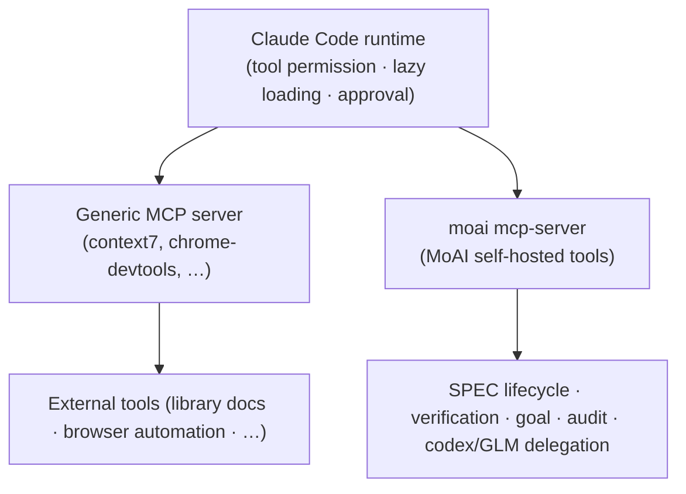

# MCP Server

MoAI-ADK rides on top of the Claude Code MCP ecosystem, then adds **its own MCP server** on top of that. A single binary (`moai mcp-server`) runs as a stdio local server, exposing MoAI-ADK-specific tools — SPEC lifecycle audit, verification snapshots, the goal engine, cross-model audit, codex/GLM delegation — to the Claude Code runtime.


[**Claude Code generic MCP**](/en/claude-code/extensibility/mcp) covers the platform's own MCP (Model Context Protocol) integration — the USB-port analogy, server registration, transport types, the `/mcp` command, OAuth authentication, and the lazy-loading principle.

This document covers the **MoAI self-hosted MCP server** that sits on top of it. The two surfaces share the same core rules, but they cover different subjects.


## Same core, two surfaces

The Claude Code MCP ecosystem and MoAI's self-hosted MCP server are separate servers, yet they rest on **identical operating principles**. They share three core rules.

| Core rule | Meaning |
|-----------|---------|
| **MCP-over-CLI** | The same capability is exposed both as a CLI and as an MCP tool, but when the MCP tool is in the agent's `tools:` list, the MCP path is preferred over the CLI. It offers structured output, avoidance of shell-quoting, and low latency inside subagents. |
| **Lazy loading** | MCP tool definitions are lazy-loaded by default. Normally only short metadata sits in the context, and the schema is loaded via `ToolSearch` at the moment of an actual call. |
| **Permission gate** | MCP tools pass through the same permission gate as Claude's ordinary tools. On the first call, an approval prompt surfaces in the main session, and once allowed, subsequent calls to the same tool do not ask again. |



The key point is that "MoAI does not provision MCP" is a **half-truth**. It is true that external MCP servers (context7, playwright, etc.) are not provisioned by default. But the one MoAI self-hosted server is installed as default-on at `moai init` time. This server is the channel through which MoAI's tool catalog reaches Claude Code.

## .mcp.json provisioning

`moai init` creates `.mcp.json` (project scope) at the project root and places **exactly one active entry** inside it — the self-hosted `moai` local stdio server.

```json
{
  "mcpServers": {
    "moai": {
      "command": "moai",
      "args": ["mcp-server"]
    }
  },
  "staggeredStartup": {
    "enabled": true,
    "delayMs": 500,
    "connectionTimeout": 15000
  }
}
```

`staggeredStartup` is a Claude Code runtime field that regulates servers so they start sequentially. When there are multiple servers, it prevents a simultaneous-startup race.

### Four documented-but-disabled entries

The distribution default activates only the `moai` server. Four external servers are documented but disabled, and are turned on with the `moai mcp add <name>` command.

| Server | Purpose | Activation |
|--------|---------|------------|
| `context7` | Looking up official up-to-date library docs (resolve-library-id, get-library-docs) | `moai mcp add context7` |
| `chrome-devtools` | Headless browser automation | `moai mcp add chrome-devtools` |
| `playwright` | Browser automation + E2E testing | `moai mcp add playwright` |
| `ast-grep` | Structural code search and refactoring | `moai mcp add ast-grep` |

### Neutrality contract

`.mcp.json` is a git-tracked file. Therefore, "entries that carry secrets, entries that require credentials, and entries that fail the neutrality check" are **forbidden**. Every environment-variable value is written as a `${VAR}` literal — the Claude Code runtime expands the actual value, so interpreted secrets are never serialized into the git-tracked `.mcp.json`.

```json
{
  "remote-needs-auth": {
    "type": "http",
    "url": "https://mcp.example.com/sse",
    "headers": {
      "Authorization": "Bearer ${MY_API_KEY}"
    }
  }
}
```

`${MY_API_KEY}` is filled by the runtime from the environment variable. Only the literal string remains in the file itself, so the secret is never exposed in the repository.

### atomic-RWM management

Users never hand-edit `.mcp.json`. The `moai mcp add|remove|list` CLI manages the file, and this CLI operates through an atomic-RWM seam (flock file locking + compare-retry + backup-before-write + idempotent-skip). Even if two sessions edit simultaneously, one side's change does not overwrite the other.

## The `project_root` input — the caller names its own tree

Thirteen tools accept an optional `project_root` string: `spec_progress`, `spec_audit`, `spec_drift`, `verify_snapshot`, `verify_trend`, `codex_audit`, `claude_audit`, `glm_audit`, `audit_multi`, `graph_file_api`, `graph_find_code`, `graph_trace_calls`, and `graph_shortest_path`. It names the tree the call should act on, and the value to pass is the caller's own `git rev-parse --show-toplevel`.

An agent working inside a worktree must pass it. This is not a convenience. The server has no way to work the answer out for itself: it is a long-lived subprocess, so its working directory cannot follow a worktree switch, and the environment variable it falls back on names the **project** root — the primary checkout — even for a session working in a worktree. Omit it from a worktree and the call acts on the primary checkout instead, which means a SPEC that exists only on the card's branch is not in the catalog the auditor reads. It is not reported missing. It is simply absent.

The caller is the only party that holds the answer. That is why it is an input rather than something inferred.

| Situation | What to pass | What happens |
|-----------|--------------|--------------|
| Session in a worktree | `project_root: <git rev-parse --show-toplevel>` | the call acts on that tree |
| Session in the primary checkout | nothing | resolves exactly as it always has |
| Linked worktree of a repository that does not track `.moai` (the worktree has no `.moai` of its own) | `project_root: <git rev-parse --show-toplevel>` | accepted when git lists it as a worktree of a primary checkout that has `.moai`; the call acts on the worktree |
| Path that is not a MoAI project root | — | the call is **rejected** with an error naming the path |

The rejection is deliberate, not a rough edge. A silent fallback to the default would send a caller who mistyped its own worktree path back to auditing the primary checkout while reporting success — the exact failure the parameter exists to prevent.

A linked worktree of a repository that keeps `.moai` out of git has no `.moai` of its own, and it is still accepted — but only when the path is the top level of a worktree that `git worktree list` registers and the repository's primary checkout has `.moai`. A subdirectory, an unregistered or prunable worktree, an ambiguous layout such as a separate git directory, or a machine where git is unavailable is rejected. On such a worktree, when it has no workflow config of its own, the explicit audit gate (`workflow.audit.gates`) is read from the primary checkout; when the primary cannot be identified, the gate is treated as `required`, so a missing verdict fails rather than passes. Other configuration, the SPEC catalog, and state are still read from the worktree itself, so catalog and state answers there carry a `_root.worktree_warning`: an empty result may only mean that `.moai` is not tracked.

For `audit_multi` the root reaches **both** backends of the fan-out: codex receives it as the directory it reviews in, and the GLM path uses it to collect the diff it sends to z.ai. Passing it is what keeps the two secondary opinions about the same tree — without it they can review different ones.

Version caveat: a server that is already running keeps the old behavior until it restarts, even after the binary underneath it is replaced — a subprocess does not reload itself. What a caller can check is whether `project_root` appears in the `ListTools` response.

## Tool catalog

The tools exposed by `moai mcp-server` are summarized below by family. At call time they all carry the `mcp__moai__` prefix. This page does not state a tool count. The authoritative count and list are what the installed binary returns from `tools/list`, documented in `.claude/rules/moai/core/moai-mcp-tools.md`; where either differs from this page, follow them.

### SPEC lifecycle

| Tool | Purpose | Consumer agent | CLI equivalent |
|------|---------|----------------|----------------|
| `mcp__moai__spec_progress` | List SPEC documents + frontmatter | manager-spec, manager-docs | `moai spec list` |
| `mcp__moai__spec_audit` | SPEC lifecycle audit (era classification + drift) | manager-spec, manager-docs, plan-auditor, super-advisor | `moai spec audit` |
| `mcp__moai__spec_drift` | Modern-era V3R6 drift findings | manager-spec, plan-auditor | `moai spec audit` (drift view) |

Used in the plan phase (when manager-spec authors a new SPEC, checking era classification and drift) and the sync phase (when manager-docs verifies lifecycle closure). plan-auditor performs skeptical plan-phase review with `spec_audit` / `spec_drift`.

### Verification snapshots

| Tool | Purpose | Consumer agent | CLI equivalent |
|------|---------|----------------|----------------|
| `mcp__moai__verify_snapshot` | Read/record per-key verification snapshots | manager-develop | `moai verify check` |
| `mcp__moai__verify_trend` | Per-key verification history trend | manager-develop, sync-auditor, super-advisor | `moai verify check` |

Used by manager-develop during run-phase self-verification (attribution seam §E), and by sync-auditor and super-advisor to review trends. `verify_snapshot` reads or records snapshots keyed by the HEAD digest, and `verify_trend` surfaces the history for judging convergence.

### Goal + session (autonomous loop)

| Tool | Purpose | Consumer agent | CLI equivalent |
|------|---------|----------------|----------------|
| `mcp__moai__goal_arm` | Arm a condition-declared goal | **orchestrator main session ONLY** (wired to no agent) | `moai goal arm` / `/moai goal` |
| `mcp__moai__goal_status` | Read armed-goal state | manager-develop, manager-lead | `moai goal status` |
| `mcp__moai__session_list` | List active moai sessions | manager-lead | `moai session list` |

`goal_arm` is orchestrator-only — arming an autonomous loop is an orchestrator concern, so it is never called inside an agent. This is a design decision to preserve the flat-hierarchy arming surface. `goal_status` is the channel through which manager-develop / manager-lead read the progress of the armed condition, and `session_list` is a race-mitigation tool for manager-lead to detect concurrent sessions on the same checkout before fan-out.

### Cross-model audit (second opinion)

| Tool | Purpose | Consumer agent | CLI equivalent |
|------|---------|----------------|----------------|
| `mcp__moai__audit_multi` | Multi-auditor convergence (claude + codex + glm) | plan-auditor, sync-auditor | — (MCP-only convergence entry point) |
| `mcp__moai__claude_audit` | Single Claude-subscription backend audit (`claude -p`, read-only isolation, structured output) | plan-auditor, sync-auditor; called automatically by `audit_multi` in GPT/GLM sessions | — |
| `mcp__moai__codex_audit` | codex backend single audit (native/adversarial) | plan-auditor, sync-auditor | — |
| `mcp__moai__glm_audit` | GLM (z.ai) backend single audit | plan-auditor, sync-auditor | — |
| `mcp__moai__audit_cache` | plan-audit PASS cache (compute_hash / lookup / store, process-shared) | sync-auditor | `moai audit cache` |

The single-backend audit mode is determined by the project's `audit_model` setting: `codex+glm` (default, converges via `audit_multi`) | `glm` | `codex` | `none` (Claude-only, no backend call). All backends are fail-open — an unavailable backend returns `inconclusive`, never a Go error.

### codex delegation (background jobs)

| Tool | Purpose | Consumer agent | CLI equivalent |
|------|---------|----------------|----------------|
| `mcp__moai__codex_task` | Delegate a coding/investigation task to codex (sync or background) | super-advisor | `moai codex task` |
| `mcp__moai__codex_setup` | Probe local codex install (LookPath + version + auth) | super-advisor | `moai codex setup` |
| `mcp__moai__codex_job_status` | Read a background codex job's status/record | super-advisor | `moai codex job status` |
| `mcp__moai__codex_job_result` | Read a background codex job's output | super-advisor | `moai codex job result` |
| `mcp__moai__codex_job_cancel` | Stop a running background codex job | super-advisor | `moai codex job cancel` |

The codex delegation family is wired into super-advisor — because the on-demand high-reasoning consultation agent is the natural consumer of background cross-model delegation. It delegates a task with `codex_task`, polls completion with `codex_job_status` / `codex_job_result`, and cancels with `codex_job_cancel`. codex is optional — if it is missing or unavailable, it returns fail-open `inconclusive`, never a hard error.

### codex read-only roles

| Tool | Purpose | Consumer | CLI equivalent |
|------|---------|----------|----------------|
| `mcp__moai__codex_role_audit` | Start one read-only role as a top-level `codex exec` process (read-only sandbox, every MCP server disabled); returns a job id at once | Codex lane orchestrator | — |
| `mcp__moai__codex_role_audit_status` | Read a role job's state and timestamps | Codex lane orchestrator | — |
| `mcp__moai__codex_role_audit_result` | Read a finished role job's exit code, returned text or verdict path, and launch record path | Codex lane orchestrator | — |

A Codex lane starts read-only roles such as `plan-auditor` and `sync-auditor` through this family rather than through `spawn_agent`. There is no CLI equivalent, because a nested `codex exec` inside a lane's shell cannot reach the model. Jobs live in the server process and end with it.

### GLM delegation (background jobs)

| Tool | Purpose | Consumer agent | CLI equivalent |
|------|---------|----------------|----------------|
| `mcp__moai__glm_task` | Delegate a task (arbitrary prompt) to GLM (z.ai) (sync or background) | super-advisor | — (no such CLI) |
| `mcp__moai__glm_job_status` | Read a background GLM job's status/record | super-advisor | — |
| `mcp__moai__glm_job_result` | Read a background GLM job's output | super-advisor | — |
| `mcp__moai__glm_job_cancel` | Stop a running background GLM job | super-advisor | — |

The GLM delegation family is wired into super-advisor in the same shape as the codex delegation family. `glm_task` returns the completed text as-is when `background` is false, and returns a job ID immediately when true (observed and cancelled afterwards with `glm_job_status` · `glm_job_result` · `glm_job_cancel`). The response token ceiling can be overridden with `max_tokens`; a default ceiling is set on the server side. Background jobs live inside the server process, so they end with it. GLM is optional too — a missing key or an unreachable z.ai returns a structured fail-open result, never a tool error.

### Code queries

| Tool | Purpose | Consumer | CLI equivalent |
|------|---------|----------|----------------|
| `mcp__moai__graph_file_api` | List one source file's exported declarations with signatures (no bodies) | any agent | — |
| `mcp__moai__graph_find_code` | Search the code-derived edge layer for a symbol's call sites and callers (each edge carries its resolution confidence) | any agent | — |
| `mcp__moai__graph_trace_calls` | Trace call edges from a symbol toward callers and callees, up to a given depth | any agent | — |
| `mcp__moai__graph_shortest_path` | Shortest call path between two symbols (at most 8 hops, each with its line and confidence) | any agent | — |

Every answer names the tree root and commit it was computed from. The edge layer is the `edges.jsonl` built by `moai graph build`.

### Judgment (gated, display-only)

| Tool | Purpose | Consumer | CLI equivalent |
|------|---------|----------|----------------|
| `mcp__moai__jev_ask` | Ask typed questions over one supplied state and receive typed answers with probabilities | unavailable at the shipped default (`workflow.jev.enabled: false`) | — (MCP-only) |

The tool is always registered, but with the gate off it builds no request and makes no network call. Its answer is a signal for a person to read — never a completion verdict, merge approval, queue mutation, or gate input.

### Factory messaging

| Tool | Purpose | Consumer | CLI equivalent |
|------|---------|----------|----------------|
| `mcp__moai__factory_msg_send` | Write one idempotent envelope to the current endpoint of a logical lane | attributed factory lead or worker session | — (MCP-only) |
| `mcp__moai__factory_msg_list` | Claim up to 16 metadata records for the caller's endpoint (creating or renewing the claim lease; no body) | attributed factory lead or worker session | — (MCP-only) |
| `mcp__moai__factory_msg_body` | Read one already-claimed message body (returned as untrusted peer data) | attributed factory lead or worker session | — (MCP-only) |
| `mcp__moai__factory_msg_receipt` | Record the claim disposition, then acknowledge the message | attributed factory lead or worker session | — (MCP-only) |
| `mcp__moai__factory_msg_status` | Read broker counts and lane operational state without claiming messages | factory lead or worker | — (MCP-only) |

### Session messaging (Claude ↔ Codex)

| Tool | Purpose | Consumer | CLI equivalent |
|------|---------|----------|----------------|
| `mcp__moai__session_msg_register` | Register this session (kind: claude or codex, plus a name) with the local message broker; the same kind and name return the same id | any Claude or Codex session | — |
| `mcp__moai__session_msg_list` | List registered broker agents (id, name, kind, online, pending count) | any Claude or Codex session | — |
| `mcp__moai__session_msg_send` | Send a short, self-contained fact message to another registered agent's mailbox | any Claude or Codex session | — |
| `mcp__moai__session_msg_poll` | Claim pending messages from the caller's mailbox (at-least-once) and acknowledge processed ids | any Claude or Codex session | — |

A Codex session has no native peer-messaging runtime, so this broker is its only path; between Claude sessions the native `SendMessage` path is recommended. Delivery is poll-based: a send is a record, not a delivery guarantee.

### MCP-over-CLI rule

When the MCP tool is in the agent's `tools:` list, the MCP path is preferred over the CLI. The two paths run **the same implementation** underneath. The MCP path is advantageous for three reasons:

- It returns structured output (no parsing needed)
- It avoids shell-quoting hazards
- It runs with low latency in environments where Bash may be restricted inside a subagent

The CLI is used only when the MCP tool is not in the `tools:` list, or when the CLI form reads more naturally from the main session.

## Authentication

### GLM (z.ai)

When running in a GLM session (`moai glm`), web search and web fetch are routed to z.ai MCP tools instead of the built-in `WebSearch` / `WebFetch`. Authentication is read from `~/.moai/.env.glm`.

The z.ai MCP servers (`zai-mcp-server`, `web_search_prime`, `web_reader`) are disabled by default and are turned on with `moai glm tools enable` in a GLM session. For the routing rules inside a GLM session, see [Multi-LLM backends](/en/multi-llm/).

### codex

The codex audit / delegation tools (`codex_audit`, `codex_task`, etc.) read authentication credentials from `~/.codex/auth.json`. codex is **optional** — if the auth file is absent or codex is not installed, the relevant tools return `inconclusive` and continue. The design ensures that agent work is never coupled to codex availability.

### All backends are fail-open

GLM, codex, and Claude — all three backends follow the fail-open principle. An unavailable backend returns `inconclusive` and never raises a Go error. If one backend drops out, the audit converges with the rest, and if no backend is available at all, Claude runs alone (`audit_model: none`).

## Background job progress tracking

Among the codex and GLM delegation tools, `codex_task` and `glm_task` can start a background job with `background: true`. In this case they return a job ID immediately without waiting for the job to finish.

Progress is polled with two tools (below is the codex example — for GLM, `glm_job_*` plays the same role):

```text
codex_task(background=true) ──▶ returns job ID
       │
       ├── codex_job_status(job ID) ──▶ running / completed / failed
       │
       └── codex_job_result(job ID) ──▶ read output on completion

If needed, codex_job_cancel(job ID) ──▶ cancel
```

The per-tool configuration and authentication status can be checked in the MCP console (web console). For detailed console features, see [Web console](/en/advanced/moai-web-console).

## Lazy loading and ToolSearch

MoAI's self-hosted MCP server also follows the same lazy-loading principle as the Claude Code generic MCP. Loading the full tool definitions into the context at all times fills the context window quickly, so normally only short metadata is kept and the schema is loaded at the moment of an actual call.

To call a deferred tool, you must first load its schema into the active context with `ToolSearch`.

```text
tool needed ──▶ {is the schema in context?}
                           │
                    ┌──────┴──────┐
                    no             yes
                    │              │
            preload schema         call the tool
            via ToolSearch
                    │
                    └──▶ call the tool
```

If you skip this step, the tool call is rejected with a validation error. For background on the lazy-loading principle, see the "Lazy loading and Tool Search" section of the [Claude Code generic MCP](/en/claude-code/extensibility/mcp) document.

## Related docs

- [Claude Code generic MCP](/en/claude-code/extensibility/mcp) — the platform's own MCP integration (USB-port analogy, server registration, transport types, the `/mcp` command)
- [Multi-LLM backends](/en/multi-llm/) — operating the Claude × GLM multi-backend · the rule by which web search/fetch in a GLM session routes to z.ai MCP tools
- [Cross-model audit](/en/advanced/multi-model-audit) — the multi-auditor convergence mechanism
- [Web console](/en/advanced/moai-web-console) — the per-MCP-tool configuration and authentication surface
