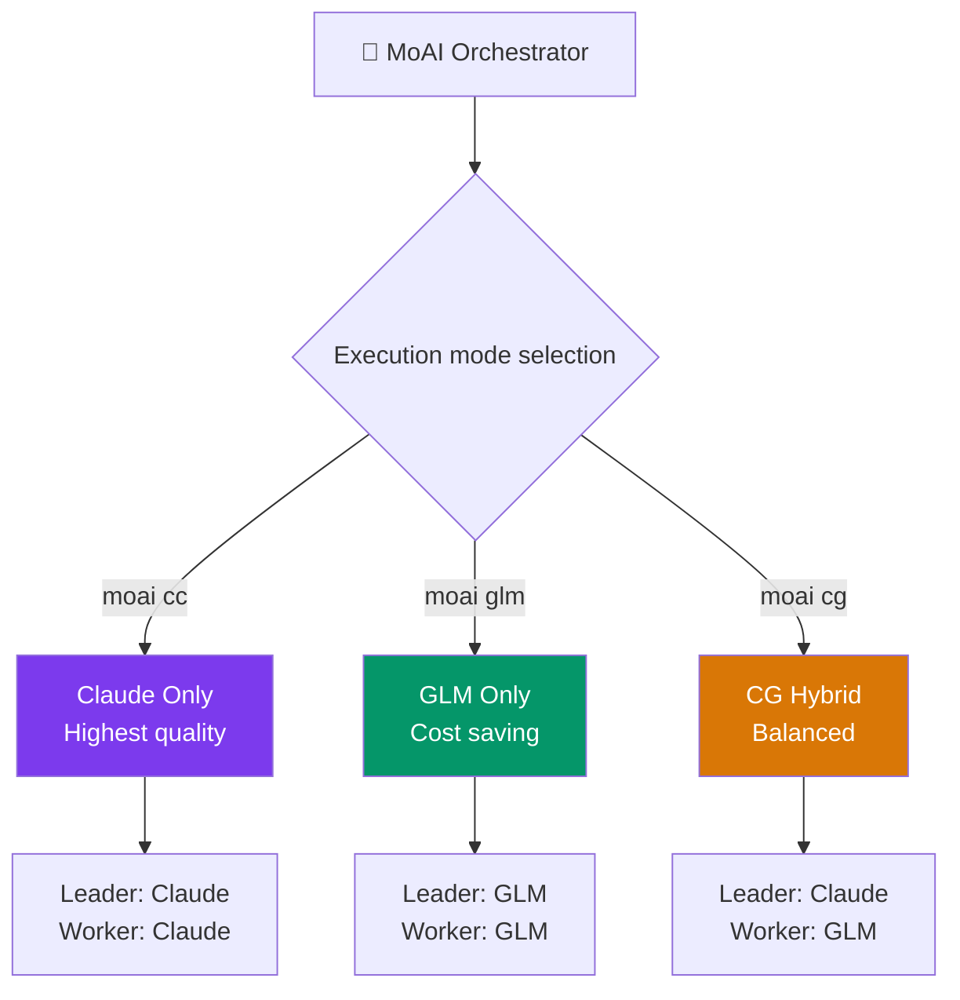

MoAI-ADK supports **z.ai GLM** as an alternative AI backend alongside the Claude API, enabling multi-LLM development workflows.

## What is z.ai GLM?

GLM (Generative Language Model) is an AI model service provided by z.ai that is compatible with Claude Code. You can switch backends with environment variables alone — no code changes required.

| Item | Details |
|------|---------|
| **GLM Coding Plan** | Starting at **$10**/month ([sign up](https://z.ai/subscribe?ic=1NDV03BGWU)) |
| **Compatibility** | Compatible with Claude Code — no code changes |
| **Models** | glm-5.2[1m], GLM-4.7, GLM-4.5-Air, free models |

## Default Model Mapping

| Claude Tier | GLM Model | Input (per 1M tokens) | Output (per 1M tokens) |
|-------------|-----------|-----------------------|------------------------|
| Opus | glm-5.2[1m] | $2.00 | $8.00 |
| Sonnet | GLM-4.7 | $0.60 | $2.20 |
| Haiku | GLM-4.5-Air | $0.20 | $1.10 |

> Free models are also available: GLM-4.7-Flash, GLM-4.5-Flash. See [z.ai Pricing](https://docs.z.ai/guides/overview/pricing) for the full price list.

## Three Execution Modes

MoAI-ADK provides three LLM execution modes:

| Command | Leader | Worker | tmux required | Cost saving | Use case |
|---------|--------|--------|---------------|-------------|----------|
| `moai cc` | Claude | Claude | No | - | Highest quality, complex tasks |
| `moai glm` | GLM | GLM | Recommended | ~70% | Cost optimization |
| `moai cg` | Claude | GLM | **Required** | **~60%** | Quality + cost balance |



### Quick Start

```bash
# 1. Store your GLM API key (first time only)
moai glm sk-your-glm-api-key

# 2. Select a mode
moai cc            # Claude only
moai glm           # GLM only
moai cg            # CG hybrid (tmux required)
```

> **As of v2.7.1**, CG mode is the **default team mode** for the `--team` flag. It runs in CG mode unless you explicitly switch to `moai cc` or `moai glm`.

## Next Steps

- [CG Mode (Claude + GLM)](/en/multi-llm/cg-mode) — tmux isolation architecture details
- [Model Policy](/en/multi-llm/model-policy) — per-agent model assignment table
