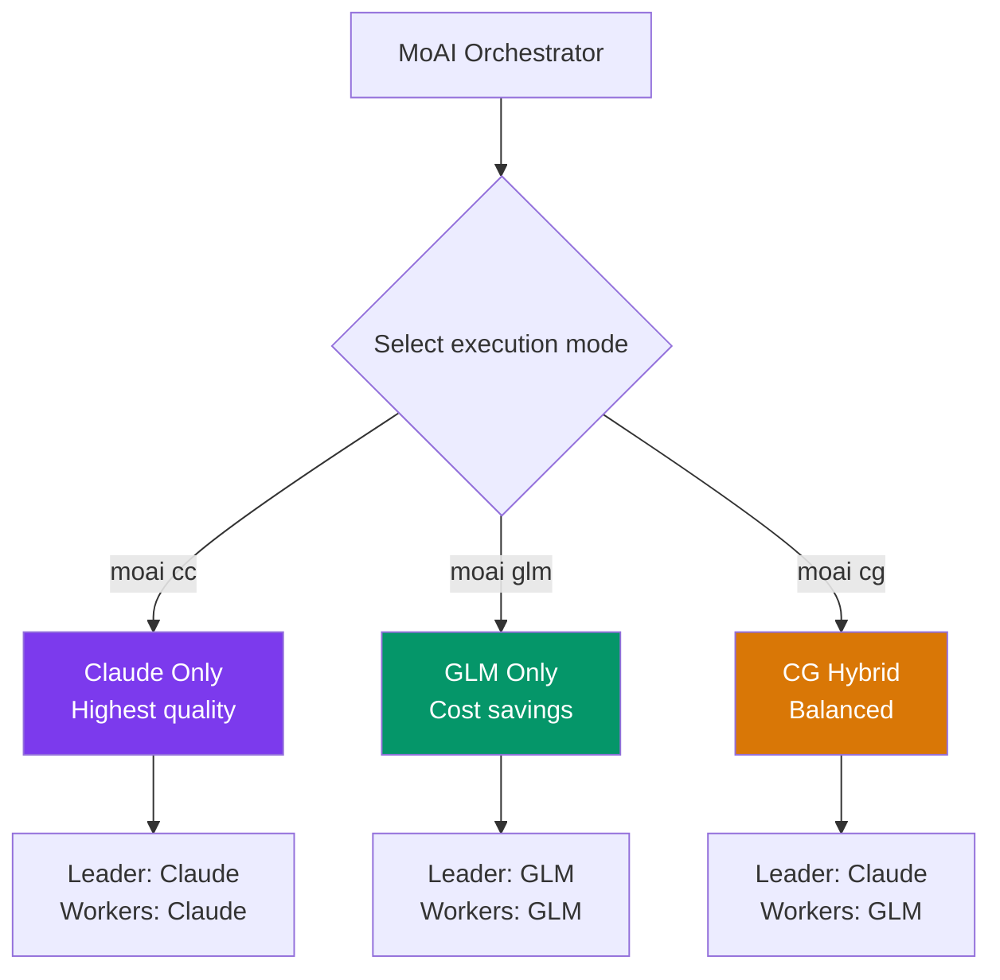

 <strong>Belongs to</strong>: 🪙 Tokenomics

<!-- @value: tokenomics -->


Beyond the Claude API, MoAI-ADK supports **z.ai GLM** as an alternative AI
backend. This is not a convenience feature — it is the axis that realizes
**Tokenomics** (Token Economics), the core value of v3.0. To get the same
quality of code at a lower cost, you must be able to assign the right model to
each task.


## What is z.ai GLM?

GLM (Generative Language Model) is an AI model service provided by z.ai that
is compatible with Claude Code. You can switch with environment variables
alone — no code changes.

| Item | Details |
|------|------|
| **GLM Coding Plan** | From **$10**/month ([sign-up link](https://z.ai/subscribe?ic=1NDV03BGWU)) |
| **Compatibility** | Compatible with Claude Code — no code changes |
| **Models** | glm-5.2, GLM-4.7, GLM-4.5-Air, free models |

## Default model mapping

MoAI-ADK assigns a different GLM model per Claude tier. It is implemented via the
4 Claude Code `ANTHROPIC_DEFAULT_*_MODEL` environment variables:

| Claude tier | Environment variable | GLM model | Context |
|-------------|----------|----------|----------|
| Opus | `ANTHROPIC_DEFAULT_OPUS_MODEL` | glm-5.2 | 1M |
| Sonnet | `ANTHROPIC_DEFAULT_SONNET_MODEL` | glm-4.7 | 202K |
| Haiku | `ANTHROPIC_DEFAULT_HAIKU_MODEL` | glm-4.5-air | 128K |
| Fable | `ANTHROPIC_DEFAULT_FABLE_MODEL` | glm-5.2 | 1M |

> The Opus slot (main session + inheriting agents) and the Fable slot use the 1M-context `glm-5.2`,
> the Sonnet slot uses the 202K `glm-4.7`, and the Haiku slot uses the 128K `glm-4.5-air`.
> This per-tier differentiated mapping is configured via `glm.models` (high/medium/low/fable) in
> `llm.yaml`, each injected through the environment variables above. The Fable environment variable
> is officially supported since Claude Code v2.1.202.

> Free models are also available: GLM-4.7-Flash, GLM-4.5-Flash. See [z.ai Pricing](https://docs.z.ai/guides/overview/pricing) for full pricing.

## 3 execution modes

MoAI-ADK offers 3 LLM execution modes. Choose based on "what do you want to
optimize":

| Command | Leader | Workers | tmux required | Cost savings | Use case |
|--------|------|------|----------|----------|------|
| `moai cc` | Claude | Claude | No | - | Highest quality, complex work |
| `moai glm` | GLM | GLM | Recommended | ~70% | Cost optimization |
| `moai cg` | Claude | GLM | **Required** | **~60%** | Quality + cost balance |


```mermaid
graph TD
    A["MoAI Orchestrator"] --> B{"Select execution mode"}
    B -->|"moai cc"| C["Claude Only<br/>Highest quality"]
    B -->|"moai glm"| D["GLM Only<br/>Cost savings"]
    B -->|"moai cg"| E["CG Hybrid<br/>Balanced"]

    C --> F["Leader: Claude<br/>Workers: Claude"]
    D --> G["Leader: GLM<br/>Workers: GLM"]
    E --> H["Leader: Claude<br/>Workers: GLM"]

    style C fill:#7C3AED,color:#fff
    style D fill:#059669,color:#fff
    style E fill:#D97706,color:#fff
```

CG mode is the flagship example of Tokenomics. Work where reasoning quality
matters — strategy, planning, auditing — goes to the Claude leader, while
volume-heavy work like bulk implementation goes to GLM workers. For
implementation-heavy work, this saves roughly 60-70% of the cost.

### Quick start

```bash
# 1. Save your GLM API key (once)
moai glm setup sk-your-glm-api-key

# 2. Pick a mode
moai cc            # Claude only
moai glm           # GLM only
moai cg            # CG hybrid (tmux required)
```

## Next steps

- [CG Mode (Claude + GLM)](/en/multi-llm/cg-mode) — details of the tmux isolation architecture
- [Model Policy](/en/multi-llm/model-policy) — the per-agent model assignment table
