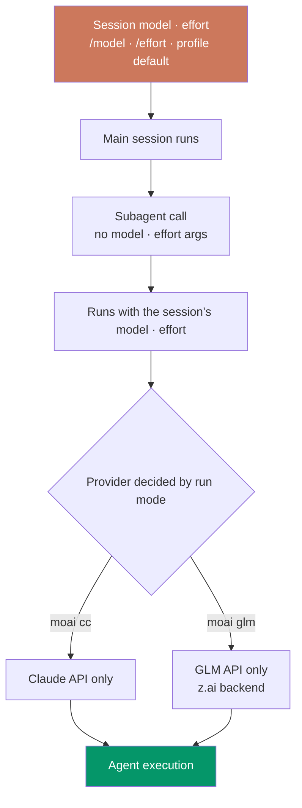

 <strong>Belongs to</strong>: Tokenomics

<!-- @value: tokenomics -->

Every time MoAI-ADK starts a session, it makes one decision: "which model will
this session run on, and how deeply will it think?" This section covers exactly
that model choice — the Claude model lineup, reasoning depth (effort), the
inheritance rule by which subagents follow the session, and multi-provider
routing that mixes Claude and GLM inside one session.

## Where This Section Sits in Tokenomics

Tokenomics is the umbrella name for every means of obtaining the same quality
of result with fewer tokens. Within it, the work of splitting cost comes in two
main branches.

- **Model choice** (this section) — decides which model, at what depth, and at
  which provider a session runs. Subagents follow the session's model and
  reasoning depth as-is, so choosing one session well is the whole assignment.
- **Context saving** (the [Cost Optimization](/en/cost-optimization) section) —
  shrinks the payload handed to the model (context diet) and makes the remaining
  payload reusable at a cheap rate (prompt caching).

The two branches complement each other. However well you pick a model, an
overweight context makes cost unmanageable; however much you shrink the
context, a wrong model choice spends expensive reasoning on cheap work. This
section owns the first branch — "what does a session run on, and under what
conditions." The whole picture is in the
[Tokenomics Overview](/en/advanced/tokenomics-overview).

## One Pair, Two Axes: Model and Reasoning Depth

What a session chooses is a single `{model, effort}` pair. That pair applies
as-is to every agent call in the session. The two axes answer different
questions.

- **Model** (model) — "which model?" Chooses among Fable, Opus, Sonnet, and
  Haiku. Changing the model changes both the per-token price and the context
  window.
- **effort** (reasoning depth) — "how deeply should it think?" Within the same
  model, decides whether to skim shallowly or dig deep. Deeper reasoning costs
  more tokens.

Because the two axes move together, you can run an "expensive model shallowly"
or a "cheap model deeply." That is why effort alone can find the knee of the
cost curve without changing the model class.

### Model Lineup (2026-08)

| Model | Identifier | Context | Best suited for |
|------|--------|----------|------------|
| **Claude Fable 5** | `claude-fable-5` | 1M | The new Mythos-tier general-purpose flagship. The deepest reasoning and complex coding |
| **Claude Opus 5.5 / 5 / 4.8** | — | 1M | Complex architecture and high-difficulty reasoning |
| **Claude Sonnet 5** | — | 1M | Balance of speed and intelligence, everyday coding |
| **Claude Haiku 4.5** | `claude-haiku-4-5-20251001` | 200K | Fastest and most economical, simple and bulk work |


**The lineup and the choice are different things.** The table above only shows
"available models." MoAI-ADK's session default follows the **No-Haiku policy**,
taking the Opus class as the first-line model, and Haiku appears nowhere in the
default combination. What actually runs is decided by the session's model
choice — the rule is covered in
[The Session Picks the Model and Effort](#the-session-picks-the-model-and-effort)
below.


### Reasoning Depth (effort)

effort comes in five levels.

| effort | Meaning |
|--------|------|
| `low` | Skims shallowly. Speed first, simple work |
| `medium` | Default balance |
| `high` | Digs deep |
| `xhigh` | Deeper still. High-difficulty reasoning, complex coding |
| `max` | The deepest reasoning |

`xhigh` and `max` are supported on Opus 5.5, Opus 5, Opus 4.8, Sonnet 5, and Opus 4.7. The shortcut that turns both on at once is the **ultrathink** keyword. It sets `effort: xhigh` and at the same time enables **Adaptive Thinking** (letting the model allocate reasoning tokens on its own).


**Fixed reasoning budgets are forbidden.** Opus 4.7 and later reject a fixed
reasoning budget such as `budget_tokens`. Always control reasoning depth through
the effort level and Adaptive Thinking — hard-coding a fixed value fails the
request.


effort can be changed with a slash command.

```bash
/effort low       # speed first
/effort high      # deep reasoning
/effort xhigh     # high difficulty
/effort ultracode # toggle for automatic workflow orchestration
/effort auto      # the model picks based on context
```

## The Session Picks the Model and Effort

The old profile-matrix approach of picking a model for each agent one by one
has retired. Since v3.2, **subagents follow the main session's model and
reasoning depth as-is** — you pass neither `model` nor `effort` when calling a
subagent, and MoAI agent definitions declare neither. What remains once the
per-agent assignment table is gone is the session's three choices.

| Choice | What it does |
|------|--------|
| Model (`/model`) | The model the session runs. Every subagent follows along |
| effort (`/effort` · `ultrathink`) | The session's reasoning depth. `high` favors quality, `medium` is the default, and `low` is economical operation within the same model |
| Session model policy (`moai profile setup`) | The default effort fallback a profile hands over when no reasoning depth is chosen separately |

> How the old matrix (13 agents × 3 profiles) retired, and the details of the
> inheritance rule, are covered in
> [Profile Matrix](/en/advanced/profile-matrix) and
> [Model Policy](/en/multi-llm/model-policy).

### How a Session Choice Reaches the Agent Call


```mermaid
flowchart TD
    A["Session model · effort<br/>/model · /effort · profile default"] --> B["Main session runs"]
    B --> C["Subagent call<br/>no model · effort args"]
    C --> D["Runs with the session's model · effort"]
    D --> E{"Provider decided by run mode"}
    E -->|"moai cc"| F["Claude API only"]
    E -->|"moai glm"| G["GLM API only<br/>z.ai backend"]
    F --> I["Agent execution"]
    G --> I

    style A fill:#cc785c,color:#fff
    style I fill:#059669,color:#fff
```

## Multi-Provider: Mixing Claude and GLM

The last question of model assignment is "which provider runs it." Beyond the
Claude API, MoAI-ADK uses **z.ai GLM** (Generative Language Model) as an
alternative backend. No code changes are needed — it stays Claude-Code-compatible
and runs as-is once the environment variables change.

Switching to GLM assigns a matching GLM model to each Claude tier. The pairs
injected through Claude Code's `ANTHROPIC_DEFAULT_*_MODEL` environment
variables are:

| Claude slot | GLM model | Context |
|-------------|----------|----------|
| Opus / Fable | `glm-5.3-flash` | 1M |
| Sonnet | `glm-5.3-flash` | 1M |
| Haiku | `glm-5.3-flash` | 1M |

> `glm-5.3-flash` is the default model. glm-5.3 remains selectable in any tier
> slot — name the slot in `llm.yaml` (`llm.glm.models.*`) and it loads with the
> existing behavior (1M context, standard effort collapse) unchanged.

### Execution Modes

Choose the Claude or GLM launcher explicitly.

| Command | Leader | Workers | tmux required | Cost savings | Use case |
|--------|------|------|----------|----------|------|
| `moai cc` | Claude | Claude | No | — | Highest quality, complex work |
| `moai glm` | GLM | GLM | Recommended | ~70% | Cost optimization |

`moai cg` has been retired. It exits with a migration diagnostic without starting Claude or GLM. It is not an alias for `moai cc`. Projects with `llm.team_mode: cg` must make an explicit migration choice before launching a session. [CG retirement and migration](/en/multi-llm/cg-mode/)

```bash
# 1. Save your GLM API key (once)
moai glm setup sk-your-glm-api-key

# 2. Pick a mode
moai cc            # Claude only
moai glm           # GLM only
```

## Model Policy: The Session Decides, the Agents Follow

**Model policy** today is the act of setting the session's model and reasoning
depth. Subagents follow the session's model and reasoning depth as-is, so calls
need no explicit model and agent definitions declare neither. In the past,
**drift** — a gap between the "declared model" and the "actually resolved
model" — was caught from audit logs; now that inheritance is the default, an
explicit model on a call is itself the rare observation worth noting.

What the session model policy decides and does not, and the history of how the
old matrix retired, unfold in [Model Policy](/en/multi-llm/model-policy).

## Documents in This Section

- [CG retirement and migration](/en/multi-llm/cg-mode/)
- [Model Policy](/en/multi-llm/model-policy) — session model policy, effort fallback, inheritance rule details
- [Profile Matrix](/en/advanced/profile-matrix) — where the old matrix retired, and today's inheritance rule

## Related Documents

- [Cost Optimization](/en/cost-optimization) — the other branch of tokenomics: context diet and prompt caching
- [Tokenomics Overview](/en/advanced/tokenomics-overview) — the whole picture joining model assignment and context saving
