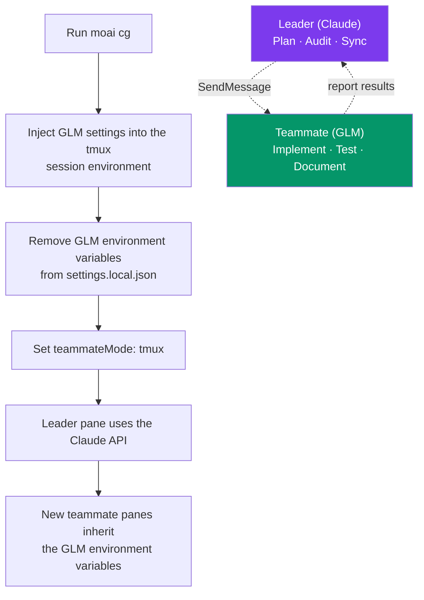

## CG mode in one line

CG mode is, in a word, a way of running things where "Claude does the
thinking and GLM moves the hands." Work where strategy and quality judgment
matter goes to the **Claude** leader, and implementation-heavy work — writing
the actual code — goes to the cheaper **GLM** (z.ai) teammates, cutting cost
by roughly 60-70% within a single session.

The **CG** in the name stands for **Claude + GLM**. Rather than alternating
between the two models, it partitions environment variables per tmux session
so that in one session the two models each own only their own role. It is the
tokenomics goal — "Claude plans deep, GLM implements cheap" — executed as-is,
without changing a line of code.


 <strong>The core idea</strong>: give the most
expensive reasoning to the smartest model, and the highest-volume work to the
cheapest model. Splitting those two roles within one session is all there is
to CG mode.


## Why this separation is needed

Most of the cost of AI coding work arises in the "implementation" stage.
Planning — writing the SPEC and thinking through the architecture — and
auditing the results are stages where reasoning depth decides quality, but the
number of calls itself is small. The implementation (run) stage — actually
writing code, filling in tests, producing documents — is where tokens pour out.

So running the same top-priced model across both stages guarantees quality but
inflates cost fast. CG mode exploits this asymmetry. It places Claude where
Claude's deep reasoning is needed, and the cheaper GLM where volume is so
large that the model's unit price decides the bill. The result: planning and
audit quality stay where they were, and only the implementation cost shrinks.

## How it works

CG mode partitions environment variables at the tmux-session level. The pane
the leader uses keeps only the Claude API environment, and newly opened
teammate panes inherit the GLM environment variables injected into the tmux
session. No code changes are needed — the environment variables alone split
the two models' duties.



The leader and teammates talk through Claude Code's messenger (SendMessage)
tool. The leader hands over a task, the work runs on GLM in a teammate pane,
and the result comes back to the leader.

## Who does which work

| Role | Model | Responsibilities |
|------|------|--------|
| **Leader** (current tmux pane) | Claude | Orchestration, planning (plan), quality judgment, audits, sync |
| **Teammates** (new tmux panes) | GLM | Implementation volume of the run stage, code generation, test writing, document generation |

The leader decides "what to build and how" and checks that results meet the
bar. Teammates write the actual code following the fixed plan. This division
is where CG mode's cost savings come from — the expensive model never carries
the implementation volume too.

> **The model GLM teammates use**: the whole Claude tier net (Opus · Sonnet ·
> Haiku · Fable) collapses into a single 1M-context `glm-5.3-flash` (the default). Claude Code
> sizes the auto-compact window once, based on the Opus slot, and agents
> spawned in other slots inherit that value — so mixing in a smaller model
> means compaction never kicks in even past its limit. Tier distinctions are
> carried by the reasoning-depth (effort) axis, not by models. See
> [Multi-LLM Introduction](/en/multi-llm) for the detailed mapping.

## Setup and running

### Step 1: store your GLM API key (once)

```bash
moai glm setup sk-your-glm-api-key
```

The key is stored safely in `~/.moai/.env.glm`.

### Step 2: check your tmux environment

If you are already using tmux, there is no need to create a new session.

```bash
# If you are not using tmux:
tmux new -s moai
```


 Setting tmux as your VS Code terminal's default
shell lets you skip this step entirely. CG mode can only separate the
leader/teammate APIs in a tmux split-pane environment.


### Step 3: launch CG mode

```bash
moai cg
```

`moai cg` launches Claude Code in the current pane for you. There is no need
to run `claude` separately.

### Step 4: run your workflow

```bash
/moai "Implement the user authentication feature"
```

From here it works as usual. The orchestrator (the leader, Claude) handles
planning, quality, and sync, while implementation-heavy work goes to GLM
teammates in new tmux panes.


 The old <code>--team</code> flag (the Agent Teams static
orchestration layer) was retired in v3.0. Forcing it falls back to sub-agent
mode. CG mode's leader/teammate separation runs on Claude Code's built-in
teammate runtime (tmux panes), and that runtime is preserved.


## When to use CG mode — and when to avoid it

### Work CG mode fits well

- Implementation-heavy SPEC execution (the run stage)
- Code generation and refactoring volume
- Writing test code
- Generating documentation

This kind of work is more volume than reasoning, so delegating it to GLM
teammates yields the biggest savings.

### Work to keep away from CG mode

- Architecture design and planning (needs Opus/Fable-grade deep reasoning)
- Security reviews (needs Claude's security training)
- Complex debugging (advanced reasoning decides quality)

In this kind of work, a single judgment steers much of the downstream cost and
direction. It is safer to have the smartest model carry it end to end. For
these, use Claude-only execution (`moai cc`) instead of CG mode.


 CG mode is not always the answer. Handing judgment
over to GLM teammates too early in the planning stage may cut the bill but
bend the direction — and the cost of redoing it can exceed what was saved.
Having the Claude leader own the "thinking" and leaving only the "hands" to
GLM teammates is the correct use of this mode.


## The three execution modes compared

| Command | Leader | Teammates | tmux required | Cost savings | Use case |
|--------|------|------|----------|----------|------|
| `moai cc` | Claude | Claude | No | - | Complex work, highest quality |
| `moai glm` | GLM | GLM | Recommended | ~70% | Cost optimization |
| `moai cg` | Claude | GLM | **Required** | **~60%** | Quality + cost balance |

`moai cc` is quality first, `moai glm` is cost first, and `moai cg` is the
balance between them. CG mode is the only one that assigns different models to
the leader and the teammates, which is why it requires tmux.

## Display mode (teammateMode)

`teammateMode` is a Claude Code built-in display setting stored in
`settings.local.json`. It is a different concept from MoAI's team-mode (the
old `--team` flag, retired in v3.0). The teammate runtime itself is provided
by Claude Code; `teammateMode` only decides how it is displayed on screen.

| Value | Description | Leader/teammate separation | CG mode |
|------|------|--------------|---------|
| `in-process` | Default, inline in the same terminal | No | Not used |
| `auto` | Auto-detect the environment | Not supported | Not used |
| `tmux` | tmux split screen | Session env-var isolation |  Used |
| `iterm2` | iTerm2 split screen | Not supported | Not used |

`moai cg` and `moai glm` set `teammateMode` to `"tmux"` in
`settings.local.json`, and `moai cc` resets it to an empty value. The
`teammateMode` setting takes precedence over the old
`CLAUDE_CODE_TEAMMATE_DISPLAY` environment variable.

> **CG mode can only separate the leader/teammate APIs in the `tmux` display
> mode.**

## Important notes

| Item | Description |
|------|------|
| **tmux environment** | Already in tmux? No new session needed. Setting tmux as your default shell is convenient |
| **Auto launch** | `moai cg` launches Claude Code in the current pane. No separate `claude` command needed |
| **Session end** | The session_end hook cleans up the tmux session env vars → the next session uses Claude |
| **Team communication** | Leader and teammates communicate via the SendMessage tool |
| **Mode switching** | Coming from `moai glm`, `moai cg` re-initializes the GLM settings itself. No intermediate `moai cc` needed |

## The tmux environment variable injection security model {#tmux-env-security}

Since v3.0.0, when `moai cg` injects the GLM token (`ANTHROPIC_AUTH_TOKEN`)
into the tmux session environment, it uses the **source-file channel**
(`tmux source-file <tmp>`) instead of the **argv channel**
(`tmux set-environment <KEY> <VALUE>`). The token therefore never appears in
plaintext in `ps auxe`, `/proc/<pid>/cmdline`, auditd logs, sysmon traces, or
crash dumps (CWE-214).

### Injection flow

1. Create a temp file under `~/.moai/run/` with `mkstemp` (mode `0o600`
   enforced)
2. Write a single `set-environment -t <session> <KEY> <VALUE>` line
3. Have tmux read the file into the environment via `tmux source-file <tmp>`
4. Unlink it with `os.Remove` right after injection

Only the temp file path remains in argv; the token itself is never exposed.

### Non-sensitive values stay on argv

Values that are not tokens — `CLAUDE_CONFIG_DIR`, `ANTHROPIC_BASE_URL`,
`ANTHROPIC_DEFAULT_*_MODEL` and the like — keep the existing argv path (no
security threat).

### User responsibility

The `~/.moai/.env.glm` file must keep `0o600` permissions in your
environment. The `moai glm` command sets this for you:

```bash
stat -c '%a' ~/.moai/.env.glm    # Linux: 600
stat -f '%A' ~/.moai/.env.glm    # macOS: 600
```

### Self-check

Check whether the token is exposed in argv while CG mode is running:

```bash
# Inside a new tmux session after running moai cg
ps auxe | grep -i 'tmux set-environment.*ANTHROPIC_AUTH_TOKEN'
# Expected: 0 matches (the token is not in argv)
```

For the detailed threat model, failure behavior (the
`ErrTmuxSensitiveInjectFailed` sentinel), and additional check procedures, see
[Security Notes — CWE-214](/en/advanced/security-notes/#cwe-214).

## Two paths to lower cost

The "cost saving" CG mode delivers and the "cost saving" prompt caching
delivers come from different angles. Both are axes of tokenomics, but they
save in different places.

| Path | Where it saves | How | Related page |
|------|--------------|--------|------------|
| **Model distribution** (CG mode) | Model unit price | Cheap work goes to a cheap model | This page |
| **Computation reuse** (prompt caching) | Repeated computation | Cache the same prefix and skip recomputation | [Prompt Caching](/en/claude-code/context-memory/prompt-caching) |

CG mode takes the **cost** angle (shrinking the bill); prompt caching takes
the **context** angle (shrinking the cost of recomputing the same context).
The two axes are not mutually exclusive — used together, the effects stack.
This page's subject, though, is model distribution.

## Troubleshooting

| Problem | Cause | Fix |
|------|------|------|
| Teammates use the Claude API | tmux session env vars not set | Re-run `moai cg` inside tmux |
| Claude Code does not launch after `moai cg` | Ran outside tmux | `tmux new -s moai`, then re-run |
| GLM env vars remain after closing the session | session_end hook failed | Clean up directly with `moai cc` |

## Next steps

- [Model Policy](/en/multi-llm/model-policy) — how to assign the right model to each agent
- [Prompt Caching](/en/claude-code/context-memory/prompt-caching) — the other axis of cost saving: computation reuse
- [FAQ](/en/getting-started/faq) — execution-mode FAQ
- [CLI Reference](/en/getting-started/cli) — moai cc, moai glm, moai cg in detail
