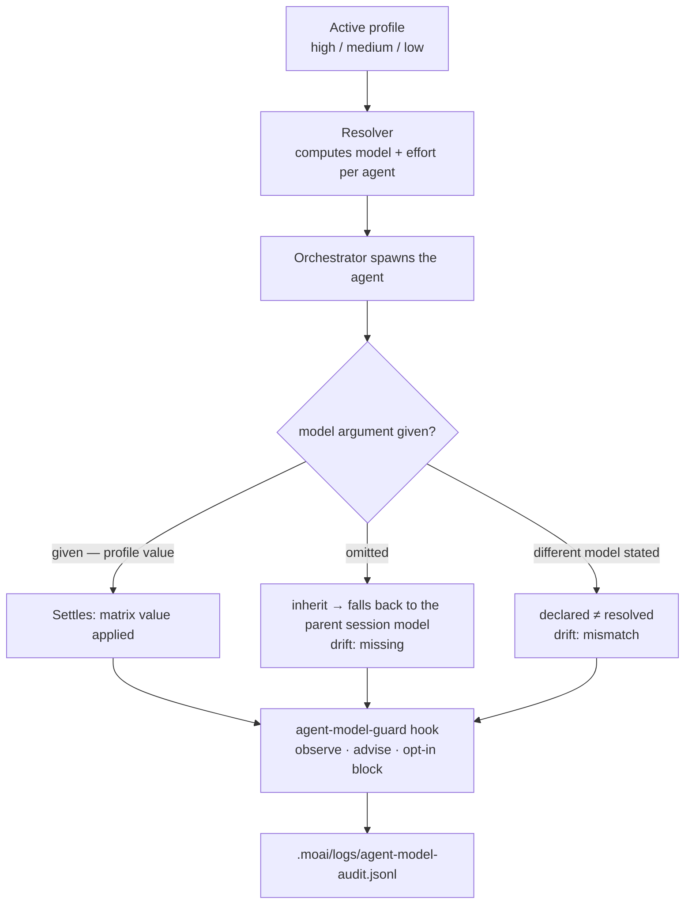

## What is a model policy?

A model policy is an assignment rule that replaces "the most expensive model for
everything" with "this model, at this depth, for this job." It splits
reasoning-heavy work like planning and auditing from lightweight work like
documentation and Git procedures, and declaratively fixes the right model and
reasoning depth (effort) for each agent. That is how you pull maximum quality
out of a Claude Code subscription plan while avoiding rate-limit errors.

This rule is the backbone of tokenomics. Tokenomics is the practice of
spending tokens where quality-per-cost justifies it, and the model policy is
the means by which MoAI-ADK actually implements its **cost** axis.


**In one line:** pick one policy (high/medium/low) and that column's values fix
the model and reasoning depth of all 11 agents for the day, in one move. The
burden of choosing models moves from eleven places to one (the profile
selection).


## Why insisting on "the strongest model" backfires

At first glance, using nothing but Opus looks like the safest choice. Two
things get in the way.

First, **what drives the bill is not the per-token price but the number of
steps per task.** A multi-turn agent keeps stepping until the task is done,
and as steps pile up so do output tokens and cost. If a shallow model has to
redo in several passes what a deep-reasoning model finishes in one, the total
cost grows even though the per-token price is cheap. Conversely, running a
deep-reasoning model on work that a single trivial pass would finish is pure
waste.

Second, **you can tune reasoning depth within the same model.** Opus at `low`
effort can outscore some Sonnet tier while costing less per task. There is a
region where staying inside the same model and only lowering reasoning depth
wins on both quality and cost, instead of dropping the model class to save
money. The model policy is the work of finding that region and assigning from
it.

## The model palette and reasoning depth

First, the options on the table. The model policy is the rule for choosing
which model from the lineup below, at which reasoning depth.

### Model lineup (2026-08)

| Model | Identifier | Context | Character |
|------|--------|----------|------|
| Claude Fable 5 | `claude-fable-5` | 256K | New Mythos-tier general-purpose flagship. Deepest reasoning and complex coding |
| Claude Opus 5 / 4.8 | `opus` | 1M | Complex architecture, hard reasoning |
| Claude Sonnet 5 | `sonnet` | 200K | Balance of speed and intelligence, everyday coding |
| Claude Haiku 4.5 | `claude-haiku-4-5-20251001` | 200K | Fastest and most economical; simple, high-volume work |

> MoAI's model policy does not use this whole lineup. Under the **No-Haiku
> policy**, Haiku appears nowhere in the agent matrix, and every multi-turn
> agentic row is carried by Opus. The reason is in the very next section.

### Reasoning depth (effort)

How deeply the model thinks is chosen from five levels.

| effort | Meaning |
|--------|------|
| `low` | Shallowest reasoning. Fast and cheap |
| `medium` | Balanced. The reference point of the default profile |
| `high` | Deep reasoning |
| `xhigh` | Deeper reasoning (supported on Opus 5 · 4.8 · Sonnet 5 · Opus 4.7) |
| `max` | Deepest reasoning |

> **The `ultrathink` keyword**: typing `ultrathink` turns on `effort:xhigh`
> together with Adaptive Thinking (automatic allocation of reasoning tokens).
> No fixed `budget_tokens` is used — the model allocates its own reasoning
> depth. You can also switch with the `/effort low|medium|high|xhigh|max|ultracode|auto`
> slash command.

## The three profiles

The policy starts by choosing one of three values. Choose one and the entire
column activates.

| Profile | CLI flag | Character |
|---------------|-----------|------|
| **high** | `--model-policy high` | Quality first. `max` effort on the two rows with the lowest call frequency |
| **medium** (default) | `--model-policy medium` | Balance of quality and cost. The inflection point of the cost/score curve |
| **low** | `--model-policy low` | Lowest cost per task. Agentic rows drop to Opus `low` |


**Name mapping**: the `profile` field in `llm.yaml`, the legacy
`performance_tier` alias, and the CLI flag `--model-policy` all use the same
three values `high`/`medium`/`low` and map 1:1. The default is `medium`. The
former top-tier name `max` is still handled as a **read-only alias** of `high`
so existing configs keep resolving, but saves always record `high` — there is
nothing to migrate. `performance_tier` is read only when `profile` is absent.


> **Lowering the policy does not mean moving to a weaker model class.** On
> long-horizon agentic work, Opus at `low` effort outscores Sonnet at any
> effort while costing less per task. So the `low` policy economizes *within*
> Opus by lowering reasoning depth, and uses Sonnet only on single-shot rows
> where multi-step completion failure is not a concern.

## Per-agent assignment table

The 33 cells below are the profile matrix (11 agents × 3 profiles). Each cell
holds the `{model, effort}` pair the resolver injects at spawn time. The
orchestrator main session is not a spawned agent, so it is left out of the
table.

### Manager Agents (5)

| Agent | high | medium | low |
|---------|------|--------|-----|
| manager-spec | opus / high | opus / medium | opus / low |
| manager-develop | opus / max | opus / medium | opus / low |
| manager-docs | opus / medium | opus / low | sonnet / low |
| manager-git | sonnet / low | sonnet / low | sonnet / low |
| manager-design | opus / high | opus / medium | opus / low |

### Evaluator · Advisor · Builder · Specialist Agents (5)

| Agent | high | medium | low |
|---------|------|--------|-----|
| plan-auditor | opus / high | opus / medium | opus / low |
| sync-auditor | opus / high | opus / medium | opus / low |
| super-advisor | opus / max | opus / high | opus / medium |
| builder-harness | opus / high | opus / medium | opus / low |
| e2e-tester | opus / medium | opus / low | sonnet / low |

### Built-in Agent (1)

| Agent | high | medium | low |
|---------|------|--------|-----|
| Explore | sonnet / low | sonnet / low | sonnet / low |

> `Explore` has no agent file on disk, so its effort cannot be pinned in
> frontmatter. Instead the matrix records `sonnet / low` as the call-time
> default, and that value is written verbatim into the spawn prompt. The Agent
> Teams static layer (static role profiles) was retired in v3.0, and its place
> was taken by parallel sub-agent execution and dynamic workflows. The `moai cg`
> teammate runtime (tmux panes) remains in place.

> **Haiku removal** (v3.0): the former Haiku slots (documentation · MX tagging ·
> Git procedures) were replaced not by a lower model class but by lower
> reasoning depth. Cost is cut by tiering effort per step, not by swapping
> models.

## Assignment principles

- **Every agentic row stays on Opus**: `manager-spec`, `manager-develop`,
  `plan-auditor`, `sync-auditor`, `manager-design`, `builder-harness`,
  `manager-docs`, `e2e-tester` — all multi-turn work remains on Opus, because
  Opus at `low` outscores Sonnet at any effort while costing less per task.
- **Sonnet only on single-shot rows**: the mechanical work of `manager-git` and
  the exploration of `Explore` finish in one input-dominated pass, so
  multi-step completion failure is never a concern, and there Sonnet's cheap
  input price is decisive. These two rows are fixed across all three profiles.
- **`max` in only two cells**: only `manager-develop` and `super-advisor` in
  the `high` profile. These are rows with the lowest call frequency where a
  single judgment steers a large share of downstream cost.
- **`xhigh` used nowhere**: on Opus it scores the same as `high` at 49% more
  cost.
- **`low` lowers effort, not model class**: agentic rows drop to Opus `low`,
  and only `manager-docs` and `e2e-tester` fall back as far as Sonnet.

So that the agent that authored a plan never audits it, `plan-auditor` and
`sync-auditor` are assigned separately from `manager-spec`. The bias-preventing
force comes from the catalog's structure itself, not from the cell values.

## How the declared values reach the agent

Everything so far has organized the **intent** — "this agent must use this
model." But intent is not execution. A separate process carries the matrix
values into actual spawns, and that process is precisely **the model policy's
enforcement point**.

### The resolver decides the values

Every time an agent is spawned, the decision mechanism that fixes the
`{model, effort}` it will use is called the **resolver**. The resolver follows
a fixed precedence and uses the first value it finds.

1. If `llm.agent_overrides[agent name]` exists, that value wins.
2. Otherwise it uses the agent cell of the active profile (`llm.profiles` in
   config).
3. If the config has no cell, it uses the agent cell of the Go default matrix.
4. An agent absent from the matrix (one you added yourself) is `inherit` — no
   model is injected and it simply follows the parent session.

To inspect resolved values, use the read-only command `moai model profile` —
no arguments for a human-readable table, `--json` for machine reading.

```bash
moai model profile          # table for humans
moai model profile --json   # JSON for machines
```

The command changes nothing — it simply shows the values the orchestrator
would inject when spawning an agent.

### model and effort travel different paths

Here is the crux. The resolved **model** and **effort** are consumed on
different routes.

- **model** — a **runtime argument given on every spawn** when the
  orchestrator calls an agent. It goes in as `Agent(model: <alias>)`. The
  agent file's frontmatter stays at `model: inherit`, and no stage — init,
  update, or save — ever touches that value.
- **effort** — a **documented intention** that anchors the agent's reasoning
  depth. The agent-spawning tool takes no per-call effort argument, so effort
  reaches the agent only through (a) the agent file's effort default, (b) the
  GLM effort overlay, or (c) workflow- or prompt-level steering.


**The `model: inherit` trap**: nearly every agent file's frontmatter defaults
to `model: inherit`. So when the orchestrator spawns an agent and **omits**
the `model` argument, the call silently falls back to the **parent session's
model** instead of the profile's. The profile is still computed — and nothing
ever reports that it was not applied. In actual observation, fewer than 1% of
spawns carry a model argument. This point leads into the drift story in the
next section.




## When declaration and resolution diverge (drift)

When the value the matrix fixed (the resolution) differs from the value
attached to the actual spawn (the declaration), **drift** appears. MoAI ships
a PreToolUse hook, **agent-model-guard**, that mechanically observes this gap.
On every spawn the hook extracts the declared model, asks the resolver "what
model should this agent have had?", and returns one of four verdicts.

| Verdict | Meaning | Handling |
|------|------|------|
| `ok` | Declaration matches resolution | Pass |
| `missing` | Resolution is a concrete alias but the spawn carries no model argument at all | Advisory (non-blocking) — the most common case |
| `mismatch` | The model declared in the spawn differs from the resolution | Advisory + (opt-in) block |
| `unmapped` | An agent outside the retained catalog (a user harness specialist) — `inherit`, so there is nothing to compare | Pass |

### Three levels of enforcement

The hook operates at three levels that can be toggled independently.

- **observe** — always on. Leaves one JSONL line per spawn and never blocks.
- **advise** — always on. Raises a non-blocking advisory message on `missing`
  or `mismatch`.
- **block** — opt-in. Works only when
  `workflow.agent_model_guard.enabled` (default `false`) is turned on, and
  rejects **`mismatch` verdicts only**.


**`missing` is never blocked.** In a reality where fewer than 1% of spawns
carry a model argument, blocking `missing` too would reject almost every
spawn. So even with the gate on, `missing` stays an advisory. Blocking applies
only to `mismatch` — spawns that explicitly name a different model.


### Audit log and fail-open

Observation records accumulate one line at a time in
`<project root>/.moai/logs/agent-model-audit.jsonl`. Each line holds the
timestamp, session, agent, declared model, resolved model, and verdict —
prompt bodies are never recorded. The log lets you aggregate per-agent drift
rates.

A block goes out only on **positive evidence** (the fail-open principle). It
rejects only when the agent identifier parses, the resolution maps, the
declared model exists, and the two differ. Every other uncertain state
(unparseable, no identifier, unmapped, config read failure, unresolvable
project root) passes through. Enforcement must never be the bug that stops a
session cold.

> **effort is outside this hook's scope.** The agent-spawning tool exposes no
> effort argument at all, so at spawn time only `model` can be observed.
> Whether effort lands properly is handled by frontmatter and overlays alone.

## Hardening in v3.1

Today's agent-model-guard still sits at the "always observe, opt-in to block"
stage. The most common verdict, `missing`, stops at an advisory, leaving a gap
where the intended profile is silently ignored. In v3.1, work to tighten this
enforcement (SPEC-AGENT-MODEL-ENFORCE-001, in progress) is under way.

The direction is to reduce model-argument omissions at spawn time in the first
place — strengthening routing so the orchestrator faithfully injects, on every
spawn, the value `moai model profile --json` reports, and visualizing drift
rates as observation records accumulate. But since that SPEC is still in
progress, do not read this as "v3.1 blocks `missing` automatically." As of
now, blocking remains `mismatch`-only and opt-in.

## Two more levers on cost

If the model policy decides *which model*, two more levers sit beside it to
push cost further down. Both are noted here from this page's **cost**
perspective, with depth deferred to their dedicated pages.

**Prompt caching** reuses the front portion of previous requests by prefix
matching (tools → system → messages order) to cut input cost. Reads cost about
0.1× the base input price and writes 1.25×, and the cache expires after 5
minutes with no requests (idle TTL). That is why it pays to bind gates early
and to split long sessions. Note that this **cost** view of prompt caching
looks at the same mechanism from a different angle than the context-continuity
view in [Prompt Caching under Context & Memory](/en/claude-code/context-memory/prompt-caching/) — one follows the
bill, the other session continuity.

**`MOAI_AUTONOMY_TIER`** sets the cost/speed trade-off per autonomy tier.
Higher tiers push more work forward without human intervention, and token
consumption grows accordingly. The tier definitions live on the
[Autonomy Tier](/en/advanced/autonomy-tier/) page.

## Configuration

### At project initialization

```bash
moai init my-project
# The interactive wizard includes model policy selection
```

### Reconfiguring an existing project

```bash
moai update
# Interactive prompts:
# - Reset model policy? (y/n) — reset the model policy
# - Update GLM settings? (y/n) — configure GLM environment variables
```

### Setting it directly with a CLI flag

```bash
moai init my-project --model-policy high    # Highest quality (max effort on 2 rows)
moai init my-project --model-policy medium  # Balanced (default)
moai init my-project --model-policy low     # Lowest cost per task
```

`--model-policy` takes the three values `high`/`medium`/`low` and the result
is stored in `llm.yaml`. The former top-tier name `max` is still accepted as
input and normalized to `high`.


The default policy is `medium` (llm.yaml `profile: "medium"`, corresponding to
CLI `--model-policy medium`; when the value is absent it is read as `medium`).
GLM settings live separately in `settings.local.json`, so they are never
committed to Git. To override a single agent, put the agent name as a key in
`llm.agent_overrides` — values are validated against the model enum and the
agent catalog, so unknown names are rejected.


## Next steps

- [Profile Matrix](/en/advanced/profile-matrix/) — the derivation basis for the 33 cells (benchmarks) and resolver precedence in detail
- [CG Mode](/en/multi-llm/cg-mode) — cut costs with the Claude leader + GLM worker hybrid
- [Autonomy Tier](/en/advanced/autonomy-tier/) — the `MOAI_AUTONOMY_TIER` cost/speed trade-off
- [CLI Reference](/en/getting-started/cli) — moai init, moai update, moai model profile in detail
