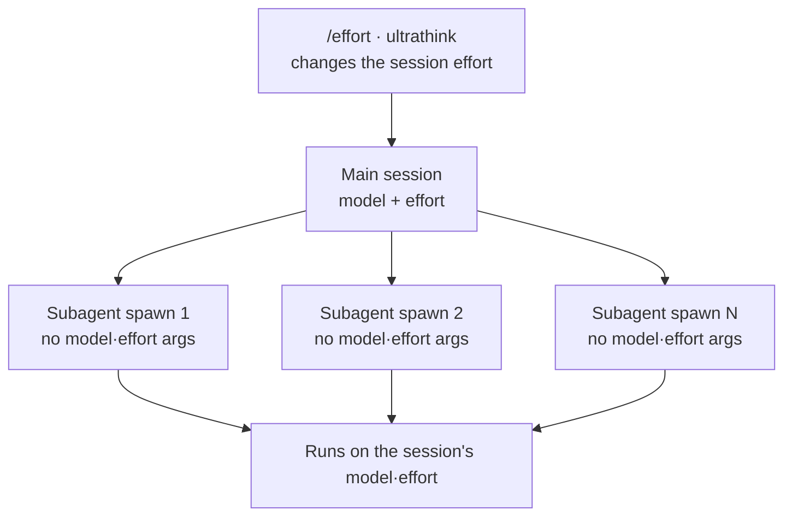

## What is a model policy?

A model policy replaces "the most expensive model for everything" with "this
model, at this depth, for this session." Since v3.2, MoAI-ADK decides the model
and the reasoning depth (effort) at the **session** level. Whatever model and
effort the main session runs on, every subagent runs on the same. The former
approach of assigning a model to each agent through a profile matrix is
retired.

This choice is the backbone of tokenomics — deciding how tokens are spent
against quality and cost. The model policy is how MoAI-ADK actually works the
**cost** side of that equation.


**In one line:** the main session's model and effort are the model and effort
of every subagent. There is nothing left to assign per agent — the only choice
is one model and one effort for the session.


## Why insisting on the strongest model backfires

At first glance running Opus for everything looks safest. Two things stand in
the way.

First, **what divides the bill is not the per-token price but the number of
steps per task.** A multi-turn agent keeps stepping until the task is done, and
longer steps pile up output tokens and cost. When a shallow model repeats what
a deep model would have finished in one pass, the total bill grows even at a
cheaper per-token price. Conversely, running every trivial single-pass job on a
deep model wastes cost for nothing.

Second, **the reasoning depth is adjustable inside the same model.** Opus at
`low` effort scores higher than a Sonnet at some levels while costing more per
task — the productive range is lowering the depth inside one model class rather
than dropping to a weaker class. Finding that range is what the model policy is
for.

The evidence and the raw benchmark behind this principle are collected on the
[3-Tier Agent Architecture](/en/advanced/no-haiku-3tier/) page.

## The model lineup and reasoning depth

The choices first. The model policy is the rule that picks which model from
the lineup below runs the session, and at which reasoning depth.

### Model lineup (2026-09)

| Model | Identifier | Context | Character |
|------|--------|----------|------|
| Claude Fable 5 | `claude-fable-5` | 1M | New Mythos-tier general flagship. Deepest reasoning and complex coding |
| Claude Opus 5.5 | `opus` | 1M | Complex architecture, high-difficulty reasoning |
| Claude Sonnet 5 | `sonnet` | 1M | Balance of speed and intelligence, everyday coding |
| Claude Haiku 4.5 | `claude-haiku-4-5-20251001` | 200K | Fastest and most economical, simple bulk work |

> The MoAI session lineup does not use Haiku by default. Slotting Haiku into
> long-horizon agentic work raises the per-task cost — confirmed by the DeepSWE
> leaderboard as the **No-Haiku policy**. The evidence lives on the
> [3-Tier Agent Architecture](/en/advanced/no-haiku-3tier/) page.

### Reasoning depth (effort)

How deeply the model thinks is chosen from five levels.

| effort | Meaning |
|--------|------|
| `low` | Shallowest reasoning. Fast and cheap |
| `medium` | Balanced. The reference point for session defaults |
| `high` | Deep reasoning |
| `xhigh` | Deeper reasoning (supported on Opus 5.5 · Opus 5 · 4.8 · Sonnet 5 · Opus 4.7) |
| `max` | Deepest reasoning |

> **Default effort**: Opus 5.5 defaults to `medium`; most other models that
> support effort default to `high`.
> The `opus` alias resolves to Opus 5.5 on Claude Code v2.1.280 or newer.

> **The `ultrathink` keyword**: typing `ultrathink` turns on `effort:xhigh`
> together with Adaptive Thinking (reasoning tokens allocated automatically).
> No fixed `budget_tokens` is used — the model allocates its own reasoning
> depth. The `/effort low|medium|high|xhigh|max|ultracode|auto` slash command
> changes it too. This adjustment is **session-wide** — change the session's
> effort and every subagent spawned afterwards follows.

## Subagents follow the session

The model-and-effort rule of MoAI-ADK v3.2 fits in one sentence.

> Subagents inherit the main session's model and effort: pass neither `model`
> nor `effort` when spawning a subagent, and MoAI agent definitions declare
> neither.

Three things follow from that sentence.

- **Agent definitions declare neither model nor effort.** The frontmatter of
  the agent files under `.claude/agents/moai/` carries neither field. The
  formerly shipped `model: inherit` field and effort defaults are retired.
- **Spawns pass neither.** When the orchestrator spawns a subagent, passing no
  `model` or `effort` argument is the normal case. Naming a model on a spawn
  was the habit of the profile-matrix era; it is no longer done.
- **The session is the answer.** If the session runs `opus / high`, every
  subagent in that session runs `opus / high`. Changing the session effort
  through `/effort` or `ultrathink` moves every subsequent spawn to the new
  depth.


```mermaid
flowchart TD
    S["Main session<br/>model + effort"] --> W1["Subagent spawn 1<br/>no model·effort args"]
    S --> W2["Subagent spawn 2<br/>no model·effort args"]
    S --> W3["Subagent spawn N<br/>no model·effort args"]
    W1 --> I["Runs on the session's model·effort"]
    W2 --> I
    W3 --> I
    E["/effort · ultrathink<br/>changes the session effort"] --> S
```

Choosing the model from session to session belongs to Claude Code's own model
selection (`/model` and friends); MoAI does not touch the session model.

## What the session model policy does

The **Session model policy** question in the `moai profile setup` wizard does
not pick a model — it picks the **effort fallback**. When a Claude session
launched with this profile starts and no effort level is chosen, the value
picked here becomes the session's default reasoning depth. The three values
`high` / `medium` / `low` map straight onto the effort vocabulary; with no
value set, the launch behavior stays exactly Claude Code's default.


**Naming note:** the former `profile` field of `llm.yaml`, the
`performance_tier` alias, and the `moai init --model-policy` flag used to
select a column of the per-agent assignment table. What remains in that seat
is one thing: the session effort fallback. The old flags are still accepted
for script compatibility, have no effect, and print a deprecation warning
pointing at `moai profile setup`.


### The GLM backend reasoning cap

Under the GLM backend (the `moai glm` switch), the session's effort cannot use
Claude's five-level vocabulary as-is. GLM-5.3 **always reasons** — turning
reasoning off is unsupported, and calls that request it fail. The adjustable
axis is a single three-level `reasoning_effort` (low / high / max), and Claude
efforts collapse onto it.

| Claude effort | GLM reasoning_effort |
|--------------|---------------------|
| `low` | `low` |
| `medium` | `max` |
| `high` | `max` |
| `xhigh` | `max` |
| `max` | `max` |
| (unrecognized value) | `max` — completeness clause: never under-reason |

In other words **the cap is `max`**. Every Claude effort above `low` converges
to reasoning-max, unrecognized values fall to reasoning-max, and a GLM session
without an explicit override runs at reasoning-max by default. reasoning-high
is still a valid wire value, but no Claude effort collapses onto it.
`manager-develop` is forced to reasoning-max regardless of the collapse result
(z.ai's recommendation that coding tasks reason at max).

The mapping's source of truth is code, not documentation — the runtime single
source is `internal/template/glm_effort_overlay.go`.

## What happened to per-agent assignment (history)

Through v3.1, MoAI-ADK assigned `{model, effort}` to every agent through a
**profile matrix** — a 39-cell table (13 agents × 3 profiles) whose active
column a profile selected, applied to spawns by a resolver, and inspectable
with the `moai model profile` command.

The whole apparatus was retired in SPEC-AGENT-MODEL-INHERIT-001. The trigger
was measurement: fewer than 1% of spawns ever carried a model argument, while
the matrix kept producing drift that "was computed but applied to nothing,"
with no mechanism reporting it. The single source of assignment became the
session itself, and the accessor, resolver, and drift enforcement were cleaned
up with it. The placement rationale the matrix established — spend on judging
rows, Opus for agentic rows, No-Haiku — survives as the judgment standard for
session-level model choice on the
[3-Tier Agent Architecture](/en/advanced/no-haiku-3tier/) and
[Profile Matrix](/en/advanced/profile-matrix/) pages.

The spawn-time model-argument observation record
(`.moai/logs/agent-model-audit.jsonl`) remains. With inheritance as the
default, its job is to watch whether a declared model differs from the session
value, and blocking is opt-in. It is an observability layer you can normally
ignore.

## Two more levers for cost

If the model policy decides "which model, at what depth, for the session," two
more levers sit beside it on the **cost** axis — each deepened on its own page.

**Prompt caching** reuses the prefix of earlier requests (matched in the
order tools → system → messages) to cut input cost. Reads cost about 0.1× the
base input price, writes 1.25×, and the cache expires after 5 minutes without
a request (idle TTL). So gates are bundled early and long sessions are split
deliberately. Note that this **cost** view of prompt caching differs from the
"context continuity" view on
[prompt caching under context/memory](/en/claude-code/context-memory/prompt-caching/) —
the same mechanism, one following the bill, the other session continuity.

**`MOAI_AUTONOMY_TIER`** sets the cost/speed trade-off per autonomy tier.
Higher tiers run more work without human intervention, and spend more tokens
for it. The tier definitions are on the
[Autonomy tiers](/en/advanced/autonomy-tier/) page.

## How to configure it

### In the profile wizard

```bash
moai profile setup
# pick the session's default effort fallback at the Session model policy question
```

The session model policy sets the default reasoning depth of the Claude
session launched with this profile. Subagents inherit that session's model and
effort.

### About the CLI flags

The old `moai init --model-policy`, `--profile`, `--high`, `--medium-alias`,
and `--low` flags are **deprecated stubs**. They accept values for script
compatibility, have no effect, and print a warning that points at
`moai profile setup`. Configure new settings through the wizard.


GLM settings live separately in `settings.local.json` and are never committed
to Git. To change the session's model and effort as you go, use Claude Code's
`/model` and `/effort`.


## Next steps

- [Profile Matrix](/en/advanced/profile-matrix/) — what replaced the matrix, and the inheritance rule in detail
- [3-Tier Agent Architecture](/en/advanced/no-haiku-3tier/) — the DeepSWE evidence and the No-Haiku policy
- [CG retirement and settings migration](/en/multi-llm/cg-mode/)
- [CLI Reference](/en/getting-started/cli) — `moai profile setup`, `moai init` details
