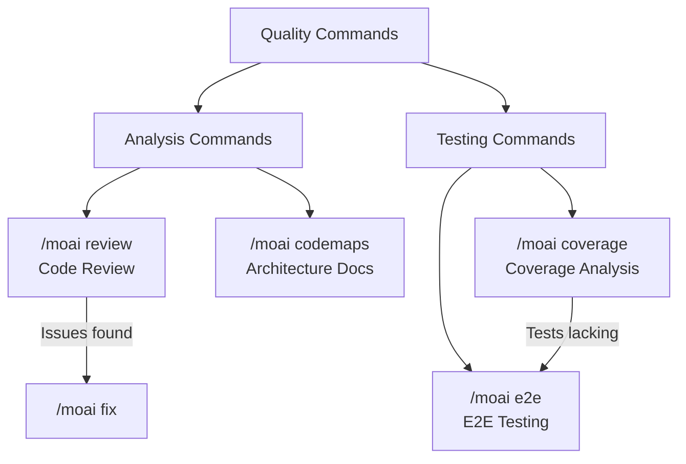

Introduction to MoAI-ADK's code quality management commands.


Quality commands are specialized for **code review, test coverage, E2E testing, and architecture analysis**. They help you systematically manage and improve code quality.


## Command Comparison

| Command | Purpose | Execution Method | When to Use |
|---------|---------|------------------|-------------|
| `/moai review` | Code review | 4-perspective analysis (security/performance/quality/UX) | Need code review before PR |
| `/moai coverage` | Coverage analysis | Test gap analysis and test generation | Want to improve test coverage |
| `/moai e2e` | E2E testing | Browser automation test creation/execution | Want to verify user flows |
| `/moai codemaps` | Architecture docs | Codebase structure analysis and documentation | Want to understand project architecture |

## Command Relationship Diagram


**Not sure which command to use?**

- Want to check overall code quality → `/moai review`
- Want to find and fill test gaps → `/moai coverage`
- Want to verify the app works from user perspective → `/moai e2e`
- Want to understand and document project structure → `/moai codemaps`

