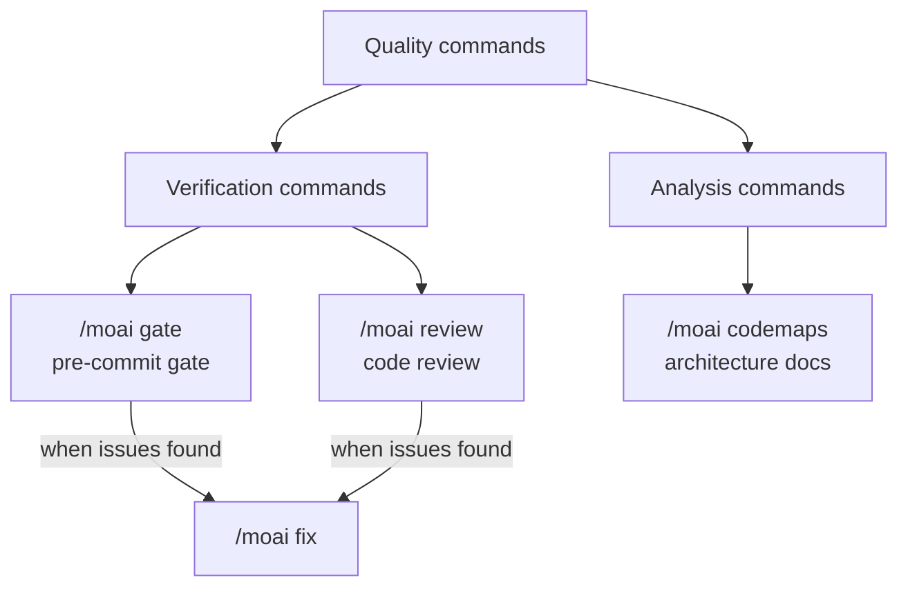

A collection of commands for verifying code quality and documenting architecture.


The quality commands specialize in **pre-commit gates, multi-perspective code review, and architecture analysis**. They are the surface where the TRUST 5 quality framework runs inside your daily workflow.


## Quality Gates Are Part of the Harness Too

v3's agentic harness means "an environment where agents work well," and quality gates are a core component of that environment. They are the mechanism that judges agent output by **evidence** — lint, tests, review — rather than "it seems done." Verification depth is also chosen to match the size of the work — right before a commit, the sub-30-second `/moai gate`; right before a PR, the 4-perspective `/moai review`. Not running the heaviest check every time is tokenomics.

## Command Comparison

| Command | Purpose | Execution style | When to use |
|--------|------|-----------|-----------|
| `/moai gate` | Pre-commit quality gate | lint + format + type-check + test run in parallel (<30 s) | Right before every commit |
| `/moai review` | Code review | Analysis from 4 perspectives: security/performance/quality/UX | When a code review is needed before a PR |
| `/moai codemaps` | Architecture docs | Codebase structure analysis and documentation | When you want to understand the project's architecture |

## Command Relationship Map

```mermaid
flowchart TD
    A[Quality commands] --> B[Verification commands]
    A --> C[Analysis commands]

    B --> G["/moai gate<br/>pre-commit gate"]
    B --> D["/moai review<br/>code review"]
    C --> E["/moai codemaps<br/>architecture docs"]

    G -->|when issues found| H["/moai fix"]
    D -->|when issues found| H
```


**Not sure which command to use?**

- Want a quick safety net before committing → `/moai gate`
- Want a general code-quality check → `/moai review`
- Want to understand and document the project structure → `/moai codemaps`

