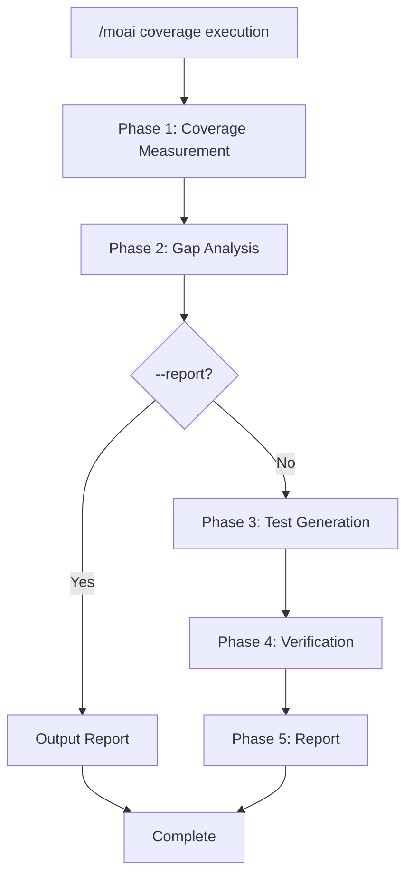
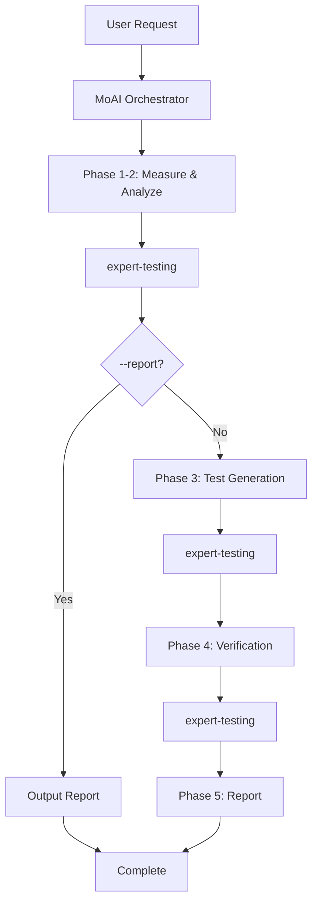

A command that analyzes test coverage, identifies gaps, and automatically generates missing tests.


**One-line summary**: `/moai coverage` is a "Test Gap Hunter". It **precisely measures** coverage using language-specific tools and **automatically generates missing tests** by priority.



**Slash Command**: Type `/moai:coverage` in Claude Code to run this command directly. Type `/moai` alone to see the full list of available subcommands.


## Overview

To improve test coverage, you first need to know where it's lacking. `/moai coverage` precisely measures coverage using language-specific tools, classifies gaps by risk priority, and automatically generates missing tests.

It generates tests in TDD or DDD style based on the `development_mode` setting in `quality.yaml`.

## Usage

```bash
# Analyze entire project coverage and generate tests
> /moai coverage

# Analyze with 85% coverage target
> /moai coverage --target 85

# Analyze specific file only
> /moai coverage --file src/auth/

# Generate report only (no test generation)
> /moai coverage --report

# Show only uncovered lines
> /moai coverage --uncovered

# Focus on critical paths only
> /moai coverage --critical
```

## Supported Flags

| Flag | Description | Example |
|------|-------------|---------|
| `--target N` | Coverage target percentage (default: from quality.yaml test_coverage_target) | `/moai coverage --target 85` |
| `--file PATH` | Analyze specific file or directory only | `/moai coverage --file src/auth/` |
| `--report` | Generate report only, do not generate tests | `/moai coverage --report` |
| `--package PKG` | Analyze specific package (Go) or module | `/moai coverage --package pkg/api` |
| `--uncovered` | Show only uncovered lines/functions | `/moai coverage --uncovered` |
| `--critical` | Focus on critical paths (high fan_in, public API) | `/moai coverage --critical` |

### --target Flag

Specifies the coverage target. If not specified, uses the `test_coverage_target` value from `quality.yaml` (default: 85%):

```bash
# Target 90% coverage
> /moai coverage --target 90
```

### --report Flag

Outputs only the gap analysis report without generating tests:

```bash
> /moai coverage --report
```

Useful when you want to assess the current state.

### --critical Flag

Focuses only on P1 (public API, high fan_in) and P2 (business logic, error handling):

```bash
> /moai coverage --critical
```

## Execution Process

`/moai coverage` runs in 5 phases.



### Phase 1: Coverage Measurement

Measures precise coverage using language-specific tools:

| Language | Coverage Tool | Execution Command |
|----------|--------------|-------------------|
| **Go** | go test + cover | `go test -coverprofile=coverage.out -covermode=atomic ./...` |
| **Python** | pytest-cov or coverage | `pytest --cov --cov-report=json` |
| **TypeScript/JavaScript** | vitest or jest | `vitest run --coverage` |
| **Rust** | cargo-llvm-cov | `cargo llvm-cov --json` |

Measurement results:
- Overall coverage percentage
- Per-file coverage percentages
- Per-function coverage data (covered/uncovered lines)
- Branch coverage (where available)

### Phase 2: Gap Analysis

Identifies files below the coverage target and classifies by priority:

| Priority | Condition | Description |
|----------|-----------|-------------|
| **P1 (Critical)** | Public API functions, fan_in >= 3, @MX:ANCHOR | Highest priority testing needed |
| **P2 (High)** | Business logic, error handling paths | High business impact code |
| **P3 (Medium)** | Internal utilities, helper functions | Test needed if target not met |
| **P4 (Low)** | Generated code, config, trivial getters/setters | Can be excluded from target |

### Phase 3: Test Generation

Generates tests differently based on `development_mode` in `quality.yaml`:

| Mode | Test Approach | Description |
|------|-------------|-------------|
| **TDD** | RED-GREEN-REFACTOR | Write failing test first, then verify |
| **DDD** | Characterization tests | Capture existing behavior in tests |

Test generation order: P1 → P2 → P3 → Skip P4

For each gap:
- Table-driven tests (Go) or parameterized tests (Python/TS)
- Includes edge cases and error scenarios
- Follows existing test patterns in the codebase
- Respects file naming conventions (`*_test.go`, `*.test.ts`, `test_*.py`)

### Phase 4: Verification

After test generation:
- Run full test suite to ensure no regressions
- Re-measure coverage to confirm improvement
- Compare before/after coverage percentages
- Verify coverage target is met

### Phase 5: Report

```
## Coverage Report

### Before: 72.5% -> After: 88.3%
### Target: 85% - ACHIEVED

### Tests Generated: 8
- auth_test.go: TestAuthenticateUser (covers P1 gap)
- auth_test.go: TestValidateToken (covers P1 gap)
- handler_test.go: TestErrorHandling (covers P2 gap)

### Coverage by Package
| Package | Before | After | Target | Status |
|---------|--------|-------|--------|--------|
| pkg/api | 70% | 88% | 85% | PASS |
| pkg/core | 45% | 82% | 85% | FAIL |

### Remaining Gaps
- pkg/core: 3% remaining (2 functions uncovered)
```

## Agent Delegation Chain



**Agent Roles:**

| Agent | Role | Key Tasks |
|-------|------|-----------|
| **MoAI Orchestrator** | Workflow coordination, user interaction | Report output, next step guidance |
| **expert-testing** | Measurement, analysis, generation, verification | Coverage measurement, gap analysis, test writing, verification |

## FAQ

### Q: Which coverage tools are used?

Standard tools are automatically selected for your project language. Go uses `go test -cover`, Python uses `pytest-cov`, TypeScript uses `vitest` or `jest` coverage.

### Q: What's the quality of generated tests?

Tests are written in a consistent style by analyzing existing test patterns in the codebase. They include table-driven tests, edge cases, and error scenarios.

### Q: What if the coverage target isn't met?

A list of remaining gaps is presented along with options to generate additional tests. P4 (low priority) gaps are skipped, so 100% may not be achievable.

### Q: Can I exclude specific files from coverage measurement?

Yes, using the `coverage_exemptions` setting in `quality.yaml`. However, the exclusion ratio is limited to 5% by default.

## Related Documentation

- [/moai review - Code Review](/quality-commands/moai-review)
- [/moai e2e - E2E Testing](/quality-commands/moai-e2e)
- [/moai fix - One-shot Auto Fix](/utility-commands/moai-fix)
- [/moai loop - Iterative Fixing Loop](/utility-commands/moai-loop)
