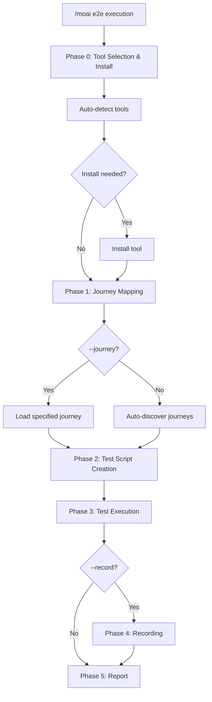
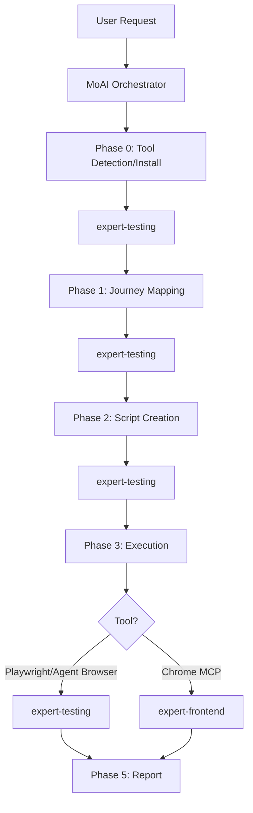

A command that creates and runs **E2E (End-to-End) tests** using browser automation tools.


**One-line summary**: `/moai e2e` is a "User Journey Tester". It selects the optimal tool from **3 browser automation options** to automatically test user flows.



**Slash Command**: Type `/moai:e2e` in Claude Code to run this command directly. Type `/moai` alone to see the full list of available subcommands.


## Overview

E2E tests verify that your application works correctly from the actual user's perspective. `/moai e2e` supports 3 browser automation tools and automatically selects the best one for your project environment.

It automatically discovers user journeys, generates test scripts, executes them, and reports results. GIF recording enables visual verification.

## Usage

```bash
# Run E2E tests with auto tool selection
> /moai e2e

# Specify Playwright
> /moai e2e --tool playwright

# Include GIF recording
> /moai e2e --record

# Target specific URL
> /moai e2e --url http://localhost:3000

# Run specific user journey only
> /moai e2e --journey login

# Disable headless mode (for debugging)
> /moai e2e --headless false
```

## Supported Flags

| Flag | Description | Example |
|------|-------------|---------|
| `--tool TOOL` | Force browser tool selection (agent-browser, playwright, chrome-mcp) | `/moai e2e --tool playwright` |
| `--record` | Record browser interactions as GIF | `/moai e2e --record` |
| `--url URL` | Target URL (default: auto-detect from project config) | `/moai e2e --url http://localhost:3000` |
| `--journey NAME` | Run specific named user journey only | `/moai e2e --journey login` |
| `--headless` | Headless mode (default: true) | `/moai e2e --headless false` |
| `--browser BROWSER` | Browser for Playwright (chromium, firefox, webkit) | `/moai e2e --browser firefox` |
| `--timeout N` | Test timeout in seconds (default: 30) | `/moai e2e --timeout 60` |
| `--retry N` | Retry count for failed tests (default: 1) | `/moai e2e --retry 3` |

## Browser Automation Tools

### Tool Comparison

| Feature | Agent Browser | Playwright CLI | Claude in Chrome |
|---------|--------------|----------------|------------------|
| **Token Cost** | Low (CLI output) | Low (CLI output) | High (MCP round-trips) |
| **Setup** | npm install | npx playwright install | Chrome extension required |
| **Headless** | Yes | Yes | No (requires visible Chrome) |
| **Cross-Browser** | Chromium only | Chromium, Firefox, WebKit | Chrome only |
| **GIF Recording** | Via Playwright trace | Via Playwright trace | Via MCP GIF creator |
| **AI Navigation** | Built-in AI agent | Script-based | MCP tool-based |
| **Best For** | AI-driven exploration | Deterministic test suites | Interactive debugging |
| **CI/CD** | Yes | Yes | No |

### Auto-Selection Logic

When `--tool` flag is not specified, the optimal tool is auto-selected based on task characteristics:

| Condition | Selected Tool | Rationale |
|-----------|--------------|-----------|
| `--record` flag used | Claude in Chrome | Best GIF recording capability |
| CI/CD environment detected | Playwright CLI | Most reliable headless support |
| Journey requires AI exploration | Agent Browser | Built-in AI navigation |
| Deterministic tests needed | Playwright CLI | Most stable, cross-browser |
| Interactive debugging | Claude in Chrome | Real-time visual feedback |
| Default | Playwright CLI | Best balance of features and token efficiency |

## Execution Process

`/moai e2e` runs in 5 phases (+ installation phase).



### Phase 0: Tool Selection & Installation

Checks installation status of all 3 tools in parallel:

```bash
# Auto-detection commands (parallel execution)
npx agent-browser --version     # Agent Browser
npx playwright --version         # Playwright
# Check Chrome MCP tool availability  # Claude in Chrome
```

If installation is needed:

| Tool | Installation Command |
|------|---------------------|
| **Playwright** | `npx playwright install --with-deps chromium` |
| **Agent Browser** | `npm install -g agent-browser` |
| **Claude in Chrome** | Chrome extension install (not auto-installable) |

### Phase 1: Journey Mapping

Without `--journey` flag, analyzes the application to auto-discover key user journeys:

- Analyze project documentation (`.moai/project/product.md`)
- Analyze route definitions (`routes.ts`, `urls.py`, `router.go`)
- Identify form elements, auth flows, and CRUD operations
- Map critical user paths (login, main features, error handling)

### Phase 2: Test Script Creation

Generates test files matching the selected tool:

| Tool | Test File Format | Location |
|------|-----------------|----------|
| **Playwright** | `{journey-name}.spec.ts` | `e2e/` |
| **Agent Browser** | `{journey-name}.agent.ts` | `e2e/` |
| **Claude in Chrome** | Structured MCP prompts | In-memory |

Playwright tests include:
- Page Object Model pattern
- Step-by-step assertions
- Screenshot capture
- Network response validation
- Accessibility checks (`@axe-core/playwright`)

### Phase 3: Test Execution

| Tool | Execution Method |
|------|-----------------|
| **Playwright** | `npx playwright test e2e/` (CLI, token-efficient) |
| **Agent Browser** | `npx agent-browser --task "..."` (CLI, AI navigation) |
| **Claude in Chrome** | MCP tool calls (real-time, high token cost) |

### Phase 4: Recording (Optional)

When `--record` flag is used:

| Tool | Recording Method | Output |
|------|-----------------|--------|
| **Playwright** | `npx playwright test --trace on` | `e2e/traces/` |
| **Agent Browser** | `npx agent-browser --task "..." --trace` | `e2e/recordings/` |
| **Claude in Chrome** | `mcp__claude-in-chrome__gif_creator` | `e2e/recordings/{journey}.gif` |

### Phase 5: Report

```
## E2E Test Report

### Tool Used: Playwright CLI

### Results Summary
| Journey | Status | Duration | Screenshots |
|---------|--------|----------|-------------|
| Login | PASS | 2.3s | 3 captured |
| Checkout | FAIL | 5.1s | 4 captured |

### Failures
- Checkout (Step 4): Expected redirect to /confirmation, got /error
  - Screenshot: e2e/screenshots/checkout-step4.png
  - Error: TimeoutError: Navigation timeout of 30000ms exceeded

### Recordings (if --record)
- e2e/recordings/login_flow.gif
- e2e/recordings/checkout_process.gif

### Coverage
- User journeys tested: 5/7
- Critical paths covered: 3/3
- Error scenarios tested: 2/4
```

## Agent Delegation Chain



**Agent Roles:**

| Agent | Role | Key Tasks |
|-------|------|-----------|
| **MoAI Orchestrator** | Workflow coordination, user interaction | Report output, next step guidance |
| **expert-testing** | Tool detection, journey mapping, script creation, execution | Full E2E test pipeline |
| **expert-frontend** | Chrome MCP execution (Chrome mode only) | Browser automation, GIF recording |

## FAQ

### Q: Which tool should I choose?

**Playwright CLI** is the best choice for most cases. It offers CI/CD support, cross-browser testing, and low token cost. Use Agent Browser for AI-based exploration, or Claude in Chrome for visual debugging.

### Q: Can it be used in CI/CD pipelines?

Playwright CLI and Agent Browser support CI/CD. Claude in Chrome requires a real Chrome browser and cannot be used in CI/CD.

### Q: What's the token cost of GIF recording?

Playwright/Agent Browser use CLI traces with no additional token cost. Claude in Chrome's GIF recording has higher token costs due to MCP round-trips.

### Q: What happens if existing E2E tests exist?

Existing tests are detected and new tests are added following existing patterns. Existing tests are never overwritten.

## Related Documentation

- [/moai coverage - Coverage Analysis](/quality-commands/moai-coverage)
- [/moai review - Code Review](/quality-commands/moai-review)
- [/moai fix - One-shot Auto Fix](/utility-commands/moai-fix)
