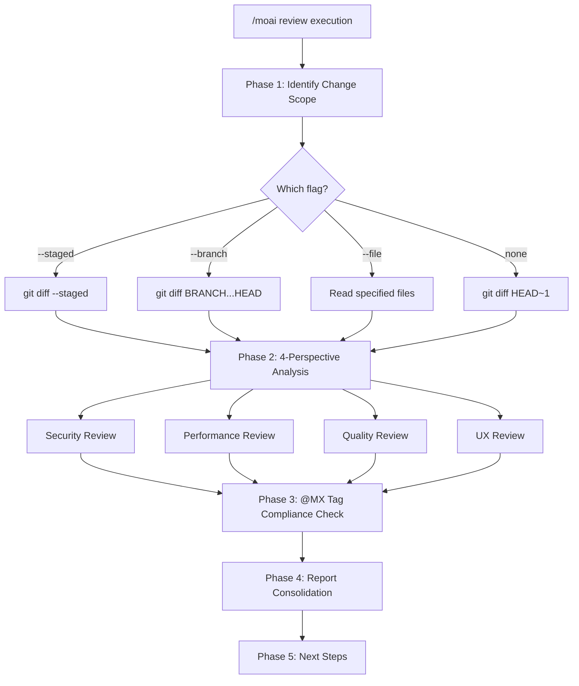
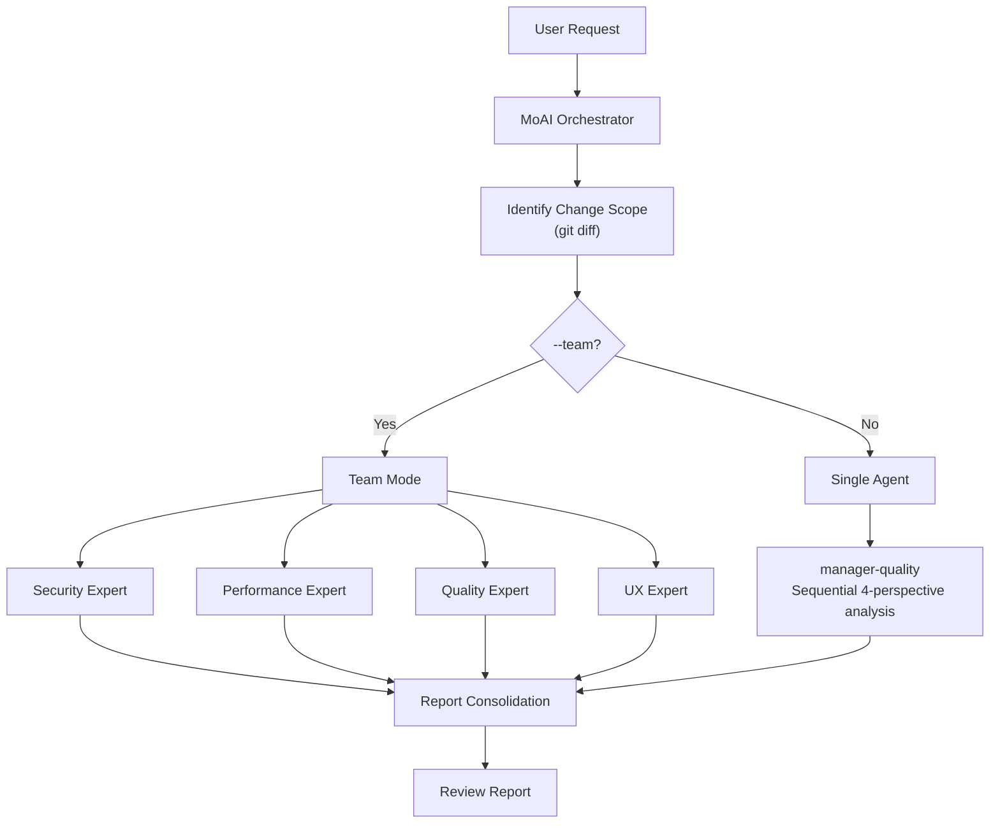

# /moai review

A code review command that analyzes your codebase from **4 perspectives: Security, Performance, Quality, and UX**.


**One-line summary**: `/moai review` is an "AI Code Reviewer". It simultaneously reviews from **4 perspectives** — OWASP security checks, performance analysis, TRUST 5 quality verification, and UX accessibility.



**Slash Command**: Type `/moai:review` in Claude Code to run this command directly. Type `/moai` alone to see the full list of available subcommands.


## Overview

Code review is at the heart of software quality. However, thoroughly checking security, performance, quality, and UX all at once is challenging. `/moai review` systematically analyzes code from 4 perspectives and produces a review report organized by severity.

It also checks @MX tag compliance to help AI agents better understand the code.

## Usage

```bash
# Review most recent commit changes
> /moai review

# Review only staged changes
> /moai review --staged

# Review against a specific branch
> /moai review --branch develop

# Security-focused review
> /moai review --security

# Review specific file only
> /moai review --file src/auth/service.py
```

## Supported Flags

| Flag | Description | Example |
|------|-------------|---------|
| `--staged` | Review only staged (git add) changes | `/moai review --staged` |
| `--branch BRANCH` | Compare against specified branch (default: main) | `/moai review --branch develop` |
| `--security` | Focus primarily on security review (OWASP, injection, auth) | `/moai review --security` |
| `--file PATH` | Review specific file(s) only | `/moai review --file src/auth/` |
| `--team` | Agent Teams mode (4 expert reviewers analyze in parallel) | `/moai review --team` |

### --staged Flag

Reviews only changes staged with `git add`. Useful for final checks before committing:

```bash
> git add src/auth/
> /moai review --staged
```

### --security Flag

Performs deeper analysis focused on the security perspective:

```bash
> /moai review --security
```

Provides in-depth analysis of OWASP Top 10, injection risks, authentication/authorization logic, and secrets exposure.

### --team Flag

4 expert review agents analyze simultaneously:

```bash
> /moai review --team
```

Security, performance, quality, and UX specialists each review independently, enabling deeper analysis.

## Execution Process

`/moai review` runs in 5 phases.



### Phase 1: Identify Change Scope

Determines the review target based on flags:

| Condition | Command Used |
|-----------|-------------|
| `--staged` | `git diff --staged` |
| `--branch BRANCH` | `git diff {BRANCH}...HEAD` |
| `--file PATH` | Read specified files directly |
| No flag | `git diff HEAD~1` |

### Phase 2: 4-Perspective Analysis

Analyzes code from 4 expert perspectives:

#### Perspective 1: Security Review

| Check Item | Description |
|------------|-------------|
| OWASP Top 10 Compliance | Major web security vulnerability check |
| Input Validation & Sanitization | User input handling safety |
| Authentication/Authorization Logic | Access control implementation |
| Secrets Exposure | API keys, passwords, token leaks |
| Injection Risks | SQL, command, XSS, CSRF risks |
| Dependency Vulnerabilities | Third-party library vulnerabilities |

#### Perspective 2: Performance Review

| Check Item | Description |
|------------|-------------|
| Algorithmic Complexity | O(n) analysis |
| Database Query Efficiency | N+1 queries, missing indexes |
| Memory Usage Patterns | Memory leaks, excessive allocation |
| Caching Opportunities | Identifying cacheable areas |
| Bundle Size Impact | Frontend change bundle size impact |
| Concurrency Safety | Race conditions, deadlocks |

#### Perspective 3: Quality Review

| Check Item | Description |
|------------|-------------|
| TRUST 5 Compliance | Tested, Readable, Unified, Secured, Trackable |
| Naming Conventions | Code readability |
| Error Handling | Error handling completeness |
| Test Coverage | Test existence for changed code |
| Documentation | Public API documentation |
| Project Pattern Consistency | Adherence to existing codebase patterns |

#### Perspective 4: UX Review

| Check Item | Description |
|------------|-------------|
| User Flow Integrity | Whether changes break existing flows |
| Error States | Error and edge cases from user perspective |
| Accessibility | WCAG, ARIA compliance |
| Loading States | Loading indicators and feedback |
| Breaking Changes | Public interface compatibility |

### Phase 3: @MX Tag Compliance Check

Checks @MX tag compliance for changed files:

- New exported functions: Need `@MX:NOTE` or `@MX:ANCHOR`
- High fan_in functions (>=3 callers): Must have `@MX:ANCHOR`
- Dangerous patterns: Should have `@MX:WARN`
- Untested public functions: Should have `@MX:TODO`

### Phase 4: Report Consolidation

Generates a consolidated report organized by severity:

```
## Code Review Report

### Critical Issues (must fix)
- [SECURITY] src/auth/service.py:45: SQL injection risk
- [PERFORMANCE] src/api/handler.py:23: N+1 query pattern

### Warnings (should fix)
- [QUALITY] src/utils/helper.py:12: Missing error handling
- [UX] src/components/Form.tsx:88: Missing accessibility attributes

### Suggestions (nice to have)
- [QUALITY] src/models/user.py:34: Method extraction recommended

### @MX Tag Compliance
- Missing tags: 3
- Outdated tags: 1
- Compliant files: 8/12

### Overall Assessment
- Security: PASS
- Performance: WARN
- Quality: PASS
- UX: WARN
- TRUST 5 Score: 4/5
```

### Phase 5: Next Steps

Guides next steps based on review results:

- **Auto-fix**: Run `/moai fix` to auto-resolve Level 1-2 issues
- **Create fix tasks**: Register each finding as individual tasks
- **Export report**: Save review report to `.moai/reports/`
- **Dismiss**: Acknowledge without immediate action

## Agent Delegation Chain



**Agent Roles:**

| Agent | Role | Key Tasks |
|-------|------|-----------|
| **MoAI Orchestrator** | Change identification & result consolidation | git diff, report generation |
| **manager-quality** | Code quality analysis (default mode) | Sequential 4-perspective analysis |
| **expert-security** | Security-focused analysis (`--security`) | OWASP, injection, authentication |

## FAQ

### Q: What's the difference between --team mode and default mode?

Default mode uses a single `manager-quality` agent to analyze all 4 perspectives sequentially. `--team` mode uses 4 expert reviewers analyzing simultaneously for deeper analysis, but consumes approximately 4x more tokens.

### Q: What's the best flag combination for pre-PR review?

`/moai review --staged` is the most efficient for reviewing staged changes. For security-critical code, use `/moai review --staged --security`.

### Q: Can I skip the @MX tag check?

Currently, @MX tag checking is always included. Results are shown in a separate section of the report, and tags are not added automatically.

### Q: Can issues found in the review be auto-fixed?

Yes, after the review you can run `/moai fix` to auto-fix Level 1-2 issues. Level 3-4 issues require manual review.

## Related Documentation

- [/moai fix - One-shot Auto Fix](/utility-commands/moai-fix)
- [/moai coverage - Coverage Analysis](/quality-commands/moai-coverage)
- [/moai e2e - E2E Testing](/quality-commands/moai-e2e)
- [/moai codemaps - Architecture Documentation](/quality-commands/moai-codemaps)
