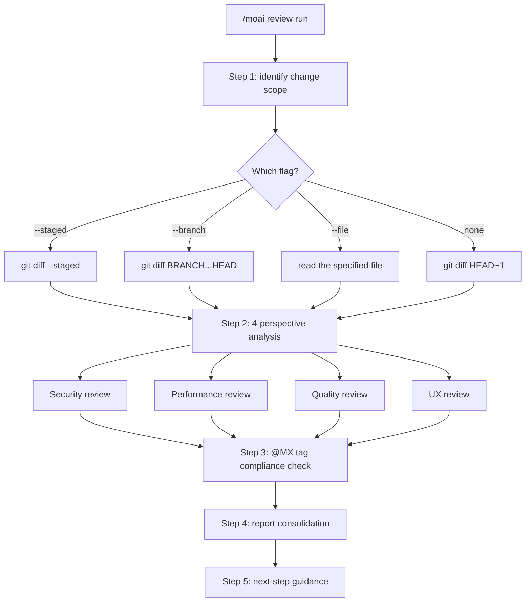
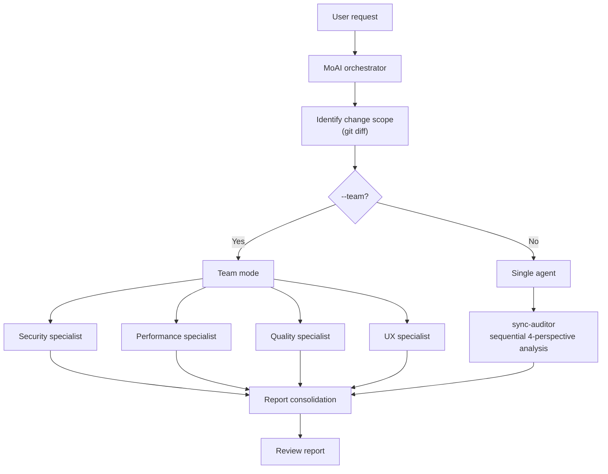

The code review command that analyzes your codebase from 4 perspectives: **security, performance, quality, and UX**.


**One-line summary**: `/moai review` is an "AI code reviewer." It **reviews from 4 perspectives simultaneously** — from OWASP security checks to performance analysis, TRUST 5 quality verification, and UX accessibility.



**Slash command**: In Claude Code, type `/moai:review` to run this command directly. Typing just `/moai` shows the list of all available subcommands.


## Overview

Code review is at the heart of software quality. But checking security, performance, quality, and UX all thoroughly is not easy. `/moai review` has the AI analyze the code systematically from 4 perspectives and produces a review report organized by severity.

The default reviewer is **sync-auditor** — an independent evaluator, not the agent that wrote the code. The harness principle that whoever produced something never inspects it applies to the review command as well. @MX tag compliance is also checked, helping AI agents understand the code better.

## Usage

```bash
# Review the changes in the most recent commit
> /moai review

# Review only staged changes
> /moai review --staged

# Review against a specific branch
> /moai review --branch develop

# Security-focused review
> /moai review --security

# Review a specific file only
> /moai review --file src/auth/service.py
```

## Supported Flags

| Flag | Description | Example |
|-------|------|------|
| `--staged` | Review only staged (git add) changes | `/moai review --staged` |
| `--branch BRANCH` | Review against the given branch (default: main) | `/moai review --branch develop` |
| `--security` | Focus on the security review (OWASP, injection, auth) | `/moai review --security` |
| `--file PATH` | Review a specific file only | `/moai review --file src/auth/` |
| `--team` | Agent team mode (4 specialist reviewers analyze in parallel) | `/moai review --team` |

### The --staged Flag

Reviews only the changes staged with `git add`. Useful as a final check before committing:

```bash
> git add src/auth/
> /moai review --staged
```

### The --security Flag

Performs a deeper analysis focused on the security perspective:

```bash
> /moai review --security
```

Analyzes the OWASP Top 10, injection risks, authentication/authorization logic, secret exposure, and more in depth.

### The --team Flag

Four specialist review agents analyze simultaneously:

```bash
> /moai review --team
```

Security, performance, quality, and UX specialists each review independently, enabling deeper analysis. Token consumption grows accordingly (about 4x), so it is economical to use it selectively on high-stakes changes like security and payments.

## Execution Flow

`/moai review` runs in 5 steps.


```mermaid
flowchart TD
    Start["/moai review run"] --> Phase1["Step 1: identify change scope"]

    Phase1 --> Scope{"Which flag?"}
    Scope -->|--staged| Staged["git diff --staged"]
    Scope -->|--branch| Branch["git diff BRANCH...HEAD"]
    Scope -->|--file| File["read the specified file"]
    Scope -->|none| Recent["git diff HEAD~1"]

    Staged --> Phase2["Step 2: 4-perspective analysis"]
    Branch --> Phase2
    File --> Phase2
    Recent --> Phase2

    Phase2 --> Security["Security review"]
    Phase2 --> Performance["Performance review"]
    Phase2 --> Quality["Quality review"]
    Phase2 --> UX["UX review"]

    Security --> Phase3["Step 3: @MX tag compliance check"]
    Performance --> Phase3
    Quality --> Phase3
    UX --> Phase3

    Phase3 --> Phase4["Step 4: report consolidation"]
    Phase4 --> Phase5["Step 5: next-step guidance"]
```

### Step 1: Identify the Change Scope

The review target is determined by the flag:

| Condition | Command used |
|------|----------------|
| `--staged` | `git diff --staged` |
| `--branch BRANCH` | `git diff {BRANCH}...HEAD` |
| `--file PATH` | Reads the specified file directly |
| No flag | `git diff HEAD~1` |

Reviewing only the change scope rather than the whole codebase is also a design choice for token efficiency.

### Step 2: 4-Perspective Analysis

The code is analyzed from 4 specialist perspectives:

#### Perspective 1: Security Review

| Check | Description |
|-----------|------|
| OWASP Top 10 compliance | Checks for major web security vulnerabilities |
| Input validation and sanitization | Safety of user-input handling |
| Auth/authorization logic | Verifies access-control implementation |
| Secret exposure | Leaked API keys, passwords, tokens |
| Injection risks | SQL, command, XSS, CSRF risks |
| Dependency vulnerabilities | Third-party library vulnerabilities |

#### Perspective 2: Performance Review

| Check | Description |
|-----------|------|
| Algorithmic complexity | O(n) analysis |
| Database query efficiency | N+1 queries, missing indexes |
| Memory usage patterns | Memory leaks, excessive allocation |
| Caching opportunities | Identifies cacheable spots |
| Bundle size | Bundle-size impact of frontend changes |
| Concurrency safety | Race conditions, deadlocks |

#### Perspective 3: Quality Review

| Check | Description |
|-----------|------|
| TRUST 5 compliance | Tested, Readable, Unified, Secured, Trackable |
| Naming conventions | Code readability |
| Error handling | Completeness of error handling |
| Test coverage | Whether tests exist for the changed code |
| Documentation | Whether public APIs are documented |
| Project-pattern consistency | Adherence to existing codebase patterns |

#### Perspective 4: UX Review

| Check | Description |
|-----------|------|
| User flows | Whether existing flows break |
| Error states | Errors and edge cases from the user's perspective |
| Accessibility | WCAG, ARIA compliance |
| Loading states | Loading indicators and feedback |
| Breaking changes | Public-interface compatibility |

### Step 3: @MX Tag Compliance Check

Checks @MX tag compliance in the changed files:

- New exported functions: `@MX:NOTE` or `@MX:ANCHOR` needed
- High fan_in functions (>=3 callers): `@MX:ANCHOR` required
- Dangerous patterns: `@MX:WARN` needed
- Untested public functions: `@MX:TODO` needed

### Step 4: Report Consolidation

Produces a consolidated report organized by severity:

```
## Code Review Report

### Critical issues (must fix)
- [SECURITY] src/auth/service.py:45: possible SQL injection
- [PERFORMANCE] src/api/handler.py:23: N+1 query pattern

### Warnings (fix recommended)
- [QUALITY] src/utils/helper.py:12: missing error handling
- [UX] src/components/Form.tsx:88: missing accessibility attributes

### Suggestions (possible improvements)
- [QUALITY] src/models/user.py:34: method extraction recommended

### @MX tag compliance
- Missing tags: 3
- Stale tags: 1
- Compliant files: 8/12

### Overall assessment
- Security: PASS
- Performance: WARN
- Quality: PASS
- UX: WARN
- TRUST 5 score: 4/5
```

### Step 5: Next-Step Guidance

Guides you to the next step based on the review results:

- **Auto-fix**: resolve Level 1-2 issues automatically with `/moai fix`
- **Create fix tasks**: register each finding as an individual task
- **Export the report**: save the review report to `.moai/reports/`
- **Close**: finish after reviewing, with no further action

## Agent Delegation Chain


```mermaid
flowchart TD
    User["User request"] --> MoAI["MoAI orchestrator"]
    MoAI --> Identify["Identify change scope<br/>(git diff)"]
    Identify --> Agent{"--team?"}

    Agent -->|Yes| Team["Team mode"]
    Agent -->|No| Single["Single agent"]

    Team --> R1["Security specialist"]
    Team --> R2["Performance specialist"]
    Team --> R3["Quality specialist"]
    Team --> R4["UX specialist"]

    Single --> Quality["sync-auditor<br/>sequential 4-perspective analysis"]

    R1 --> Consolidate["Report consolidation"]
    R2 --> Consolidate
    R3 --> Consolidate
    R4 --> Consolidate
    Quality --> Consolidate

    Consolidate --> Report["Review report"]
```

**Agent roles:**

| Agent | Role | Main work |
|----------|------|----------|
| **MoAI orchestrator** | Change identification and result consolidation | git diff, report generation |
| **sync-auditor** | Code-quality analysis (default mode) | Sequential 4-perspective analysis |
| **manager-develop** | Security-focused analysis (`--security`) | OWASP, injection, auth |

## Frequently Asked Questions

### Q: What is the difference between --team mode and the default mode?

In the default mode, the `sync-auditor` agent analyzes the 4 perspectives sequentially. In `--team` mode, 4 specialist reviewers analyze simultaneously — deeper, but consuming about 4x the tokens.

### Q: What is the best flag combination for a pre-PR review?

Reviewing only the staged changes with `/moai review --staged` is the most efficient. When security matters, use `/moai review --staged --security`.

### Q: Can I skip the @MX tag check?

Currently the @MX tag check is always included. Its results appear as a separate section in the report, and tags are not added automatically.

### Q: Can issues found in the review be fixed automatically?

Yes, after the review completes, run `/moai fix` in the next step to automatically fix Level 1-2 issues. Level 3-4 issues require manual confirmation.

## Related Documents

- [/moai gate - pre-commit quality gate](/quality-commands/moai-gate)
- [/moai fix - one-shot auto-fix](/utility-commands/moai-fix)
- [/moai codemaps - architecture docs](/quality-commands/moai-codemaps)
