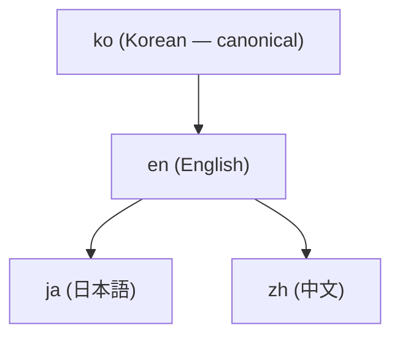

# 4-Locale Documentation and Translation

This documentation site (adk.mo.ai.kr) provides the same content in **four languages** — Korean (ko), English (en), Japanese (ja), Chinese (zh). The rule is that every page exists with equal weight in all four locales. This page explains that structure and how to report translation issues.

## Locale Locations

Each locale has its own directory under the documentation root.

| Locale | Language | Path |
|--------|----------|------|
| **ko** | Korean | `/ko/...` (site default language) |
| **en** | English | `/en/...` |
| **ja** | 日本語 | `/ja/...` |
| **zh** | 中文 | `/zh/...` |

`ko` is the site's default language (Hugo setting `defaultContentLanguage = "ko"`). The language selector at the top of the site switches between the four locales.

## Canonical Chain — Where Translation Starts

Documentation source (canonical locale) is **Korean (ko)**. Translation follows a fixed order.

- **ko** is the canonical source. New pages are authored first in ko.
- **en** is derived from ko.
- **ja** and **zh** are derived via en.

When you edit a Korean page, the same change must be reflected in the corresponding en·ja·zh pages as well.


**Edit only in the canonical locale.** Editing source text "in place" in translation locales (en·ja·zh) is prohibited. When translation seems odd, in most cases the source (ko) led the translation astray. Don't fix the translation page directly; propose correcting the source page instead.


## 4-Locale Simultaneous-Update Obligation

All documentation changes MUST be reflected in **all four locales in a single PR**. Editing only the Korean page and deferring the other three locales creates locale inconsistency. The same rule applies when creating new pages — all four locale pages go up as one bundle.

## What's Preserved vs. What's Translated

What translation **does NOT change** (common rules across locales):

- **Mermaid diagram direction** — Only `flowchart TD` / `graph TB` are allowed. `LR`/`RL` directions are forbidden, and translation doesn't change direction.
- **Code blocks** — Commands·code·flags stay as-is. Only natural language inside comments is translated.
- **URL whitelist** — Only `adk.mo.ai.kr` and `github.com/modu-ai` are allowed. Other variant domains (`docs` + `moai-ai` + `dev` family, `adk` + `moai` + `com` family, `adk` + `moai` + `kr` family with different dot positions) are prohibited in any locale. The valid domain is exactly `adk.mo.ai.kr` — one dot difference is invalid.
- **No decorative emoji** — Use the `` shortcode instead of body-text decorative emoji. Typographic symbols (`→ ← ↓ ✓ ✗`) are NOT emoji and stay as-is.
- **Version** — `hugo.toml`'s `params.version` / `params.releaseDate` is the single source. Don't hardcode versions in pages; use the `` shortcode instead.

What translation **changes**:

- Body prose — Natural language of each locale.
- UI labels and menus — The site menu (`data/menu/main.yaml`) name maps are translated per locale.
- Document titles — Frontmatter `title` is translated into each language.

## Translation Quality — Avoid Translationese

Because English is the source language and others are derived, translations can easily fall into "translationese" (calque) — carrying English sentence structure wholesale into the target language. Use natural expressions appropriate to each language.

- In Korean, avoid structural metaphors like "three axes" / "seven pillars." "Three core values" / "seven strengths" is natural.
- Don't translate English figurative expressions word-for-word — find the universal expression that conveys the same meaning in each language.
- Distinguish conversational from written register prose — Guide prose is clean written register.

## How to Report Translation Issues

When you find translation errors or locale inconsistencies, report them via a GitHub issue.

1. **Which page** — Provide the URL (e.g., `https://adk.mo.ai.kr/ko/core-concepts/trust-5/`).
2. **Which locale** — Specify which of the four locales (ko/en/ja/zh).
3. **What the problem is** — Translation error, missing paragraph, locale inconsistency, terminology inconsistency, etc.
4. **If you have a suggestion** — Include a natural alternative expression — it helps with implementation.

Open issues at [github.com/modu-ai/moai-adk/issues](https://github.com/modu-ai/moai-adk/issues). From within a Claude Code session, you can also open an issue via the `/moai feedback` command.


**When the source is suspect.** When translation seems odd, don't suspect the translation page first. In many cases, the Korean source (ko) expression led the translation astray. In such cases, source correction and translation correction are handled as one bundle.


## README Follows the Same Structure

Not just this documentation site, but the GitHub repository README is also provided in four languages. Note that README is the opposite of the site — **English (en) is canonical** and Korean·Japanese·Chinese are derived. Be careful that the canonical locale differs between the docs-site (ko canonical) and README (en canonical).

- **Documentation site** (this site) — ko canonical, en·ja·zh derived.
- **README** (GitHub repository) — `README.md` (en) canonical, `README.ko.md` / `README.ja.md` / `README.zh.md` derived.

Both surfaces follow the same rule that all four locales update in one change bundle.

## Related Documents

- [Getting started](/en/getting-started/) — Installation and quick start
- [What is MoAI-ADK?](/en/core-concepts/what-is-moai-adk/) — Project overview
- [GitHub repository](https://github.com/modu-ai/moai-adk) — Issues and contributions
