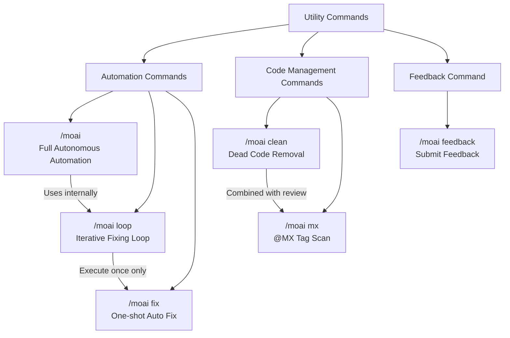

# Utility Commands

Introduction to MoAI-ADK's automation and feedback commands.


Utility commands are specialized for **quick automation and problem solving**, unlike workflow commands (`/moai plan`, `/moai run`, `/moai sync`).


## Command Comparison

| Command | Purpose | Execution Method | When to Use |
|---------|---------|------------------|-------------|
| `/moai` | Full autonomous automation | Entire process from SPEC creation to documentation | Want to delegate a feature from start to finish |
| `/moai loop` | Iterative fixing loop | Repeat diagnose → fix → verify | Want to fix multiple errors at once |
| `/moai fix` | One-shot auto fix | Diagnose → fix → complete (once) | Want to quickly fix lint errors or type errors |
| `/moai clean` | Dead code removal | Static analysis → usage graph → safe removal | Want to clean up unused code |
| `/moai mx` | @MX tag scan | 3-pass scan → auto tag insertion | Want to add AI context annotations to code |
| `/moai feedback` | Submit feedback | Auto-create GitHub issue | Want to send bug reports or improvement suggestions for MoAI-ADK |

## Command Relationship Diagram


**Not sure which command to use?**

- Want to create a feature from scratch → `/moai`
- Want to iteratively fix many errors in code → `/moai loop`
- Want to quickly fix simple lint errors → `/moai fix`
- Want to clean up unused code → `/moai clean`
- Want AI to understand your code better with tags → `/moai mx`
- Have problems with MoAI-ADK itself → `/moai feedback`

