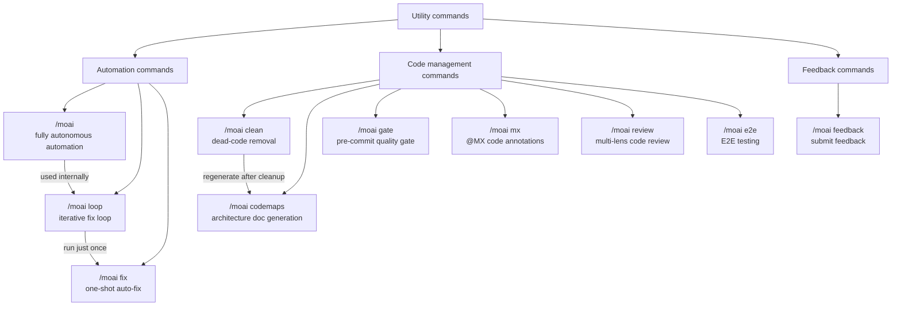

 <strong>Belongs to</strong>: 🧠 Recursive Self-Learning · 🛡️ Agentic Harness

<!-- @value: self-learning, agentic-harness -->

A collection of commands for autonomous automation, iterative fix loops, code management, and feedback.


Unlike the workflow commands (`/moai plan`, `/moai run`, `/moai sync`), the utility commands specialize in **fast automation and problem solving**.


## The Execution Surface of Agentic Loop Engineering

This section is where v3's second pillar, **agentic loop engineering**, actually runs. `/moai loop` is a diagnostic loop that iterates until the issue queue found by diagnostic tools is empty, and `/moai goal` is a condition-declared loop where you declare a completion condition and the session works on its own until the condition holds. `/moai fix` is the one-shot (single-pass) preset in the same family. The observations left behind as the loop runs become raw material for harness learning — the entrance to the recursive cycle where loops accumulate observations, the harness learns, and the guidance evolves.

## Command Comparison

| Command | Purpose | Execution style | When to use |
|--------|------|-----------|-----------|
| `/moai` | Fully autonomous automation | The whole pipeline from SPEC creation to documentation | When you want to hand over a new feature end to end |
| `/moai goal` | Condition-declared autonomous loop | Keeps taking turns until the completion condition holds | When you want to declare an end state like "until all tests pass" |
| `/moai loop` | Iterative fix loop | Repeats diagnose → fix → verify | When you want to knock out many errors at once |
| `/moai fix` | One-shot auto-fix | Diagnose → fix → done (once) | When you want to fix lint or type errors quickly |
| `/moai gate` | Pre-commit quality gate | Lint · format · type · test in parallel (<30s) | When you want a fast pass/fail check before committing |
| `/moai mx` | @MX code annotations | Codebase scan → @MX tag insertion | When you want to plant AI-context code anchors and danger markers |
| `/moai clean` | Dead-code removal | Static analysis → usage graph → safe removal | When you want to clean up unused code |
| `/moai codemaps` | Architecture doc generation | Codebase scan → auto-generated structure docs | When you want to produce project architecture docs |
| `/moai review` | Multi-lens code review | Security · performance · quality · UX verdict + @MX compliance check | When you want a multi-lens review of a PR/changeset |
| `/moai e2e` | E2E testing | web/mobile/desktop auto-detection + CLI-first runs | When you want to create and run user-journey E2E tests |
| `/moai feedback` | Submit feedback | Auto-creates a GitHub issue | When sending a bug report or improvement proposal to MoAI-ADK |

## Command Relationship Map

```mermaid
flowchart TD
    A[Utility commands] --> B[Automation commands]
    A --> C[Code management commands]
    A --> D[Feedback commands]

    B --> E["/moai<br/>fully autonomous automation"]
    B --> F["/moai loop<br/>iterative fix loop"]
    B --> G["/moai fix<br/>one-shot auto-fix"]
    C --> H["/moai clean<br/>dead-code removal"]
    C --> I["/moai codemaps<br/>architecture doc generation"]
    C --> K["/moai gate<br/>pre-commit quality gate"]
    C --> L["/moai mx<br/>@MX code annotations"]
    C --> M["/moai review<br/>multi-lens code review"]
    C --> N["/moai e2e<br/>E2E testing"]
    D --> J["/moai feedback<br/>submit feedback"]

    E -->|used internally| F
    F -->|run just once| G
    H -->|regenerate after cleanup| I
```


For the SPEC 3-Phase lifecycle commands (`/moai plan`, `run`, `sync`, `project`, `design`, `harness`), see the [workflow commands](/workflow-commands/) section. The full list of 15 subcommands the `/moai` orchestrator routes is also there.



**Not sure which command to use?**

- Want to build a whole feature at once → `/moai`
- "Work on your own until this condition is met" → `/moai goal`
- Lots of errors in the code you want fixed iteratively → `/moai loop`
- Just want simple lint errors fixed fast → `/moai fix`
- Just want a fast pass/fail check before committing → `/moai gate`
- Want to plant AI-context code annotations (@MX) → `/moai mx`
- Want to clean up unused code → `/moai clean`
- Want to produce project architecture docs → `/moai codemaps`
- A problem with MoAI-ADK itself → `/moai feedback`

