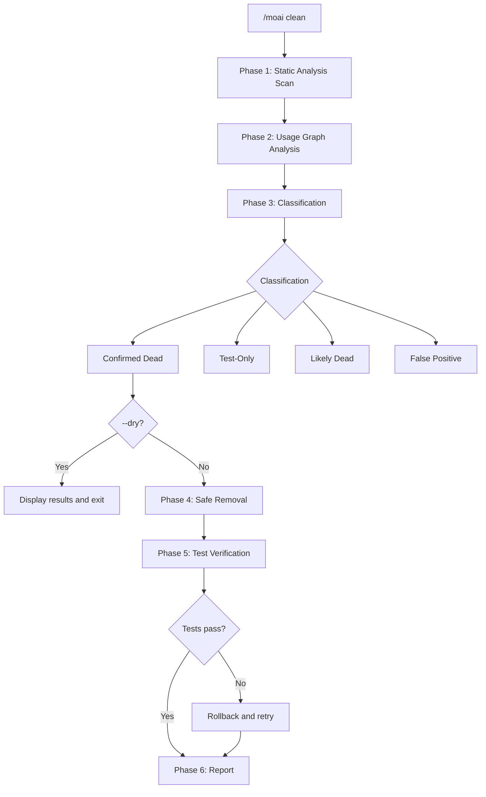
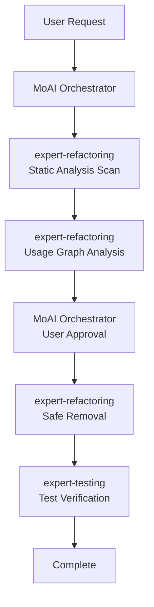

# /moai clean

Dead code identification and safe removal command. Uses static analysis and usage graph analysis to **find and safely remove unused code**.


**One-line summary**: `/moai clean` is a "code diet tool". It **automatically finds and safely removes** unused functions, variables, imports, and files.



**Slash Command**: Type `/moai:clean` in Claude Code to run this command directly. Type `/moai` alone to see the full list of available subcommands.


## Overview

As projects grow, unused code accumulates. Unused imports, uncalled functions, and unreferenced types make the codebase unnecessarily complex. `/moai clean` detects dead code through static analysis and safely removes it after test verification.

## Usage

```bash
# Basic usage
> /moai clean

# Preview (check without removing)
> /moai clean --dry

# Remove only confirmed dead code
> /moai clean --safe-only

# Target specific file/directory
> /moai clean --file src/auth/

# Target specific code type
> /moai clean --type functions
```

## Supported Flags

| Flag | Description | Example |
|------|-------------|---------|
| `--dry` (or `--dry-run`) | Show analysis results without removing | `/moai clean --dry` |
| `--safe-only` | Only remove confirmed dead code (skip uncertain) | `/moai clean --safe-only` |
| `--file PATH` | Target specific file or directory | `/moai clean --file src/utils/` |
| `--type TYPE` | Focus on specific code type | `/moai clean --type imports` |
| `--aggressive` | Include low-usage code (1 caller that is also dead) | `/moai clean --aggressive` |

### --type Flag Options

| Type | Description |
|------|-------------|
| `functions` | Uncalled functions/methods |
| `imports` | Unreferenced import statements |
| `types` | Unused type definitions |
| `variables` | Declared but never read variables |
| `files` | Files with no incoming imports |

### --dry Flag

Preview which items would be classified as dead code without making any changes:

```bash
> /moai clean --dry
```

Useful when you want to review analysis results before removal.

## Execution Process

`/moai clean` executes in 6 phases.



### Phase 1: Static Analysis Scan

Detects dead code candidates using language-specific tools:

| Language | Analysis Tools | Detection Targets |
|----------|---------------|-------------------|
| **Go** | `go vet`, `staticcheck`, `deadcode` | Unused variables, functions, types |
| **Python** | `vulture`, `autoflake` | Dead code, unused imports |
| **TypeScript/JavaScript** | `ts-prune`, ESLint `no-unused-vars` | Unused exports, variables |
| **Rust** | `cargo clippy`, `cargo udeps` | Dead code warnings, unused deps |

**Scan Categories:**

- Unused imports: Import statements with no references
- Unused variables: Declared but never read
- Unused functions: Defined but never called
- Unused types: Type definitions with no usage
- Unused files: Files with no incoming imports
- Dead dependencies: Installed packages never imported

### Phase 2: Usage Graph Analysis

Builds a usage graph to verify static analysis results:

- Search all references across the codebase for each candidate
- Check indirect usage (interfaces, reflection, dynamic dispatch)
- Check test-only usage (used only in tests, not production)
- Check conditional compilation (build tags, env-based imports)

### Phase 3: Classification

| Classification | Description | Removal Safety |
|---------------|-------------|----------------|
| **Confirmed Dead** | No references found anywhere | Safe |
| **Test-Only** | Used only in test files | Generally safe |
| **Likely Dead** | Low confidence (dynamic usage possible) | Use caution |
| **False Positive** | Actually used (reflection, plugins, etc.) | Do not remove |

### Phase 4: Safe Removal

Removes in reverse dependency order (leaf nodes first):

- Group related removals (function + private helpers)
- Update affected imports
- Clean up empty files
- Never remove code with `@MX:ANCHOR` tag without explicit approval

### Phase 5: Test Verification

Runs the full test suite after removal to verify no regressions. If tests fail, the specific removal is rolled back and marked as a false positive.

### Phase 6: Report

```
Dead Code Removal Report

Removed: 15 items (287 lines)
  - src/utils/helper.go: UnusedFunction (15 lines)
  - src/models/old.go: Entire file deleted (120 lines)

Kept (false positives): 2 items
  - src/api/handler.go: DynamicHandler (used via reflection)

Test Results: PASS (all tests green)

Codebase Reduction:
  - Files removed: 3
  - Lines removed: 287
  - Dependencies removed: 1
```

## Agent Delegation Chain



| Agent | Role | Key Tasks |
|-------|------|-----------|
| **expert-refactoring** | Analysis & Removal | Static analysis, usage graph, safe removal |
| **expert-testing** | Verification | Run test suite, confirm no regressions |
| **MoAI Orchestrator** | Coordination | User approval, @MX tag cleanup |

## Frequently Asked Questions

### Q: What if dead code is incorrectly removed?

You can revert with Git. MoAI removes in reverse dependency order and runs tests, so problems are automatically rolled back.

### Q: When should I use --aggressive?

Use when you want to include code with 1 caller where that caller is also dead. Useful for cleanup after major refactoring.

### Q: Will code used via reflection be removed?

In `--safe-only` mode, only "Confirmed Dead" code is removed. Code used via reflection or dynamic dispatch is classified as a false positive and preserved.

## Related Documents

- [/moai fix - One-shot Auto Fix](/utility-commands/moai-fix)
- [/moai mx - @MX Tag Scan](/utility-commands/moai-mx)
- [/moai review - Code Review](/quality-commands/moai-review)
- [/moai coverage - Coverage Analysis](/quality-commands/moai-coverage)
